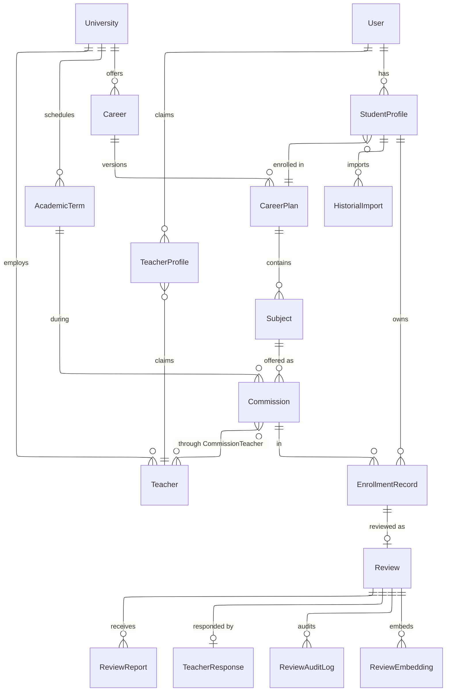
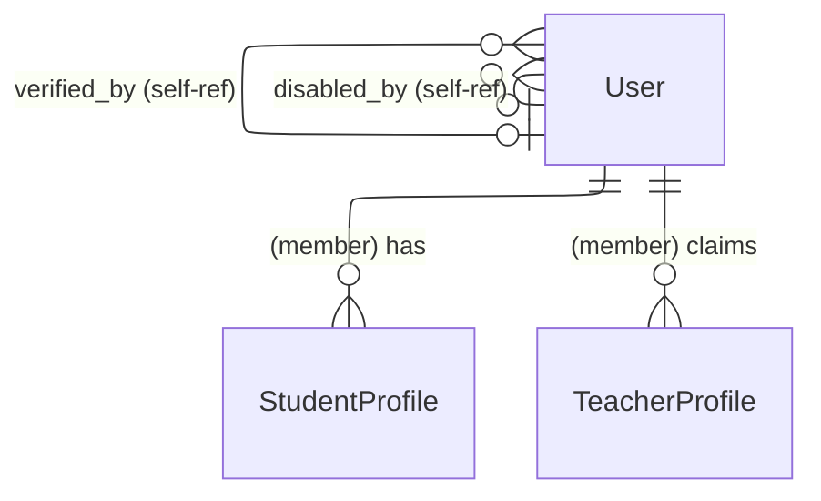
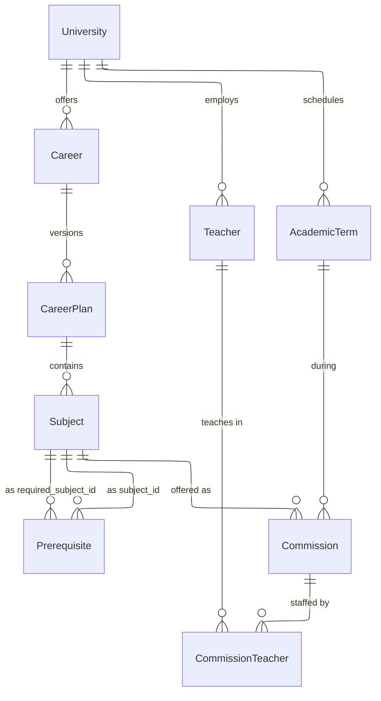
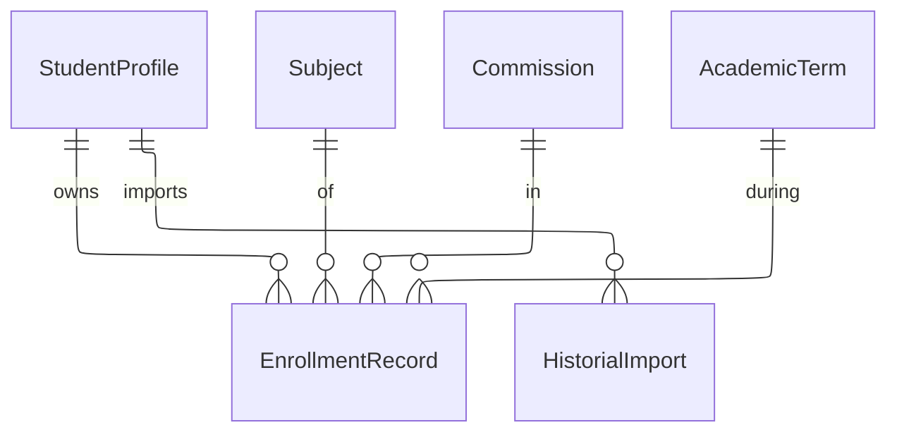
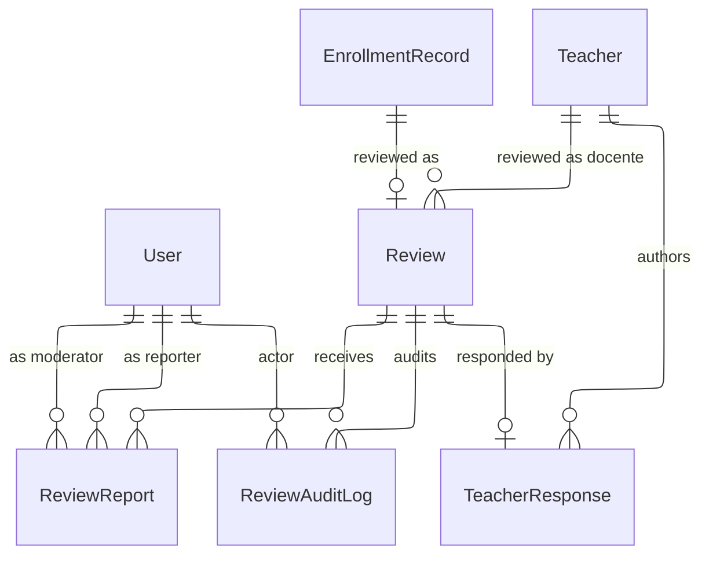
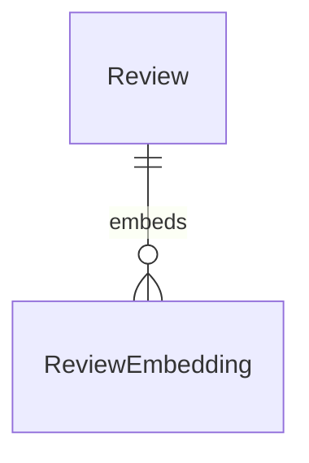

# Data Model. planb

Modelo de datos completo del sistema, organizado por bounded contexts. Cada sección tiene un diagrama ER en Mermaid con las relaciones del contexto, seguido de la especificación de cada entidad (campos, tipos, constraints) y las invariantes que se aplican transversalmente.

El "por qué" de las decisiones estructurales está en los ADRs referenciados. Este documento describe el "qué".

## Tabla de contenidos

- [Overview](#overview)
- [Context: Identity](#context-identity)
- [Context: Academic Catalog](#context-academic-catalog)
- [Context: Student History](#context-student-history)
- [Context: Reviews & Moderation](#context-reviews--moderation)
- [Context: Semantic Analytics](#context-semantic-analytics)
- [Apéndice A: Enums](#apéndice-a-enums)
- [Apéndice B: Invariantes transversales](#apéndice-b-invariantes-transversales)

## Overview

Vista de alto nivel: bounded contexts y sus conexiones. Cada contexto se detalla en su sección.



**Contextos:**

| Context              | Entidades                                                                                                   | Propósito                                                       |
| -------------------- | ----------------------------------------------------------------------------------------------------------- | --------------------------------------------------------------- |
| Identity             | User, StudentProfile, TeacherProfile                                                                        | Cuentas, roles, identidades académicas                          |
| Academic Catalog     | University, Career, CareerPlan, Subject, Prerequisite, Teacher, Commission, CommissionTeacher, AcademicTerm | Datos precargados del dominio académico                         |
| Student History      | EnrollmentRecord, HistorialImport                                                                           | Historial de cursadas del alumno                                |
| Reviews & Moderation | Review, ReviewReport, TeacherResponse, ReviewAuditLog                                                       | Reseñas, reportes, respuestas, auditoría                        |
| Semantic Analytics   | ReviewEmbedding                                                                                             | Embeddings para clustering y búsqueda semántica (feature gated) |

## Context: Identity

Cuentas, roles y perfiles que capturan identidad del usuario en la plataforma. Ver [ADR-0008](../decisions/0008-roles-exclusivos-profiles-como-capacidades.md) para la separación entre rol y profile.



### Entity: User

| Campo               | Tipo             | Constraints                  | Notas                               |
| ------------------- | ---------------- | ---------------------------- | ----------------------------------- |
| `id`                | UUID             | PK                           |                                     |
| `email`             | TEXT             | NOT NULL, UNIQUE             |                                     |
| `password_hash`     | TEXT             | NOT NULL                     | bcrypt/argon2                       |
| `email_verified_at` | TIMESTAMPTZ      | NULL                         | Null = cuenta pendiente             |
| `role`              | ENUM `user_role` | NOT NULL, DEFAULT `'member'` | Ver [Apéndice A](#apéndice-a-enums) |
| `disabled_at`       | TIMESTAMPTZ      | NULL                         | Soft suspend                        |
| `disabled_reason`   | TEXT             | NULL                         |                                     |
| `disabled_by`       | UUID             | FK → User, NULL              | Self-ref                            |
| `created_at`        | TIMESTAMPTZ      | NOT NULL, DEFAULT `now()`    |                                     |
| `updated_at`        | TIMESTAMPTZ      | NOT NULL, DEFAULT `now()`    |                                     |

### Entity: StudentProfile

Vincula un User con un CareerPlan. Un User `member` puede tener múltiples StudentProfiles (una por carrera).

| Campo             | Tipo                  | Constraints                  | Notas                           |
| ----------------- | --------------------- | ---------------------------- | ------------------------------- |
| `id`              | UUID                  | PK                           |                                 |
| `user_id`         | UUID                  | FK → User, NOT NULL          |                                 |
| `career_id`       | UUID                  | FK → CareerPlan, NOT NULL    | Apunta al plan, no a la carrera |
| `enrollment_year` | INT                   | NOT NULL                     | Año de ingreso                  |
| `status`          | ENUM `student_status` | NOT NULL, DEFAULT `'active'` |                                 |
| `graduated_at`    | DATE                  | NULL                         |                                 |
| `created_at`      | TIMESTAMPTZ           | NOT NULL                     |                                 |
| `updated_at`      | TIMESTAMPTZ           | NOT NULL                     |                                 |

Constraints adicionales:

- `UNIQUE(user_id, career_id)` — un user no puede tener dos profiles en la misma carrera-plan.
- CHECK: `status = 'graduated'` → `graduated_at NOT NULL`.
- CHECK: `status IN ('active', 'abandoned')` → `graduated_at IS NULL`.

### Entity: TeacherProfile

Claim de identidad docente por parte de un User. Sin `verified_at`, el profile existe pero no desbloquea capacidades.

| Campo                 | Tipo                               | Constraints            | Notas                                                   |
| --------------------- | ---------------------------------- | ---------------------- | ------------------------------------------------------- |
| `id`                  | UUID                               | PK                     |                                                         |
| `user_id`             | UUID                               | FK → User, NOT NULL    |                                                         |
| `teacher_id`          | UUID                               | FK → Teacher, NOT NULL |                                                         |
| `verification_method` | ENUM `teacher_verification_method` | NULL                   | Se setea al verificar                                   |
| `verified_at`         | TIMESTAMPTZ                        | NULL                   | Null = no verificado                                    |
| `verified_by`         | UUID                               | FK → User, NULL        | Admin que verificó manualmente                          |
| `institutional_email` | TEXT                               | NULL                   | Se captura si verification_method = institutional_email |
| `rejection_reason`    | TEXT                               | NULL                   | Si se rechazó un claim, motivo                          |
| `created_at`          | TIMESTAMPTZ                        | NOT NULL               |                                                         |
| `updated_at`          | TIMESTAMPTZ                        | NOT NULL               |                                                         |

Constraints adicionales:

- `UNIQUE(user_id, teacher_id)`.
- `UNIQUE(teacher_id) WHERE verified_at IS NOT NULL` — un Teacher tiene un único profile verificado.
- CHECK: `verified_at NOT NULL` → `verification_method NOT NULL`.
- CHECK: `verification_method = 'manual'` → `verified_by NOT NULL`.
- CHECK: `verification_method = 'institutional_email'` → `institutional_email NOT NULL`.

### Invariantes cross-table (enforced en app)

- Si `User.role != 'member'` → no puede existir `StudentProfile` ni `TeacherProfile` con ese `user_id`.
- Si se crea un `TeacherProfile` con `verification_method = 'institutional_email'`, el dominio de `institutional_email` debe estar en `Teacher.university.institutional_email_domains`.
- `verified_by` apunta a un User con `role = 'admin'`.
- `disabled_by` apunta a un User con `role IN ('moderator', 'admin')`.

## Context: Academic Catalog

Datos precargados manualmente por el equipo admin. Modela universidades, carreras, planes de estudio, materias, correlativas, docentes, comisiones y cuatrimestres. Ver [ADR-0001](../decisions/0001-multi-universidad-desde-dia-1.md), [ADR-0002](../decisions/0002-versionado-de-planes-de-estudio.md), [ADR-0003](../decisions/0003-correlativas-con-dos-tipos.md).



### Entity: University

| Campo                         | Tipo        | Constraints              | Notas                                            |
| ----------------------------- | ----------- | ------------------------ | ------------------------------------------------ |
| `id`                          | UUID        | PK                       |                                                  |
| `name`                        | TEXT        | NOT NULL                 | Ej "Universidad del Norte Santo Tomás de Aquino" |
| `short_name`                  | TEXT        | NOT NULL                 | Ej "UNSTA"                                       |
| `slug`                        | TEXT        | NOT NULL, UNIQUE         | Ej "unsta"                                       |
| `country`                     | TEXT        | NOT NULL                 |                                                  |
| `city`                        | TEXT        | NOT NULL                 |                                                  |
| `website`                     | TEXT        | NULL                     |                                                  |
| `institutional_email_domains` | TEXT[]      | NOT NULL, DEFAULT `'{}'` | Dominios válidos para verificación docente       |
| `created_at`                  | TIMESTAMPTZ | NOT NULL                 |                                                  |
| `updated_at`                  | TIMESTAMPTZ | NOT NULL                 |                                                  |

### Entity: Career

| Campo           | Tipo        | Constraints               |
| --------------- | ----------- | ------------------------- |
| `id`            | UUID        | PK                        |
| `university_id` | UUID        | FK → University, NOT NULL |
| `name`          | TEXT        | NOT NULL                  |
| `short_name`    | TEXT        | NOT NULL                  |
| `code`          | TEXT        | NULL                      |
| `created_at`    | TIMESTAMPTZ | NOT NULL                  |
| `updated_at`    | TIMESTAMPTZ | NOT NULL                  |

Constraints:

- `UNIQUE(university_id, code)` — código único por universidad cuando se provee.

### Entity: CareerPlan

Versión específica del plan de estudios de una carrera.

| Campo               | Tipo             | Constraints           | Notas                          |
| ------------------- | ---------------- | --------------------- | ------------------------------ |
| `id`                | UUID             | PK                    |                                |
| `career_id`         | UUID             | FK → Career, NOT NULL |                                |
| `version_label`     | TEXT             | NOT NULL              | Ej "Plan 2024"                 |
| `duration_terms`    | INT              | NOT NULL              | En unidades del kind principal |
| `default_term_kind` | ENUM `term_kind` | NOT NULL              | La cadencia principal del plan |
| `effective_from`    | DATE             | NOT NULL              |                                |
| `effective_to`      | DATE             | NULL                  | Null = vigente                 |
| `notes`             | TEXT             | NULL                  |                                |
| `created_at`        | TIMESTAMPTZ      | NOT NULL              |                                |
| `updated_at`        | TIMESTAMPTZ      | NOT NULL              |                                |

Constraints:

- `UNIQUE(career_id, version_label)`.
- CHECK: `effective_to IS NULL OR effective_to >= effective_from`.

### Entity: Subject

Materia de un plan específico.

| Campo            | Tipo             | Constraints               | Notas             |
| ---------------- | ---------------- | ------------------------- | ----------------- |
| `id`             | UUID             | PK                        |                   |
| `career_plan_id` | UUID             | FK → CareerPlan, NOT NULL |                   |
| `code`           | TEXT             | NOT NULL                  | Ej "MAT101"       |
| `name`           | TEXT             | NOT NULL                  | Ej "Matemática I" |
| `year_in_plan`   | INT              | NOT NULL                  | 1, 2, 3…          |
| `term_in_year`   | INT              | NULL                      | Null si anual     |
| `term_kind`      | ENUM `term_kind` | NOT NULL                  |                   |
| `weekly_hours`   | INT              | NOT NULL                  |                   |
| `total_hours`    | INT              | NOT NULL                  |                   |
| `description`    | TEXT             | NULL                      |                   |
| `created_at`     | TIMESTAMPTZ      | NOT NULL                  |                   |
| `updated_at`     | TIMESTAMPTZ      | NOT NULL                  |                   |

Constraints:

- `UNIQUE(career_plan_id, code)`.
- CHECK: `term_kind = 'anual'` → `term_in_year IS NULL`.
- CHECK: `term_kind != 'anual'` → `term_in_year IS NOT NULL`.

### Entity: Prerequisite

Correlativa entre dos materias del mismo plan.

| Campo                 | Tipo                     | Constraints            |
| --------------------- | ------------------------ | ---------------------- |
| `subject_id`          | UUID                     | FK → Subject, NOT NULL |
| `required_subject_id` | UUID                     | FK → Subject, NOT NULL |
| `type`                | ENUM `prerequisite_type` | NOT NULL               |

Constraints:

- `PRIMARY KEY (subject_id, required_subject_id, type)`.
- CHECK: `subject_id != required_subject_id`.
- App-level: ambas materias pertenecen al mismo `career_plan_id`.
- App-level: el grafo de cada `type` es acíclico (validado al cargar plan en backoffice).

### Entity: Teacher

Docente del catálogo de una universidad. Entidad precargada, independiente de si un User la reclamó.

| Campo           | Tipo        | Constraints               | Notas                                                             |
| --------------- | ----------- | ------------------------- | ----------------------------------------------------------------- |
| `id`            | UUID        | PK                        |                                                                   |
| `university_id` | UUID        | FK → University, NOT NULL |                                                                   |
| `first_name`    | TEXT        | NOT NULL                  |                                                                   |
| `last_name`     | TEXT        | NOT NULL                  |                                                                   |
| `title`         | TEXT        | NULL                      | Lowercase en DB, title case en display (convención Laravel-style) |
| `bio`           | TEXT        | NULL                      |                                                                   |
| `photo_url`     | TEXT        | NULL                      |                                                                   |
| `created_at`    | TIMESTAMPTZ | NOT NULL                  |                                                                   |
| `updated_at`    | TIMESTAMPTZ | NOT NULL                  |                                                                   |

### Entity: AcademicTerm

Período lectivo genérico. Ver [ADR-0001](../decisions/0001-multi-universidad-desde-dia-1.md).

| Campo               | Tipo             | Constraints               | Notas                                                  |
| ------------------- | ---------------- | ------------------------- | ------------------------------------------------------ |
| `id`                | UUID             | PK                        |                                                        |
| `university_id`     | UUID             | FK → University, NOT NULL |                                                        |
| `year`              | INT              | NOT NULL                  |                                                        |
| `number`            | INT              | NOT NULL                  | Ordinal dentro del año                                 |
| `kind`              | ENUM `term_kind` | NOT NULL                  |                                                        |
| `start_date`        | DATE             | NOT NULL                  |                                                        |
| `end_date`          | DATE             | NOT NULL                  |                                                        |
| `enrollment_opens`  | TIMESTAMPTZ      | NOT NULL                  |                                                        |
| `enrollment_closes` | TIMESTAMPTZ      | NOT NULL                  |                                                        |
| `label`             | TEXT             | NOT NULL                  | Computado al insertar. Ej "2026-C1", "2026-B3", "2026" |
| `created_at`        | TIMESTAMPTZ      | NOT NULL                  |                                                        |
| `updated_at`        | TIMESTAMPTZ      | NOT NULL                  |                                                        |

Constraints:

- `UNIQUE(university_id, year, number, kind)`.
- CHECK: `end_date > start_date`.
- CHECK: `enrollment_closes > enrollment_opens`.

### Entity: Commission

Oferta concreta de una Subject en un AcademicTerm.

| Campo        | Tipo                       | Constraints                 | Notas                    |
| ------------ | -------------------------- | --------------------------- | ------------------------ |
| `id`         | UUID                       | PK                          |                          |
| `subject_id` | UUID                       | FK → Subject, NOT NULL      |                          |
| `term_id`    | UUID                       | FK → AcademicTerm, NOT NULL |                          |
| `name`       | TEXT                       | NOT NULL                    | Ej "A", "Com 1", "Noche" |
| `modality`   | ENUM `commission_modality` | NOT NULL                    |                          |
| `capacity`   | INT                        | NULL                        |                          |
| `notes`      | TEXT                       | NULL                        |                          |
| `created_at` | TIMESTAMPTZ                | NOT NULL                    |                          |
| `updated_at` | TIMESTAMPTZ                | NOT NULL                    |                          |

Constraints:

- `UNIQUE(subject_id, term_id, name)`.

### Entity: CommissionTeacher

M:N entre Commission y Teacher, con rol.

| Campo           | Tipo                           | Constraints               |
| --------------- | ------------------------------ | ------------------------- |
| `commission_id` | UUID                           | FK → Commission, NOT NULL |
| `teacher_id`    | UUID                           | FK → Teacher, NOT NULL    |
| `role`          | ENUM `commission_teacher_role` | NOT NULL                  |

Constraints:

- `PRIMARY KEY (commission_id, teacher_id)`.

### Invariantes cross-table (enforced en app)

- `Career.university_id = Teacher.university_id` para los teachers asignados (vía `CommissionTeacher`) a comisiones de subjects de esa carrera.
- `Subject.term_kind = AcademicTerm.kind` cuando se crea una `Commission`.
- `Subject.career_plan.career.university_id = AcademicTerm.university_id` para una `Commission`.
- `Prerequisite`: ambos subjects pertenecen al mismo `career_plan_id`.
- `Career.university_id = Commission.subject.career_plan.career.university_id = AcademicTerm.university_id = Teacher.university_id` (coherencia universitaria total).

## Context: Student History

Historial académico del alumno. Ver [ADR-0004](../decisions/0004-enrollment-guarda-hechos.md) y [ADR-0006](../decisions/0006-jsonb-solo-donde-el-shape-es-variable.md).



### Entity: EnrollmentRecord

Cursada específica del alumno.

| Campo             | Tipo                     | Constraints                   | Notas                     |
| ----------------- | ------------------------ | ----------------------------- | ------------------------- |
| `id`              | UUID                     | PK                            |                           |
| `student_id`      | UUID                     | FK → StudentProfile, NOT NULL |                           |
| `subject_id`      | UUID                     | FK → Subject, NOT NULL        |                           |
| `commission_id`   | UUID                     | FK → Commission, NULL         | Null para equivalencias   |
| `term_id`         | UUID                     | FK → AcademicTerm, NULL       | Null para equivalencias   |
| `status`          | ENUM `enrollment_status` | NOT NULL                      |                           |
| `approval_method` | ENUM `approval_method`   | NULL                          | Solo si status='aprobada' |
| `grade`           | NUMERIC(4,2)             | NULL                          | 0..10                     |
| `created_at`      | TIMESTAMPTZ              | NOT NULL                      |                           |
| `updated_at`      | TIMESTAMPTZ              | NOT NULL                      |                           |

Constraints:

- `UNIQUE(student_id, subject_id, term_id)`.
- `UNIQUE(student_id, subject_id) WHERE approval_method = 'equivalencia'`.
- CHECK: `status = 'aprobada'` → `grade NOT NULL AND approval_method NOT NULL`.
- CHECK: `status = 'regular'` → `grade NOT NULL AND approval_method IS NULL`.
- CHECK: `status IN ('cursando','reprobada','abandonada')` → `grade IS NULL AND approval_method IS NULL`.
- CHECK: `approval_method = 'equivalencia'` → `commission_id IS NULL AND term_id IS NULL`.
- CHECK: `approval_method = 'final_libre'` → `commission_id IS NULL AND term_id IS NOT NULL` (rindió libre en un cuatrimestre específico sin cursar comisión).
- CHECK: `approval_method IN (NULL, 'cursada', 'promocion', 'final')` → `commission_id NOT NULL AND term_id NOT NULL`.
- CHECK: `grade BETWEEN 0 AND 10`.

### Entity: HistorialImport

Staging del parseo de PDF/texto.

| Campo         | Tipo                      | Constraints                   | Notas                               |
| ------------- | ------------------------- | ----------------------------- | ----------------------------------- |
| `id`          | UUID                      | PK                            |                                     |
| `student_id`  | UUID                      | FK → StudentProfile, NOT NULL |                                     |
| `source_type` | ENUM `import_source_type` | NOT NULL                      |                                     |
| `raw_payload` | JSONB                     | NOT NULL                      | Output crudo del parser             |
| `status`      | ENUM `import_status`      | NOT NULL, DEFAULT `'pending'` |                                     |
| `error`       | TEXT                      | NULL                          | Mensaje de error si status='failed' |
| `parsed_at`   | TIMESTAMPTZ               | NULL                          | Timestamp de parseo exitoso         |
| `created_at`  | TIMESTAMPTZ               | NOT NULL                      |                                     |
| `updated_at`  | TIMESTAMPTZ               | NOT NULL                      |                                     |

### Invariantes cross-table (enforced en app)

- `StudentProfile.career_id.career.university_id = Subject.career_plan.career.university_id` para un `EnrollmentRecord` — el alumno cursa materias de su propia universidad/plan.
- `Commission.subject_id = EnrollmentRecord.subject_id` y `Commission.term_id = EnrollmentRecord.term_id` — la comisión del enrollment corresponde a la materia y cuatrimestre del enrollment.
- Una Review solo puede existir sobre enrollments con `status != 'cursando'`.

## Context: Reviews & Moderation

Reseñas, reportes, respuestas de docentes y auditoría. Ver [ADR-0005](../decisions/0005-resena-anclada-al-enrollment.md) y [ADR-0009](../decisions/0009-anonimato-como-regla-de-presentacion.md).



### Entity: Review

Reseña anclada a una cursada finalizada.

| Campo                 | Tipo                 | Constraints                             | Notas                  |
| --------------------- | -------------------- | --------------------------------------- | ---------------------- |
| `id`                  | UUID                 | PK                                      |                        |
| `enrollment_id`       | UUID                 | FK → EnrollmentRecord, NOT NULL, UNIQUE | Una reseña por cursada |
| `docente_reseñado_id` | UUID                 | FK → Teacher, NOT NULL                  |                        |
| `difficulty_rating`   | SMALLINT             | NOT NULL                                | 1..5                   |
| `subject_text`        | TEXT                 | NULL                                    |                        |
| `teacher_text`        | TEXT                 | NULL                                    |                        |
| `final_grade`         | NUMERIC(4,2)         | NULL                                    | 0..10                  |
| `status`              | ENUM `review_status` | NOT NULL, DEFAULT `'published'`         |                        |
| `created_at`          | TIMESTAMPTZ          | NOT NULL                                |                        |
| `updated_at`          | TIMESTAMPTZ          | NOT NULL                                |                        |

Constraints:

- CHECK: `difficulty_rating BETWEEN 1 AND 5`.
- CHECK: `final_grade IS NULL OR final_grade BETWEEN 0 AND 10`.
- CHECK: `coalesce(subject_text,'') || coalesce(teacher_text,'') != ''` — no reseña vacía.

### Entity: ReviewReport

Reporte de un usuario sobre una reseña.

| Campo             | Tipo                        | Constraints                |
| ----------------- | --------------------------- | -------------------------- |
| `id`              | UUID                        | PK                         |
| `review_id`       | UUID                        | FK → Review, NOT NULL      |
| `reporter_id`     | UUID                        | FK → User, NOT NULL        |
| `reason`          | ENUM `review_report_reason` | NOT NULL                   |
| `details`         | TEXT                        | NULL                       |
| `status`          | ENUM `review_report_status` | NOT NULL, DEFAULT `'open'` |
| `moderator_id`    | UUID                        | FK → User, NULL            |
| `resolution_note` | TEXT                        | NULL                       |
| `created_at`      | TIMESTAMPTZ                 | NOT NULL                   |
| `resolved_at`     | TIMESTAMPTZ                 | NULL                       |

Constraints:

- `UNIQUE(review_id, reporter_id)`.
- CHECK: `status != 'open'` → `moderator_id NOT NULL AND resolved_at NOT NULL`.

### Entity: TeacherResponse

Respuesta pública del docente reseñado a una reseña.

| Campo           | Tipo                           | Constraints                     |
| --------------- | ------------------------------ | ------------------------------- |
| `id`            | UUID                           | PK                              |
| `review_id`     | UUID                           | FK → Review, NOT NULL, UNIQUE   |
| `teacher_id`    | UUID                           | FK → Teacher, NOT NULL          |
| `response_text` | TEXT                           | NOT NULL                        |
| `status`        | ENUM `teacher_response_status` | NOT NULL, DEFAULT `'published'` |
| `created_at`    | TIMESTAMPTZ                    | NOT NULL                        |
| `updated_at`    | TIMESTAMPTZ                    | NOT NULL                        |

### Entity: ReviewAuditLog

Log inmutable de cambios sobre una reseña. Usa JSONB por la heterogeneidad del `changes` según la acción.

| Campo       | Tipo                       | Constraints               |
| ----------- | -------------------------- | ------------------------- |
| `id`        | UUID                       | PK                        |
| `review_id` | UUID                       | FK → Review, NOT NULL     |
| `action`    | ENUM `review_audit_action` | NOT NULL                  |
| `actor_id`  | UUID                       | FK → User, NOT NULL       |
| `changes`   | JSONB                      | NULL                      |
| `at`        | TIMESTAMPTZ                | NOT NULL, DEFAULT `now()` |

### Invariantes cross-table (enforced en app)

- `Review.docente_reseñado_id` debe existir en `CommissionTeacher` para la `Commission` del `EnrollmentRecord.commission_id`.
- `Review` solo se puede crear si `EnrollmentRecord.status != 'cursando'`.
- `TeacherResponse.teacher_id = Review.docente_reseñado_id` — solo el docente reseñado responde.
- `TeacherResponse` solo puede crearse si existe un `TeacherProfile` con `teacher_id = TeacherResponse.teacher_id` y `verified_at NOT NULL`.
- `ReviewReport.moderator_id` debe apuntar a un User con `role IN ('moderator','admin')`.
- `ReviewAuditLog`: cuando `action = 'edited'`, `changes` contiene estructura `{before: {...}, after: {...}}`.
- Todos los endpoints públicos que serializan Review omiten `enrollment.student_id` y cualquier referencia al User autor. El anonimato es regla de la capa de presentación.

## Context: Semantic Analytics

Embeddings de reseñas para features post-MVP. Ver [ADR-0007](../decisions/0007-pgvector-implementado-ui-gated-off.md).



### Entity: ReviewEmbedding

Requiere extensión `pgvector` en Postgres.

| Campo           | Tipo                    | Constraints           | Notas                              |
| --------------- | ----------------------- | --------------------- | ---------------------------------- |
| `id`            | UUID                    | PK                    |                                    |
| `review_id`     | UUID                    | FK → Review, NOT NULL |                                    |
| `source`        | ENUM `embedding_source` | NOT NULL              | Qué texto se embebió               |
| `model_name`    | TEXT                    | NOT NULL              | Ej "intfloat/multilingual-e5-base" |
| `model_version` | TEXT                    | NOT NULL              | Revisión/commit del modelo         |
| `embedding`     | VECTOR(768)             | NOT NULL              |                                    |
| `created_at`    | TIMESTAMPTZ             | NOT NULL              |                                    |

Constraints:

- `UNIQUE(review_id, source, model_name, model_version)`.
- Index HNSW para búsqueda de similitud (a crear cuando se active el feature).

## Apéndice A: Enums

Nombres y valores de todos los enums del modelo.

| Enum                          | Valores                                                                               |
| ----------------------------- | ------------------------------------------------------------------------------------- |
| `user_role`                   | `member`, `moderator`, `admin`, `university_staff`                                    |
| `student_status`              | `active`, `graduated`, `abandoned`                                                    |
| `teacher_verification_method` | `institutional_email`, `manual`                                                       |
| `term_kind`                   | `bimestral`, `cuatrimestral`, `semestral`, `anual`                                    |
| `prerequisite_type`           | `para_cursar`, `para_rendir`                                                          |
| `commission_modality`         | `presencial`, `virtual`, `hibrida`                                                    |
| `commission_teacher_role`     | `titular`, `adjunto`, `jtp`, `ayudante`, `invitado`                                   |
| `enrollment_status`           | `cursando`, `regular`, `aprobada`, `reprobada`, `abandonada`                          |
| `approval_method`             | `cursada`, `promocion`, `final`, `final_libre`, `equivalencia`                        |
| `import_source_type`          | `pdf`, `text`, `manual`                                                               |
| `import_status`               | `pending`, `parsed`, `failed`                                                         |
| `review_status`               | `published`, `under_review`, `removed`                                                |
| `review_report_reason`        | `spam`, `datos_personales`, `lenguaje_inapropiado`, `difamacion`, `off_topic`, `otro` |
| `review_report_status`        | `open`, `upheld`, `dismissed`                                                         |
| `teacher_response_status`     | `published`, `removed`                                                                |
| `review_audit_action`         | `published`, `edited`, `reported`, `removed`, `restored`                              |
| `embedding_source`            | `subject_text`, `teacher_text`, `combined`                                            |

## Apéndice B: Invariantes transversales

Reglas que atraviesan múltiples contextos y no caben en una sola sección. La mayoría se enforcan en app porque cruzan tablas.

### Separación de roles staff y profiles

- Si `User.role != 'member'` → no puede existir `StudentProfile(user_id=User.id)` ni `TeacherProfile(user_id=User.id)`.
- `User.role = 'member'` → puede tener 0, 1 o 2 profiles (Student, Teacher, o ambos).

Responsable: servicios de registro, claim de profile, cambio de rol admin.

### Coherencia universitaria

Un `EnrollmentRecord` con `commission_id` y `term_id` no nulos debe satisfacer:

```
EnrollmentRecord.student.career_plan.career.university
  == Subject.career_plan.career.university
  == Commission.term.university
  == CommissionTeacher.teacher.university (para cada teacher de la comisión)
```

Responsable: servicios de inscripción, validadores al crear commission.

### Anonimato en serialización

Ningún endpoint público serializa:

- `Review.enrollment.student_id`
- `Review.enrollment.student.user_id`
- `ReviewReport.reporter_id` (excepto al propio reporter en sus endpoints)
- `User.email` de terceros

Responsable: DTOs de la capa API, tests de integración que verifican ausencia de estos campos.

### Integridad de moderación

- Una reseña con `status = 'removed'` no se lista en endpoints públicos.
- Una reseña con `status = 'under_review'` no se lista en endpoints públicos.
- Los reportes resueltos (`upheld`) deben coincidir con `Review.status = 'removed'` del correspondiente review.

Responsable: servicio de moderación, queries públicas.

### Verificación de docentes

- `TeacherResponse` solo se crea si existe `TeacherProfile` verificado vinculado al `teacher_id` y al User.
- `institutional_email` debe tener un dominio presente en `Teacher.university.institutional_email_domains`.

Responsable: servicio de claim/verificación, endpoint de respuesta a reseñas.
