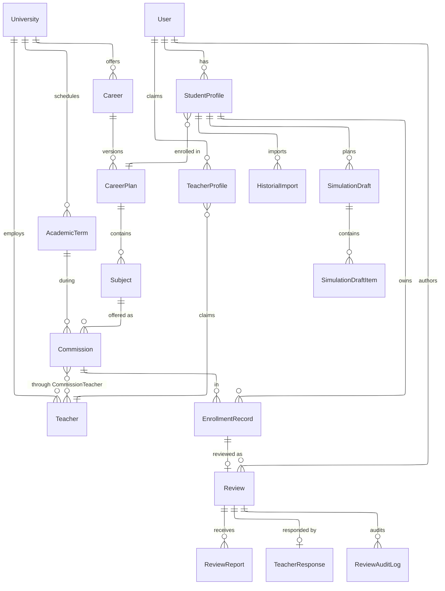
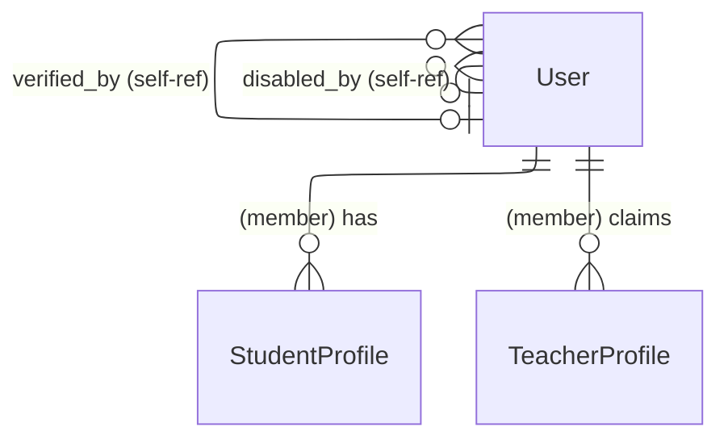
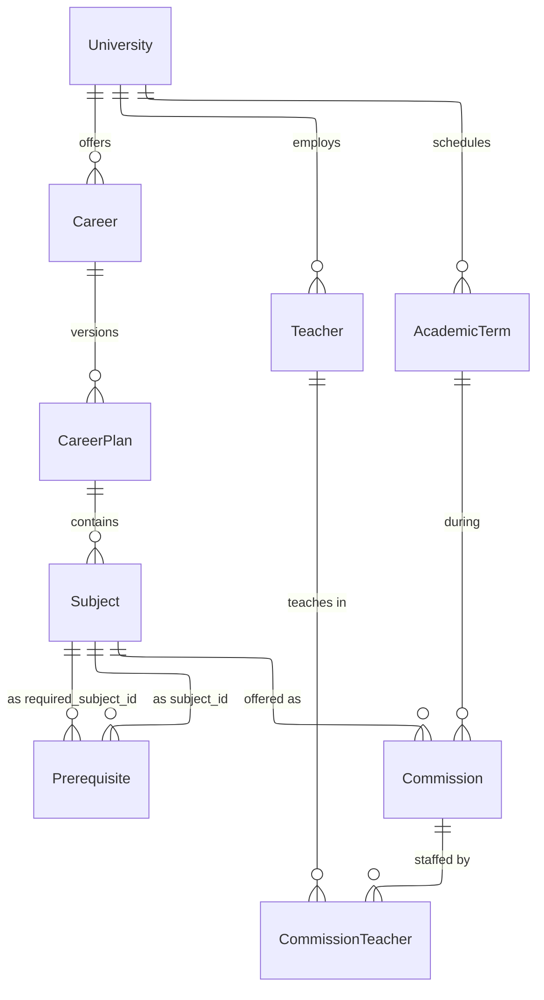
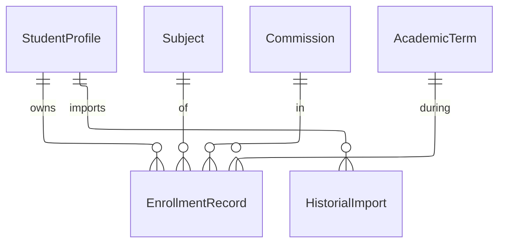
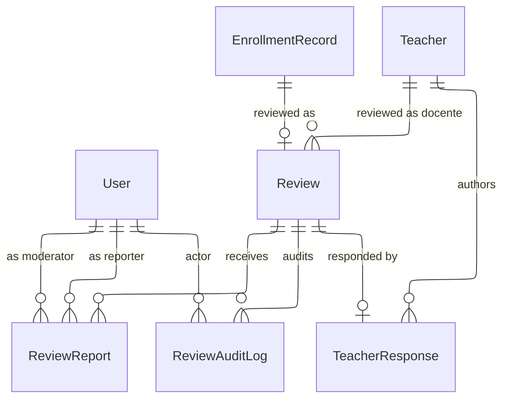

# Data Model. planb

Modelo de datos completo del sistema, organizado por bounded contexts. Cada sección tiene un diagrama ER en Mermaid con las relaciones del contexto, seguido de la especificación de cada entidad (campos, tipos, constraints) y las invariantes que se aplican transversalmente.

El "por qué" de las decisiones estructurales está en los ADRs referenciados. Este documento describe el "qué".

## Tabla de contenidos

- [Overview](#overview)
- [Context: Identity](#context-identity)
- [Context: Academic Catalog](#context-academic-catalog)
- [Context: Student History](#context-student-history)
- [Context: Reviews & Moderation](#context-reviews--moderation)
- [Context: Semantic Analytics](#context-semantic-analytics)
- [Context: Planning](#context-planning)
- [Apéndice A: Enums](#apéndice-a-enums)
- [Apéndice B: Invariantes transversales](#apéndice-b-invariantes-transversales)

## Overview

Vista de alto nivel: bounded contexts y sus conexiones. Cada contexto se detalla en su sección.


```mermaid
---
config:
    layout: elk
---
erDiagram
    University ||--o{ Career : offers
    University ||--o{ Teacher : employs
    University ||--o{ AcademicTerm : schedules
    Career ||--o{ CareerPlan : versions
    CareerPlan ||--o{ Subject : contains
    Subject ||--o{ Commission : "offered as"
    AcademicTerm ||--o{ Commission : during
    Commission }o--o{ Teacher : "through CommissionTeacher"

    User ||--o{ StudentProfile : has
    User ||--o{ TeacherProfile : claims
    StudentProfile }o--|| CareerPlan : "enrolled in"
    TeacherProfile }o--|| Teacher : "claims"

    StudentProfile ||--o{ EnrollmentRecord : owns
    Commission ||--o{ EnrollmentRecord : in
    StudentProfile ||--o{ HistorialImport : imports

    EnrollmentRecord ||--o| Review : "reviewed as"
    User ||--o{ Review : authors
    Review ||--o{ ReviewReport : receives
    Review ||--o| TeacherResponse : "responded by"
    Review ||--o{ ReviewAuditLog : audits

    StudentProfile ||--o{ SimulationDraft : plans
    SimulationDraft ||--o{ SimulationDraftItem : contains
```

**Contextos:**

| Context              | Entidades                                                                                                   | Propósito                                                       |
| -------------------- | ----------------------------------------------------------------------------------------------------------- | --------------------------------------------------------------- |
| Identity             | User, StudentProfile, TeacherProfile, VerificationToken                                                     | Cuentas, roles, identidades académicas                          |
| Academic Catalog     | University, Career, CareerPlan, Subject, Prerequisite, Teacher, Commission, CommissionTeacher, AcademicTerm, CareerPlanImport | Datos precargados del dominio académico       |
| Student History      | EnrollmentRecord, HistorialImport                                                                           | Historial de cursadas del alumno                                |
| Reviews & Moderation | Review, ReviewReport, TeacherResponse, ReviewAuditLog                                                       | Reseñas, reportes, respuestas, auditoría                        |
| Planning             | SimulationDraft, SimulationDraftItem                                                                        | Simulaciones de cuatrimestre del alumno                         |

## Context: Identity

Cuentas, roles y perfiles que capturan identidad del usuario en la plataforma. Ver [ADR-0008](../decisions/0008-roles-exclusivos-profiles-como-capacidades.md) para la separación entre rol y profile.


```mermaid
---
config:
    layout: elk
---
erDiagram
    User ||--o{ StudentProfile : "(member) has"
    User ||--o{ TeacherProfile : "(member) claims"
    User }o--o| User : "disabled_by (self-ref)"
    User }o--o| User : "verified_by (self-ref)"
```

### Entity: User

| Campo               | Tipo             | Constraints                  | Notas                               |
| ------------------- | ---------------- | ---------------------------- | ----------------------------------- |
| `id`                | UUID             | PK                           |                                     |
| `email`             | TEXT             | NOT NULL, UNIQUE             |                                     |
| `password_hash`     | TEXT             | NOT NULL                     | bcrypt/argon2                       |
| `email_verified_at` | TIMESTAMPTZ      | NULL                         | Null = cuenta pendiente             |
| `role`              | ENUM `user_role` | NOT NULL, DEFAULT `'member'` | Ver [Apéndice A](#apéndice-a-enums) |
| `disabled_at`       | TIMESTAMPTZ      | NULL                         | Soft suspend                        |
| `disabled_reason`   | TEXT             | NULL                         |                                     |
| `disabled_by`       | UUID             | FK → User, NULL              | Self-ref                            |
| `created_at`        | TIMESTAMPTZ      | NOT NULL, DEFAULT `now()`    |                                     |
| `updated_at`        | TIMESTAMPTZ      | NOT NULL, DEFAULT `now()`    |                                     |

### Entity: StudentProfile

Vincula un User con un CareerPlan. Un User `member` puede tener múltiples StudentProfiles (una por carrera).

| Campo             | Tipo                  | Constraints                  | Notas                           |
| ----------------- | --------------------- | ---------------------------- | ------------------------------- |
| `id`              | UUID                  | PK                           |                                 |
| `user_id`         | UUID                  | FK → User, NOT NULL          |                                 |
| `career_id`       | UUID                  | FK → CareerPlan, NOT NULL    | Apunta al plan, no a la carrera |
| `enrollment_year` | INT                   | NOT NULL                     | Año de ingreso                  |
| `status`          | ENUM `student_status` | NOT NULL, DEFAULT `'active'` |                                 |
| `graduated_at`    | DATE                  | NULL                         |                                 |
| `created_at`      | TIMESTAMPTZ           | NOT NULL                     |                                 |
| `updated_at`      | TIMESTAMPTZ           | NOT NULL                     |                                 |

Constraints adicionales:

- `UNIQUE(user_id, career_id)`: un user no puede tener dos profiles en la misma carrera-plan.
- CHECK: `status = 'graduated'` → `graduated_at NOT NULL`.
- CHECK: `status IN ('active', 'abandoned')` → `graduated_at IS NULL`.

### Entity: TeacherProfile

Claim de identidad docente por parte de un User. Sin `verified_at`, el profile existe pero no desbloquea capacidades.

| Campo                 | Tipo                               | Constraints            | Notas                                                   |
| --------------------- | ---------------------------------- | ---------------------- | ------------------------------------------------------- |
| `id`                  | UUID                               | PK                     |                                                         |
| `user_id`             | UUID                               | FK → User, NOT NULL    |                                                         |
| `teacher_id`          | UUID                               | FK → Teacher, NOT NULL |                                                         |
| `verification_method` | ENUM `teacher_verification_method` | NULL                   | Se setea al verificar                                   |
| `verified_at`         | TIMESTAMPTZ                        | NULL                   | Null = no verificado                                    |
| `verified_by`         | UUID                               | FK → User, NULL        | Admin que verificó manualmente                          |
| `institutional_email` | TEXT                               | NULL                   | Se captura si verification_method = institutional_email |
| `rejection_reason`    | TEXT                               | NULL                   | Si se rechazó un claim, motivo                          |
| `created_at`          | TIMESTAMPTZ                        | NOT NULL               |                                                         |
| `updated_at`          | TIMESTAMPTZ                        | NOT NULL               |                                                         |

Constraints adicionales:

- `UNIQUE(user_id, teacher_id)`.
- `UNIQUE(teacher_id) WHERE verified_at IS NOT NULL`: un Teacher tiene un único profile verificado.
- CHECK: `verified_at NOT NULL` → `verification_method NOT NULL`.
- CHECK: `verification_method = 'manual'` → `verified_by NOT NULL`.
- CHECK: `verification_method = 'institutional_email'` → `institutional_email NOT NULL`.

### Entity: VerificationToken (child de User / TeacherProfile)

Token opaco usado para verificar el email de un User (purpose=`user_email_verification`) o el email institucional de un docente reclamado (purpose=`teacher_institutional_verification`). Es **child entity**, no aggregate independiente: vive dentro del aggregate root que lo posee. Ver [ADR-0033](../decisions/0033-verification-token-como-child-entity.md).

| Campo               | Tipo                              | Constraints                              | Notas                                              |
| ------------------- | --------------------------------- | ---------------------------------------- | -------------------------------------------------- |
| `id`                | UUID                              | PK                                       |                                                    |
| `owner_id`          | UUID                              | NOT NULL                                 | FK a `user.id` cuando purpose=`user_email_verification`; FK a `teacher_profile.id` cuando purpose=`teacher_institutional_verification` (UNIQUE por purpose) |
| `purpose`           | ENUM `verification_token_purpose` | NOT NULL                                 | `user_email_verification`, `teacher_institutional_verification` |
| `value`             | TEXT                              | NOT NULL, UNIQUE                         | Opaque, 256-bit base64url                          |
| `issued_at`         | TIMESTAMPTZ                       | NOT NULL                                 |                                                    |
| `expires_at`        | TIMESTAMPTZ                       | NOT NULL                                 | TTL típicamente 24h                                |
| `consumed_at`       | TIMESTAMPTZ                       | NULL                                     | Set cuando se consume; terminal                    |
| `invalidated_at`    | TIMESTAMPTZ                       | NULL                                     | Set cuando se invalida (por resend o force expiry) |

Constraints:

- `UNIQUE(owner_id, purpose) WHERE consumed_at IS NULL AND invalidated_at IS NULL`: un solo token activo por purpose por owner.
- CHECK: `consumed_at IS NULL OR invalidated_at IS NULL`: un token no puede estar consumido E invalidado simultáneamente.
- CHECK: `expires_at > issued_at`.

### Invariantes cross-table (enforced en app)

- Si `User.role != 'member'` → no puede existir `StudentProfile` ni `TeacherProfile` con ese `user_id`.
- Si se crea un `TeacherProfile` con `verification_method = 'institutional_email'`, el dominio de `institutional_email` debe estar en `Teacher.university.institutional_email_domains`.
- `verified_by` apunta a un User con `role = 'admin'`.
- `disabled_by` apunta a un User con `role IN ('moderator', 'admin')`.

## Context: Academic Catalog

Datos precargados manualmente por el equipo admin. Modela universidades, carreras, planes de estudio, materias, correlativas, docentes, comisiones y cuatrimestres. Ver [ADR-0001](../decisions/0001-multi-universidad-desde-dia-1.md), [ADR-0002](../decisions/0002-versionado-de-planes-de-estudio.md), [ADR-0003](../decisions/0003-correlativas-con-dos-tipos.md).


```mermaid
---
config:
    layout: elk
---
erDiagram
    University ||--o{ Career : offers
    University ||--o{ Teacher : employs
    University ||--o{ AcademicTerm : schedules
    Career ||--o{ CareerPlan : versions
    CareerPlan ||--o{ Subject : contains
    Subject ||--o{ Prerequisite : "as subject_id"
    Subject ||--o{ Prerequisite : "as required_subject_id"
    Subject ||--o{ Commission : "offered as"
    AcademicTerm ||--o{ Commission : during
    Commission ||--o{ CommissionTeacher : "staffed by"
    Teacher ||--o{ CommissionTeacher : "teaches in"
```

### Entity: University

| Campo                         | Tipo        | Constraints              | Notas                                            |
| ----------------------------- | ----------- | ------------------------ | ------------------------------------------------ |
| `id`                          | UUID        | PK                       |                                                  |
| `name`                        | TEXT        | NOT NULL                 | Ej "Universidad del Norte Santo Tomás de Aquino" |
| `short_name`                  | TEXT        | NOT NULL                 | Ej "UNSTA"                                       |
| `slug`                        | TEXT        | NOT NULL, UNIQUE         | Ej "unsta"                                       |
| `country`                     | TEXT        | NOT NULL                 |                                                  |
| `city`                        | TEXT        | NOT NULL                 |                                                  |
| `website`                     | TEXT        | NULL                     |                                                  |
| `institutional_email_domains` | TEXT[]      | NOT NULL, DEFAULT `'{}'` | Dominios válidos para verificación docente       |
| `created_at`                  | TIMESTAMPTZ | NOT NULL                 |                                                  |
| `updated_at`                  | TIMESTAMPTZ | NOT NULL                 |                                                  |

### Entity: Career

| Campo            | Tipo                      | Constraints               | Notas                                         |
| ----------------- | ------------------------- | -------------------------- | ----------------------------------------------- |
| `id`              | UUID                      | PK                          |                                                 |
| `university_id`   | UUID                      | FK → University, NOT NULL   |                                                 |
| `name`            | TEXT                      | NOT NULL                    |                                                 |
| `slug`            | TEXT                      | NOT NULL                    | Único por universidad                          |
| `short_name`      | TEXT                      | NULL                        | Ej "Ing. Sistemas"                             |
| `code`            | TEXT                      | NULL                        | Código institucional, ej "TUDCS"               |
| `degree_type`     | ENUM `career_degree_type` | NULL                        | Grado, posgrado o tecnicatura                  |
| `duration_years`  | INT                       | NULL                        | Duración nominal en años (rango 1-15)          |
| `cadence`         | ENUM `term_kind`          | NULL                        | Cadencia mayoritaria de la carrera              |
| `description`     | TEXT                      | NULL                        | Descripción corta visible al alumno            |
| `is_official`     | BOOLEAN                   | NOT NULL, DEFAULT `true`    | False cuando la creó un alumno via crowdsourcing |
| `is_active`       | BOOLEAN                   | NOT NULL, DEFAULT `true`    | Soft delete                                    |
| `created_at`      | TIMESTAMPTZ               | NOT NULL                    |                                                 |
| `updated_at`      | TIMESTAMPTZ               | NOT NULL                    |                                                 |

Constraints:

- `UNIQUE(university_id, slug)`: slug único por universidad.
- `UNIQUE(university_id, code) WHERE code IS NOT NULL`: código único por universidad cuando se provee (índice parcial).
- `duration_years` (cuando no NULL): rango 1-15.

### Entity: CareerPlan

Plan de estudios de una Career para un año particular (ej. "TUDCS Plan 2024").

| Campo         | Tipo                       | Constraints              | Notas                                             |
| ------------- | -------------------------- | -------------------------- | --------------------------------------------------- |
| `id`          | UUID                       | PK                          |                                                     |
| `career_id`   | UUID                       | FK → Career, NOT NULL       |                                                     |
| `year`        | INT                        | NOT NULL                    | Año del plan, ej 2024                              |
| `status`      | ENUM `career_plan_status`  | NOT NULL                    | `active` = vigente; `deprecated` = histórico       |
| `label`       | TEXT                       | NULL                         | Identificador editorial opcional, ej "plan-2023"   |
| `is_official` | BOOLEAN                    | NOT NULL, DEFAULT `true`    | False cuando lo creó un alumno via crowdsourcing   |
| `created_at`  | TIMESTAMPTZ                | NOT NULL                    |                                                     |
| `updated_at`  | TIMESTAMPTZ                | NOT NULL                    |                                                     |

Constraints:

- `UNIQUE(career_id, year)`: un plan por año por carrera.

### Entity: Subject

Materia de un plan específico.

| Campo            | Tipo             | Constraints               | Notas             |
| ---------------- | ---------------- | ------------------------- | ----------------- |
| `id`             | UUID             | PK                        |                   |
| `career_plan_id` | UUID             | FK → CareerPlan, NOT NULL |                   |
| `code`           | TEXT             | NOT NULL                  | Ej "MAT101"       |
| `name`           | TEXT             | NOT NULL                  | Ej "Matemática I" |
| `year_in_plan`   | INT              | NOT NULL                  | 1, 2, 3…          |
| `term_in_year`   | INT              | NULL                      | Null si anual     |
| `term_kind`      | ENUM `term_kind` | NOT NULL                  |                   |
| `weekly_hours`   | INT              | NOT NULL                  |                   |
| `total_hours`    | INT              | NOT NULL                  |                   |
| `description`    | TEXT             | NULL                      |                   |
| `is_active`      | BOOLEAN          | NOT NULL, DEFAULT `true`  | Soft delete (US-062) |
| `is_official`    | BOOLEAN          | NOT NULL                  | False si la creó el crowdsourcing |
| `created_at`     | TIMESTAMPTZ      | NOT NULL                  |                   |
| `updated_at`     | TIMESTAMPTZ      | NOT NULL                  |                   |

Constraints:

- `UNIQUE(career_plan_id, code)`.
- CHECK: `term_kind = 'anual'` → `term_in_year IS NULL`.
- CHECK: `term_kind != 'anual'` → `term_in_year IS NOT NULL`.
- `term_kind` queda congelado apenas la materia tiene comisiones (app-level): crear una comisión valida que la cadencia de materia y período coincidan, y editarla después rompía esa igualdad en silencio.

Índices de búsqueda (US-042):

```sql
CREATE INDEX ix_subjects_search_trgm ON academic.subjects USING gin (
    academic.immutable_unaccent(lower(code)) gin_trgm_ops,
    academic.immutable_unaccent(lower(name)) gin_trgm_ops);
```

`academic.immutable_unaccent(text)` es un wrapper propio: las dos sobrecargas de `unaccent` son `STABLE`, así que Postgres rechaza indexarlas. Fijando el diccionario de forma explícita (`public.unaccent('public.unaccent'::regdictionary, $1)`) el resultado sí es determinístico y marcarla `IMMUTABLE` es correcto. La query tiene que usar exactamente la misma expresión, y comparar por similitud con el operador `%` (con `pg_trgm.similarity_threshold` seteado en la sesión), porque `similarity(a,b) > x` como llamada a función no es indexable.

### Entity: Prerequisite

Correlativa entre dos materias del mismo plan.

| Campo                 | Tipo                     | Constraints            |
| --------------------- | ------------------------ | ---------------------- |
| `subject_id`          | UUID                     | FK → Subject, NOT NULL |
| `required_subject_id` | UUID                     | FK → Subject, NOT NULL |
| `type`                | ENUM `prerequisite_type` | NOT NULL               |

Constraints:

- `PRIMARY KEY (subject_id, required_subject_id, type)`.
- CHECK: `subject_id != required_subject_id`.
- App-level: ambas materias pertenecen al mismo `career_plan_id`.
- App-level: el grafo de cada `type` es acíclico (validado al cargar plan en backoffice).

### Entity: Teacher

Docente del catálogo de una universidad. Entidad precargada, independiente de si un User la reclamó.

| Campo           | Tipo        | Constraints               | Notas                                                             |
| --------------- | ----------- | ------------------------- | ----------------------------------------------------------------- |
| `id`            | UUID        | PK                        |                                                                   |
| `university_id` | UUID        | FK → University, NOT NULL |                                                                   |
| `first_name`    | TEXT        | NOT NULL                  |                                                                   |
| `last_name`     | TEXT        | NOT NULL                  |                                                                   |
| `title`         | TEXT        | NULL                      | Lowercase en DB, title case en display (convención Laravel-style) |
| `bio`           | TEXT        | NULL                      |                                                                   |
| `photo_url`     | TEXT        | NULL                      |                                                                   |
| `is_active`     | BOOLEAN     | NOT NULL, DEFAULT `true`  | Soft delete (US-063)                                              |
| `created_at`    | TIMESTAMPTZ | NOT NULL                  |                                                                   |
| `updated_at`    | TIMESTAMPTZ | NOT NULL                  |                                                                   |

Índice de búsqueda análogo al de Subject (`ix_teachers_search_trgm`), con una tercera expresión sobre `first_name || ' ' || last_name` para la búsqueda por nombre completo.

Un docente archivado no se puede asignar a comisiones nuevas (app-level). Sí se lo deja seguir asignado donde ya estaba: sacarlo reescribiría quién dictó esa comisión.

### Entity: AcademicTerm

Período lectivo genérico. Ver [ADR-0001](../decisions/0001-multi-universidad-desde-dia-1.md).

| Campo               | Tipo             | Constraints               | Notas                                                  |
| ------------------- | ---------------- | ------------------------- | ------------------------------------------------------ |
| `id`                | UUID             | PK                        |                                                        |
| `university_id`     | UUID             | FK → University, NOT NULL |                                                        |
| `year`              | INT              | NOT NULL                  |                                                        |
| `number`            | INT              | NOT NULL                  | Ordinal dentro del año                                 |
| `kind`              | ENUM `term_kind` | NOT NULL                  |                                                        |
| `start_date`        | DATE             | NOT NULL                  |                                                        |
| `end_date`          | DATE             | NOT NULL                  |                                                        |
| `enrollment_opens`  | TIMESTAMPTZ      | NOT NULL                  |                                                        |
| `enrollment_closes` | TIMESTAMPTZ      | NOT NULL                  |                                                        |
| `label`             | TEXT             | NOT NULL                  | Computado al insertar. Ej "2026-C1", "2026-B3", "2026" |
| `created_at`        | TIMESTAMPTZ      | NOT NULL                  |                                                        |
| `updated_at`        | TIMESTAMPTZ      | NOT NULL                  |                                                        |

Constraints:

- `UNIQUE(university_id, year, number, kind)`.
- CHECK: `end_date > start_date`.
- CHECK: `enrollment_closes > enrollment_opens`.
- `kind` queda congelado apenas el período tiene comisiones (app-level), por el mismo motivo que `Subject.term_kind`. El resto de los campos se siguen pudiendo corregir.

El `label` lo computa siempre el dominio (`AcademicTerm.ComputeLabel`), incluido el seeder. Cuando el seed traía sus propios literales, el mismo dropdown mezclaba dos convenciones para el mismo tipo de período según quién lo hubiera creado.

### Entity: Commission

Oferta concreta de una Subject en un AcademicTerm.

| Campo        | Tipo                       | Constraints                 | Notas                                  |
| ------------ | -------------------------- | --------------------------- | -------------------------------------- |
| `id`         | UUID                       | PK                          |                                        |
| `subject_id` | UUID                       | FK → Subject, NOT NULL      |                                        |
| `term_id`    | UUID                       | FK → AcademicTerm, NOT NULL |                                        |
| `name`       | TEXT                       | NOT NULL                    | Ej "A", "Com 1", "Noche"               |
| `modality`   | ENUM `commission_modality` | NOT NULL                    |                                        |
| `capacity`   | INT                        | NULL                        |                                        |
| `notes`      | TEXT                       | NULL                        |                                        |
| `schedules`  | JSONB                      | NOT NULL                    | Franjas embebidas, ver abajo           |
| `is_active`  | BOOLEAN                    | NOT NULL                    | Soft delete (US-093), default `true`   |
| `created_at` | TIMESTAMPTZ                | NOT NULL                    |                                        |
| `updated_at` | TIMESTAMPTZ                | NOT NULL                    |                                        |

Constraints:

- `UNIQUE(subject_id, term_id, name)`. Sobre todas las filas, no solo las activas: archivar no libera el nombre porque la salida correcta es reactivar la comisión archivada, no crear una segunda con el mismo nombre.
- CHECK `ck_commissions_capacity_positive`: `capacity IS NULL OR capacity > 0`.

`schedules` es un array de `{day, start, end}` embebido en la fila, no una tabla hija ([ADR-0053](../decisions/0053-forma-de-las-colecciones-hijas-de-un-aggregate.md)): ninguna lectura expande las franjas a filas para joinear. `CommissionTeacher`, en cambio, sigue siendo tabla porque se joinea contra `teachers` para traer el nombre. El CHECK `end_time > start_time` que tenía la tabla de franjas no se puede escribir sobre un array jsonb; el invariante lo sostiene el aggregate, cuyo último bypass (`Commission.Hydrate`, usado por el seeder) ahora valida y tira.

### Entity: CommissionTeacher

M:N entre Commission y Teacher, con rol.

| Campo           | Tipo                           | Constraints               |
| --------------- | ------------------------------ | ------------------------- |
| `commission_id` | UUID                           | FK → Commission, NOT NULL |
| `teacher_id`    | UUID                           | FK → Teacher, NOT NULL    |
| `role`          | ENUM `commission_teacher_role` | NOT NULL                  |

Constraints:

- `PRIMARY KEY (commission_id, teacher_id)`.

### Invariantes cross-table (enforced en app)

- `Career.university_id = Teacher.university_id` para los teachers asignados (vía `CommissionTeacher`) a comisiones de subjects de esa carrera.
- `Subject.term_kind = AcademicTerm.kind` cuando se crea una `Commission`.
- `Subject.career_plan.career.university_id = AcademicTerm.university_id` para una `Commission`.
- `Prerequisite`: ambos subjects pertenecen al mismo `career_plan_id`.
- `Career.university_id = Commission.subject.career_plan.career.university_id = AcademicTerm.university_id = Teacher.university_id` (coherencia universitaria total).

## Context: Student History

Historial académico del alumno. Ver [ADR-0004](../decisions/0004-enrollment-guarda-hechos.md) y [ADR-0006](../decisions/0006-jsonb-solo-donde-el-shape-es-variable.md).


```mermaid
---
config:
    layout: elk
---
erDiagram
    StudentProfile ||--o{ EnrollmentRecord : owns
    Subject ||--o{ EnrollmentRecord : of
    Commission ||--o{ EnrollmentRecord : in
    AcademicTerm ||--o{ EnrollmentRecord : during
    StudentProfile ||--o{ HistorialImport : imports
```

### Entity: EnrollmentRecord

Cursada específica del alumno.

| Campo             | Tipo                     | Constraints                   | Notas                     |
| ----------------- | ------------------------ | ----------------------------- | ------------------------- |
| `id`              | UUID                     | PK                            |                           |
| `student_id`      | UUID                     | FK → StudentProfile, NOT NULL |                           |
| `subject_id`      | UUID                     | FK → Subject, NOT NULL        |                           |
| `commission_id`   | UUID                     | FK → Commission, NULL         | Null para equivalencias   |
| `term_id`         | UUID                     | FK → AcademicTerm, NULL       | Null para equivalencias   |
| `status`          | ENUM `enrollment_status` | NOT NULL                      |                           |
| `approval_method` | ENUM `approval_method`   | NULL                          | Solo si status='aprobada' |
| `grade`           | NUMERIC(4,2)             | NULL                          | 0..10                     |
| `created_at`      | TIMESTAMPTZ              | NOT NULL                      |                           |
| `updated_at`      | TIMESTAMPTZ              | NOT NULL                      |                           |

Constraints:

- `UNIQUE(student_id, subject_id, term_id)` con `NULLS NOT DISTINCT`: sin eso el índice no restringe nada cuando `term_id` es nulo (en Postgres dos NULL son distintos entre sí) y convivían N cursadas iguales sin período, que es exactamente lo que ensucia el pass rate público.
- `UNIQUE(student_id, subject_id) WHERE approval_method = 'equivalencia'`: una sola equivalencia por materia, independiente del período (que ahí siempre es nulo).
- CHECK: `status = 'aprobada'` → `grade NOT NULL AND approval_method NOT NULL`.
- CHECK: `status = 'regular'` → `grade NOT NULL AND approval_method IS NULL`.
- CHECK: `status IN ('cursando','reprobada','abandonada')` → `grade IS NULL AND approval_method IS NULL`.
- CHECK: `approval_method = 'equivalencia'` → `commission_id IS NULL AND term_id IS NULL`.
- CHECK: `approval_method = 'final_libre'` → `commission_id IS NULL AND term_id IS NOT NULL` (rindió libre en un cuatrimestre específico sin cursar comisión).
- CHECK `ck_enrollment_records_cursada_requires_term`: `approval_method IN ('cursada','promocion','final')` → `term_id NOT NULL`. **La comisión NO se exige**: el historial académico que sube el alumno no dice en qué comisión cursó, así que exigirla hacía imposible importar cualquier materia aprobada cursando (US-014). Sin comisión la cursada no es reseñable, que es una función menos, no un dato falso.
- CHECK: `grade BETWEEN 0 AND 10`.

### Entity: HistorialImport

Staging del parseo de PDF/texto.

| Campo         | Tipo                      | Constraints                   | Notas                               |
| ------------- | ------------------------- | ----------------------------- | ----------------------------------- |
| `id`          | UUID                      | PK                            |                                     |
| `student_id`  | UUID                      | FK → StudentProfile, NOT NULL |                                     |
| `source_type` | ENUM `import_source_type` | NOT NULL                      |                                     |
| `raw_payload` | JSONB                     | NOT NULL                      | Output crudo del parser             |
| `status`      | ENUM `import_status`      | NOT NULL, DEFAULT `'pending'` |                                     |
| Error       | TEXT                      | NULL                          | Mensaje de error si status='failed' |
| `parsed_at`   | TIMESTAMPTZ               | NULL                          | Timestamp de parseo exitoso         |
| `confirmed_at`| TIMESTAMPTZ               | NULL                          | Timestamp del confirm del alumno    |
| `created_at`  | TIMESTAMPTZ               | NOT NULL                      |                                     |
| `updated_at`  | TIMESTAMPTZ               | NOT NULL                      |                                     |

`MarkParsing` acepta volver desde `parsing` además de `pending`: estar ya en `parsing` significa que el worker anterior se cayó a mitad del parseo, y rechazar esa redelivery dejaba el import trabado en ese estado para siempre, con el frontend polleando algo que no iba a cambiar nunca. Del lado del transporte, las colas locales de Wolverine son durables (`UseDurableLocalQueues`) para que el mensaje sobreviva al restart en vez de perderse entre el outbox y la cola en memoria.

### Invariantes cross-table (enforced en app)

- `StudentProfile.career_id.career.university_id = Subject.career_plan.career.university_id` para un `EnrollmentRecord`: el alumno cursa materias de su propia universidad/plan.
- `Commission.subject_id = EnrollmentRecord.subject_id` y `Commission.term_id = EnrollmentRecord.term_id`: la comisión del enrollment corresponde a la materia y cuatrimestre del enrollment.
- Una Review solo puede existir sobre enrollments con `status != 'cursando'`.

## Context: Reviews & Moderation

Reseñas, reportes, respuestas de docentes y auditoría. Ver [ADR-0005](../decisions/0005-reseña-anclada-al-enrollment.md) y [ADR-0009](../decisions/0009-anonimato-como-regla-de-presentacion.md).


```mermaid
---
config:
    layout: elk
---
erDiagram
    User ||--o{ ReviewReport : "as reporter"
    User ||--o{ ReviewReport : "as moderator"
    User ||--o{ ReviewAuditLog : actor
    EnrollmentRecord ||--o| Review : "reviewed as"
    Teacher ||--o{ Review : "reviewed as docente"
    Review ||--o{ ReviewReport : receives
    Review ||--o| TeacherResponse : "responded by"
    Review ||--o{ ReviewAuditLog : audits
    Teacher ||--o{ TeacherResponse : authors
```

### Entity: Review

Reseña anclada a una cursada finalizada.

| Campo                           | Tipo                        | Constraints                     | Notas                                          |
| ------------------------------- | --------------------------- | ------------------------------- | ---------------------------------------------- |
| `id`                            | UUID                        | PK                              |                                                |
| `enrollment_id`                 | UUID                        | FK → EnrollmentRecord, NOT NULL | Una reseña por cursada, ver el índice de abajo |
| `author_user_id`                | UUID                        | FK → User, NOT NULL             | Autor. Nunca se serializa (ADR-0009)           |
| `reviewed_teacher_id`           | UUID                        | FK → Teacher, NOT NULL          |                                                |
| `difficulty_rating`             | SMALLINT                    | NOT NULL                        | 1..5                                           |
| `overall_rating`                | SMALLINT                    | NOT NULL                        | 1..5                                           |
| `hours_per_week`                | INT                         | NULL                            | 0..30                                          |
| `tags`                          | TEXT[]                      | NOT NULL                        | Subconjunto del set permitido                  |
| `would_recommend_course`        | BOOLEAN                     | NOT NULL                        |                                                |
| `would_retake_teacher`          | BOOLEAN                     | NOT NULL                        |                                                |
| `subject_text`                  | TEXT                        | NULL                            | Sobre la cursada                               |
| `teacher_text`                  | TEXT                        | NULL                            | Sobre el docente                               |
| `final_grade`                   | NUMERIC(4,2)                | NULL                            | 0..10                                          |
| `status`                        | ENUM `review_status`        | NOT NULL, DEFAULT `'published'` |                                                |
| `under_review_reason`           | ENUM `under_review_reason`  | NULL                             | Por qué está UnderReview, ver abajo            |
| `created_at`                    | TIMESTAMPTZ                 | NOT NULL                        |                                                |
| `updated_at`                    | TIMESTAMPTZ                 | NOT NULL                        | `> created_at` marca "editada" en el feed      |
| `deleted_at`                    | TIMESTAMPTZ                 | NULL                            | Soft delete (US-055)                           |
| `deleted_reason`                | ENUM `review_deleted_reason`| NULL                            |                                                |

Constraints:

- `UNIQUE(enrollment_id) WHERE status <> 'Deleted'`: una reseña viva por cursada. Parcial y no total porque una reseña borrada libera la cursada para volver a reseñarla. Ojo con el corolario: por eso el autor no puede borrar una reseña que moderación removió (sería la salida de escape para republicarla limpia), y el handler corta con `reviews.review.cannot_delete_removed`.
- CHECK: `difficulty_rating BETWEEN 1 AND 5`, `overall_rating BETWEEN 1 AND 5`.
- CHECK: `hours_per_week IS NULL OR hours_per_week BETWEEN 0 AND 30`.
- CHECK: `final_grade IS NULL OR final_grade BETWEEN 0 AND 10`.
- CHECK `ck_reviews_at_least_one_text`: `subject_text IS NOT NULL OR teacher_text IS NOT NULL`.
- CHECK `ck_reviews_{subject,teacher}_text_length`: cada texto presente entra en el rango de `ReviewText` (50..2000). No es redundante con el aggregate: el value converter del read path hace `.Value` sobre el `Result`, así que una fila fuera de rango no da error de dominio, revienta al materializar y deja la reseña inutilizable para cualquier operación.

`under_review_reason` distingue por qué una reseña está `UnderReview`: `content_filter` (el filtro la frenó al publicar o editar), `reports` (el threshold de reports abiertos), o `enrollment_changed` (la cursada que la respalda cambió de forma destructiva, [ADR-0032](../decisions/0032-edit-destructive-enrollment-invalida-review.md); sin escritor implementado todavía). Antes era un bool que solo alcanzaba para las primeras dos causas y las dejaba indistinguibles del status; sin esa distinción, desestimar un report sobre una reseña frenada por el filtro la publicaba de rebote.

### Entity: ReviewReport

Reporte de un usuario sobre una reseña.

| Campo             | Tipo                        | Constraints                |
| ----------------- | --------------------------- | -------------------------- |
| `id`              | UUID                        | PK                         |
| `review_id`       | UUID                        | FK → Review, NOT NULL      |
| `reporter_id`     | UUID                        | FK → User, NOT NULL        |
| `reason`          | ENUM `review_report_reason` | NOT NULL                   |
| `details`         | TEXT                        | NULL                       |
| `status`          | ENUM `review_report_status` | NOT NULL, DEFAULT `'open'` |
| `moderator_id`    | UUID                        | FK → User, NULL            |
| `resolution_note` | TEXT                        | NULL                       |
| `created_at`      | TIMESTAMPTZ                 | NOT NULL                   |
| `resolved_at`     | TIMESTAMPTZ                 | NULL                       |

Constraints:

- `UNIQUE(review_id, reporter_id)`.
- CHECK: `status != 'open'` → `moderator_id NOT NULL AND resolved_at NOT NULL`.

### Entity: TeacherResponse

Respuesta pública del docente reseñado a una reseña.

| Campo           | Tipo                           | Constraints                     |
| --------------- | ------------------------------ | ------------------------------- |
| `id`            | UUID                           | PK                              |
| `review_id`     | UUID                           | FK → Review, NOT NULL, UNIQUE   |
| `teacher_id`    | UUID                           | FK → Teacher, NOT NULL          |
| `response_text` | TEXT                           | NOT NULL                        |
| `status`        | ENUM `teacher_response_status` | NOT NULL, DEFAULT `'published'` |
| `created_at`    | TIMESTAMPTZ                    | NOT NULL                        |
| `updated_at`    | TIMESTAMPTZ                    | NOT NULL                        |

### Entity: ReviewAuditLog

Log inmutable de cambios sobre una reseña. Usa JSONB por la heterogeneidad del `changes` según la acción.

| Campo       | Tipo                       | Constraints               |
| ----------- | -------------------------- | ------------------------- |
| `id`        | UUID                       | PK                        |
| `review_id` | UUID                       | FK → Review, NOT NULL     |
| `action`    | ENUM `review_audit_action` | NOT NULL                  |
| `actor_id`  | UUID                       | FK → User, NOT NULL       |
| `changes`   | JSONB                      | NULL                      |
| `at`        | TIMESTAMPTZ                | NOT NULL, DEFAULT `now()` |

### Invariantes cross-table (enforced en app)

- `Review.reviewed_teacher_id` debe existir en `CommissionTeacher` para la `Commission` del `EnrollmentRecord.commission_id`.
- `Review` solo se puede crear si `EnrollmentRecord.status != 'cursando'`.
- `TeacherResponse.teacher_id = Review.reviewed_teacher_id`: solo el docente reseñado responde.
- `TeacherResponse` solo puede crearse si existe un `TeacherProfile` con `teacher_id = TeacherResponse.teacher_id` y `verified_at NOT NULL`.
- `ReviewReport.moderator_id` debe apuntar a un User con `role IN ('moderator','admin')`.
- `ReviewAuditLog`: cuando `action = 'edited'`, `changes` contiene estructura `{before: {...}, after: {...}}`.
- Una reseña `removed` por moderación no la puede borrar su autor: el índice único es parcial sobre `status <> 'Deleted'`, así que borrarla liberaría la cursada y le permitiría republicar el mismo texto como fila nueva, sin los reportes upheld encima.
- Desestimar el último report solo restaura a `published` si `under_review_reason = 'reports'`; no restaura si la razón es `content_filter` o `enrollment_changed`.
- Todos los endpoints públicos que serializan Review omiten `enrollment.student_id` y cualquier referencia al User autor. El anonimato es regla de la capa de presentación.

## Context: Semantic Analytics

**No existe.** La revisión del 2026-07-26 de [ADR-0007](../decisions/0007-pgvector-implementado-ui-gated-off.md) borró el andamiaje de pgvector (la extensión, el wiring de Npgsql y el handler stub) hasta que haya un consumidor real.

Este doc describía la tabla `ReviewEmbedding` con su unique y su índice HNSW como si estuvieran creados. Nunca lo estuvieron: no había tabla, ni entidad, ni repositorio, ni índice, ni pipeline. Se saca la descripción en lugar de dejarla marcada como pendiente, porque un modelo de datos que enumera columnas de una tabla inexistente se lee con la misma confianza que el resto del doc.

El diseño (tabla aparte para poder versionar modelos, el modelo elegido, el gating por volumen) sigue vigente en el ADR para cuando la feature se retome.

## Context: Planning

Simulaciones tentativas guardadas por alumnos. BC introducido en discovery DDD (ver [ADR-0029](../decisions/0029-planning-bc-separado.md)).

### Entity: SimulationDraft

| Campo           | Tipo                            | Constraints                              | Notas                                              |
| --------------- | ------------------------------- | ---------------------------------------- | -------------------------------------------------- |
| `id`            | UUID                            | PK                                       |                                                    |
| `owner_profile_id` | UUID                         | NOT NULL                                 | FK lógica a `identity.student_profile.id` (no FK constraint cross-schema, [ADR-0017](../decisions/0017-persistence-ignorance.md)) |
| `term_id`       | UUID                            | NOT NULL                                 | FK lógica a `academic.academic_term.id`            |
| `status`        | ENUM `simulation_draft_status`  | NOT NULL, DEFAULT `'draft'`              | `draft`, `active` o `archived`. Un solo `active` por (owner, term) |
| `visibility`    | ENUM `simulation_visibility`    | NOT NULL, DEFAULT `'private'`            | `private` o `shared`                               |
| `label`         | TEXT                            | NULL                                     | Nombre opcional dado por el alumno                 |
| `created_at`    | TIMESTAMPTZ                     | NOT NULL                                 |                                                    |
| `updated_at`    | TIMESTAMPTZ                     | NOT NULL                                 |                                                    |
| `shared_at`     | TIMESTAMPTZ                     | NULL                                     | Set cuando visibility pasa a 'shared'              |

Constraints:

- CHECK `ck_simulation_drafts_shared_requires_shared_at`: `visibility='shared'` ⇒ `shared_at NOT NULL`. El feed público desreferencia `shared_at` y ordena por él, así que una sola fila mal formada tiraba el feed entero de la carrera.
- CHECK: `visibility='private'` ⇒ `shared_at IS NULL`.
- `UNIQUE(owner_profile_id, term_id) WHERE status = 'active'`: un solo plan vigente por (alumno, período). El aggregate no puede sostenerlo solo (cruza filas): con Read Committed dos promotes concurrentes leen ambos "no hay ninguno activo" y commitean los dos.
- Índice `(owner_profile_id, term_id, status)`: sirve el listado propio y el lookup del activo al publicar.

Hard delete permitido (drafts privados no tienen valor de retención).

### Entity: SimulationDraftItem

Cada materia que compone la simulación, con la comisión que el alumno eligió para cursarla (US-096).

| Campo           | Tipo | Constraints                        | Notas                                        |
| --------------- | ---- | ---------------------------------- | -------------------------------------------- |
| `draft_id`      | UUID | FK → SimulationDraft, NOT NULL     | Cascade delete                               |
| `subject_id`    | UUID | NOT NULL                           | FK lógica a `academic.subject.id`            |
| `commission_id` | UUID | NULL                               | FK lógica a `academic.commission.id`. Null cuando el alumno todavía no eligió comisión: la materia cuenta para carga y dificultad, pero no para choques |

Constraints:

- `PRIMARY KEY (draft_id, subject_id)`: una materia no se repite en el mismo borrador.
- Un draft tiene al menos un item (invariante del aggregate, no CHECK de DB).

Esta entidad reemplazó a la columna `subject_ids UUID[]` que el modelo declaraba antes de US-023, porque cada materia pasó a llevar su comisión elegida. Sigue siendo tabla hija y no documento embebido: [ADR-0053](../decisions/0053-forma-de-las-colecciones-hijas-de-un-aggregate.md) evalúa el criterio por colección, y acá el feed público expande los items a filas para joinear contra `academic.subjects` y `academic.commissions` (nombre de la materia, nombre de la comisión, carga horaria). Ese join es justamente lo que no se puede hacer contra un array jsonb sin desarmarlo primero.

## Apéndice A: Enums

Nombres y valores de todos los enums del modelo.

| Enum                          | Valores                                                                               |
| ----------------------------- | ------------------------------------------------------------------------------------- |
| `user_role`                   | `member`, `moderator`, `admin`, `university_staff`                                    |
| `student_status`              | `active`, `graduated`, `abandoned`                                                    |
| `teacher_verification_method` | `institutional_email`, `manual`                                                       |
| `career_degree_type`          | `grado`, `posgrado`, `tecnicatura`                                                    |
| `career_plan_status`          | `active`, `deprecated`                                                                |
| `term_kind`                   | `bimestral`, `cuatrimestral`, `semestral`, `anual`                                    |
| `prerequisite_type`           | `para_cursar`, `para_rendir`                                                          |
| `commission_modality`         | `presencial`, `virtual`, `hibrida`                                                    |
| `commission_teacher_role`     | `titular`, `adjunto`, `jtp`, `ayudante`, `invitado`                                   |
| `enrollment_status`           | `cursando`, `regular`, `aprobada`, `reprobada`, `abandonada`                          |
| `approval_method`             | `cursada`, `promocion`, `final`, `final_libre`, `equivalencia`                        |
| `import_source_type`          | `pdf`, `text`, `manual`                                                               |
| `import_status`               | `pending`, `parsing`, `parsed`, `failed`, `confirmed`                                 |
| `career_plan_import_status`   | `pending`, `parsing`, `parsed`, `failed`, `approved`                                  |
| `review_status`               | `published`, `under_review`, `removed`, `deleted`                                     |
| `review_deleted_reason`       | `self`, `moderator`                                                                   |
| `review_report_reason`        | `spam`, `datos_personales`, `lenguaje_inapropiado`, `difamacion`, `off_topic`, `otro` |
| `review_report_status`        | `open`, `upheld`, `dismissed`                                                         |
| `teacher_response_status`     | `published`, `removed`                                                                |
| `review_audit_action`         | `edited`, `deleted`, `reported`, `moderator_decision`, `response_published`           |
| `simulation_draft_status`     | `draft`, `active`, `archived`                                                         |
| `simulation_visibility`       | `private`, `shared`                                                                   |
| `verification_token_purpose`  | `user_email_verification`, `teacher_institutional_verification`                       |

## Apéndice B: Invariantes transversales

Reglas que atraviesan múltiples contextos y no caben en una sola sección. La mayoría se enforcan en app porque cruzan tablas.

### Separación de roles staff y profiles

- Si `User.role != 'member'` → no puede existir `StudentProfile(user_id=User.id)` ni `TeacherProfile(user_id=User.id)`.
- `User.role = 'member'` → puede tener 0, 1 o 2 profiles (Student, Teacher, o ambos).

Responsable: servicios de registro, claim de profile, cambio de rol admin.

### Coherencia universitaria

Un `EnrollmentRecord` con `commission_id` y `term_id` no nulos debe satisfacer:

```
EnrollmentRecord.student.career_plan.career.university
  == Subject.career_plan.career.university
  == Commission.term.university
  == CommissionTeacher.teacher.university (para cada teacher de la comisión)
```

Responsable: servicios de inscripción, validadores al crear commission.

### Anonimato en serialización

Ningún endpoint público serializa:

- `Review.enrollment.student_id`
- `Review.enrollment.student.user_id`
- `ReviewReport.reporter_id` (excepto al propio reporter en sus endpoints)
- `User.email` de terceros

Responsable: DTOs de la capa API, tests de integración que verifican ausencia de estos campos.

### Integridad de moderación

- Una reseña con `status = 'removed'` no se lista en endpoints públicos.
- Una reseña con `status = 'under_review'` no se lista en endpoints públicos.
- Los reportes resueltos (`upheld`) deben coincidir con `Review.status = 'removed'` del correspondiente review.

Responsable: servicio de moderación, queries públicas.

### Verificación de docentes

- `TeacherResponse` solo se crea si existe `TeacherProfile` verificado vinculado al `teacher_id` y al User.
- `institutional_email` debe tener un dominio presente en `Teacher.university.institutional_email_domains`.

Responsable: servicio de claim/verificación, endpoint de respuesta a reseñas.
