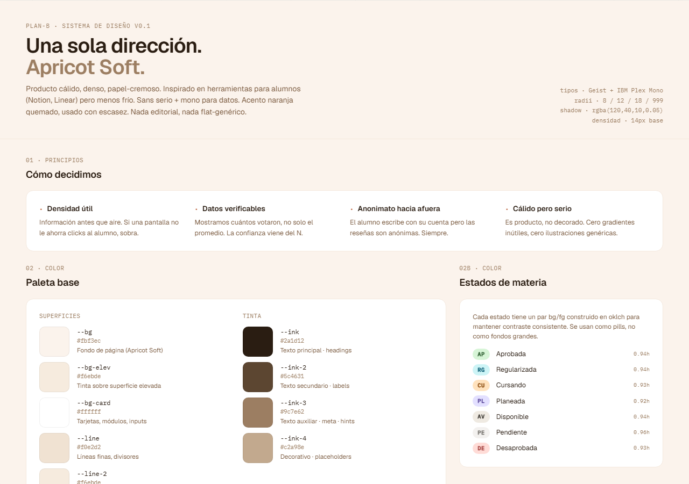

# Design system

Documento canónico del lenguaje visual de plan-b. Contrato entre el canvas (donde el sistema vive como mockup) y la implementación frontend (donde se construye el producto).

La fuente de verdad es la sección **⓪ Design System** del canvas (`docs/design/reference/plan-b-direcciones.html`), renderizada desde `canvas-mocks/design-system.jsx`. Cualquier cambio visual del producto pasa primero por el canvas; la implementación frontend deriva.

## Snapshot

(Captura auto-generada por `frontend/e2e/_capture/canvas-screenshots.spec.ts`. Re-correr cuando el JSX del DS cambie.)

## Fuentes en el repo

| Capa | Archivo | Qué es |
|---|---|---|
| Canvas (mockup) | [`reference/canvas-mocks/design-system.jsx`](reference/canvas-mocks/design-system.jsx) | Render JSX del design system con todas las primitivas + tokens visibles. Es lo que muestra el screenshot de arriba. |
| Canvas (tokens) | [`reference/canvas-tokens.css`](reference/canvas-tokens.css) | Tokens del shell del canvas: paleta Apricot Soft, tipografía, radii, sombras. |
| Mockup v1 | [`reference/styles.css`](reference/styles.css) | Tokens y clases compuestas del mockup HTML v1 (pre-rediseño). Histórico, no nuevo. |
| Implementación | [`frontend/src/app/globals.css`](../../frontend/src/app/globals.css) | `@theme` Tailwind 4 con los tokens reales que consume el producto. Mismos nombres que canvas pero con prefijo `--color-`. |

## Mapping canvas → frontend

Tailwind 4 requiere el prefijo `--color-` para que los utilities (`bg-bg`, `text-ink`, etc.) se generen automáticamente. Por eso los nombres de los tokens en el frontend tienen ese prefijo, mientras que el canvas usa los nombres "naturales" (`--bg`, `--ink`, etc.).

| Canvas (`canvas-tokens.css` / mocks) | Frontend (`globals.css`) | Notas |
|---|---|---|
| `--bg` | `--color-bg` | Fondo Apricot Soft. |
| `--bg-soft` / `--bg-elev` | `--color-bg-elev` | Variante elevada del fondo. |
| `--paper` | `--color-bg-card` | Card / paper-cremoso. **Drift de nombre intencional**: "card" es más explícito en el contexto del producto. |
| `--ink` | `--color-ink` | Texto principal. |
| `--ink-2` | `--color-ink-2` | Texto secundario. |
| `--ink-3` | `--color-ink-3` | Eyebrows / labels mono. |
| `--ink-4` | `--color-ink-4` | Texto disabled / placeholder. |
| `--line` | `--color-line` | Borde primario. |
| `--line-2` | `--color-line-2` | Borde secundario / divisor sutil. |
| `--accent` | `--color-accent` | Terracota acento. |
| `--accent-deep` | `--color-accent-ink` | Variante ink del accent (foreground sobre soft). **Drift de nombre intencional**: "ink" alinea con la convención del frontend. |
| `--accent-soft` (mocks inline) | `--color-accent-soft` | Background suave del accent. |
| `--good-bg` / `--good` | `--color-st-approved-bg` / `-fg` | Estados verdes. El frontend tiene una taxonomía más fina (`st-approved`, `st-coursing`, `st-regularized`, etc.); el canvas usa nombres semánticos más generales. |
| `--warn-bg` / `--warn-fg` | `--color-st-pending-bg` / `-fg` | Análogo. |
| `--bad-bg` / `--bad-fg` | `--color-st-failed-bg` / `-fg` | Análogo. |

## Tipografía

| Rol | Familia | Token canvas | Tailwind utility |
|---|---|---|---|
| Display | Geist | `--font-display` | `font-display` |
| UI | Geist | `--font-ui` (= display) | `font-sans` |
| Mono | IBM Plex Mono | `--font-mono` | `font-mono` |
| Serif (citas, italics) | Instrument Serif | implícito en `<em>` dentro de `.h-display` | aplicar inline |

## Cómo se mantiene

- Cada cambio visual del producto: editar `canvas-mocks/*.jsx`, regenerar screenshot (`PLAYWRIGHT_INCLUDE_CAPTURE=1 bunx playwright test e2e/_capture/canvas-screenshots.spec.ts`), y ajustar `frontend/src/app/globals.css` si toca tokens.
- Si un token nuevo aparece en el canvas y todavía no está en el frontend, agregarlo a `globals.css` con prefijo `--color-` antes de usarlo.
- Si un drift de naming intencional se introduce (ej. `--paper` → `--color-bg-card`), documentarlo en la tabla de arriba.

## Referencias

- ADRs: [ADR-0041](../decisions/0041-rediseño-ux-post-claude-design.md) (rediseño UX post claude-design).
- Canvas index: [`reference/README.md`](reference/README.md) (catálogo de archivos del bundle).
- Screenshots index: [`reference/screenshots/README.md`](reference/screenshots/README.md) (mapping artboard → US).
