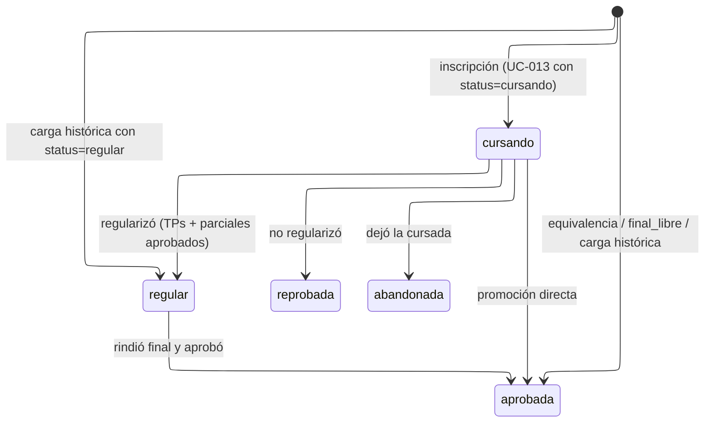
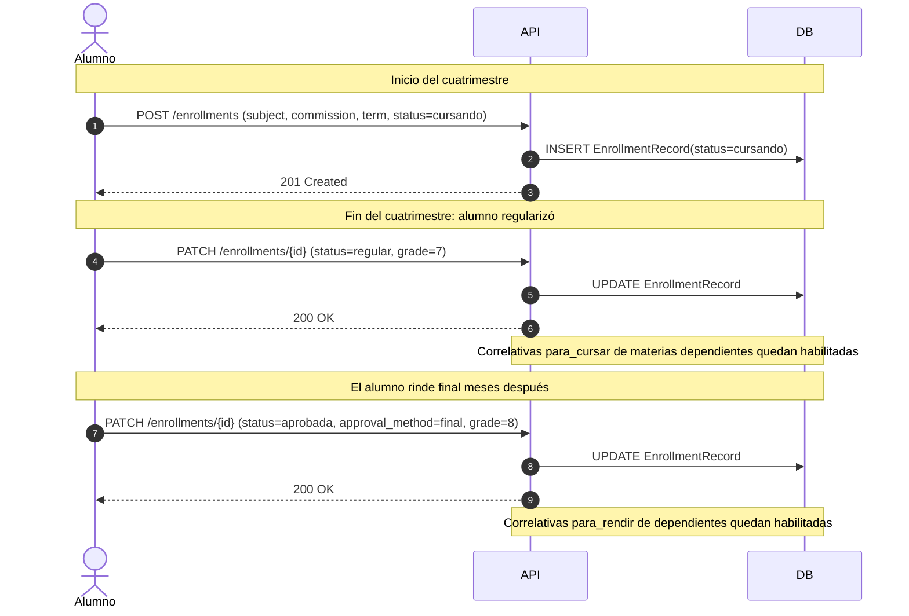
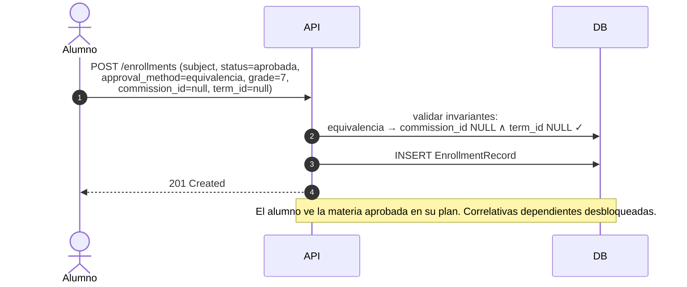
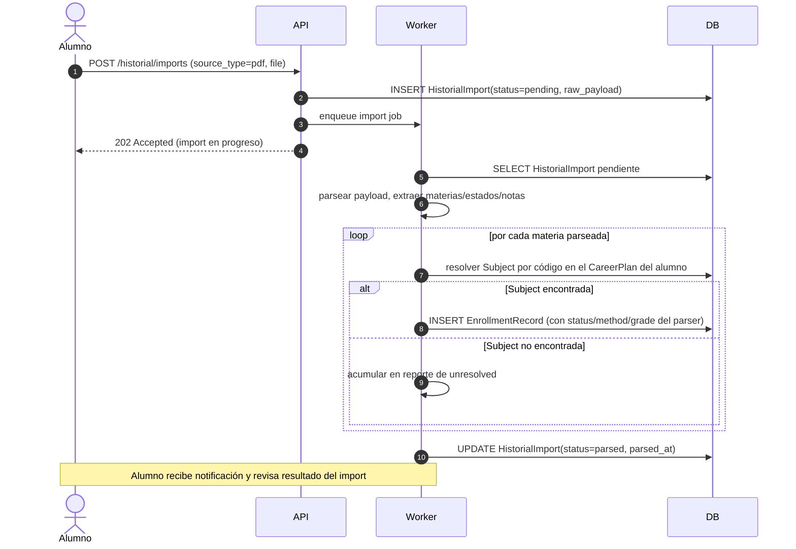

# Enrollment Lifecycle (planb)

Ciclo de vida del `EnrollmentRecord`, la entidad que representa una cursada específica de un alumno (par alumno × materia × cuatrimestre). Es el ancla del historial académico y la precondición del sistema de reseñas.

Cubre:

- State machine de `EnrollmentRecord.status`.
- Matriz de transiciones con side effects (habilitación de correlativas, habilitación de reseña, etc.).
- Sequence diagrams de los flujos típicos de carga.
- Invariantes derivadas del `approval_method`.
- Reglas específicas: recursada como enrollment nuevo, caída de regularidad, final libre.

Este documento expande los UCs UC-013, UC-014, UC-015. Para el lifecycle dependiente ver [review-lifecycle.md](review-lifecycle.md).

## States

| Estado       | Significado                                                                                        | Terminal |
| ------------ | -------------------------------------------------------------------------------------------------- | -------- |
| `cursando`   | Alumno actualmente cursando la materia. Sin resultado final todavía.                               | No       |
| `regular`    | Cursada terminada con TPs y parciales aprobados. Puede rendir final.                               | No       |
| `aprobada`   | Materia aprobada por alguno de los métodos (cursada, promoción, final, final libre, equivalencia). | Sí       |
| `reprobada`  | Cursada terminada sin regularizar. Para intentar de nuevo, recursar (enrollment nuevo).            | Sí       |
| `abandonada` | Alumno dejó de cursar antes de terminar.                                                           | Sí       |

Los estados "disponible para cursar" y "bloqueada por correlativas" **no** son estados persistidos del EnrollmentRecord: son estados derivados que se computan en query cruzando historial + correlativas. Ver [ADR-0004](../decisions/0004-enrollment-guarda-hechos.md).

## State machine

**Nota sobre `regular → reprobada`:** no se modela como transición automática. La "caída de regularidad" (expiración del plazo para rendir final) varía por universidad y depende de fechas que no tenemos en el modelo. Si un alumno cae de regular, edita manualmente vía UC-015 para cambiarlo a `reprobada` o crea un enrollment de recursada.

**Nota sobre recursada:** no hay transición desde `reprobada` ni desde ningún otro estado. Recursar una materia siempre significa **crear un EnrollmentRecord nuevo** con otro `term_id`. El enrollment viejo queda intacto como registro histórico. Esto permite que ambas cursadas tengan reseñas independientes (ver [ADR-0005](../decisions/0005-reseña-anclada-al-enrollment.md)).

## Matriz de transiciones con side effects

| De → A                                                  | Trigger                                   | UC              | Side effects                                                                                                                                                                    |
| ------------------------------------------------------- | ----------------------------------------- | --------------- | ------------------------------------------------------------------------------------------------------------------------------------------------------------------------------- |
| `null` → `cursando`                                     | Inscripción con status=cursando           | UC-013          | Bloquea creación de Review (`status != 'cursando'` es precondición de UC-017). Estados derivados "disponible/bloqueada" para otras materias se recomputan.                      |
| `null` → `regular`                                      | Carga histórica                           | UC-013 / UC-014 | Habilita UC-017 sobre esta cursada. Habilita correlativas `para_cursar` para materias dependientes.                                                                             |
| `null` → `aprobada` (`cursada` / `promocion` / `final`) | Carga histórica tradicional               | UC-013 / UC-014 | Habilita UC-017. Habilita tanto `para_cursar` como `para_rendir` para correlativas dependientes.                                                                                |
| `null` → `aprobada` (`equivalencia`)                    | UC-013 con approval_method='equivalencia' | UC-013          | `commission_id` y `term_id` NULL. Habilita UC-017 solo si el alumno quisiera reseñar la experiencia de equivalencia (improbable).                                               |
| `null` → `aprobada` (`final_libre`)                     | UC-013 con approval_method='final_libre'  | UC-013          | `commission_id` NULL, `term_id` NOT NULL. Sin docente_reseñado posible (no hubo comisión): UC-017 no aplica.                                                                   |
| `cursando` → `regular`                                  | Edit manual post-cuatrimestre             | UC-015          | Habilita UC-017. Habilita `para_cursar` de dependientes.                                                                                                                        |
| `cursando` → `aprobada`                                 | Edit manual                               | UC-015          | Habilita UC-017. Habilita todas las correlativas.                                                                                                                               |
| `cursando` → `reprobada`                                | Edit manual                               | UC-015          | Habilita UC-017 sobre esta cursada. Para recursar: enrollment nuevo.                                                                                                            |
| `cursando` → `abandonada`                               | Edit manual                               | UC-015          | Habilita UC-017 sobre esta cursada (el alumno puede reseñar aunque haya abandonado).                                                                                            |
| `regular` → `aprobada`                                  | Edit manual tras aprobar final            | UC-015          | Habilita `para_rendir` de dependientes. Si había Review asociada, permanece válida (la nota final mostrada en la reseña es independiente de la nota del enrollment: ver nota). |

**Nota sobre `grade` en Review vs EnrollmentRecord:** `Review.final_grade` captura la nota reportada por el alumno al momento de reseñar. No se deriva automáticamente de `EnrollmentRecord.grade`. Si el alumno actualiza su enrollment (ej. pasó de `regular` a `aprobada` con una nota nueva), la reseña sigue mostrando la nota que tenía al publicarse; para actualizarla, el alumno edita la reseña vía UC-018.

## Invariantes derivadas de `approval_method`

El `approval_method` dicta qué campos deben o no deben estar poblados. La razón es semántica: cada método representa una situación académica distinta con contexto diferente.

| `approval_method`                                                           | `commission_id` | `term_id` | Razón                                                                 |
| --------------------------------------------------------------------------- | --------------- | --------- | --------------------------------------------------------------------- |
| `NULL` (cuando `status IN ('cursando','regular','reprobada','abandonada')`) | NOT NULL        | NOT NULL  | Hubo cursada en una comisión y cuatrimestre específicos.              |
| `cursada`                                                                   | NOT NULL        | NOT NULL  | Aprobó con la cursada en sí (promoción con nota final en la cursada). |
| `promocion`                                                                 | NOT NULL        | NOT NULL  | Promoción directa (sin final).                                        |
| `final`                                                                     | NOT NULL        | NOT NULL  | Aprobó final tras cursar.                                             |
| `final_libre`                                                               | **NULL**        | NOT NULL  | No cursó comisión, rindió libre en un cuatrimestre específico.        |
| `equivalencia`                                                              | **NULL**        | **NULL**  | Reconocimiento académico sin cursada ni término.                      |

Estas invariantes están enforceadas como CHECKs en el data model (ver [data-model.md#entity-enrollmentrecord](../architecture/data-model.md#entity-enrollmentrecord)).

## Reglas específicas del lifecycle

### Recursada genera un enrollment nuevo

Si un alumno reprueba Matemática I en 2025-C1 y recursa en 2025-C2:

- EnrollmentRecord A: `student=X, subject=Mate1, term=2025-C1, status=reprobada`.
- EnrollmentRecord B: `student=X, subject=Mate1, term=2025-C2, status=cursando` (y después se edita a su estado final).

No hay transición entre A y B. Cada uno es un registro independiente. El `UNIQUE(student_id, subject_id, term_id)` lo garantiza: un alumno no puede tener dos cursadas de la misma materia en el mismo término, pero sí en términos distintos.

Esto habilita:

- Reseñar ambas cursadas por separado (si ambas están finalizadas), comparando docentes o comisiones.
- Reconstruir la cronología completa del alumno con la materia.
- Para el dashboard institucional: medir tasa de recursada por materia contando múltiples enrollments del mismo par (student, subject).

### Caída de regularidad

Algunas universidades expiran la regularidad si el alumno no aprueba el final en un plazo (típicamente 2-3 años). Planb no automatiza este vencimiento porque:

- Las reglas varían significativamente por universidad y hasta por carrera.
- La fecha exacta depende de cuándo el alumno se enteró de la regularidad, no siempre es computable desde los datos que tenemos.
- Automatizarlo con lógica aproximada puede introducir errores que son difíciles de corregir para el alumno.

El manejo es manual: si el alumno cae de regular, edita el enrollment (UC-015) cambiando `status` a `reprobada`. Alternativamente, inscribe una recursada.

### Final libre sin comisión

Cuando un alumno rinde final libre (`approval_method='final_libre'`), el modelo refleja que no hubo cursada: `commission_id IS NULL`. Pero sí rindió en un cuatrimestre específico, entonces `term_id NOT NULL`.

Consecuencias de diseño:

- **No hay docente_reseñado posible** sobre un final libre: UC-017 requiere elegir docente de la `CommissionTeacher` de la comisión del enrollment, y no hay comisión. El alumno puede igualmente querer dejar comentario sobre la materia en sí; por ahora esto no se habilita. Si aparece demanda, el modelo puede evolucionar permitiendo Review sin `docente_reseñado`.
- **El dashboard institucional** puede filtrar rehabilitaciones libres para medir efectividad de la preparación autodidacta (o detectar materias cuyo final libre es comparativamente fácil).

### Equivalencia sin comisión ni término

`approval_method='equivalencia'` es el caso más simple: el alumno no rindió nada en planb, simplemente reconoce una materia aprobada en otra carrera/universidad. No hay comisión, no hay término, solo el registro del reconocimiento. La nota se transcribe para efectos de promedio de carrera.

No hay reseña posible sobre una equivalencia (sin comisión, sin docente). El flow es solo carga de historial para que el alumno vea su plan completo y el simulador compute correlativas correctamente.

## Sequence diagrams

### 1. Cursada regular terminando en aprobada

### 2. Equivalencia directa

### 3. Import de historial (delegado a UC-014)

## Cross-references

| Tipo                  | Referencias                                                                                                                                                                                                                                                                                                                      |
| --------------------- | -------------------------------------------------------------------------------------------------------------------------------------------------------------------------------------------------------------------------------------------------------------------------------------------------------------------------------- |
| UCs                   | UC-013 (carga manual), UC-014 (import), UC-015 (edit), UC-017 (precondición: status != cursando).                                                                                                                                                                                                                                |
| ADRs                  | [ADR-0002](../decisions/0002-versionado-de-planes-de-estudio.md), [ADR-0003](../decisions/0003-correlativas-con-dos-tipos.md), [ADR-0004](../decisions/0004-enrollment-guarda-hechos.md), [ADR-0005](../decisions/0005-reseña-anclada-al-enrollment.md), [ADR-0006](../decisions/0006-jsonb-solo-donde-el-shape-es-variable.md). |
| Data model            | [EnrollmentRecord + HistorialImport](../architecture/data-model.md#context-student-history).                                                                                                                                                                                                                                     |
| Lifecycle dependiente | [review-lifecycle.md](review-lifecycle.md).                                                                                                                                                                                                                                                                                      |
