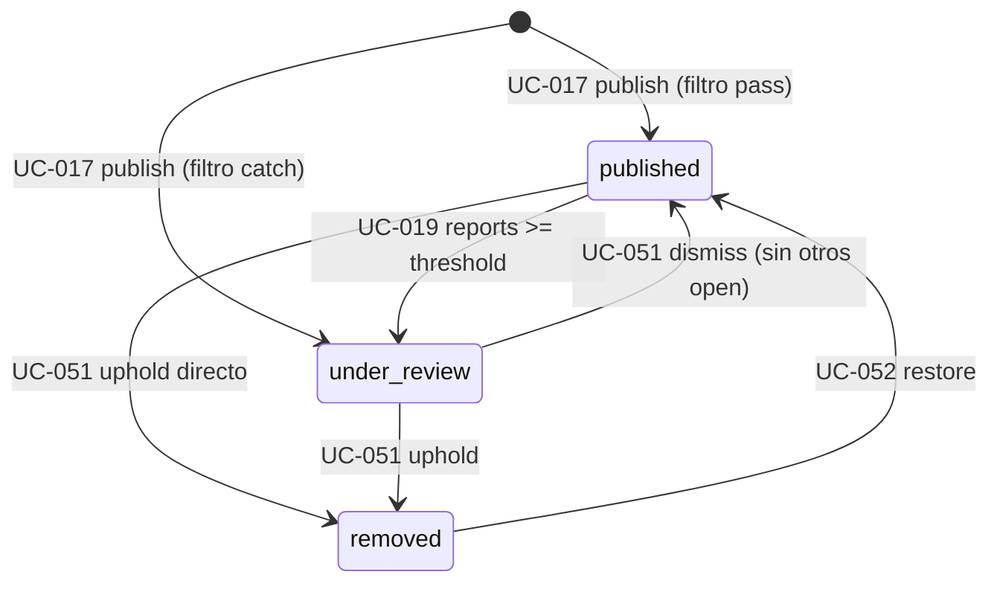
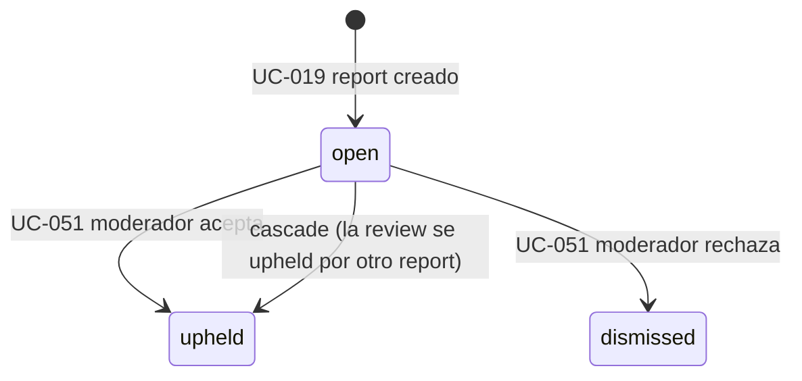
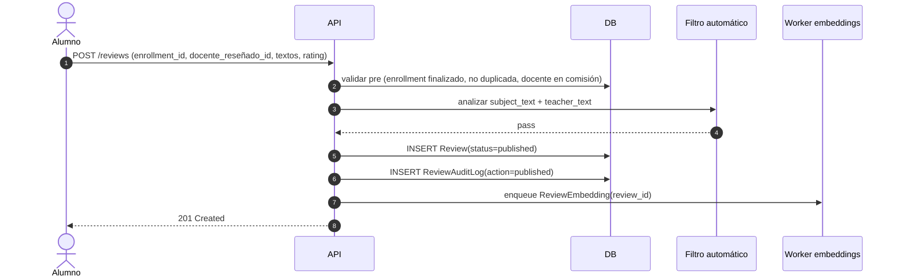
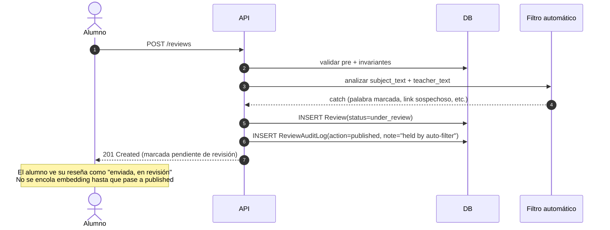
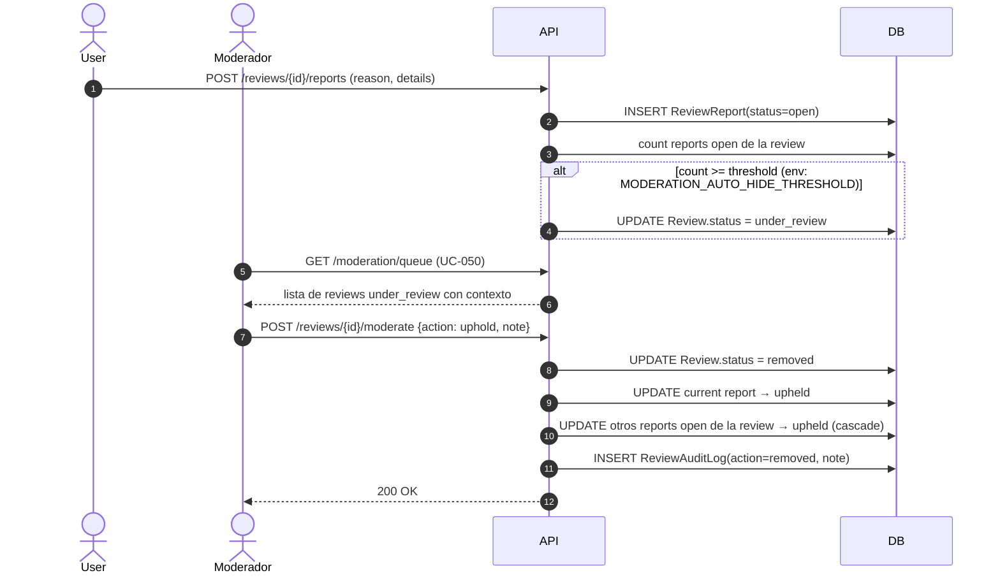
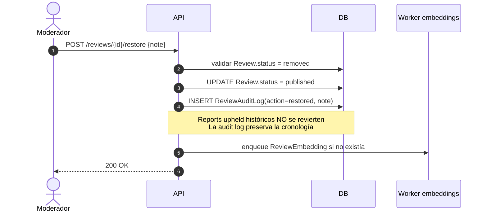

# Review Lifecycle — planb

Ciclo de vida de una reseña desde su publicación hasta su eventual remoción o restauración. Cubre:

- State machines de `Review.status` y `ReviewReport.status`.
- Matriz de transiciones con side effects (audit log, cascades, jobs encolados).
- Sequence diagrams de los flujos críticos cross-actor.
- Invariantes y reglas del lifecycle.

Este documento **expande** los UCs UC-017, UC-018, UC-019, UC-050, UC-051 y UC-052 con vista temporal y de colaboración. La especificación funcional de cada UC vive en [actors-and-use-cases.md](actors-and-use-cases.md).

## States

### `Review.status`

| Estado | Significado | Visibilidad pública |
|---|---|---|
| `published` | Reseña visible públicamente. | Sí |
| `under_review` | En cola de moderación. Puede haber caído por filtro automático o por threshold de reports. | No |
| `removed` | Removida por un moderador. | No |

### `ReviewReport.status`

| Estado | Significado |
|---|---|
| `open` | Pendiente de resolución. |
| `upheld` | El moderador (o cascade) aceptó: la reseña infringía. |
| `dismissed` | El moderador rechazó: el report no procedía. |

## State machine — `Review.status`

**Nota sobre edición:** la edición (UC-018) solo se permite desde `published` y mantiene el estado. No aparece como transición porque no cambia el estado — cambia el contenido y dispara efectos (ver matriz abajo). No se permite editar reseñas en `under_review` ni `removed` para evitar edit-bombing como evasión de moderación.

## State machine — `ReviewReport.status`

## Matriz de transiciones de `Review` con side effects

| De → A | Trigger | UC | Side effects |
|---|---|---|---|
| `null` → `published` | publicar, filtro pass | UC-017 | `ReviewAuditLog(action=published)`. Enqueue job de `ReviewEmbedding`. |
| `null` → `under_review` | publicar, filtro catch | UC-017 | `ReviewAuditLog(action=published, note="held by auto-filter")`. **No** enqueue de embedding — se encola recién cuando pase a `published`. |
| `published` → `under_review` | N reports abiertos | UC-019 | Se registra el report que cruzó el threshold. El auto-hide queda implícito en la transición de Review; no hay entrada de audit adicional. |
| `published` → `removed` | uphold sin pasar por under_review | UC-051 | `ReviewAuditLog(action=removed)`. El report se marca `upheld` con `resolved_at`. Otros reports open de la misma review → `upheld` (cascade). |
| `under_review` → `published` | dismiss (y no quedan otros reports open) | UC-051 | `ReviewAuditLog(action=published, note="restored by moderator after review")`. Report `dismissed` con nota. Enqueue embedding si no había. |
| `under_review` → `removed` | uphold | UC-051 | `ReviewAuditLog(action=removed)`. Todos los reports open → `upheld` (cascade). |
| `removed` → `published` | restore | UC-052 | `ReviewAuditLog(action=restored, note)`. Reports `upheld` históricos **no** se revierten. Enqueue embedding si no había. |
| `published` → `published` | edición (no es transición de estado) | UC-018 | `ReviewAuditLog(action=edited, changes={before, after})`. Re-enqueue de embedding sobre el nuevo contenido. Si había `TeacherResponse`, se muestra badge "editada después de tu respuesta". |

## Matriz de transiciones de `ReviewReport`

| De → A | Trigger | UC | Side effects |
|---|---|---|---|
| `null` → `open` | usuario reporta | UC-019 | INSERT `ReviewReport`. Si cruza threshold, la Review se mueve a `under_review`. |
| `open` → `upheld` (directo) | moderador acepta | UC-051 | `moderator_id`, `resolution_note`, `resolved_at`. Dispara remoción de la Review y cascade. |
| `open` → `upheld` (cascade) | otro report de la misma Review fue upheld | UC-051 | Mismos campos que el report original. `resolution_note` heredada. |
| `open` → `dismissed` | moderador rechaza | UC-051 | `moderator_id`, `resolution_note`, `resolved_at`. Si era el único open, la Review vuelve a `published`. |

## Sequence diagrams

### 1. Happy path — publicación con filtro pass

### 2. Publicación retenida por filtro automático

### 3. Moderación por reports con uphold

### 4. Restauración por apelación

## Reglas del lifecycle

### Edición solo desde `published`

Un alumno **no puede** editar una reseña en `under_review` ni en `removed`. Si intenta, el endpoint devuelve 403.

**Why:** permitir edit sobre contenido en revisión abre edit-bombing como vector de evasión — el alumno podría modificar la reseña para burlar al moderador antes de que la resuelva. Sobre removidas, el alumno primero debe apelar (que es out-of-flow en MVP, típicamente via email al admin) y ser restaurada.

### Threshold de auto-hide configurable por env var

La cantidad N de reports open que dispara la transición `published → under_review` automática se lee de `MODERATION_AUTO_HIDE_THRESHOLD` (env var o `appsettings.json`). Default: `3`.

**Why env var y no DB-stored config:** el valor se toca en la práctica una vez por año en el peor caso. Mover a `SystemConfig` requiere montar tabla + cache + admin UI, ~3-4 horas de trabajo para un beneficio marginal. El restart de container en Dokploy es un click. Si en el futuro aparecen más parámetros runtime-tuneables, vale la pena consolidar en `SystemConfig`, pero hoy sería prematuro.

### Cascade on uphold, sin reversión on restore

Cuando un moderador upholdea un report, la Review pasa a `removed` y **todos los reports open** sobre esa Review se marcan `upheld` automáticamente con la misma `resolution_note`. No requieren resolución individual.

Si después la Review se restaura (UC-052), los reports cascade-upheld **no** se revierten — quedan marcados upheld aunque la Review vuelva a `published`. La cronología real se reconstruye desde `ReviewAuditLog`.

**Why:** consistente con la intuición de "decisión de moderación = ban del contenido", análogo a bans en plataformas de juegos donde los reports que llevaron al ban quedan como registro aunque el ban se levante después. Evita burocracia sin sacrificar trazabilidad (el audit log tiene todo).

### Embedding solo sobre `published`

El worker de generación de embeddings (ver [ADR-0007](../decisions/0007-pgvector-implementado-ui-gated-off.md)) se enqueua en las transiciones hacia `published`:

- `null → published` (publicación con filtro pass).
- `under_review → published` (dismiss de reports).
- `removed → published` (restore).
- Edición de contenido en `published` (re-embedding sobre el nuevo texto).

**Why:** no tiene sentido gastar compute en contenido que puede terminar removido. Además, si un usuario publica contenido problemático y se retiene por filtro, no queremos que quede residuo en la infraestructura de analytics.

### Anonimato en los sequence diagrams

En ningún momento la API expone `enrollment.student_id` o datos derivados del autor en endpoints públicos. Ver [ADR-0009](../decisions/0009-anonimato-como-regla-de-presentacion.md). Los moderadores sí pueden ver la identidad (vía audit log y rol de moderator) para detectar patrones de abuso.

## Cross-references

| Tipo | Referencia |
|---|---|
| UCs | UC-017 (publicar), UC-018 (editar), UC-019 (reportar), UC-050 (cola de moderación), UC-051 (resolver report), UC-052 (restaurar). |
| ADRs | [ADR-0005](../decisions/0005-resena-anclada-al-enrollment.md), [ADR-0007](../decisions/0007-pgvector-implementado-ui-gated-off.md), [ADR-0009](../decisions/0009-anonimato-como-regla-de-presentacion.md). |
| Data model | [`Review`, `ReviewReport`, `TeacherResponse`, `ReviewAuditLog`, `ReviewEmbedding`](../architecture/data-model.md#context-reviews--moderation). |
