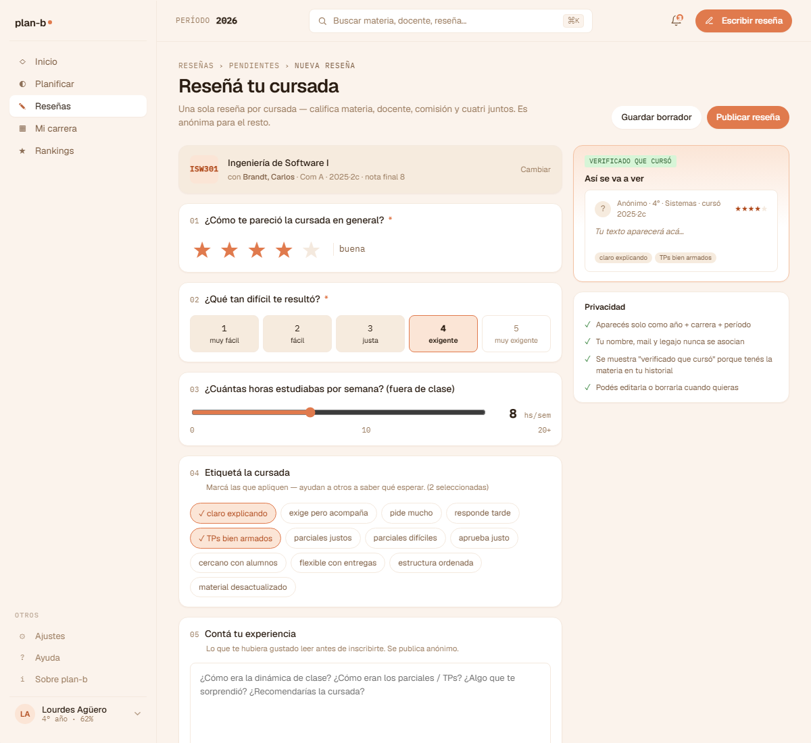

# US-017: Publicar reseña

**Status**: Backlog
**Sprint**: 
**Epic**: [EPIC-05: Sistema de reseñas](../epics/EPIC-05.md)
**Priority**: High
**Effort**: L
**UC**: [UC-017](../use-cases/UC-017.md)
**ADR refs**: ADR-0005, ADR-0007, ADR-0009, ADR-0013

## Como alumno, quiero publicar una reseña sobre una cursada finalizada para aportar al corpus que otros leerán

Como alumno con EnrollmentRecord propia (status != cursando, sin Review previa), quiero un endpoint que cree una Review anclada a esa cursada con difficulty + textos + docente reseñado, evalúe el contenido con un filter (clean → published, triggered → under_review) y dispare async un job de embedding.

## Acceptance Criteria

### Backend

- [ ] `POST /api/me/reviews` con `{ enrollmentRecordId, difficultyRating, subjectText?, teacherText?, docenteResenadoId, finalGrade? }`.
- [ ] Requiere ownership del EnrollmentRecord + `status != 'cursando'` + sin Review existente para ese enrollment (constraint UNIQUE).
- [ ] Valida `docenteResenadoId` pertenece a `CommissionTeacher` de la commission del enrollment (cross-BC vía `IAcademicQueryService.GetCommissionTeachers`).
- [ ] Al menos uno de `subjectText` / `teacherText` no vacío (CHECK constraint del data-model).
- [ ] `difficultyRating` ∈ [1, 5].
- [ ] `finalGrade` opcional, ∈ [0, 10] si se provee.
- [ ] Domain service `IReviewContentFilter` evalúa el contenido: clean → `published`; triggered → `under_review`.
- [ ] Emite `ReviewPublished` o `ReviewQuarantined` via Wolverine outbox.
- [ ] Async kicks `ReviewEmbedding` job (pipeline corre, UI gated off por ADR-0007).
- [ ] Audit log entry con `action = 'published'`.
- [ ] Idempotencia: si el client reintenta POST con el mismo `(authorId, enrollmentId)`, segundo request devuelve la review ya creada (200 con el body de la primera) en lugar de 409 conflict. Implementado con check before insert.

### Frontend

- [ ] Form de publicación con selector de docente constrained a la comisión.

## Sub-tasks

- [ ] Aggregate Review en módulo Reviews
- [ ] Comando `PublishReviewCommand` + handler
- [ ] Domain service `IReviewContentFilter` impl inicial: regex de blacklist (insultos comunes en español, links http(s)://) + length validators (subject_text 50-2000 chars, teacher_text 50-2000 chars). Lista de blacklist en archivo `Planb.Reviews.Application/ContentFilter/blacklist.txt` checkeado en repo.
- [ ] Endpoint Carter
- [ ] Integration events `ReviewPublished` / `ReviewQuarantined`
- [ ] Wolverine job `ReviewEmbedding` con feature flag (ADR-0007)
- [ ] UI form publicar reseña
- [ ] Integration tests: happy path, content filter triggered, enrollment cursando rechazado, docente no-en-comisión rechazado, segunda review rechazada

## Notas de implementación

- **Anclada al EnrollmentRecord**: ADR-0005. La review no es "del usuario sobre la materia" sino "del usuario sobre esta cursada específica". Permite separar la opinión del que cursó dos veces (recursada). UNIQUE por `enrollment_id`.
- **`docente_reseñado_id` constrained a la comisión**: invariante data-model. No podés reseñar a un teacher que no estaba en tu comisión. Validación cross-BC vía PublicContract de Academic.
- **Embedding job se ejecuta aunque la UI esté gated**: ADR-0007 + ADR-0013. El pipeline corre desde día 1; cuando el volumen justifique habilitar la UI semantic search, los embeddings ya están listos. Costo bajo, beneficio diferido.
- **Filtro automático no es moderation final**: si el filter marca, va a `under_review` y un moderator decide. El filter es heurística, no sentencia. ADR-0010 para threshold de auto-hide por reports (otro mecanismo, mismo destino `under_review`).

## Refs

- DoD: [Definition of Done](../definition-of-done.md)
- Use Case: [UC-017](../use-cases/UC-017.md)
- ADRs: [ADR-0005](../../decisions/0005-reseña-anclada-al-enrollment.md), [ADR-0007](../../decisions/0007-pgvector-implementado-ui-gated-off.md), [ADR-0009](../../decisions/0009-anonimato-como-regla-de-presentacion.md), [ADR-0013](../../decisions/0013-embedding-gated-en-transiciones-a-published.md)
- Mockup: . Fuente JSX en `canvas-mocks/v2-screens-3.jsx::V2EditorResena` (form vertical con selector de docente, sliders de dificultad/recomendación, textarea anónima).
