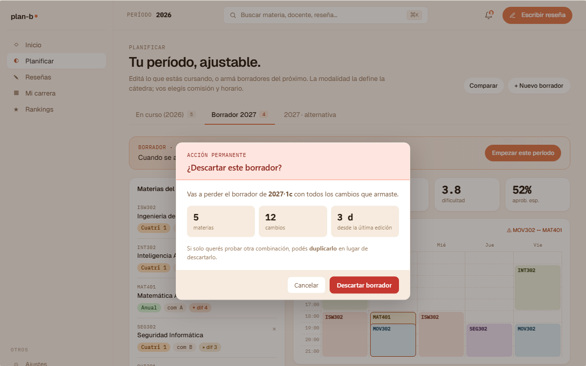

# US-026: Borrar simulación

**Status**: Backlog
**Sprint**: 
**Epic**: [EPIC-04: Planificación de cuatrimestre](../epics/EPIC-04.md)
**Priority**: Low
**Effort**: S
**UC**: 
**ADR refs**: ADR-0029

## Como alumno, quiero borrar una simulación guardada para limpiar mi lista

Como alumno, quiero un DELETE sobre una SimulationDraft propia (hard delete: la simulación es efímera por diseño) para limpiar mi panel.

## Acceptance Criteria

### Backend

- [ ] `DELETE /api/me/simulations/drafts/{id}`.
- [ ] Valida ownership.
- [ ] Hard delete (no soft).
- [ ] Si era `shared`, desaparece también del corpus público sin más pasos.
- [ ] Idempotente: borrar un draft inexistente o ya borrado retorna 204.
- [ ] Authorization: solo el owner.
- [ ] Borrar una simulación pública: las copias hechas por otros users (si existieran en el futuro) sobreviven; solo se borra el original.

### Frontend

- [ ] Confirmación con **modal destructivo** (port de `v2-modals.jsx::V2ModalDescartarBorrador`):
  - Heading display "¿Descartar borrador?".
  - Subtitle con etiqueta del período del borrador (ej. "Borrador 2027·1c").
  - Preview de stats del draft que se pierde: N materias seleccionadas, N cambios desde la última edición, antigüedad del borrador en días.
  - Body de consecuencias: "Lo perdés definitivamente. Si querés probar otra combinación, mejor duplicalo antes (US-025 cuando aterrice acción duplicar)."
  - 2 CTAs: `Cancelar` (ghost) + `Descartar` (warn).
  - Patrón typed-confirm reusable (escribir "DESCARTAR" o el período del draft) si Lucas lo prefiere; opcional para MVP dado que es hard delete pero la simulación es efímera.

## Sub-tasks

- [ ] Comando `DeleteSimulationDraftCommand`
- [ ] Endpoint DELETE
- [ ] UI confirmación (modal `V2ModalDescartarBorrador`)

## Notas de implementación

- **Hard delete por diseño**: el data-model lo declara explícitamente. Un draft no es histórico que valga preservar; es un borrador que el alumno controla. Si lo borra, fuera.
- **Sin "ghost" en corpus público**: el listing de shared joinea contra `simulation_draft`. Sin la row, no aparece. Cero coordinación cross-table requerida.
- **Modal vs dialog nativo**: usar el `<Dialog>` de shadcn (ya disponible en frontend). Reusar el patrón visual del modal de `delete-account-button` que ya está en código.

## Refs

- DoD: [Definition of Done](../definition-of-done.md)
- Use Case: ninguno.
- Mockup: . Fuente JSX en `canvas-mocks/v2-modals.jsx::V2ModalDescartarBorrador`.
- ADRs: [ADR-0029](../../decisions/0029-planning-bc-separado.md), [ADR-0041](../../decisions/0041-rediseño-ux-post-claude-design.md).
