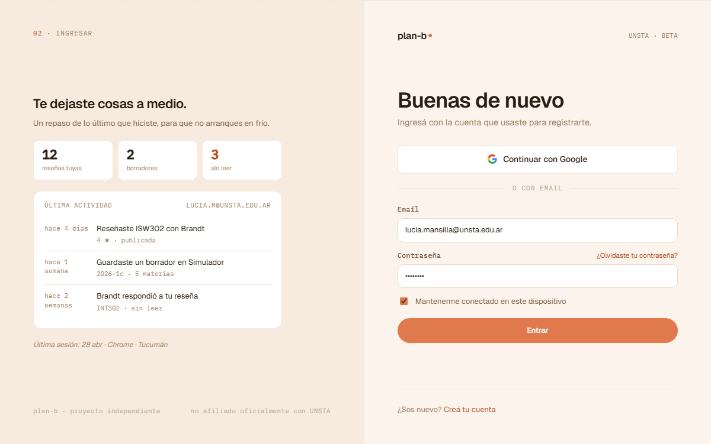

# US-028-f: Login frontend (sign-in tab)

**Status**: Done · pendiente rediseño visual ([US-059-f](US-059-f.md))
**Sprint**: S1 (implementación inicial); rediseño candidato a S3-S4
**Epic**: [EPIC-02: Identidad y autenticación](../epics/EPIC-02.md)
**Priority**: High
**Effort**: M
**UC**: [UC-028](../use-cases/UC-028.md)
**ADR refs**: ADR-0019, ADR-0022, ADR-0023, [ADR-0041](../../decisions/0041-rediseño-ux-post-claude-design.md)

> **Drift visual**: el shell actual (`AuthSplit` + `auth-hero`) es previo al canvas v2. La migración al `AuthShell` con `LastActivityPanel` está documentada en [US-059-f](US-059-f.md) y NO modifica comportamiento.

## Como user verificado, quiero un formulario de login con feedback claro de cada estado

Como user con cuenta lista para entrar, quiero el modo "Ingresar" del `AuthView` en `/auth` con un form de email + password, manejo de los tres caminos de error (credenciales, no verificado, disabled) con copy específico por caso, y al éxito quedo logueado y redirigido a la home protegida.

Comparte el componente `AuthView` con el modo "Crear cuenta" (mismas tabs locales, mismo split layout), siguiendo el mockup.

## Acceptance Criteria

- [x] Página `(auth)/auth/page.tsx` renderiza `AuthView`. Soporta deep-link `?mode=signin` para abrir directo en la tab "Ingresar".
- [x] Form: email + password, validación mínima cliente (no vacío, password >= 12).
- [x] Submit dispara server action `signInAction` que llama `POST /api/identity/sign-in`.
- [x] 200 → redirect a `/dashboard` (member home), las cookies `planb_session` + `planb_refresh` quedaron seteadas httpOnly por la action via `forwardSetCookies`.
- [x] 401 → muestra "Email o contraseña incorrectos" cerca del form (sin distinguir cuál).
- [x] 403 `identity.account.email_not_verified` → muestra "Tu cuenta todavía no está verificada" + link workaround "Registrate de nuevo con el mismo email" (no hay endpoint resend; cuando US-021-f aterrice se reemplaza por botón real).
- [x] 403 `identity.account.disabled` → muestra "Tu cuenta fue suspendida. Contactá al equipo de moderación si creés que es un error."
- [x] Copy en español rioplatense.
- [x] Tab "Crear cuenta" del switcher cambia el modo localmente (`setMode('signup')`), sin navegación. Per la convención del frontend (`frontend/CLAUDE.md`): una sola ruta `/auth` con switcher local.

## Sub-tasks

- [x] Componente `AuthView` shared con switcher local de modos (compartido con US-010-f)
- [x] Página `(auth)/auth/page.tsx` que renderiza AuthView (cierra US-010-f también)
- [x] Server action `signInAction` que llama el backend y maneja respuestas
- [x] `lib/session.ts` con verificación real del JWT (jose, HS256, claves issuer/audience/role)
- [x] Manejo de los 3 paths de error con copy específico por status/title

## Notas de implementación

- **Single `/auth` route con switcher local**: el primer intento dividía en `/sign-in` + `/sign-up` con `<Link>` para el switching. Lo descartamos: switcher local con `setMode()` es más rápido y evita drift visual entre formularios. Documentado en `frontend/CLAUDE.md`.
- **Anti-enumeration**: 401 muestra el mismo mensaje para wrong-email y wrong-password, sin scopear el error bajo un input específico (al hacerlo se filtraría cuál campo falló). El backend devuelve `UserErrors.InvalidCredentials` para ambos casos por la misma razón.
- **`/dashboard` ya existe**: cuando aterrizó US-029-i el placeholder de `/dashboard` cubrió el flow. AppShell + dashboard home rico aterrizan en US-042-f y US-043-f.
- **Reenviar verificación**: el AC original pedía un botón "Reenviar mail" deshabilitado. En su lugar se implementó un link `/sign-up` con copy "Registrate de nuevo con el mismo email" que activa el path de re-emisión del token vía un nuevo registro. Mismo efecto operacional, sin endpoint nuevo.
- **"¿Olvidaste tu contraseña?"**: el link está en el form (debajo del campo password, alineado a la derecha) apuntando a `/forgot-password`. La ruta no existe todavía (404), el feature de password reset llega como US separada. La interfaz va primero; cuando el endpoint y la página aterricen, el link queda funcional sin cambios en el sign-in form.

## Refs

- DoD: [Definition of Done](../definition-of-done.md)
- Use Case: [UC-028](../use-cases/UC-028.md)
- Mockup: . Fuente JSX en `canvas-mocks/auth.jsx::LoginView` (con `LastActivityPanel` en el panel izquierdo).
- ADRs: [ADR-0019](../../decisions/0019-single-nextjs-app-con-route-groups.md), [ADR-0022](../../decisions/0022-forms-react19-primitives-tanstack-form.md), [ADR-0023](../../decisions/0023-auth-flow-jwt-cookie-layout-guards.md)
