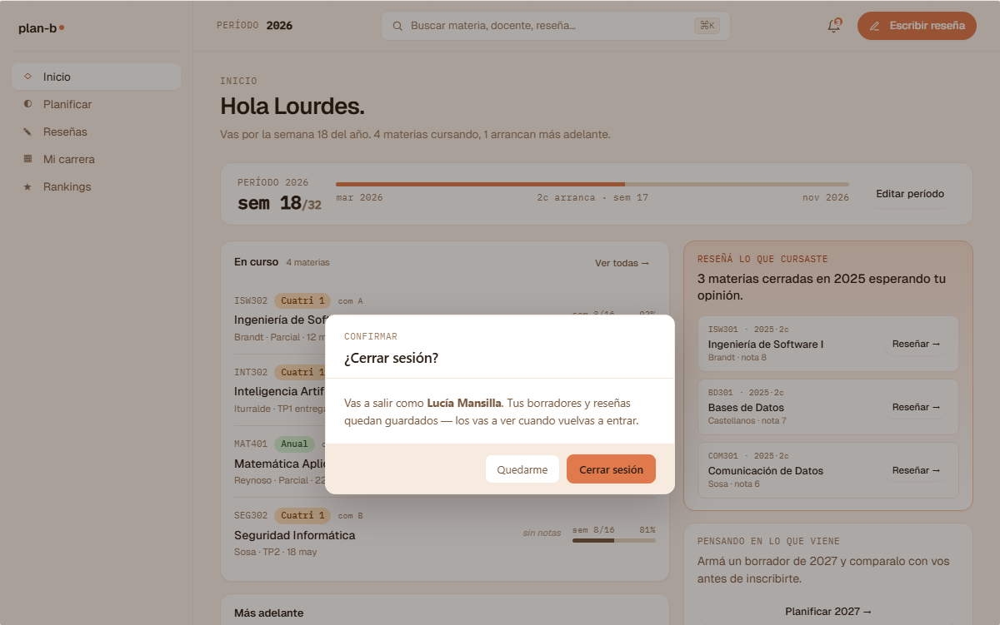

# US-029-i: Sign-out integrated

**Status**: Done · pendiente AC modal de confirmación (canvas v2)
**Sprint**: S1 (implementación inicial); modal de confirmación candidato a S5+
**Epic**: [EPIC-02: Identidad y autenticación](../epics/EPIC-02.md)
**Priority**: High
**Effort**: S
**UC**: [UC-029](../use-cases/UC-029.md)
**ADR refs**: ADR-0023, ADR-0034, [ADR-0041](../../decisions/0041-rediseño-ux-post-claude-design.md)

> **Pendiente post-Done**: el sign-out actual es directo (click → action → redirect). El canvas v2 introduce un **modal de confirmación** previo (port de `v2-modals.jsx::V2ModalCerrarSesion`) con preview del usuario que cierra sesión + dos CTAs ("Quedate" + "Cerrar sesión"). Esa AC se agrega abajo y entra cuando aterrice US-059-f (rediseño Auth+Onb) o el sprint que toque el avatar menu.

## Como user autenticado, quiero un botón "Cerrar sesión" que limpie mi sesión completamente

Como user logueado, quiero clickear "Cerrar sesión" y que mi refresh token se revoque server-side (Redis), mis cookies se limpien y termine en `/auth`. Si en otra tab ya cerré sesión, este botón es idempotente: no rompe.

Slice integrated: backend + frontend en un solo PR porque es chico (un endpoint trivial + un button).

## Acceptance Criteria

- [x] `POST /api/identity/sign-out`. No requiere body.
- [x] Backend extrae refresh token del cookie `planb_refresh`, lo hashea, llama `DEL identity:refresh:{hash}` en Redis vía `IRefreshTokenStore.RevokeAsync`.
- [x] Backend setea `Set-Cookie` con `planb_session` y `planb_refresh` con `Expires` en el pasado (vía `Response.Cookies.Delete` con los Path correctos: `/` y `/api/identity`).
- [x] 204 sin body.
- [x] Idempotente: sin cookies o con cookies ya inválidas → 204 igual.
- [x] Frontend: botón "Cerrar sesión" en el `/dashboard` placeholder (sidebar real aterriza en F3+).
- [x] Click → `signOutAction` server action → `POST /api/identity/sign-out` (forwarding del cookie `planb_refresh`) → borra cookies locales → `redirect('/auth')`.
- [x] Integration tests: login con Lucía + sign-out + intentar refresh con la cookie vieja → 401. Sign-out sin cookies → 204. Sign-out con token desconocido → 204.

### Pendiente: modal de confirmación (canvas v2)

- [ ] **Modal de confirmación** antes de disparar `signOutAction` (port de `v2-modals.jsx::V2ModalCerrarSesion`):
  - Heading display "¿Cerrar sesión?".
  - Preview del usuario actual (avatar + nombre + email).
  - Subtitle: "Vas a salir de plan-b en este dispositivo. Tus reseñas y borradores siguen guardados."
  - 2 CTAs: `Quedate` (ghost) + `Cerrar sesión` (primary).
  - Trigger: el `<V2AvatarMenu/>` ya tiene el row "Cerrar sesión" (`v2-shell.jsx`). Click → abre el modal en lugar de disparar el action directo.
  - Cancelar / Esc / click backdrop: cierra el modal sin sign-out.

## Sub-tasks

- [x] Application: `SignOutCommand` + `SignOutCommandHandler` (idempotente, sin Result<T> porque no hay error de negocio)
- [x] Endpoint Carter `SignOutEndpoint` que limpia cookies con `Cookies.Delete` y devuelve 204
- [x] Server action `signOutAction` en `features/sign-out/actions.ts` (frontend)
- [x] Botón "Cerrar sesión" en `app/(member)/dashboard/page.tsx`
- [x] Integration tests: revocación + cookies clear + idempotencia (sin cookies, token desconocido)

## Notas de implementación

- **Order de operaciones en `signOutAction`**: backend revoca primero, luego se borran cookies locales. Si el backend falla (network, downtime), se borran cookies igual: el user no debe quedarse "trabado logueado" en el cliente. El refresh stale en Redis se evapora por TTL (≤ 30 días).
- **Forwarding del cookie**: las server actions de Next.js no propagan cookies del navegador al fetch server-side. La action lee el cookie `planb_refresh` con `cookies().get()` y lo mete manualmente en el header `Cookie:` del request al backend.
- **Cookie deletion paths**: `Cookies.Delete` requiere `Path` igual al original. `planb_session` es `Path=/`, `planb_refresh` es `Path=/api/identity`. Sin matchear, el browser ignora el delete.
- **No hay `SignOutResponse`**: el endpoint devuelve 204 sin body, el handler retorna `Task` (void). El patrón vertical slice del backend (6 archivos) se reduce acá a 3 (Command + Handler + Endpoint) porque no hay Request body, Response body, ni validación.

## Refs

- DoD: [Definition of Done](../definition-of-done.md)
- Use Case: [UC-029](../use-cases/UC-029.md)
- Mockup (modal pendiente): . Fuente JSX en `canvas-mocks/v2-modals.jsx::V2ModalCerrarSesion`.
- ADRs: [ADR-0023](../../decisions/0023-auth-flow-jwt-cookie-layout-guards.md), [ADR-0034](../../decisions/0034-redis-como-cache-y-ephemeral-state.md), [ADR-0041](../../decisions/0041-rediseño-ux-post-claude-design.md).
- Patrón Redis: [redis-key-patterns.md#patrón-1-refresh-token-revocation-list](../../architecture/redis-key-patterns.md)
