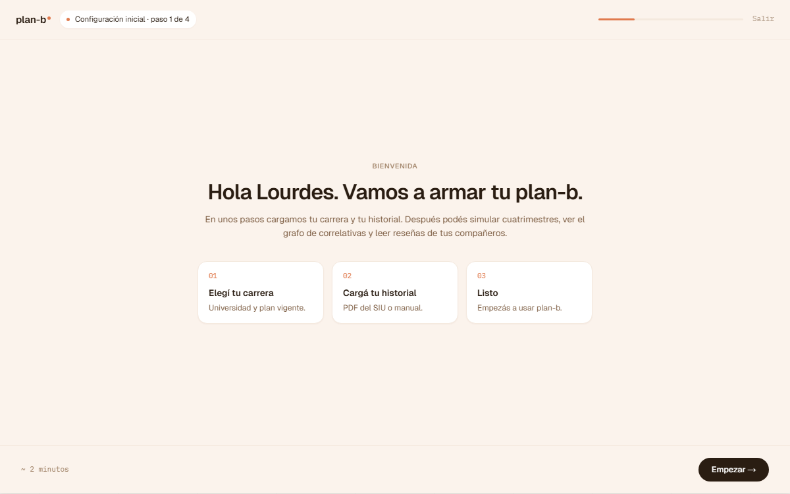
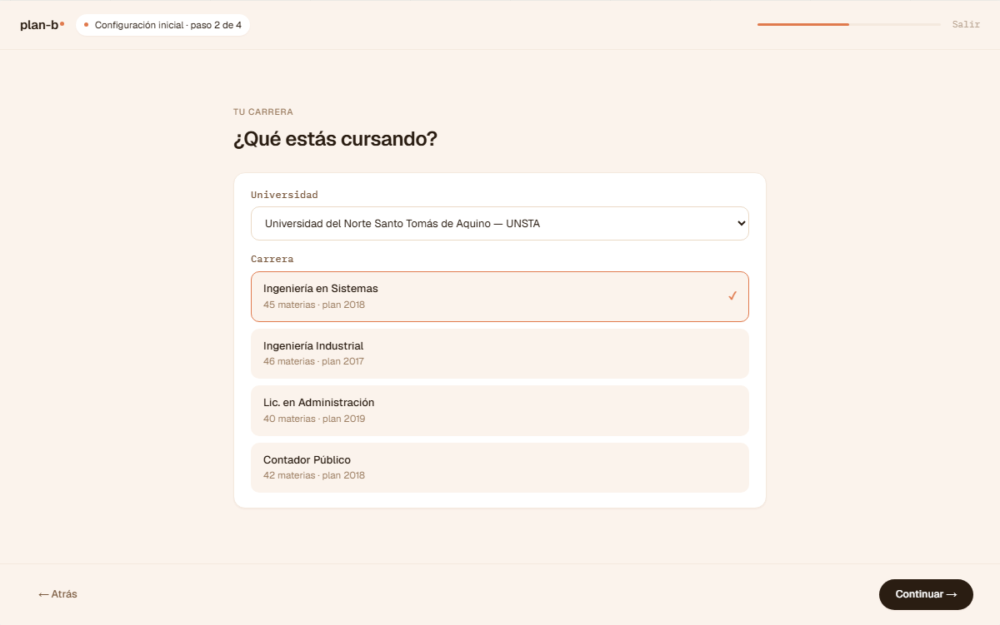
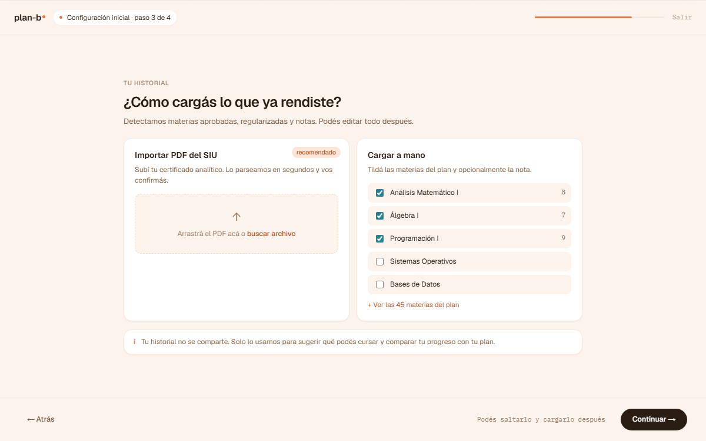
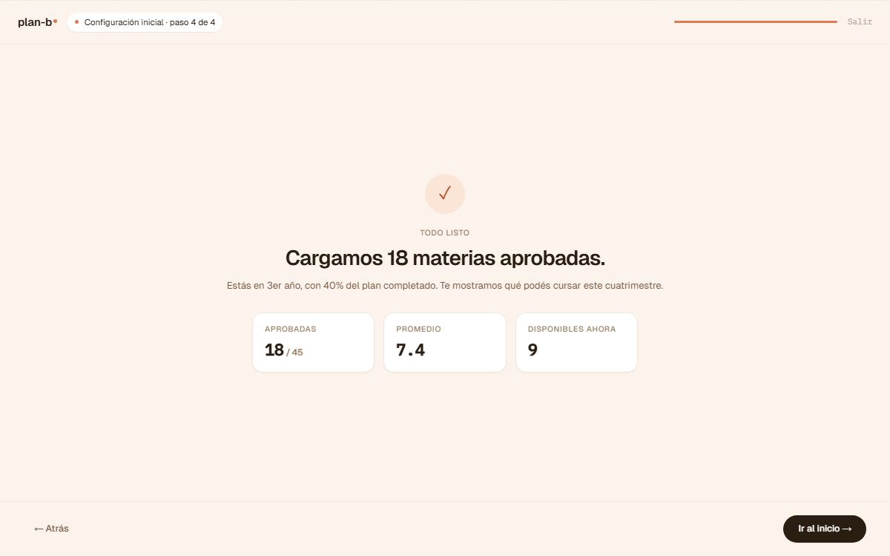

# US-037-f: Onboarding frontend (4 pasos post-registro con guard del layout)

**Status**: Sprint actual (S2)
**Sprint**: S2
**Epic**: [EPIC-02: Identidad y autenticación](../epics/EPIC-02.md)
**Priority**: High
**Effort**: M
**Parent US**: [US-037](US-037.md) (onboarding integral)
**ADR refs**: [ADR-0019](../../decisions/0019-single-nextjs-app-con-route-groups.md), [ADR-0022](../../decisions/0022-forms-react19-primitives-tanstack-form.md), [ADR-0041](../../decisions/0041-rediseño-ux-post-claude-design.md)

## Como member recién verificado, quiero un onboarding guiado de 4 pasos para asociar mi carrera y aterrizar en Inicio sabiendo qué hacer

El sign-in actual deposita al alumno directo en `/home` sin asociar carrera. El frontend del onboarding cubre 4 pantallas (Bienvenida → Carrera → Historial → Listo) que terminan creando el StudentProfile y mandando a `/home` con sesión completa.

Backend (US-037-b, **Done**) ya provee:
- 3 endpoints públicos Academic para las cascadas (`/api/academic/universities`, `/careers?universityId=`, `/career-plans?careerId=`).
- `POST /api/me/student-profiles` (US-012-b shipped) para crear el profile.
- `GET /api/me/student-profiles?userId=` para chequear si tiene profile (guard).

## Acceptance Criteria

- [ ] Route group `app/(onboarding)/` con `layout.tsx` que valida sesión activa + user sin profile activo. Si tiene profile → `/home`. Si no autenticado → `/sign-in`.
- [ ] **Paso 01: `/onboarding/welcome`**: card centered con copy de bienvenida + CTA "Empecemos" → `/onboarding/career`. Sin form.
- [ ] **Paso 02: `/onboarding/career`**: form con cascadas Universidad → Carrera → Plan + año de ingreso. Submit dispara `POST /api/me/student-profiles` → al éxito redirige a `/onboarding/history`.
- [ ] **Paso 03: `/onboarding/history`**: 3 opciones (Cargar PDF / Cargar manualmente / Lo cargo después). PDF y manual deshabilitadas con label "Disponible pronto" (diferidas a US-014 / US-013). "Lo cargo después" → `/onboarding/done`.
- [ ] **Paso 04: `/onboarding/done`**: confirmación + CTA "Ir a Inicio" → `/home`.
- [ ] **Layout `(member)/layout.tsx`** chequea si user tiene profile. Si no → redirect `/onboarding/welcome`. Esto sustituye al "todo user verificado entra a /home" actual.
- [ ] Si el user abandona el flow (cierra browser después del paso 02), al re-loguearse el guard de `(member)` ve que tiene profile → `/home`. Los pasos 03/04 son UX no obligatorios: el profile basta para considerar onboarding completo.

## Out of scope

Esto NO incluye:

- **Carga real de historial PDF / manual**: las opciones 1 y 2 del paso 03 muestran "Disponible pronto". Implementaciones diferidas a US-014 y US-013.
- **Cambiar de carrera después del onboarding**: post-MVP. Sin flow para editar `careerPlanId` desde el frontend en este sprint.
- **Mobile completo**: web-first per ADR-0041. El onboarding renderea en viewport mobile como degraded UX (form usable, no diseñado).
- **i18n**: copy en español rioplatense hardcoded.
- **Analytics / tracking** del funnel de onboarding (cuántos abandonan en cada paso). Cuando aterrice el módulo de telemetry.
- **Skip-onboarding** (ej. ?skip=true): el guard fuerza el onboarding. No hay puerta lateral.
- **Backfill** de personas seedeadas (Lucía, Mateo, Paula, Martín): el seed actual NO crea StudentProfile para ninguna persona. Cualquiera de ellos al loguearse va a entrar al onboarding. Si en QA querés un user con profile pre-creado, completá onboarding manualmente con Mateo o creá un seed nuevo en otra US.

## Edge cases

| Caso | Comportamiento esperado |
|---|---|
| User cierra browser en paso 02 después de submit OK | Re-loguea, guard ve profile → `/home`. Onboarding considerado completo. |
| User selecciona Universidad A → Carrera X. Cambia a Universidad B | Career dropdown se resetea (re-fetch). Plan dropdown también. Año de ingreso preserva. |
| `GET /api/academic/universities` falla (5xx, timeout) | Empty state "No pudimos cargar las universidades" + botón "Reintentar". Submit deshabilitado. |
| Catálogo Academic vacío | Empty state "Todavía no hay universidades disponibles. Avisanos a soporte." (no debería pasar en dev/prod, pero lo cubrimos). |
| Dos tabs en `/onboarding/career` con submit simultáneo | Backend rechaza el segundo con 409 (`identity.user.duplicate_student_profile`). UI muestra "Ya tenés un perfil. Ir a Inicio". |
| Entrada directa a `/onboarding/done` sin pasar por `career` | Guard del layout `(onboarding)`: si NO tiene profile → redirige a `/onboarding/welcome`. Si tiene → muestra `done` (estado consistente, igual que volver). |
| Back button del browser entre pasos | Welcome / done son stateless. Career persiste data en backend (no en URL). History es selección efímera. Back funciona normal. |
| Sesión expira mid-submit en paso 02 | Backend devuelve 401 (cuando JwtBearer aterrice; hoy no aplica con userId-en-query). UI muestra error genérico + CTA "Volver a entrar" → `/sign-in`. |
| Doble click en submit "Continuar" del paso 02 | Button `disabled={pending}` (React `useFormStatus`). Backend además idempotent (segundo POST devuelve 409). |
| Año fuera de rango (< 1990 o > current_year + 1) | Validación client-side bloquea submit. Backend valida también. |
| Keyboard-only para completar las 3 cascadas | Cada `<select>` (o combobox) navegable con Tab + arrows. Submit accesible con Enter. |

## Test scenarios

### Críticos (Given-When-Then)

1. **Given** Lucía recién verificó email y nunca completó onboarding, **when** se loguea, **then** el guard de `(member)` la redirige a `/onboarding/welcome` (no a `/home`).
2. **Given** Lucía está en `/onboarding/career` con todos los campos vacíos, **when** intenta submit, **then** el form muestra mensajes per-field y el submit queda bloqueado.
3. **Given** Lucía completó paso 02 (POST profile OK), **when** elige "Lo cargo después" en paso 03, **then** aterriza en `/onboarding/done` y el CTA "Ir a Inicio" la lleva a `/home` con AppShell.
4. **Given** Lucía completó onboarding (tiene StudentProfile), **when** pega URL directa `/onboarding/welcome`, **then** el guard del page la redirige a `/home`.
5. **Given** Lucía completa paso 02 OK pero cierra browser, **when** vuelve a loguearse, **then** el guard ve que tiene profile y la lleva directo a `/home` (no re-arranca onboarding).
6. **Given** un visitor sin sesión, **when** intenta entrar a `/onboarding/welcome` directo, **then** el guard del layout `(onboarding)` lo redirige a `/sign-in`.

### Cobertura por capa

- **Unit / vitest**: `features/onboarding/schema.ts` (Zod del form de career: año range, IDs Guid).
- **Component tests** (vitest + RTL): `career-form.tsx` con cascadas mockeadas (queryClient mock); validation per-field.
- **E2E Playwright**: `e2e/auth/onboarding.spec.ts` con full flow para un user nuevo cubriendo escenarios 1+3+4 (post-flow ya tiene profile y el guard lo bypassea).

## Sub-tasks

### Frontend

- [ ] `app/(onboarding)/layout.tsx` con guard server-side (sesión + no-profile).
- [ ] 4 pages: `welcome/page.tsx`, `career/page.tsx`, `history/page.tsx`, `done/page.tsx`.
- [ ] `features/onboarding/api.ts`: fetchers para los 3 endpoints Academic + queryOptions de TanStack.
- [ ] `features/onboarding/actions.ts`: server action que crea el StudentProfile via API + redirect.
- [ ] `features/onboarding/schema.ts`: Zod schema del form de career (universityId, careerId, careerPlanId, enrollmentYear).
- [ ] `features/onboarding/types.ts`: FormState, initialState.
- [ ] `features/onboarding/components/{welcome-screen,career-form,history-options,done-screen}.tsx`.
- [ ] `features/onboarding/components/onboarding-shell.tsx`: layout centered consistente (cream background + radial glow + card centrada con stepper indicator).
- [ ] Update `app/(member)/layout.tsx` guard: redirect `/onboarding/welcome` si user sin profile.
- [ ] Helper en `lib/session.ts` (o nuevo `lib/student-profile.ts`): `getStudentProfile(userId)` server-side fetch que llama a `GET /api/me/student-profiles`.
- [ ] Tests vitest: schema + career-form component + actions.
- [ ] Spec E2E `e2e/auth/onboarding.spec.ts`.

### Backend

(Done en US-037-b: endpoints disponibles para consumir)

## Dependencies

- **Depende de**: [US-037-b](US-037-b.md) (Done: endpoints Academic + GET student-profile). Pre-condition cumplida.
- **Bloquea a**: ninguna directa. Cuando aterricen US-013 / US-014 (carga historial), las opciones del paso 03 se activan, pero la US-037-f no las bloquea.
- **Relacionada con**: US-013, US-014 (carga de historial: opciones del paso 03 las exponen como placeholders), US-047 (Mi perfil: usa la misma data del StudentProfile).

## Notas de implementación

- **El StudentProfile se crea en paso 02**, no al final. Eso permite que un user que abandona después del paso 2 ya tenga onboarding "implícitamente" completo.
- **El guard del `(onboarding)` layout es la pieza crítica**: define el contrato "no entrar acá si ya tenés profile". Sin esto, un user con profile podría aterrizar en paso 02, hacer 2do POST, y caer en 409.
- **El guard del `(member)` layout es la otra pieza crítica**: si user verificado SIN profile entra a `/home`, lo redirigimos a `/onboarding/welcome`. Eso completa el ciclo.
- **`getStudentProfile()` server-side fetch** se hace en cada render de página `(member)`. Para no spamear el backend, **podemos cachear el resultado por requestId** (Next.js `cache()` o `unstable_cache`) o por sesión. MVP: sin cache, cada navigate dispara un GET. Si se nota latency, se agrega.
- **Cascadas del form**: TanStack Query con `enabled: !!parentId` para que career queries solo arranquen cuando hay university seleccionada. Mismo para plans → career.
- **Sidebar v2 no entra acá**: la US-044 (Inicio v2) cambia el shell, pero acá lo que importa es el guard del current AppShell. Cuando se rediseñe el shell, el guard del layout sigue intacto.

## Refs

- DoD: [Definition of Done](../definition-of-done.md)
- US template: [us-template.md](../us-template.md)
- Parent US: [US-037](US-037.md)
- Backend split: [US-037-b](US-037-b.md) (Done)
- Mockups (4 artboards de la sección ③ Onboarding del canvas):
  - 
  - 
  - 
  - 
  - Fuente JSX en `canvas-mocks/onboarding.jsx`.
- ADRs: [ADR-0019](../../decisions/0019-single-nextjs-app-con-route-groups.md) (route groups + guards), [ADR-0022](../../decisions/0022-forms-react19-primitives-tanstack-form.md) (forms con TanStack), [ADR-0041](../../decisions/0041-rediseño-ux-post-claude-design.md).
