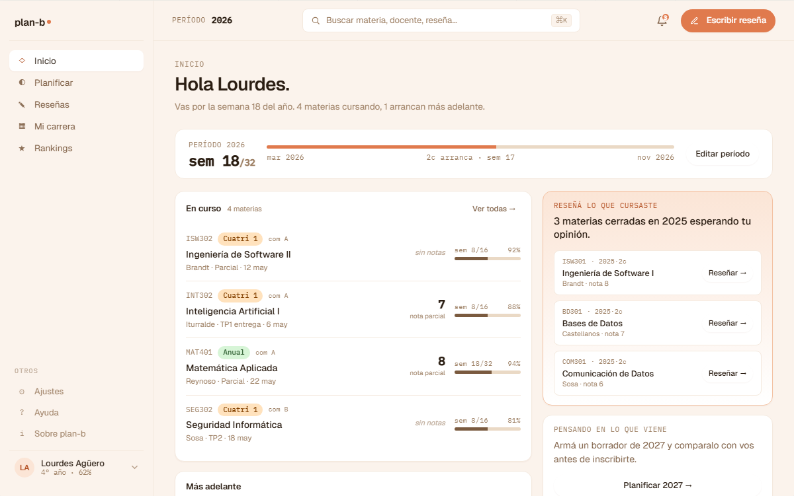

# US-044: Inicio v2 (port literal del mock V2Inicio)

**Status**: Sprint actual (S2), splitada en [US-044-a](US-044-a.md) + [US-044-b](US-044-b.md) + [US-044-c](US-044-c.md)
**Sprint**: S2
**Epic**: [EPIC-04: Planificación de cuatrimestre](../epics/EPIC-04.md)
**Priority**: High
**Effort**: M (S por slice)
**ADR refs**: [ADR-0041](../../decisions/0041-rediseño-ux-post-claude-design.md)

> Esta US se splitea en tres slices secuenciales (frontend-only, partidos por columna del mock):
> - `-a`: shell (eyebrow + greeting + subtitle stats) + período progress card.
> - `-b`: columna izquierda (En curso + Más adelante).
> - `-c`: columna derecha (Reseñá lo que cursaste + Pensando en lo que viene + Movimientos).
>
> Este archivo describe el alcance integral; los slices contienen los AC concretos por bloque, sub-tasks y tests filtrados.

## Como member logueado, quiero que el Inicio refleje el estado de mi cuatri y me ofrezca acciones contextuales (reseñar lo que cursé, planificar lo que viene) sin perder tiempo eligiendo qué hacer

El home actual (US-043-f shipped en S1) es un placeholder visual con DecisionCards en grid 2x2 + sección "Cursando ahora", sin jerarquía clara. La sesión de claude-design del 2026-05-02 cerró el mock final en `docs/design/reference/canvas-mocks/v2-screens.jsx::V2Inicio`. Ese mock es la verdad visual de esta US: el Inicio se reescribe portándolo literal a Next.js / TSX.

## Acceptance Criteria

- [ ] `app/(member)/home/page.tsx` reemplaza el layout actual por la estructura del mock V2Inicio.
- [ ] **Header** arriba del contenido:
  - Eyebrow "Inicio" (mono, uppercase, color `var(--color-ink-3)`, letter-spacing 0.12em).
  - Display heading `Hola {firstName}.` (font-display, 56px, weight 500, leading 1.05, color `var(--color-ink)`).
  - Subtitle `Vas por la semana {N} del año. {N} materias cursando, {N} arrancan más adelante.` (15px, color `var(--color-ink-2)`, max-width legible).
- [ ] **Período progress card**: card con grid `auto 1fr auto`:
  - Left: eyebrow "Período {year}" + heading mono "sem {N}/{total}".
  - Middle: progress bar (tone "warm") + labels (mes inicio · marker "{Nc} arranca · sem {N}" · mes fin).
  - Right: botón secondary "Editar período" (no funcional en MVP, link a stub).
- [ ] **Grid principal** `1.55fr / 1fr`:
  - Columna izquierda: bloque "En curso" + bloque "Más adelante" (si hay materias futuras).
  - Columna derecha: bloque acent "Reseñá lo que cursaste" + bloque "Pensando en lo que viene" + bloque "Movimientos".
- [ ] **Mock data tipada** en `features/home/data/`:
  - `period.ts`: `{ year, weekOfYear, weeksInYear, label }` (TODO: cuando aterrice US-Period o tracking real, reemplazar por endpoint).
  - `active-subjects.ts`: array de materias activas con `{ code, name, mod, com, prof, diff, week, weeks, next, attendance, note }` (TODO: US-013 cargar historial + US-016 simular = enrollments + academic).
  - `to-review.ts`: array de materias cerradas pendientes de reseñar (TODO: US-017 escribir reseña).
  - `movements.ts`: feed de notifs (TODO: US-Notif backend).
- [ ] **Borrar**: `features/home/components/{decision-card,coursing-now}.tsx` + `features/home/data/{mock-decisions,mock-coursing}.ts`. Reemplazo total de la home.
- [ ] **Tokens visuales** del mock se mapean a los ya expuestos en `frontend/src/app/globals.css` (`--color-ink`, `--color-ink-2`, `--color-ink-3`, `--color-ink-4`, `--color-bg`, `--color-bg-card`, `--color-line`, `--color-line-2`, `--color-accent`, `--color-accent-soft`, `--color-accent-ink`, `--font-display`, `--font-mono`).
- [ ] Helpers reusables en `features/home/components/`: `mod-pill.tsx` (V2Mod del mock), `progress-bar.tsx` (V2Progress).

## Out of scope

Esto NO incluye:

- **Datos reales**: 100% mock data tipada. Cada feature aterriza con TODOs explícitos del endpoint que la reemplaza (Enrollments US-013, Academic US-061, Reviews US-017, Notif).
- **Edición real del período**: el botón "Editar período" navega a un stub o no hace nada en MVP.
- **Funcionalidad del CTA "Planificar 2027 →"**: el botón existe visualmente, pero `/planificar` aterriza con US-016 + US-R-Planificar. MVP: link con TODO.
- **Funcionalidad del CTA "Reseñar →" en el bloque "Reseñá lo que cursaste"**: el botón existe; navega a stub hasta que aterrice US-017.
- **Sidebar v2 + Topbar v2**: el AppShell actual sigue. Su rebuild es US separada.
- **Mobile diseñado**: web-first per ADR-0041. Mobile renderea como degraded UX.
- **i18n / pipe de traducción**: copy en español rioplatense hardcoded.
- **Persistencia del "período"**: el período (año + semana) viene de mock. Cuando aterrice un calendario académico real, se enchufa.

## Edge cases

| Caso | Comportamiento esperado |
|---|---|
| User sin StudentProfile entra a `/home` | Guard de `(member)` redirige a `/onboarding/welcome` (US-037-f, ya implementado). |
| Mock activo vacío (sin materias cursando) | El header subtitle muestra "0 materias cursando". El bloque "En curso" muestra empty state ("Cuando empieces a cursar, vas a ver tus materias acá"). |
| Mock futuras vacío | Bloque "Más adelante" no se renderea (condicional `futuras.length > 0`, igual al mock). |
| Mock to-review vacío | Bloque "Reseñá lo que cursaste" muestra empty state ("Cuando cierres una materia te avisamos para reseñarla"). |
| Mock movements vacío | Bloque "Movimientos" muestra empty state ("Sin novedades por ahora"). |
| Materia activa con `attendance=null` | Columna asistencia muestra `--%` o se omite. |
| Materia activa con `note=null` | Columna nota parcial muestra "sin notas" en italic, color `--color-ink-4`. |
| Viewport < 1024px | Grid principal colapsa a single column. Columna izquierda queda arriba, derecha abajo (web-first, mobile degraded). |
| Viewport < 768px | Stack total. Card del período se reduce (la columna derecha del progress bar pasa abajo). |
| User con email con tilde mal o sin tilde | Greeting se calcula con `greetingNameFromEmail(email)` (ya existe). Cuando aterrice firstName en session (US-012-b ya shipped), se reemplaza. |

## Test scenarios

### Críticos (Given-When-Then)

1. **Given** Lucía con StudentProfile + mock activo de 4 materias cursando + 1 futura, **when** entra a `/home`, **then** ve el greeting "Hola Lucia." + subtitle "Vas por la semana 18 del año. 4 materias cursando, 1 arranca más adelante." + período card + grid 2-col completo.
2. **Given** mock con todas las activas en `note=null`, **when** se inspecciona "En curso", **then** cada row muestra "sin notas" en lugar del número.
3. **Given** mock futuras vacío, **when** la página renderea, **then** el bloque "Más adelante" no aparece.
4. **Given** mock to-review con 3 materias, **when** se inspecciona la columna derecha, **then** el bloque "Reseñá lo que cursaste" lista las 3 con CTA "Reseñar →".
5. **Given** click en "Planificar 2027 →", **when** se inspecciona, **then** redirige a stub o console.log "TODO US-016".
6. **Given** viewport 1280px, **when** la página renderea, **then** el grid es 2-col (1.55fr / 1fr).
7. **Given** viewport 768px, **when** la página renderea, **then** el grid colapsa a 1-col stack.

### Cobertura por capa

- **Unit / vitest**: helpers `greetingNameFromEmail` (ya existe, mantener test), `formatPeriodWeek(period)` si sale como helper.
- **Component / vitest + RTL**: render de cada bloque con mock injectado, snapshot del header + período card.
- **E2E Playwright**: spec único de cierre del rebuild (`home-v2.spec.ts`) que cubre los 5 scenarios principales con Lucía.

## Sub-tasks

- [ ] Reescribir `app/(member)/home/page.tsx` con la estructura del mock.
- [ ] Crear `features/home/data/{period,active-subjects,to-review,movements}.ts` con tipos + mocks + TODOs.
- [ ] Crear componentes reusables en `features/home/components/`:
  - `mod-pill.tsx` (V2Mod del mock).
  - `progress-bar.tsx` (V2Progress del mock).
  - `period-progress-card.tsx` (la card de período).
  - `current-subjects-card.tsx` (bloque "En curso").
  - `upcoming-subjects-card.tsx` (bloque "Más adelante").
  - `pending-reviews-card.tsx` (bloque "Reseñá lo que cursaste").
  - `next-period-card.tsx` (bloque "Pensando en lo que viene").
  - `movements-card.tsx` (bloque "Movimientos").
- [ ] Tests vitest unit + component.
- [ ] Spec E2E `frontend/e2e/dashboard/home-v2.spec.ts`.
- [ ] Borrar `features/home/components/{decision-card,coursing-now}.tsx` + `features/home/data/{mock-decisions,mock-coursing}.ts`.

## Notas de implementación

- **Mock como fuente única**: el mock `v2-screens.jsx::V2Inicio` (con datos en `v2-shell.jsx`) es la verdad. Cualquier ambigüedad se resuelve releyendo el mock.
- **Los helpers visuales se reusan**: `mod-pill` y `progress-bar` los va a usar también US-045 (Mi carrera). Conviene aterrizarlos con tipos genéricos desde el primer slice.
- **Greeting**: hoy se deriva del email vía `greetingNameFromEmail`. Cuando StudentProfile tenga `firstName` en session (post US-012 frontend), se reemplaza.
- **Período mock**: hardcoded a `{ year: 2026, weekOfYear: 18, weeksInYear: 32 }` para empezar. Cuando aterrice un módulo de calendario académico real (post-MVP), se enchufa.
- **Sin "pregunta dominante"**: ese framing fue un overreach mío al redactar el split inicial. El mock real ofrece **greeting + stats subtitle + acciones contextuales en cards**. Las acciones son "Editar período", "Reseñar →" (por materia), "Planificar 2027 →".
- **Tokens visuales del mock vs globals.css**: la mock usa `--bg-card`, `--ink`, etc. La app usa `--color-bg-card`, `--color-ink`. El mapeo es 1-a-1, sólo cambia el prefijo `color-`.

## Dependencies

- **Depende de**: [US-037-f](US-037-f.md) (guard `(member)` redirige si no hay profile, **Done**) + [US-042-f](US-042-f.md) (AppShell con sidebar + topbar, **Done**).
- **Bloquea a**: [US-016](US-016.md) (Simular inscripción) consume el CTA "Planificar 2027 →" como punto de entrada cuando aterrice. No bloqueante pero acoplada visualmente.
- **Relacionada con**: [US-013](US-013.md) (cargar historial), [US-016](US-016.md) (simular inscripción), [US-017](US-017.md) (escribir reseña).

## Refs

- DoD: [Definition of Done](../definition-of-done.md)
- Mockup: . Fuente JSX en `canvas-mocks/v2-screens.jsx::V2Inicio` + datos en `v2-shell.jsx` (V2_USER, V2_PERIOD, V2_ACTIVE, V2_TO_REVIEW).
- ADRs: [ADR-0041](../../decisions/0041-rediseño-ux-post-claude-design.md).
- US relacionadas: [US-043-f](US-043-f.md) (home placeholder de S1, shipped), [US-037](US-037.md) (Onboarding, Done).
- Slices: [US-044-a](US-044-a.md) (shell + período), [US-044-b](US-044-b.md) (columna izq: En curso + Más adelante), [US-044-c](US-044-c.md) (columna der: Reseñá + Planificar + Movimientos).
