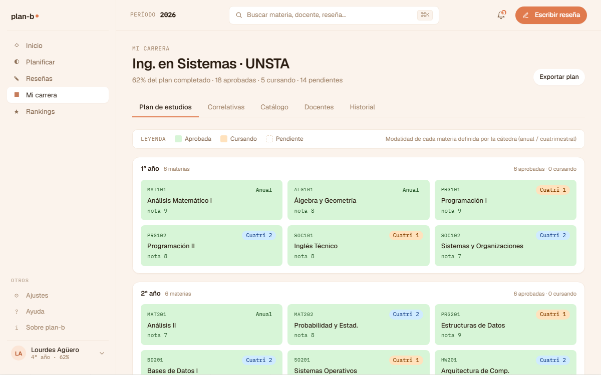

# US-045-b: Mi carrera tab Plan (heatmap por año/cuatrimestre)

**Status**: Done
**Sprint**: S3
**Epic**: [EPIC-03: Historial académico](../epics/EPIC-03.md)
**Priority**: High
**Effort**: M
**Parent US**: [US-045](US-045.md)
**ADR refs**: [ADR-0041](../../decisions/0041-rediseño-ux-post-claude-design.md)

## Como member, quiero ver mi plan de estudios como heatmap por año con materias coloreadas por estado para entender mi avance de un vistazo

Segundo slice del rebuild de Mi carrera. Reemplaza el `TabStub` del tab `plan` con el componente `PlanGrid`, port literal del mock `canvas-mocks/v2-screens.jsx::V2CarreraPlan`.

## Acceptance Criteria

- [x] Tab `?tab=plan` renderea `features/mi-carrera/components/plan-grid.tsx`.
- [x] **Layout**: una card por año (vertical). Dentro de cada card, grid 3-cols con las materias del año. Header de la card: `{N}° año · X materias` + `{aprobadas} aprobadas · {cursando} cursando` a la derecha.
- [x] **3 estados visuales** (port literal del mockup):
  - `AP` Aprobada: bg verde claro (`bg-st-approved-bg`) + texto verde oscuro + nota visible debajo del nombre.
  - `CU` Cursando: bg naranja claro (`bg-st-coursing-bg`) + texto naranja oscuro.
  - `PD` Pendiente: bg `bg-card` + border `line` + texto `ink-3` + `opacity-80`.
- [x] **Click en una celda** navega a `/mi-carrera/materia/[code]` (drawer real implementado en US-045-d).
- [x] **Tooltip on hover** (atributo `title`): nombre completo + estado + nota cuando aplica + correlativas pendientes cuando aplica.
- [x] **Mock data** en `features/mi-carrera/data/plan.ts`: 5 años con ~28 materias inventadas. TODO apunta a `GET /api/career-plans/{id}/subjects` (US-061) + Enrollments para estado real.
- [x] **Empty state**: si `plan.length === 0`, placeholder "No hay materias en tu plan todavía. Hablá con la coordinación de tu carrera."
- [x] **Leyenda visual** arriba del grid con 3 swatches (AP/CU/PD) + nota sobre modalidad (anual/cuatrimestral).
- [x] **Modality badge** (`anual`/`1c`/`2c`) en la esquina superior derecha de cada celda. Source of truth de cómo se cursa la materia.

## Drift intencional vs spec original

El AC original mencionaba **4 estados visuales** separando "Disponible" vs "Bloqueada" según correlativas. El mockup canónico de v2 **unifica todo lo no-AP/CU en "PD"** (3 estados visuales). El visual manda. El cálculo de `isUnlocked` queda disponible:
- Para tooltips de PD bloqueadas (lista las primeras 3 correlativas faltantes + `"y N más"`).
- Para el drawer de US-045-d que sí distingue los dos casos en el SituationCard.

Documentado en el header del archivo `plan-grid.tsx`.

## Out of scope (cerrado en otras US)

- **Datos reales**: mock 100%. TODOs apuntan a US-061 + Enrollments BC.
- **Drawer de materia con info completa**: cerrado en [US-045-d](US-045-d.md).
- **Grafo de correlativas**: cerrado en [US-045-c](US-045-c.md).
- **Promedio acumulado / GPA visualizado en el grid**: deuda futura.
- **Comparar plan con otros alumnos**: deuda futura.
- **Edición del plan** (solo admin): backoffice ([US-062](US-062.md)).

## Edge cases

| Caso | Comportamiento esperado |
|---|---|
| Materia con > 3 correlativas pendientes | Tooltip muestra las primeras 3 + `"y N más"`. |
| Materia sin correlativas | `isUnlocked` retorna true; el tooltip no menciona correlativas. |
| Click en celda PD bloqueada | Navega al drawer igual; el drawer indica claramente "bloqueada" + lista correlativas faltantes (US-045-d). |
| Mock vacío | Empty state. |

## Test scenarios

### Críticos (Given-When-Then)

1. **Given** mock con plan de 5 años, **when** Lucía entra a `?tab=plan`, **then** ve una card por año + grid 3-cols por card.
2. **Given** una celda con materia aprobada, **when** se renderea, **then** tiene fondo verde + texto verde oscuro + nota visible.
3. **Given** una celda PD con correlativas pendientes (`isUnlocked=false`), **when** se inspecciona el tooltip, **then** lista las correlativas faltantes.
4. **Given** mock vacío, **when** la página renderea, **then** se ve el empty state sin leyenda.

### Cobertura por capa

- **Component / vitest + RTL**: `plan-grid.test.tsx` (8 tests): render por estado + tooltips + states + empty + linking.
- **Unit / vitest**: `subject-status.test.ts` (11 tests): `approvedCodes`, `missingCorrelativas`, `isUnlocked`, `stateLabel`.
- **E2E Playwright**: cubierto por spec único de cierre US-045.

## Entregables

- `features/mi-carrera/data/plan.ts` (mock 5 años × ~28 materias).
- `features/mi-carrera/lib/subject-status.ts` + test.
- `features/mi-carrera/components/modality-badge.tsx`.
- `features/mi-carrera/components/plan-grid.tsx` + test.
- `app/(member)/mi-carrera/materia/[code]/page.tsx` (stub al inicio; convertido en drawer real por US-045-d).
- Wire-up en `app/(member)/mi-carrera/page.tsx`.

## Notas de implementación

- **Tokens del design system**: `--color-st-approved-bg/fg`, `--color-st-coursing-bg/fg`. Generados por Tailwind 4 vía `@theme`.
- **Mock data shape**: `{ code, name, modality: 'anual'|'1c'|'2c', state: 'AP'|'CU'|'PD', grade: number|null, correlativas: string[] }`.
- **`isUnlocked` no afecta el color visual** del nodo en este tab. Solo se usa para tooltip + drawer (US-045-d).
- **Click → `<Link href="/mi-carrera/materia/${code}">`**: navega via Next router. Drawer aterrizó con US-045-d.

## Dependencies

- **Depende de**: [US-045-a](US-045-a.md) (shell + tabs nav).
- **Habilitada por**: [US-045-d](US-045-d.md) (drawer real al destino del click).
- **Relacionada con**: [US-061](US-061.md) (backend catálogo Career + CareerPlan).

## Refs

- DoD: [Definition of Done](../definition-of-done.md)
- Parent US: [US-045](US-045.md)
- Slices hermanos: [US-045-a](US-045-a.md), [US-045-c](US-045-c.md), [US-045-d](US-045-d.md), [US-045-e](US-045-e.md)
- Mockup: . Fuente JSX en `canvas-mocks/v2-screens.jsx::V2CarreraPlan`.
- ADRs: [ADR-0041](../../decisions/0041-rediseño-ux-post-claude-design.md).
