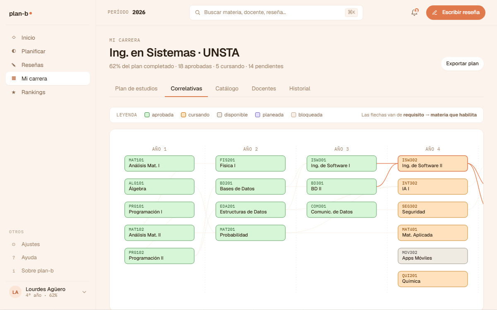

# US-045-c: Mi carrera tab Correlativas (grafo SVG hand-coded)

**Status**: Done
**Sprint**: S3
**Epic**: [EPIC-03: Historial académico](../epics/EPIC-03.md)
**Priority**: Medium
**Effort**: M
**Parent US**: [US-045](US-045.md)
**ADR refs**: [ADR-0041](../../decisions/0041-rediseño-ux-post-claude-design.md)

## Como member, quiero ver el grafo de correlativas de mi plan para entender qué me bloquea para anotarme a otra materia

Tercer slice del rebuild de Mi carrera. Reemplaza el `TabStub` del tab `correlativas` con el componente `CorrelativasGraph`, port literal del mock `canvas-mocks/v2-screens.jsx::V2CarreraGrafo`.

## Acceptance Criteria

- [x] Tab `?tab=correlativas` renderea `features/mi-carrera/components/correlativas-graph.tsx`.
- [x] **Layout columnas-por-año** (5 cols x hasta 6 filas), no filas-por-año. Coords lógicas `(x, y)` explícitas por nodo, traducidas a pixels con `nodeOrigin()`.
- [x] **Nodos rectangulares** (168 × 38 px, rounded 7px). Cada nodo contiene:
  - Code (font-mono 9.5px) arriba.
  - Nombre completo (medium 11.5px) debajo.
- [x] **5 estados visuales** (tokens oklch del canvas, copiados a `stateTokens`):
  - `AP` aprobada (verde sólido).
  - `CU` cursando (naranja sólido).
  - `AV` disponible (gris cálido; correlativas cumplidas, no inscripta).
  - `PL` planeada (violeta; agregada al borrador del próximo cuatri).
  - `BL` bloqueada (gris desaturado con `opacity-0.55`; correlativas incompletas).
- [x] **Aristas** como curvas bezier horizontales (`M ax,ay C mx,ay mx,by bx,by`). Stroke `line` por default; `accent` en las que tocan el nodo focused.
- [x] **Labels de año** arriba de cada columna (`Año 1` ... `Año 5`) + líneas verticales dasheadas entre columnas como separador visual.
- [x] **Foco visual fijo** en la materia que el alumno está cursando (default `ISW302` del mock). Stroke accent + edges destacadas. **NO hay click-driven highlight de ancestros/descendientes**: el foco refleja el contexto del alumno, no la exploración con mouse.
- [x] **Banner tip inferior** con copy narrativo: `"Tocá un nodo para ver el detalle... Estás cursando {focusedId}. Al aprobarla habilitás {unlocks}."` Mock cae a tip genérico cuando no hay foco.
- [x] **Click en un nodo** navega a `/mi-carrera/materia/[code]` (drawer real de US-045-d).
- [x] **Leyenda** arriba con 5 swatches + texto "Las flechas van de requisito → materia que habilita".
- [x] **Mock data** en `features/mi-carrera/data/correlativas-mock.ts`: 21 nodos + 20 edges + tokens + helpers de layout. Port literal del canvas.
- [x] **Empty state**: si el mock viene sin edges, placeholder "Tu plan no tiene correlativas modeladas todavía."
- [x] **Server component**: sin `'use client'`. La interacción es solo navegación via `<Link>` por nodo.

## Drift intencional vs spec original

El AC original (pre canvas v3) describía:
- Nodos circulares (no rectangulares).
- 4 estados (aprobada/cursando/disponible/bloqueada). El canvas v3 trajo 5 (suma `planeada`).
- Layered layout filas-por-año (el canvas trajo columnas-por-año).
- Click highlight de ancestros + descendientes con `getAncestors`/`getDescendants`. El canvas no tiene click highlight: el foco es fijo + contextual.

El canvas v3 (zip de 2026-05-14) trajo el diseño real. Lo que estaba antes era invento. Port literal aplicado.

Los helpers `getAncestors`, `getDescendants`, `detectCycle`, `layeredLayout` se borraron porque no se usan en el nuevo diseño (las coords vienen pre-calculadas del mock).

## Out of scope (cerrado en otras US o deuda futura)

- **Library de grafos** (d3-force, cytoscape, vis.js): hand-coded a propósito por bundle size + control visual.
- **Drag/pan/zoom de nodos**: layout estático en MVP. Si crece a > 30 nodos ilegibles, pasa a deuda.
- **Animaciones complejas**: solo `transition` CSS implícito.
- **Edición del grafo** (admin): backoffice (US-062).
- **Click interactivo de highlight ancestros/descendientes**: descartado porque el canvas no lo modela.

## Edge cases

| Caso | Comportamiento esperado |
|---|---|
| Edge a un nodo que no existe en `nodes` (caso patológico) | `nodeById.get(to)` retorna undefined → el path se omite silenciosamente. |
| Nodo `BL` (bloqueado) | Opacity 0.55 + color desaturado, sin destacar. |
| `focusId = null` | Banner tip default ("Tocá un nodo..."); ningún nodo tiene anillo accent. |
| `focusId` apunta a un id que no existe | `nodeById.get(focusId)` retorna undefined → banner default; ningún nodo destacado. |
| Mock con > 30 nodos | El SVG renderea todo. Si crece a ilegible, pasa a deuda (no MVP). |

## Test scenarios

### Críticos (Given-When-Then)

1. **Given** mock con 21 nodos y 20 edges, **when** Lucía entra a `?tab=correlativas`, **then** ve un `<g>` por nodo + un `<path>` por edge.
2. **Given** un nodo con `state='AP'`, **when** se inspecciona, **then** `data-state="AP"` + fill verde.
3. **Given** click en un nodo, **when** la nav resuelve, **then** está en `/mi-carrera/materia/[id]`.
4. **Given** un edge a un id inexistente, **when** se renderea, **then** se omite sin warning.
5. **Given** `focusId='ISW302'`, **when** se renderea el banner, **then** menciona la materia + las que habilita.

### Cobertura por capa

- **Component / vitest + RTL**: `correlativas-graph.test.tsx` (9 tests).
- **E2E Playwright**: cubierto por spec único de cierre US-045.

## Entregables

- `features/mi-carrera/data/correlativas-mock.ts` (port literal canvas: nodes, edges, tokens, LAYOUT, VIEWPORT, edgePath, nodeOrigin).
- `features/mi-carrera/components/correlativas-graph.tsx` + test.
- Wire-up en `app/(member)/mi-carrera/page.tsx`.

## Notas de implementación

- **`correlativas-mock.ts` independiente de `plan.ts`**: el canvas tiene una inconsistency interna (ej. PRG201 = Estructuras de Datos en PlanGrid, EDA201 en grafo; estados expandidos AP/CU/AV/PL/BL en grafo vs 3 estados en Plan). Cuando aterrice backend real (US-061), ambas vistas se unifican en `GET /api/me/career-plan`.
- **Foco como prop opcional**: `focusId` default = `'ISW302'` del mock. Se puede override para tests o futuras integraciones (ej. "ver el grafo desde la perspectiva de otra materia").
- **`biome-ignore` en el `<g>` con onClick**: el componente delega click a `<Link>` envoltorio. La regla `noStaticElementInteractions` se queja porque `<g>` SVG no soporta `role/tabIndex` interactive sin `foreignObject`. La nav por keyboard se hace via `<Link>` envoltorio (Tab + Enter).

## Dependencies

- **Depende de**: [US-045-a](US-045-a.md) (shell + tabs nav).
- **Habilitada por**: [US-045-d](US-045-d.md) (drawer real al destino del click).
- **Relacionada con**: [US-061](US-061.md) (backend catálogo + correlativas reales).

## Refs

- DoD: [Definition of Done](../definition-of-done.md)
- Parent US: [US-045](US-045.md)
- Slices hermanos: [US-045-a](US-045-a.md), [US-045-b](US-045-b.md), [US-045-d](US-045-d.md), [US-045-e](US-045-e.md)
- Mockup: . Fuente JSX en `canvas-mocks/v2-screens.jsx::V2CarreraGrafo`.
- ADRs: [ADR-0041](../../decisions/0041-rediseño-ux-post-claude-design.md).
