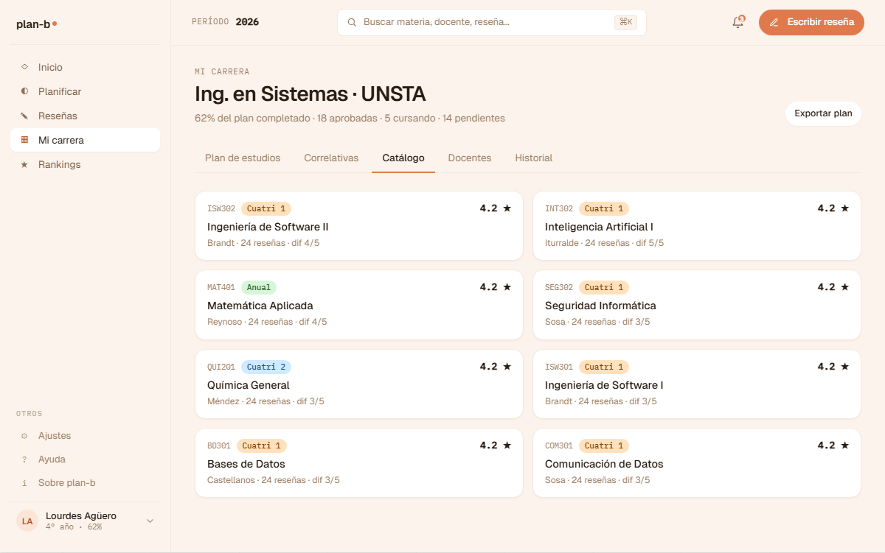
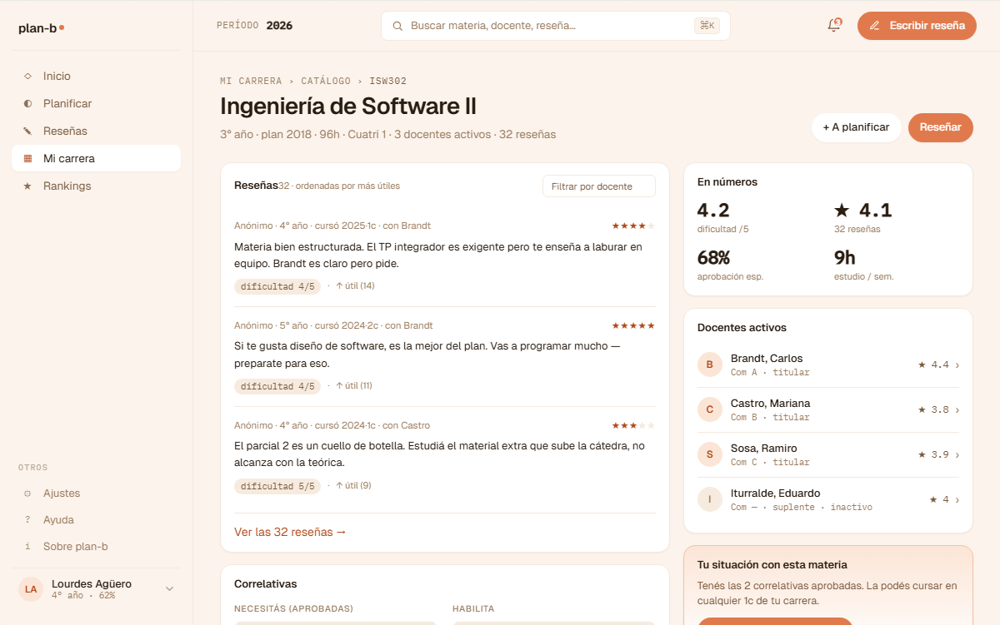
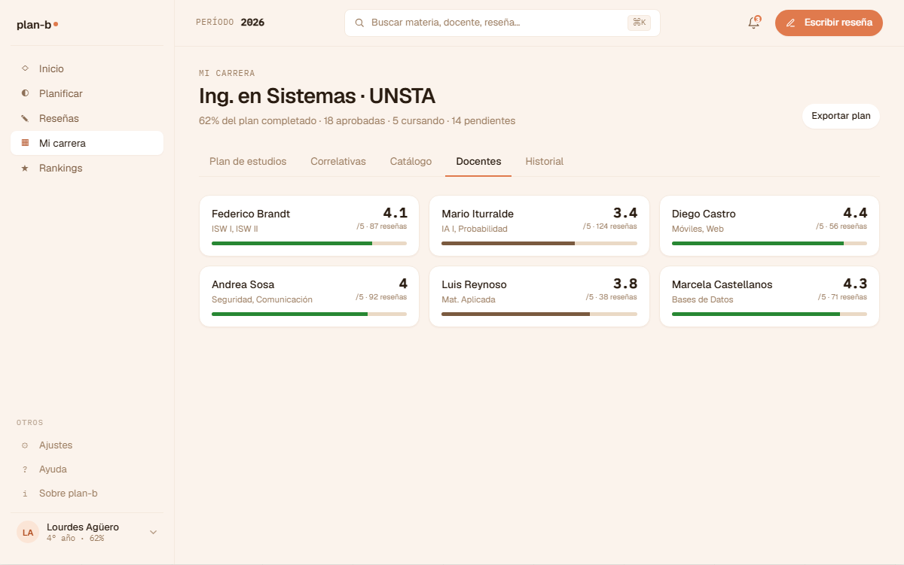
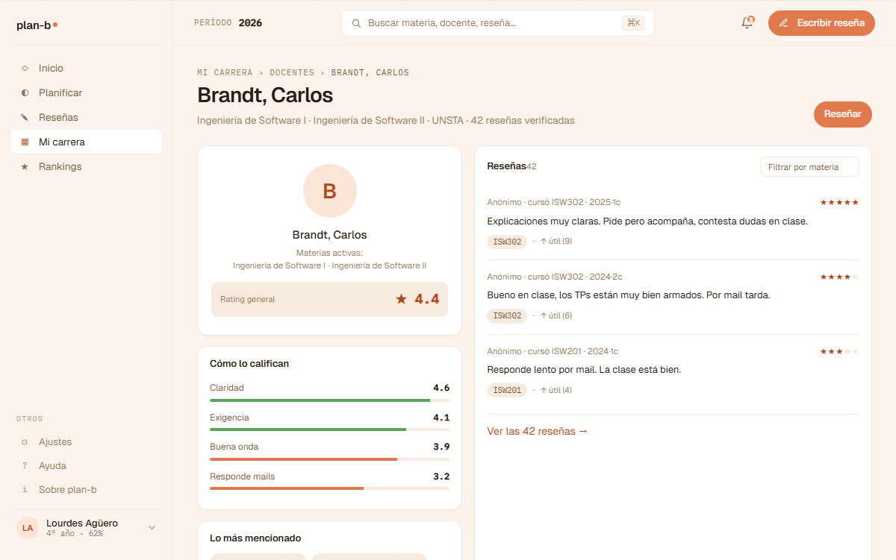

# US-045-d: Mi carrera tabs Materias + Docentes + drawers de detalle

**Status**: Done
**Sprint**: S3
**Epic**: [EPIC-03: Historial académico](../epics/EPIC-03.md)
**Priority**: Medium
**Effort**: M
**Parent US**: [US-045](US-045.md)
**ADR refs**: [ADR-0041](../../decisions/0041-rediseño-ux-post-claude-design.md)

## Como member, quiero buscar materias y docentes de mi plan en listas filtrables y abrir drawers con su detalle para encontrar info sin saltar entre 5 pantallas

Cuarto slice del rebuild de Mi carrera. Cubre 2 tabs (Catálogo y Docentes) en un solo slice porque comparten queries del módulo Academic + reseñas, y los drawers cierran el loop visual de los tabs anteriores (Plan + Correlativas linkean al drawer de materia).

## Acceptance Criteria

### Tab Catálogo (Materias)

- [x] Tab `?tab=catalogo` renderea `features/mi-carrera/components/subject-list.tsx`.
- [x] Lista de materias del plan, **ordenadas por año + cuatrimestre por defecto** (orden del array de `plan.ts`).
- [x] **Buscador local** (input filter) que matchea por nombre o código (case-insensitive).
- [x] **Filtros** (selects): por año (años presentes en el plan), por modalidad (`1c`/`2c`/`anual`), por estado (`AP`/`CU`/`PD`). Combina con AND.
- [x] Cada item de la lista (card 2-col grid): código mono + modality badge + rating promedio + nombre + footer "docentes · N reseñas · año · estado".
- [x] **Empty state**: si filtros no matchean nada, "No encontramos materias con esos filtros."

### Tab Docentes

- [x] Tab `?tab=docentes` renderea `features/mi-carrera/components/teacher-list.tsx`.
- [x] Lista de docentes que dictan materias del plan (mock independiente del plan, 6 docentes).
- [x] **Buscador local** por nombre (case-insensitive).
- [x] Cada item (card 3-col grid): nombre + materias que dicta (line-clamped) + rating overall mono + count de reseñas + progress bar tonal (verde si ≥ 4, gris si menos).

### Drawer de materia (`/mi-carrera/materia/[code]`)

- [x] Página dedicada (no modal en MVP). Layout: header breadcrumb + grid 2-col.
- [x] **Header**: eyebrow breadcrumb `Mi carrera › Catálogo › {code}` + título `{name}` + subtitle `{año}° año · {modality} · N docentes · N reseñas · estado {state}`.
- [x] **Columna izquierda**: card "Reseñas reportadas" (top 3 by `useful` + CTA "Ver las N reseñas") + card "Correlativas" con 2 sub-listas: "Necesitás (aprobadas)" + "Habilita" (otras materias del plan que la requieren). Cada chip clickeable → otro drawer.
- [x] **Columna derecha**: card "En números" (4 StatCells: rating / reseñas / comisiones / modalidad) + card "Docentes" (lista con avatar inicial + nombre + comisión + rating + chevron) + card "Tu situación" (3 variantes: AP / CU / PD según `isUnlocked`).
- [x] **`notFound()`** si el `code` no existe en el plan.

### Drawer de docente (`/mi-carrera/docente/[id]`)

- [x] Página dedicada. Layout: header con avatar + grid 2-col.
- [x] **Header**: avatar circular con inicial + breadcrumb `Mi carrera › Docentes` + nombre + subtitle `{materias} · N reseñas verificadas`.
- [x] **Columna izquierda**: card "Reseñas top 3" + card "Tags destacados" (chips con count).
- [x] **Columna derecha**: card "En números" (rating / reseñas / materias / tags) + card "Cómo es como docente" (4 sub-metrics con bars: Claridad / Exigencia / Buena onda / Responde) + card "Materias que dicta" (lista linkeable a `/mi-carrera/materia/[code]`).
- [x] **`notFound()`** si el `id` no existe en `teachers.ts`.

### Mock data

- [x] `features/mi-carrera/data/teachers.ts`: 6 docentes con `rating + metrics + tags`. TODO → US-063.
- [x] `features/mi-carrera/data/comisiones.ts`: 12 comisiones del cuatri vigente. TODO → US-065.
- [x] `features/mi-carrera/data/reviews.ts`: 9 reseñas. TODO → US-005.

### Linking cross-tab cerrado

| Origen | Destino |
|---|---|
| Cell del PlanGrid (US-045-b) | `/mi-carrera/materia/[code]` |
| Card del SubjectList | `/mi-carrera/materia/[code]` |
| Card del TeacherList | `/mi-carrera/docente/[id]` |
| Correlativa chip del SubjectDrawer | `/mi-carrera/materia/[code]` (otra) |
| Teacher entry del SubjectDrawer | `/mi-carrera/docente/[id]` |
| Subject entry del TeacherDrawer | `/mi-carrera/materia/[code]` |
| Nodo del CorrelativasGraph (US-045-c) | `/mi-carrera/materia/[code]` |

## Drift intencional vs spec original

- **Drawer como página dedicada, no modal**: el AC original decía "modal sobre la lista (preferred UX), página dedicada como MVP fallback". Implementamos solo la página dedicada (sin modal `@modal` parallel routes). Mantiene URL sharable + simplicidad. Migración a `@modal` queda como deuda.
- **Filtros de estado usan códigos del plan** (AP/CU/PD), no labels human-readable (aprobada/cursando/disponible/bloqueada). El `stateLabel` helper hace la traducción en el footer de cada card.

## Out of scope (cerrado en otras US o deuda futura)

- **Datos reales del plan/teachers/reviews**: US-061 + US-063 + US-005.
- **Crear/editar reseña desde el drawer**: US-017 (presente solo como CTA stub).
- **Drawer como modal** (parallel routes `@modal`): deuda explícita.
- **Filtros avanzados** (rango de notas, sort por rating): MVP simple.
- **Lazy loading / paginación**: las listas son chicas (≤ 50 items).
- **Action menu en drawer materia** (planificar, agregar a wishlist): out of scope.

## Edge cases

| Caso | Comportamiento esperado |
|---|---|
| Búsqueda matchea 0 materias | Empty state. |
| URL `/materia/INEXISTENTE` | `notFound()` → page 404 de Next. |
| `/docente/INEXISTENTE` | `notFound()`. |
| Drawer de materia con 0 reseñas | CTA stub "Sé el primero en reseñar →" en el card. |
| Filtro estado=CU con todas aprobadas | Empty state "No encontramos materias con esos filtros." |

## Test scenarios

### Críticos (Given-When-Then)

1. **Given** mock con 20 materias, **when** Lucía entra a `?tab=catalogo`, **then** ve lista 2-col completa.
2. **Given** Lucía escribe "Programación" en el buscador, **when** termina de tipear, **then** filtra a las materias con "Programación" en nombre.
3. **Given** Lucía clickea el card de una materia, **when** la página carga, **then** se ve el SubjectDrawer con todas las cards.
4. **Given** Lucía está en el drawer de Materia X y clickea una correlativa Y, **when** la página carga, **then** se ve el drawer de Y. Browser back vuelve a X.
5. **Given** Lucía está en `?tab=docentes`, **when** clickea un docente, **then** se ve el TeacherDrawer con las 4 metrics + materias.

### Cobertura por capa

- **Component / vitest + RTL**: `subject-list.test.tsx` (8 tests), `teacher-list.test.tsx` (6 tests).
- **Unit / vitest**: `filters.test.ts` (10 tests).
- **E2E Playwright**: cubierto por spec de cierre US-045.

## Entregables

- 3 mocks: `teachers.ts`, `comisiones.ts`, `reviews.ts`.
- `lib/filters.ts` + test.
- `components/subject-list.tsx` + test.
- `components/teacher-list.tsx` + test.
- 3 primitivos de drawer: `correlativa-chip.tsx`, `review-card.tsx`, `stat-cell.tsx`.
- `components/subject-drawer.tsx`.
- `components/teacher-drawer.tsx`.
- `app/(member)/mi-carrera/materia/[code]/page.tsx` (drawer page; reemplaza stub de US-045-b).
- `app/(member)/mi-carrera/docente/[id]/page.tsx` (drawer page nueva).
- Wire-up en `app/(member)/mi-carrera/page.tsx`: `case 'catalogo'` y `case 'docentes'` rendean los componentes reales.

## Notas de implementación

- **Drawer como página dedicada vs modal**: optamos por página dedicada. Sharable URL + simplicidad. Cuando aterrice un patrón de parallel routes (`@modal`), se evalúa migrar.
- **Filter state en `useState` local**: no persiste en URL. Si crece la necesidad, migrar a `nuqs` sin tocar `lib/filters.ts`.
- **Mock de teachers deducido conceptualmente del plan**, pero NO importa el plan directamente. Cada teacher referencia sus subject codes; algunos pueden no estar en `plan.ts` (caso edge, no se da en el mock actual).
- **Performance**: lista < 50 items, filter local instantáneo, sin debounce.

## Dependencies

- **Depende de**: [US-045-a](US-045-a.md) (shell), [US-045-b](US-045-b.md) (mock plan reusable).
- **Habilita a**: [US-045-c](US-045-c.md) (los nodos del grafo linkean a `/materia/[code]`).
- **Relacionada con**: US-005 (ver reseñas, doc por aterrizar), [US-017](US-017.md) (escribir reseña), [US-024](US-024.md) (respuesta de docente), [US-061](US-061.md) (backend catálogo).

## Refs

- DoD: [Definition of Done](../definition-of-done.md)
- Parent US: [US-045](US-045.md)
- Slices hermanos: [US-045-a](US-045-a.md), [US-045-b](US-045-b.md), [US-045-c](US-045-c.md), [US-045-e](US-045-e.md)
- Mockups (4 artboards):
  - 
  - 
  - 
  - 
  - Fuente JSX en `canvas-mocks/v2-screens.jsx::V2MiCarrera tab="materias"`/`tab="docentes"` + `canvas-mocks/v2-screens-3.jsx::V2MateriaDetalle` + `V2DocenteDetalle`.
- ADRs: [ADR-0041](../../decisions/0041-rediseño-ux-post-claude-design.md).
