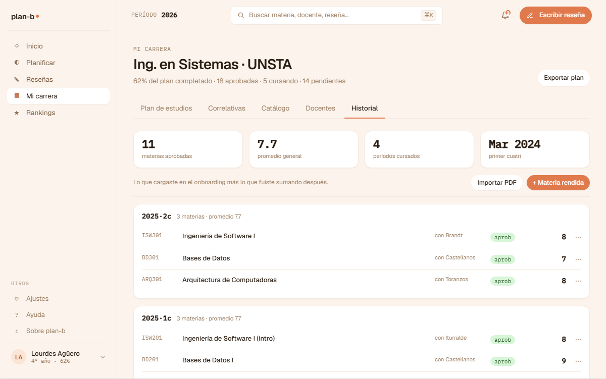

# US-045-e: Mi carrera tab Historial (tabla + CTA cargar)

**Status**: Sprint actual (S2)
**Sprint**: S2
**Epic**: [EPIC-03: Historial académico](../epics/EPIC-03.md)
**Priority**: Medium
**Effort**: S
**Parent US**: [US-045](US-045.md)
**ADR refs**: [ADR-0041](../../decisions/0041-rediseño-ux-post-claude-design.md)

## Como member, quiero ver mi historial académico cargado en una tabla con CTA para cargar más entradas para tenerlo todo en un solo lugar y completar lo que falte

Quinto y último slice del rebuild de Mi carrera. Reemplaza el stub `historial-stub.tsx` con una tabla de las entradas cargadas + CTAs para alimentar el historial.

## Acceptance Criteria

- [ ] Tab `?tab=historial` renderea `features/mi-carrera/components/history-table.tsx`.
- [ ] **Tabla** con columnas: Materia (código + nombre) · Cuatrimestre cursado · Estado (aprobada/regular/libre/pendiente) · Nota (si aplica) · Comisión · Acciones.
- [ ] **Acciones por fila**: "Editar" (link a `/mi-carrera/historial/[id]/editar` cuando aterrice US-015) + "Eliminar" (modal de confirmación, soft-delete cuando aterrice backend).
- [ ] **CTA principal arriba de la tabla**: "Cargar entrada manual" → `/mi-carrera/historial/agregar` (cuando aterrice US-013) + "Importar PDF SIU" → `/mi-carrera/historial/importar` (cuando aterrice US-014). Por ahora ambos botones navegan a páginas stub con "Próximamente".
- [ ] **Sort por columna** (cuatri, materia, estado, nota): click en header. MVP: sort client-side.
- [ ] **Filtros simples**: por estado (aprobada / regular / libre / pendiente). MVP: chips o select.
- [ ] **Empty state**: si el alumno no tiene entradas cargadas, "Tu historial está vacío. Empezá cargando una materia o importando un PDF del SIU." + ambos CTAs visibles destacados.
- [ ] **Mock data** en `features/mi-carrera/data/historial.ts`: array de entradas inventadas + TODO de US-013 / Enrollments.
- [ ] **Conteo** arriba: "12 materias cargadas (10 aprobadas, 2 pendientes)".

## Out of scope

- Cargar entrada manual: deuda US-013.
- Importar PDF: deuda US-014.
- Editar entrada: deuda US-015.
- Eliminar entrada con backend real: MVP modal + log a consola, sin backend.
- Estadísticas avanzadas (promedio, GPA, % avance carrera): out of scope. Si hace falta, US separada.
- Export del historial (PDF, CSV): out of scope.

## Edge cases

| Caso | Comportamiento esperado |
|---|---|
| Mock vacío | Empty state con CTAs destacados. |
| Entrada sin nota (cursando o libre) | Columna nota muestra guion ("-") o el badge correspondiente. |
| Sort por columna nota con entradas sin nota | Las entradas sin nota van al final del sort, independiente de orden asc / desc. |
| Click en "Eliminar" | Modal "¿Eliminar esta entrada?". Confirm: elimina del state local + log "TODO: backend". Sin persistencia real. |
| Filtro estado=pendiente con todas las entradas aprobadas | Empty filtered "No hay entradas con ese filtro." |
| Mock con > 100 entradas | Render todo (sin paginación en MVP). Si en uso real es lento, deuda. |
| Click en CTA "Cargar entrada" | Navega a stub con "Próximamente". |

## Test scenarios

### Críticos (Given-When-Then)

1. **Given** mock con 10 entradas, **when** Lucía entra a `?tab=historial`, **then** ve tabla con 10 filas + conteo "10 materias cargadas".
2. **Given** Lucía sin entradas, **when** entra al tab, **then** ve empty state con ambos CTAs destacados.
3. **Given** Lucía clickea "Eliminar" en una fila, **when** confirma el modal, **then** la fila desaparece de la tabla (state local) y el conteo baja en 1.
4. **Given** Lucía sortea por nota descendente, **when** se inspecciona la tabla, **then** las notas aparecen de mayor a menor (entradas sin nota al final).
5. **Given** Lucía filtra estado=aprobada, **when** se inspecciona, **then** solo aparecen entradas con estado aprobada.

### Cobertura por capa

- **Component / vitest + RTL**: `history-table.test.tsx` con mock injectado: render + sort + filter + delete (state local).
- **Unit / vitest**: `sortHistorial(entries, column, direction)` + `filterHistorial(entries, filters)` aparte.
- **E2E Playwright**: cubierto en spec único de cierre US-045.

## Sub-tasks

- [ ] `features/mi-carrera/data/historial.ts`: mock con 10-12 entradas + types + TODOs.
- [ ] `features/mi-carrera/lib/historial-sort.ts` + tests.
- [ ] `features/mi-carrera/lib/historial-filter.ts` + tests.
- [ ] `features/mi-carrera/components/history-table.tsx` + `.test.tsx`.
- [ ] `features/mi-carrera/components/history-summary.tsx` (conteo arriba).
- [ ] `features/mi-carrera/components/history-empty.tsx` (empty state).
- [ ] Update `app/(member)/mi-carrera/page.tsx`: reemplazar `<HistorialStub />` por `<HistoryTable />`.
- [ ] Borrar `features/mi-carrera/components/historial-stub.tsx`.
- [ ] Spec E2E `frontend/e2e/dashboard/mi-carrera-completo.spec.ts`: navega los 5 tabs + abre 1 drawer + interactúa con la tabla. Spec único de cierre del US-045.

## Notas de implementación

- **Mock data shape**: `{ id, subjectCode, subjectName, year, term, status: 'aprobada' | 'regular' | 'libre' | 'pendiente', grade?: number, comision?: string, takenAt: ISO }`.
- **Sort y filter como helpers puros**: testeo aparte. El componente solo orquesta state.
- **Delete state local**: `useReducer` o `useState` con array. Cuando aterrice backend US-015, el delete dispara mutation real.
- **Tabla con shadcn**: `<Table>` de shadcn ya provee headers clickeables + estilos. Si los chips de estado son recurrentes, definir un componente `<StatusBadge>` reusable.
- **CTAs disabled vs links a stub**: optamos por links a páginas stub porque mantiene la nav funcional y vos decidís cuándo aterrizar US-013 / US-014. Los stubs vienen con copy "Disponible pronto" + link "Volver a Mi carrera".

## Dependencies

- **Depende de**: [US-045-a](US-045-a.md) (shell + tabs nav).
- **Bloquea a**: ninguno directo.
- **Relacionada con**: [US-013](US-013.md) (cargar entrada manual), [US-014](US-014.md) (importar PDF), [US-015](US-015.md) (editar entrada). Todos llegan después y reemplazan los stubs de los CTAs.

## Refs

- DoD: [Definition of Done](../definition-of-done.md)
- Parent US: [US-045](US-045.md)
- Slices hermanos: [US-045-a](US-045-a.md), [US-045-b](US-045-b.md), [US-045-c](US-045-c.md), [US-045-d](US-045-d.md)
- Mockup: . Fuente JSX en `canvas-mocks/v2-screens-2.jsx::V2MiCarrera tab="historial"`.
- ADRs: [ADR-0041](../../decisions/0041-rediseño-ux-post-claude-design.md).
