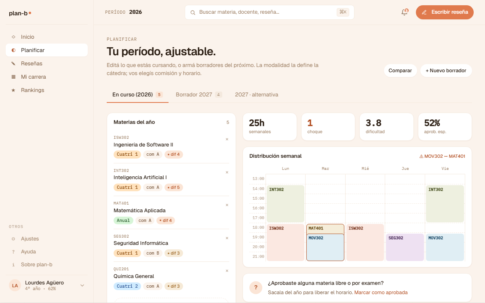
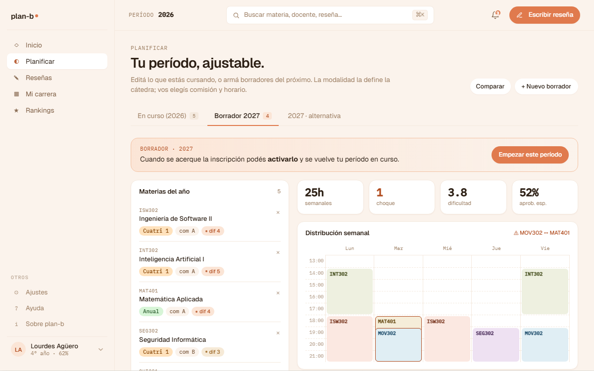
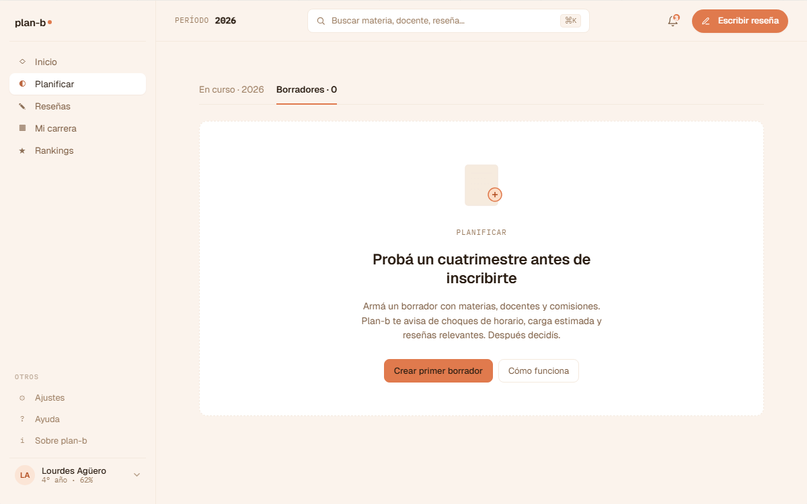
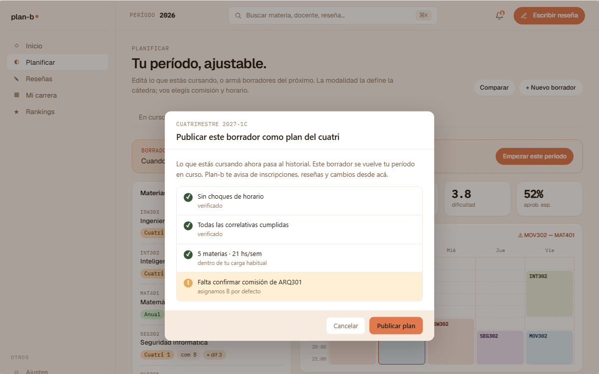

# US-046: Planificar shell + 2 tabs (en curso / borrador) + nudge de promoción

**Status**: Done
**Sprint**: S4
**Epic**: [EPIC-04: Planificación de cuatrimestre](../epics/EPIC-04.md)
**Priority**: High
**Effort**: L
**ADR refs**: [ADR-0041](../../decisions/0041-rediseño-ux-post-claude-design.md)

## Como member, quiero una pantalla "Planificar" que separe el período en curso (editable) de los borradores futuros para no mezclar lo que estoy cursando con lo que pienso cursar más adelante

La sesión de claude-design del 2026-05-02 renombró el "Simulador" del v1 a "Planificar" y zanjó la separación en 2 tabs: período activo vs borradores futuros. La promoción de borrador a en-curso es **manual con nudge** ("tu período 2026 empezó hace X días, ¿lo activás?"), no automática por fecha.

## Acceptance Criteria

- [x] Ruta `/planificar` (route group `(member)`) con tabs. **Ruta real**: `/plan` (nombres en inglés post-refactor; sidebar dice "Planificar"):
  1. `?tab=active` (default, doc decía `en-curso`): período activo. Calendario semanal con materias inscritas, ability de agregar/sacar materias, cambiar comisión, ver insights crowd-sourced.
  2. `?tab=draft` (doc decía `borrador`): períodos futuros. Lista de borradores con CTA "Crear borrador para [próximo período]".
- [x] **Tab "En curso"**:
  - Header con período activo (ej. "2026: primer cuatrimestre").
  - Calendario semanal con bloques por materia + comisión (`calendar-week.tsx`).
  - Botón "Agregar materia" → drawer con catálogo filtrable (`subject-picker-drawer.tsx`).
  - Cada materia inscrita muestra comisión activa + opción "Comparar comisiones" (`commission-compare.tsx`).
- [x] **Tab "Borrador"**:
  - Lista de borradores guardados con etiqueta del período (`draft-list.tsx`).
  - CTA "Crear borrador" → wizard simple (elegir período, agregar materias, comparar comisiones).
  - Cada borrador con acciones: Editar (US-025), Borrar (US-026), Compartir al corpus (US-024).
- [x] **Nudge de promoción**: banner en el tab "Borrador" (`promote-banner.tsx`).
- [x] Activar promociona el borrador a en-curso (flip de flag, no copia), descartando el en-curso anterior si existe (con confirmación).
- [x] **Periodo = año lectivo + cuatri** (no anual completo): dato del CareerPlan.
- [x] **Stub data hasta que aterrice backend** de simulación (US-016) y planificación-storage (US-023). Confirmado: `features/plan/data/mocks.ts`, backend real sigue pendiente (US-016/US-023 sin implementar).
- [x] **Empty state global del Planificar** (`v2-empty.jsx::V2PlanificarVacio`): confirmado `features/plan/components/empty-state.tsx`.
- [x] **Modal de publicar plan del cuatri** (`v2-modals.jsx::V2ModalPublicarPlan`): confirmado `features/plan/components/publish-plan-modal.tsx`.

## Sub-tasks

- [x] `app/(member)/planificar/page.tsx` con tabs. Ruta real `app/(member)/plan/page.tsx`.
- [x] `features/planificar/components/{calendar-week,subject-picker,commission-compare,draft-list,promote-banner}.tsx`. Ruta real `features/plan/components/`.
- [x] `features/planificar/data/` con mocks alineados al canvas v2. Ruta real `features/plan/data/mocks.ts`.
- [x] Hook `useActiveAcademicPeriod` que calcule el período activo (mock por ahora). Confirmado `features/plan/hooks/use-active-academic-period.ts`. US-064 (AcademicTerm) ya cerró (S9) pero este hook no se conectó a datos reales en este slice.
- [x] Lógica de "borrador vencido" para mostrar nudge.
- [x] Sidebar v2: agregar/mover entrada "Planificar" en sección Producto. Confirmado en `lib/member-shell.ts`.
- [ ] Tests de componentes (calendar render, drawer add subject, nudge banner visible cuando corresponde). No hay component tests en `features/plan/` (ningún `.test.tsx`); la cobertura real es E2E (`frontend/e2e/plan/plan.spec.ts`, cubre tabs, calendario, drawer agregar materia, modal publicar).

## Notas de implementación

- **Manual con nudge** = el sistema NO promociona solo. Le avisa al alumno y él decide. Razón: el alumno puede haber cambiado de plan, pospuesto inscripción, abandonado materias del borrador. La promoción automática genera "datos zombie" que él no validó.
- **Borrador → en-curso es flip, no copia**: el modelo es una sola entidad `Simulation` con `status: 'draft' | 'active'`. Al activar, el draft cambia a active y el active anterior queda como histórico (no se borra, se archiva). Eso permite "rollback" si el alumno se arrepintió en 24hs.
- **Stub data**: el calendario semanal y los bloques de materias pueden mockear con data fake hasta que aterrice US-016 (simulación backend). Compare-commissions tiene datos del corpus crowd-sourced que viene de US-024 (compartir simulación).
- **Periodo activo**: mock por ahora ("2026: 1c"). Cuando aterrice backoffice de AcademicTerm (US-064), se calcula real.

## Refs

- DoD: [Definition of Done](../definition-of-done.md)
- Mockups (3 artboards de la sección ⑥ Planificar del canvas + 1 modal):
  - 
  - 
  - 
  - 
  - Fuente JSX en `canvas-mocks/v2-screens.jsx::V2Planificar` (tabs `curso` + `borrador`), `v2-empty.jsx::V2PlanificarVacio`, `v2-modals.jsx::V2ModalPublicarPlan`.
- ADRs: [ADR-0041](../../decisions/0041-rediseño-ux-post-claude-design.md).
- US relacionadas: [US-016](US-016.md) (simular inscripción), [US-023](US-023.md) (guardar draft), [US-024](US-024.md) (compartir), [US-025](US-025.md) (editar), [US-026](US-026.md) (borrar), [US-027](US-027.md) (ver simulaciones públicas), [US-064](US-064.md) (AcademicTerm backoffice).
