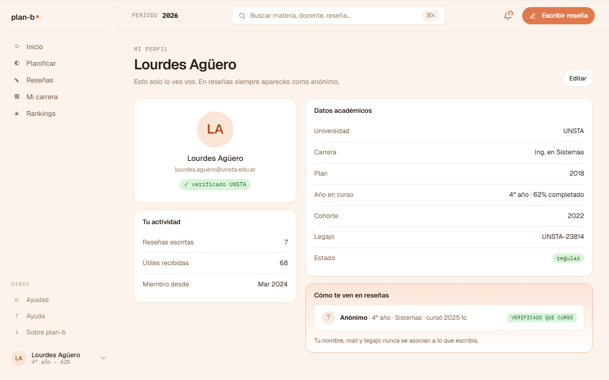

# US-047: Mi perfil (view + edit datos académicos + foto)

**Status**: Done
**Sprint**: S4
**Epic**: [EPIC-02: Identidad y autenticación](../epics/EPIC-02.md)
**Priority**: High
**Effort**: M
**ADR refs**: [ADR-0041](../../decisions/0041-rediseño-ux-post-claude-design.md)

## Como member, quiero ver y editar mis datos de perfil (nombre, mail, universidad, carrera, plan, año, legajo, estado regular, foto) en una pantalla dedicada para mantener mi identidad académica al día

La sesión de claude-design del 2026-05-02 separó "Mi perfil" (identidad del usuario) de "Ajustes" (config de la app). Mi perfil vive accesible desde el **menú del avatar** en el footer del sidebar. Ajustes va en su propio item en sección "Otros" (US-072, S5).

Los datos del StudentProfile ya se guardan en backend (US-012-b, shipped en S1). Esta US es la pantalla para verlos y editarlos.

## Acceptance Criteria

- [x] Ruta `/mi-perfil` (route group `(member)`). Ruta real `/my-profile` (nombres en inglés post-refactor).
- [x] Acceso desde **menú del avatar** en footer del sidebar (no desde ítem de nav directo). Confirmado en `components/layout/avatar-menu.tsx`.
- [x] **View mode** (default) muestra datos académicos + foto + email + botón "Editar" (`MyProfileForm`, `profile-avatar.tsx`).
- [x] **Edit mode** habilita campos editables: display name, año, legajo, estado regular. Universidad/Carrera/Plan y Email no editables acá, como especifica el AC. **Foto NO implementada**: `ProfileAvatar` genera iniciales desde el email ("no photo storage (ADR pending)", comentario explícito en `profile-avatar.tsx`); no hay upload real.
- [x] Validación: display name requerido, año entre 1 y 8 (`features/my-profile/schema.ts`).
- [x] Botón "Guardar" envía el patch del perfil y revalida la query. Endpoint real `PATCH /api/me/student-profile` (`UpdateMyProfileEndpoint.cs`), no `/api/students/me/profile` como decía este AC.
- [x] Botón "Cancelar" descarta cambios y vuelve a view mode.
- [x] Sección "Zona peligrosa" al pie con CTA "Dar de baja mi cuenta". **El flow real es [US-038-bis](US-038-bis.md) (ADR-0044), no US-075**: US-075 fue cancelada por ese ADR antes de este slice (ver `US-038-bis.md`). Confirmado en `app/(member)/my-profile/page.tsx`: `<DeactivateAccountButton>` de `features/deactivate-account`, con comentario explícito "Danger zone... (ADR-0044, US-038-bis frontend)".

## Sub-tasks

### Backend

- [x] Endpoint `GET .../me/student-profile` (devuelve StudentProfile). Ruta real `GET /api/me/student-profile` (US-037-b), no `/api/students/me/profile`.
- [x] Endpoint `PATCH .../me/student-profile` con los campos editables. Ruta real `PATCH /api/me/student-profile` (`UpdateMyProfileEndpoint.cs`).
- [ ] Endpoint `POST /api/students/me/profile/photo` (multipart). No implementado: sigue sin ADR de foto storage, tal como preveían las Notas de implementación de este mismo doc.
- [x] Validators server-side (`UpdateMyProfileValidator.cs`).
- [x] Tests integration: `Identity/UpdateMyProfileEndpointTests.cs` + `Identity/GetStudentProfileEndpointTests.cs`. No hay test de upload de foto (no hay endpoint).

### Frontend

- [x] `app/(member)/mi-perfil/page.tsx` (server component que prefetch perfil). Ruta real `app/(member)/my-profile/page.tsx`.
- [x] `features/my-profile/{api.ts,actions.ts,schema.ts,components/...,types.ts}`. Estructura real: `my-profile-form.tsx` + `profile-avatar.tsx` (no `view-mode`/`edit-form`/`danger-zone` como archivos separados; la zona peligrosa vive en la page, reusando `features/deactivate-account`).
- [x] Edit form con TanStack Form + Zod schema compartido client/server.
- [ ] Foto upload con preview antes de guardar. No implementado (ver AC de foto arriba).
- [x] Avatar menu en sidebar v2: agregar item "Mi perfil" + "Cerrar sesión". Confirmado en `avatar-menu.tsx`.

## Notas de implementación

- **Foto storage**: ADR pendiente (¿object storage local? ¿bytea en Postgres? ¿Cloudinary self-hosted?). Para esta US, asumimos endpoint que persiste y devuelve URL servible. Si el ADR no aterriza antes del sprint, queda placeholder sin foto.
- **Universidad / Carrera / Plan no editables aquí**: cambiar de carrera es un flow grande (consume historial, recalcula plan, etc.) que merece US separada post-MVP.
- **Email no editable**: cambiar email requiere re-verify del nuevo email + invalidación del viejo. Post-MVP.
- **Zona peligrosa**: CTA "Dar de baja mi cuenta" abre el flow de US-075 (modal de confirmación → endpoint self-disable → logout).

## Refs

- DoD: [Definition of Done](../definition-of-done.md)
- Mockups (2 artboards de la sección ⑩ Cuenta del canvas):
  - 
  - 
  - Fuente JSX en `canvas-mocks/v2-screens-4.jsx` (`V2Perfil`, `V2Ajustes`).
- ADRs: [ADR-0041](../../decisions/0041-rediseño-ux-post-claude-design.md).
- US relacionadas: [US-012-b](US-012-b.md) (StudentProfile backend, shipped), [US-075](US-075.md) (member self-disable), [US-072](US-072.md) (Ajustes: pantalla aparte en S5).
