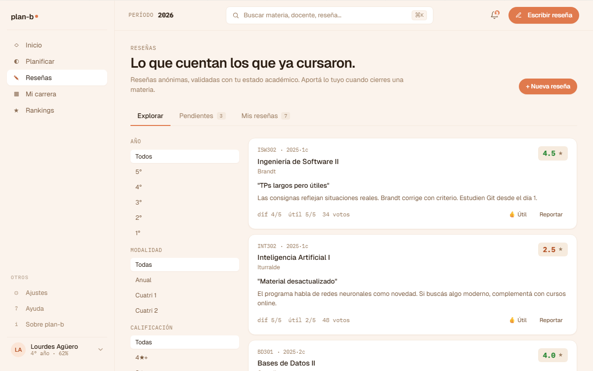
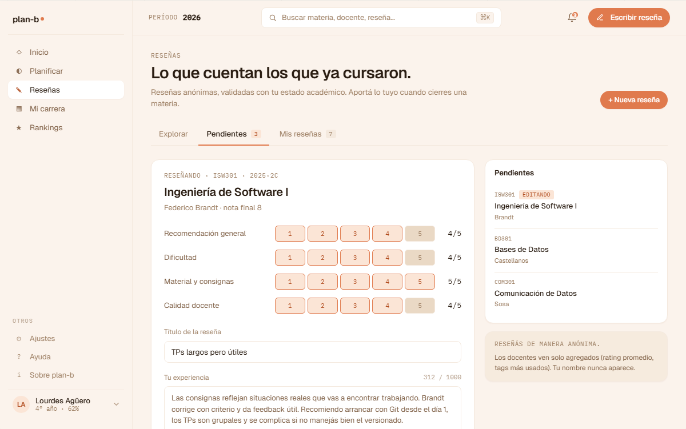
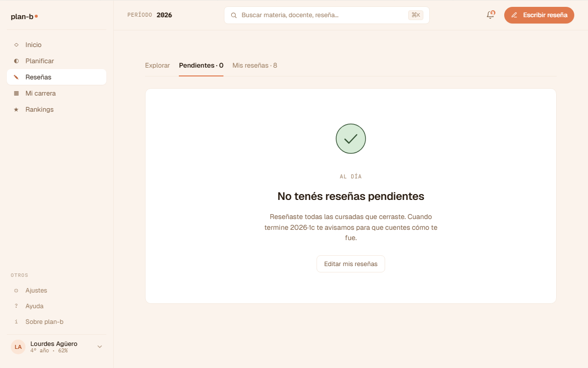
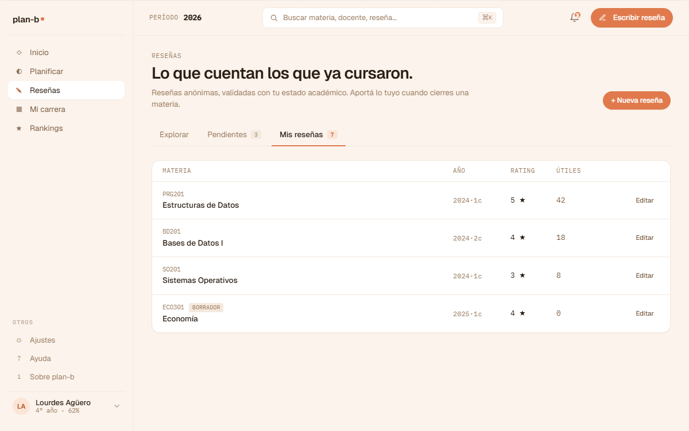
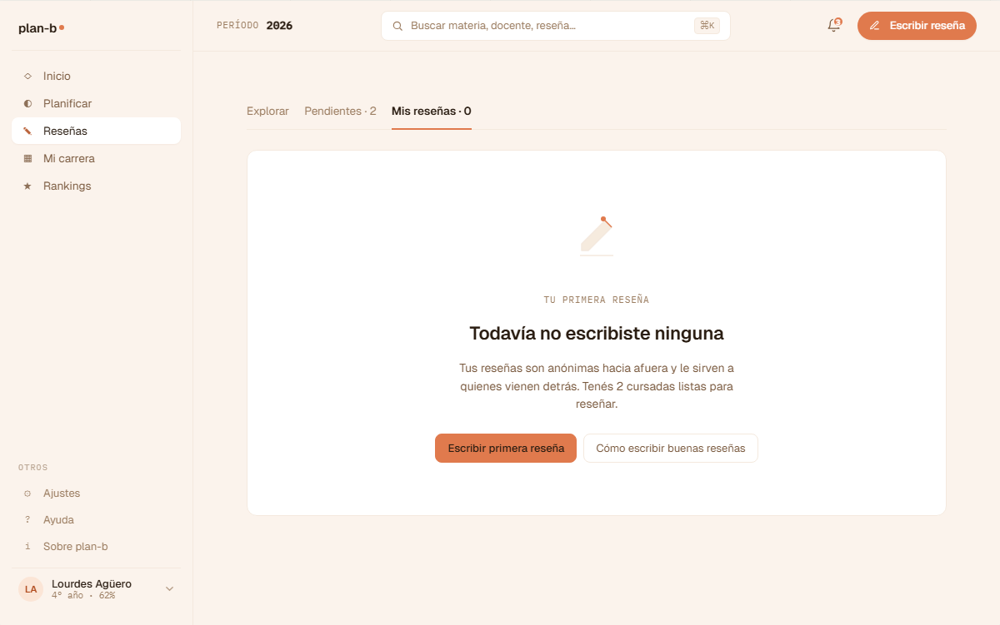

# US-048: Reseñas shell + 3 tabs (explorar / pendientes / mías)

**Status**: Backlog
**Sprint**: candidato a S4
**Epic**: [EPIC-05: Sistema de reseñas](../epics/EPIC-05.md)
**Priority**: High
**Effort**: M
**ADR refs**: [ADR-0041](../../decisions/0041-rediseño-ux-post-claude-design.md)

## Como member, quiero una pantalla "Reseñas" con 3 tabs (explorar comunidad, pendientes mías, las que ya escribí) para separar consumir de la comunidad vs aportar al corpus

La sesión de claude-design del 2026-05-02 zanjó la separación en 3 tabs:
1. **Explorar**: feed público de reseñas de la comunidad.
2. **Pendientes**: cursadas que el alumno ya completó pero todavía no reseñó (invita-a-completar).
3. **Mías**: las propias, con stats agregadas (cuántas escribí, cuántos likes / responses, etc.).

## Acceptance Criteria

- [ ] Ruta `/reseñas` (route group `(member)`) con tabs:
  1. `?tab=explorar` (default): feed paginado de reseñas públicas.
  2. `?tab=pendientes`: lista de cursadas pendientes de reseñar.
  3. `?tab=mias`: reseñas propias.
- [ ] **Tab "Explorar"**:
  - Feed con cards de reseña: rating, dificultad, autor (display name del alumno), materia, docente, comisión, snippet del texto, tags.
  - Filtros laterales: por carrera del alumno (default ON), por dificultad, por rating, por tags.
  - Ordenar: más recientes / más útiles (TBD: cuándo aparecen "likes" o reacciones).
- [ ] **Tab "Pendientes"**:
  - Lista de cursadas finalizadas sin reseña asociada.
  - Cada item con CTA "Escribir reseña" → US-049 editor.
  - **Estado vacío** (`v2-empty.jsx::V2ResenasPendientesVacio`, captura `resenas-v2-resenas-e-empty`): cuando no hay pendientes, card central con icono ✓ accent + heading "Estás al día." + subtitle "Cuando cierres una materia te avisamos para que la reseñes." + ghost link "Ver mis reseñas" → tab `mias`.
- [ ] **Tab "Mías"**:
  - Lista de reseñas propias con CTA "Editar" (US-018) y "Borrar" (US-055).
  - Header con stats: cantidad publicadas, cantidad con respuesta del docente.
  - **Estado vacío** (`v2-empty.jsx::V2MisResenasVacio`, captura `resenas-v2-resenas-m-empty`): primera vez que entra y no escribió ninguna; card central con eyebrow "Mis reseñas" + heading "Todavía no escribiste ninguna." + body explicativo (anonimato + verificación) + CTA primary "Empezá por una pendiente →" navega a tab `pendientes` si tiene; ghost link "Cómo funcionan las reseñas" → US-073 Ayuda.
- [ ] **CTA accent "Escribir reseña"** en topbar v2 cuando hay cursadas pendientes (badge con cantidad).

## Sub-tasks

### Backend

- [ ] `GET /api/reviews` con filtros (carrera, materia, docente, dificultad, rating, tags, paginado).
- [ ] `GET /api/reviews/me/pending` (cursadas finalizadas sin review).
- [ ] `GET /api/reviews/me` (mías).
- [ ] Tests integration por endpoint.

### Frontend

- [ ] `app/(member)/reseñas/page.tsx` con tabs.
- [ ] `features/browse-reviews/{api.ts,components/{review-card,filter-sidebar,explore-feed}.tsx}`.
- [ ] `features/pending-reviews/{api.ts,components/pending-list.tsx}`.
- [ ] `features/my-reviews/{api.ts,components/{my-reviews-list,my-stats-header}.tsx}`.
- [ ] Sidebar v2: agregar entrada "Reseñas" en sección Producto.
- [ ] Topbar CTA "Escribir reseña" con badge.

## Notas de implementación

- **Una reseña por cursada** = (materia + docente + comisión + cuatri en una sola reseña). Decisión consolidada en ADR-0041. La pantalla "Pendientes" lista cursadas (no materia × docente separados).
- **Fuente de cursadas pendientes**: cruza el `EnrollmentRecord` del alumno (cursadas con `status = 'aprobada' | 'desaprobada' | 'abandonada'`) con `Review` (las que NO tienen). Cuando aterricen ambos endpoints (US-013 historial + US-017 publicar reseña), este endpoint compone.
- **Filtros**: por default filtra por carrera del alumno para que el feed sea relevante. El usuario puede ampliar a otras carreras / universidades.
- **El editor (US-049) está separado**. Esta US es solo el shell de los 3 tabs y los listados.

## Refs

- DoD: [Definition of Done](../definition-of-done.md)
- Mockups (5 artboards de la sección ⑦ Reseñas del canvas, del shell con tabs + empty states):
  - 
  - 
  - 
  - 
  - 
  - Fuente JSX en `canvas-mocks/v2-screens-2.jsx::V2Resenas` (tabs `leer`, `escribir`, `mias`) + `canvas-mocks/v2-empty.jsx` (`V2ResenasPendientesVacio`, `V2MisResenasVacio`). El editor (`V2EditorResena`) es de US-049.
- ADRs: [ADR-0041](../../decisions/0041-rediseño-ux-post-claude-design.md).
- US relacionadas: [US-049](US-049.md) (editor), [US-017](US-017.md) (publicar reseña), [US-018](US-018.md) (editar reseña), [US-013](US-013.md) (cargar historial).
