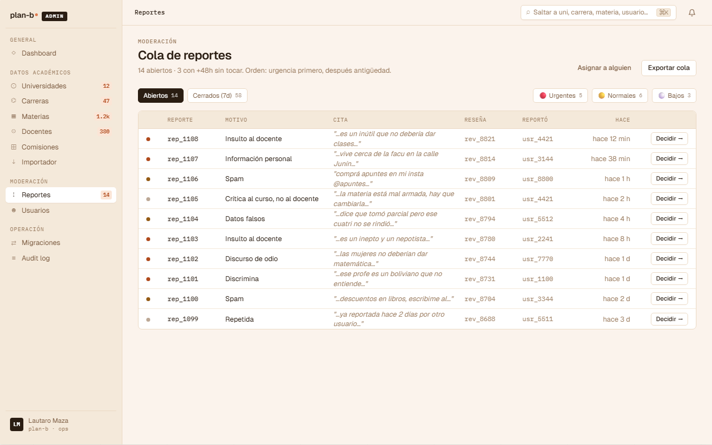

# US-050: Cola de reportes (read model + vista del moderator)

**Status**: Backlog
**Sprint**:
**Epic**: [EPIC-07: Moderación](../epics/EPIC-07.md)
**Priority**: High
**Effort**: M
**UC**: [UC-050](../use-cases/UC-050.md)
**ADR refs**: [ADR-0009](../../decisions/0009-anonimato-como-regla-de-presentacion.md), [ADR-0041](../../decisions/0041-rediseño-ux-post-claude-design.md)

## Como moderator, quiero ver la cola de reportes abiertos ordenada por urgencia, con motivo + cita + autor del reporte + antigüedad, para procesar uno por uno los casos más urgentes primero

El canvas v2 (`canvas-mocks/admin-screens-3.jsx::AdmReportesCola`) define la cola como **una fila por report individual** (no agrupado por review). Cada report es la unidad de decisión del moderator. Cuando el moderator decide sobre un report, US-051 cubre las opciones (incluido el cascade que cierra otros reports de la misma review si aplica).

## Acceptance Criteria

### Backend

- [ ] `GET /api/admin/reports/queue` retorna **reports** (no reviews) con `status = 'open'`, ordenados por `tone DESC` (urgent → normal → low) y luego `created_at ASC` (antigüedad).
- [ ] Cada item del listado:
  - `id` (mono, ej. `rep_1108`).
  - `createdAt` y `since` precomputado (`hace 12 min`, `hace 1 h`, etc.).
  - `reason` (motivo del report, copy human-readable: "Insulto al docente", "Información personal", "Spam", "Discurso de odio", "Discrimina", "Crítica al curso, no al docente", "Datos falsos", "Repetida"). Mapping desde el enum `review_report_reason`.
  - `snippet` (cita del fragmento reportado de la reseña, truncado).
  - `targetReviewId` (mono, ej. `rev_8821`).
  - `reporterUserId` (mono, ej. `usr_4421`).
  - `tone` (`'urgent' | 'normal' | 'low'`): clasificación automática del read model basada en `reason`:
    - `urgent`: `discurso_odio`, `discrimina`, `datos_personales`, `insulto_al_docente`.
    - `normal`: `spam`, `datos_falsos`, `difamacion`.
    - `low`: `repetida`, `off_topic`, `otro`, `critica_al_curso`.
- [ ] **Filtros opcionales** en query:
  - `?status=open|closed` (default `open`). `closed` agrega upheld + dismissed.
  - `?tone=urgent|normal|low` (filtra por urgencia).
  - `?assignedTo={userId}` (cuando aterrice asignación de reports; out de MVP, dejar el query param reservado).
  - `?olderThan={days}` (ej. `?olderThan=2` para detectar atrasados).
- [ ] **Paginación**: default 20, máximo 100.
- [ ] **Identidad del autor de la reseña visible al moderator** (no anonimizado al staff). ADR-0009.
- [ ] **Identidad del reporter visible al moderator** (para detectar abuse patterns: mismo reporter denunciando masivamente).
- [ ] Header del read model (separado del listing) con counts globales para los filter chips:
  - `openCount`, `closedLast7d`, `urgentCount`, `normalCount`, `lowCount`.
  - Endpoint puede devolverlo en el mismo response (top-level: `{ counts, items, pagination }`).
- [ ] Requiere `role IN ('moderator', 'admin')`.

### Frontend

- [ ] Ruta `/admin/moderacion/reportes` en route group `(staff)`.
- [ ] **Page header** (port de `AdmReportesCola`):
  - Eyebrow "Moderación" + título "Cola de reportes".
  - Subtitle dinámico: "{openCount} abiertos · {staleCount} con +48h sin tocar. Orden: urgencia primero, después antigüedad." (`staleCount` = reports con `since > 48h`).
  - Actions: `Asignar a alguien` (ghost, disabled hasta que aterrice asignación) + `Exportar cola` (CSV download del listing actual con filtros aplicados).
- [ ] **Filter chips** (port de `AdmFilterChip`):
  - `Abiertos {openCount}` (default activo).
  - `Cerrados (7d) {closedLast7d}` (toggle a la vista cerrados).
  - Spacer.
  - `🔴 Urgentes {urgentCount}` (filtra tone=urgent).
  - `🟡 Normales {normalCount}`.
  - `⚪ Bajos {lowCount}`.
- [ ] **Tabla** (port de `AdmTable`):
  - Columnas: `tone dot (24px)` / `id (90px mono)` / `Motivo (180px)` / `Cita (2fr italic, muted)` / `Reseña (90px mono muted)` / `Reportó (90px mono muted)` / `Hace (90px right muted)` / `Decidir → (90px right button)`.
  - Dot de tone: `#b04a1c` urgent, `#945a14` normal, `var(--ink-4)` low.
  - Row hover background `var(--adm-bg-elev)`.
  - CTA `Decidir →` (botón `adm-btn sm`) navega a `/admin/moderacion/reportes/{reportId}` → US-051.
- [ ] **Vacío**: si `items.length === 0` y `openCount === 0`, mostrar "Sin reportes abiertos. Andá a tomar mate." (empty state celebratorio).

## Out of scope

- **Decisión sobre el report**: cubierto por [US-051](US-051.md) (detalle + 5 opciones de decisión + strike system + pedir edición al autor).
- **Asignación de reports a un moderator específico**: el CTA "Asignar a alguien" del header se renderea como placeholder; la implementación de `ReportAssignment` aggregate + `?assignedTo=` filter es **US separada** (sugerir US-086 si lo querés crear). En MVP el read model devuelve toda la cola sin asignación.
- **Cola de reviews under_review** (vista agrupada por review): out. El canvas reemplaza el modelo "una decisión por review" por "una decisión por report"; el cascade-on-uphold de US-051 se sigue aplicando cuando la decisión es "ocultar la review" pero la cola siempre es de reports.
- **Real-time push**: la cola se actualiza en cada navegación o refresh manual. Sin WebSocket en MVP.
- **i18n**: español rioplatense hardcoded.
- **Mobile diseñado**: vista admin es desktop-first. Mobile renderea como degraded UX.

## Edge cases

| Caso | Comportamiento esperado |
|---|---|
| 0 reports abiertos | Empty state celebratorio. Filter chips muestran 0. |
| Report con review borrada (review.deletedAt != null) | Sigue apareciendo en cola; al abrir el detalle, advierte "Reseña borrada por el autor" y permite cerrar el report como `dismissed` con nota. |
| Reporter baneado | Report sigue apareciendo. El detalle marca al reporter como "baneado". |
| 2 reports del mismo user a la misma review | El UNIQUE de US-019 lo previene. Si el read model devuelve dups por race condition, deduplicar en el cliente. |
| Report con > 48h sin tocar | Aparece en `staleCount` del subtitle. Visual de la row no cambia (la urgencia ya está en `tone`). |
| Moderator sin permisos cross-uni (futuro) | Por ahora todos los moderators ven todo. Cuando aterrice scoping por uni (post-MVP), agregar `?university=` filter. |
| Network error | Toast rojo + button "Reintentar". Cache de TanStack Query mantiene el último listado válido. |

## Test scenarios

### Críticos (Given-When-Then)

1. **Given** moderator con 14 reports abiertos seedeados (5 urgent / 6 normal / 3 low), **when** entra a `/admin/moderacion/reportes`, **then** ve filter chips con los counts correctos + tabla con 14 rows ordenadas (urgent → normal → low → dentro de cada grupo, ASC por antigüedad).
2. **Given** click en filter chip `🔴 Urgentes`, **when** se actualiza la cola, **then** solo se muestran los 5 reports urgent.
3. **Given** click en `Decidir →` de un report, **when** navega, **then** abre `/admin/moderacion/reportes/{reportId}` (US-051 detalle).
4. **Given** moderator sin reports abiertos, **when** entra a la cola, **then** ve empty state celebratorio.
5. **Given** un member intenta acceder a `/admin/moderacion/reportes`, **when** el guard `(staff)` chequea, **then** redirige a `/home` con error.
6. **Given** report `rep_1108` con tone `urgent`, **when** se renderea la row, **then** el dot es `#b04a1c`.

### Cobertura por capa

- **Unit / vitest**: `tone-from-reason.test.ts` (mapping reason → tone), `time-since.test.ts` (formatter "hace 12 min").
- **Integration backend**: read model devuelve sort correcto, counts correctos, filters funcionan, anonimato del autor preservado en presentation pero identidades visibles al staff.
- **Component / vitest + RTL**: `reports-queue-table.test.tsx`, `tone-dot.test.tsx`, `filter-chips.test.tsx`.
- **E2E Playwright**: spec `admin-reports-queue.spec.ts` con un moderator seedeado + reports mock.

## Sub-tasks

### Backend

- [ ] Read model Dapper cross-schema (Moderation reports JOIN Reviews para snippet/target + Identity users para reporter). OK por ADR-0017 (read no requiere FK).
- [ ] `IReportToneClassifier` domain service que mapea `reason` → `tone` (config-driven, no hardcoded en el handler).
- [ ] Endpoint Carter `GET /api/admin/reports/queue` con paginación + filtros.
- [ ] Devolver `counts` en el response top-level.
- [ ] Authorization policy `moderator|admin`.
- [ ] Tests integration: sort por tone + antigüedad, filters, paginación, counts, identidad reporter+autor visible al staff.

### Frontend

- [ ] `app/(staff)/admin/moderacion/reportes/page.tsx` (server component con prefetch).
- [ ] `features/admin-reports-queue/{api.ts,components/{reports-table,tone-dot,filter-chips,page-header}.tsx,types.ts}`.
- [ ] Reusar `<AdmShell>` + `<AdmTable>` + `<AdmFilters>` de `components/layout/admin-*` (cuando aterricen con US-081).
- [ ] Tests vitest + spec E2E.

## Notas de implementación

- **Modelo unidad = report, no review**: cambio respecto al AC anterior. Razón: el moderator decide por report (puede haber 3 reports sobre la misma review con motivos distintos y cada uno requiere análisis propio). El cascade-on-uphold de US-051 cubre el caso donde la decisión sobre un report ("ocultar la review") implícitamente cierra los otros reports abiertos de esa review.
- **Tone classifier es config-driven**: el mapping `reason → tone` vive en un archivo de config (`moderation-tone.config.json`) editable por admin sin redeploy. Evita decisiones hardcodeadas en código.
- **Identidad visible al staff**: el read model devuelve `reporterUserId` y el autor de la review en claro. El anonimato es solo en presentation pública (ADR-0009). El staff necesita ver para detectar abuse patterns.
- **`since` precomputado en backend**: evita inconsistencias entre clientes con clocks distintos.
- **Counts en el response**: una sola roundtrip para tabla + filter chips. Evita N+1 queries del cliente.
- **`Asignar a alguien` como placeholder**: el botón se renderea pero queda disabled con tooltip "Próximamente". Cuando aterrice US-086 (asignación), se habilita.

## Dependencies

- **Depende de**: [US-019](US-019.md) (reportar reseña, alimenta la cola), [US-067](US-067.md) (cuentas staff para login del moderator), [US-081](US-081.md) (admin shell + componentes `AdmTable` / `AdmFilters`).
- **Bloquea a**: [US-051](US-051.md) (detalle del report, depende de tener la cola para llegar al detalle).
- **Relacionada con**: [US-053](US-053.md) (audit log de decisiones), [US-068](US-068.md) (disable user desde el detalle del reporter).

## Refs

- DoD: [Definition of Done](../definition-of-done.md)
- Use Case: [UC-050](../use-cases/UC-050.md)
- Mockup admin canvas (sección ③):
  - 
  - Fuente JSX en `canvas-mocks/admin-screens-3.jsx::AdmReportesCola`.
- ADRs: [ADR-0009](../../decisions/0009-anonimato-como-regla-de-presentacion.md), [ADR-0041](../../decisions/0041-rediseño-ux-post-claude-design.md).
- US relacionadas: [US-019](US-019.md), [US-051](US-051.md), [US-053](US-053.md), [US-068](US-068.md), [US-081](US-081.md).
