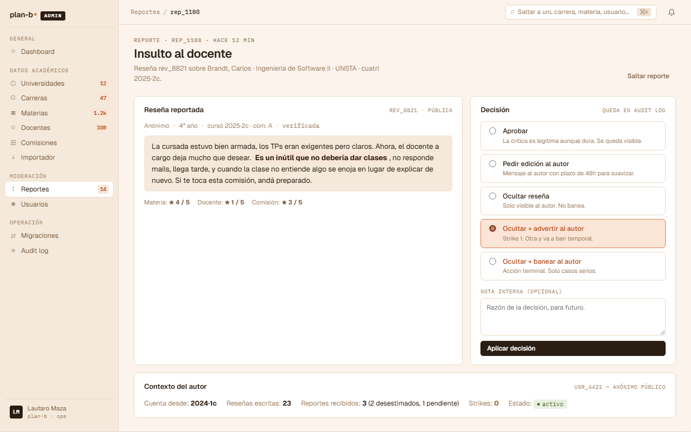

# US-051: Resolver report (decisión del moderator · uphold / dismiss + detalle)

**Status**: Backlog
**Sprint**:
**Epic**: [EPIC-07: Moderación](../epics/EPIC-07.md)
**Priority**: High
**Effort**: M
**UC**: [UC-051](../use-cases/UC-051.md)
**ADR refs**: [ADR-0011](../../decisions/0011-cascade-on-uphold-sin-reversion-on-restore.md), [ADR-0041](../../decisions/0041-rediseño-ux-post-claude-design.md)
**Extended by**: [US-085](US-085.md) (strike system + pedir edición al autor + ban desde el detalle)

## Como moderator, quiero ver el detalle de un report y resolverlo como upheld o dismissed para limpiar la cola

Como moderator, quiero la pantalla de detalle (`/admin/moderacion/reportes/{reportId}`) con la reseña reportada, contexto del autor, y un panel de decisión con dos opciones live (`Aprobar` y `Ocultar reseña`). El uphold cascadea a otros reports `open` de la misma review (ADR-0011) y la deja `removed`. El dismiss puede volver la review a `published` si era el único `open`.

Las otras 3 acciones del panel de decisión (`Pedir edición al autor`, `Ocultar + advertir al autor` con strike, `Ocultar + banear al autor`) se renderean como **placeholders disabled** con tooltip "Próximamente". Aterrizan en [US-085](US-085.md) una vez que el strike system + workflow de edición esté modelado. Esta US no las implementa.

## Acceptance Criteria

### Backend

- [ ] `GET /api/admin/reports/{id}` retorna detalle completo del report:
  - Report: `id`, `reason`, `snippet`, `createdAt`, `since`, `status`, `tone`, `resolutionNote?`, `resolvedAt?`, `moderatorId?`.
  - Review reportada: `id`, `body`, `ratings` (subject/teacher/commission), `authorAnonHandle` ("Anónimo"), `targetTeacher`, `targetSubject`, `targetTerm`, `targetCommission`, `verified`, `status`.
  - Reporter: `id`, `disabled?` (boolean).
  - Author context (stats agregadas del autor de la review): `accountSince`, `reviewsWritten`, `reportsReceived` (con breakdown por status), `strikes`, `status` (`active|warn|banned`).
  - Otros reports `open` sobre la misma review (para que el moderator vea el cascade que se va a aplicar): listado de `{id, reason, since}`.
- [ ] `POST /api/admin/reports/{id}/uphold` con `{ resolutionNote }`:
  - Setea report `status = 'upheld'`, `moderator_id = actor.id`, `resolution_note`, `resolved_at = now()`.
  - Cascade: cualquier otro report `open` sobre la misma Review pasa a `upheld` con la misma `resolution_note` (ADR-0011). Audit entry separado por cada report cerrado por cascade con `action = 'cascade_upheld'`.
  - Review pasa a `status = 'removed'`.
  - Audit log entry sobre la review con `action = 'removed'` + entry sobre cada report con `action = 'upheld'`.
  - Emite `ReviewRemoved` integration event vía Wolverine outbox.
- [ ] `POST /api/admin/reports/{id}/dismiss` con `{ resolutionNote }`:
  - Setea report `status = 'dismissed'`, `moderator_id`, `resolution_note`, `resolved_at`.
  - Si era el único report `open` y la review estaba `under_review` solo por threshold (no por filter), vuelve a `published`. Emite `ReviewRestored`.
  - Si quedan otros reports `open`, la review se mantiene `under_review`. El dismiss solo cierra el report individual.
- [ ] Distinción `filter` vs `threshold` (`review_audit_log.transition_reason`): controla approve. Vuelve a published solo si la transición fue `threshold`. Si fue `filter`, queda en `under_review` hasta moderation explícita.
- [ ] Longitud máxima `resolutionNote`: 1000 chars. Mínimo 0 (puede ser vacío).
- [ ] Requiere `role IN ('moderator', 'admin')`.
- [ ] Idempotente: uphold/dismiss sobre report ya resuelto retorna 409 `moderation.report.already_resolved` con el outcome anterior.

### Frontend

- [ ] Ruta `/admin/moderacion/reportes/{reportId}` en route group `(staff)`.
- [ ] **Page header** (port de `AdmReporteDetalle`):
  - Eyebrow `Reporte · {report.id} · hace {since}`.
  - Título: `{report.reason}` (motivo human-readable).
  - Subtitle: `Reseña {review.id} sobre {teacher.fullName} · {subject.name} · {university.code} · cuatri {term.label}.`
  - Action: `Saltar reporte` (ghost, sin acción persistente en MVP, solo navega al siguiente report `open` de la cola).
- [ ] **Layout dos columnas** (`1.6fr 1fr`, gap 14px):
  - **Columna izquierda: card "Reseña reportada"**:
    - Header con `<h3>Reseña reportada</h3>` + `<small>{review.id} · {review.status}</small>`.
    - Metadata del autor: `Anónimo · {yearInPlan}° año · cursó {term} · com. {commission} · verificada` (todo `var(--ink-3)` 11.5px).
    - Cuerpo de la reseña con el fragmento reportado highlighted (`<b>` con background `#fbe5d6` padding `1px 4px`). El backend devuelve el body completo + offsets del snippet reportado.
    - Footer con ratings: `Materia: ★ {N} / 5 · Docente: ★ {N} / 5 · Comisión: ★ {N} / 5`.
  - **Columna derecha: card "Decisión"**:
    - Header `<h3>Decisión</h3><small>queda en audit log</small>`.
    - 5 opciones renderizadas como `<label>` con `<input type="radio" name="decision">`:
      1. **Aprobar** (live, ✅ implementada en esta US): "La crítica es legítima aunque dura. Se queda visible." → invoca `POST /reports/{id}/dismiss`.
      2. **Pedir edición al autor** (placeholder disabled, US-085): "Mensaje al autor con plazo de 48h para suavizar." Tooltip "Próximamente · US-085".
      3. **Ocultar reseña** (live, ✅ implementada en esta US): "Solo visible al autor. No banea." → invoca `POST /reports/{id}/uphold`.
      4. **Ocultar + advertir al autor** (placeholder disabled, US-085, tone `danger`): "Strike 1. Otra y va a ban temporal." Tooltip "Próximamente · US-085".
      5. **Ocultar + banear al autor** (placeholder disabled, US-085, tone `danger`): "Acción terminal. Solo casos serios." Tooltip "Próximamente · US-085".
    - Textarea "Nota interna (opcional)" para `resolutionNote` (rows=3, placeholder "Razón de la decisión, para futuro.", maxLength 1000).
    - Botón primary `Aplicar decisión` (width 100%). Disabled si no hay radio seleccionado o si el radio seleccionado es un placeholder.
- [ ] **Card "Contexto del autor"** (full width, debajo del grid):
  - Header `<h3>Contexto del autor</h3><small>{user.id} · Anónimo público</small>`.
  - Fila horizontal con: `Cuenta desde · Reseñas escritas · Reportes recibidos (con breakdown) · Strikes · Estado` (pill).
  - Si el autor tiene strikes > 0, el número se renderea en `#945a14`. Si está `banned`, pill rojo.
- [ ] **Banner especial: review borrada por el autor**: si `review.deletedAt != null`, agregar banner amarillo arriba del card de la reseña: "Reseña borrada por el autor. Igual podés desestimar el report con nota." El uphold queda disabled, solo dismiss disponible.
- [ ] **Confirmación antes de aplicar**: modal con resumen ("Vas a {aprobar|ocultar} esta reseña. {Esto cerrará {N} reports adicionales por cascade.} La decisión queda en el audit log.") + botones `Cancelar` / `Aplicar`. Solo cuando hay confirmación explícita el POST se dispara.

## Out of scope

- **Pedir edición al autor** (workflow de "suavizar reseña con plazo 48h"): US-085.
- **Strike system** (acumulación de strikes hasta ban temporal automático): US-085.
- **Ban manual con motivo y plazo desde el detalle del report**: US-085. La US existente [US-068](US-068.md) cubre el endpoint backend del disable, pero el "Ocultar + banear" del panel de decisión integra el workflow de moderación con el ban en un solo paso, que es lo que aterriza en US-085.
- **Saltar reporte con persistencia** (acumular reports "saltados" del moderator para no verlos de nuevo): out de MVP. El botón hoy solo navega.
- **Restaurar reseña previamente removed**: cubierto por [US-052](US-052.md) (separate flow desde la cola de removed).
- **Cascade-on-restore**: ADR-0011 lo prohíbe explícitamente. Los reports cascadeados quedan upheld históricamente.

## Edge cases

| Caso | Comportamiento esperado |
|---|---|
| Review borrada por el autor | Banner amarillo. Solo dismiss disponible. Uphold disabled (no tiene sentido ocultar lo que ya está oculto). |
| Reporter baneado | Visible en el contexto del autor (no, en el header del report). Detalle marca al reporter como "baneado" arriba del card de la reseña. La decisión sigue siendo independiente. |
| Report ya resuelto (otro moderator ganó la race) | Al intentar aplicar decisión, backend retorna 409. Frontend muestra toast "Este reporte ya lo resolvió otro moderator" + redirige a la cola. |
| Uphold sobre review con 0 otros reports open | No hay cascade. Solo se aplica al report actual + review pasa a removed. |
| Uphold sobre review con 3 reports open | Cascade cierra los 3 con misma resolution_note. Audit log tiene 4 entries (1 upheld + 3 cascade_upheld) + 1 sobre la review (removed). |
| Dismiss sobre report único de review under_review por filter | Review NO vuelve a published. Queda en under_review. Toast: "Reporte desestimado. La reseña sigue under_review por el filtro automático." |
| Click en un placeholder disabled | Tooltip "Próximamente · US-085". El radio no se selecciona. Botón "Aplicar decisión" sigue disabled. |
| `resolutionNote` vacío | Permitido (mínimo 0 chars). Confirmación del modal igual aplica. |
| Network error al aplicar | Toast rojo + permanece en el detalle con el radio seleccionado. Permite reintentar. |
| Moderator sin permisos | Guard `(staff)` ya redirige antes de llegar al detalle. Si llega via deeplink, 403 + redirect a /home. |

## Test scenarios

### Críticos (Given-When-Then)

1. **Given** moderator en `/admin/moderacion/reportes/rep_1108`, **when** entra al detalle, **then** ve la reseña reportada con el fragmento highlighted, el panel de decisión con 5 radios (2 live, 3 disabled), y el contexto del autor.
2. **Given** moderator selecciona "Aprobar" + nota "Crítica legítima" + click "Aplicar decisión", **when** confirma en el modal, **then** POST a `/reports/rep_1108/dismiss`, report queda `dismissed`, navega de vuelta a la cola.
3. **Given** moderator selecciona "Ocultar reseña" con 2 otros reports open sobre la misma review, **when** confirma, **then** POST a `/reports/rep_1108/uphold`, los 3 reports quedan `upheld`, review queda `removed`, audit log con 4 entries (1 upheld + 2 cascade_upheld + 1 removed sobre la review).
4. **Given** moderator intenta click en "Pedir edición al autor" (placeholder), **when** click, **then** radio no se selecciona, tooltip "Próximamente · US-085" aparece.
5. **Given** moderator aplica uphold pero otro moderator ya resolvió el report 200ms antes, **when** backend retorna 409, **then** frontend toast "Ya resuelto" + redirect a cola.
6. **Given** dismiss único sobre review under_review por threshold, **when** se aplica, **then** review vuelve a `published` y se emite `ReviewRestored`.
7. **Given** dismiss único sobre review under_review por filter, **when** se aplica, **then** review queda `under_review` y NO se emite `ReviewRestored`.

### Cobertura por capa

- **Unit / vitest**: `decision-radio.test.tsx` (selección + disabled states), `apply-decision-modal.test.tsx` (confirmación + cascade message).
- **Integration backend**: cascade on uphold con N reports, dismiss único con threshold vs filter, idempotencia 409, audit log entries correctos.
- **Component / vitest + RTL**: `report-detail-page.test.tsx`, `author-context-card.test.tsx`.
- **E2E Playwright**: spec `admin-report-detail.spec.ts` con flujo dismiss + flujo uphold con cascade.

## Sub-tasks

### Backend

- [ ] Read model Dapper cross-schema para el detalle (Moderation reports + Reviews + Identity users + Academic teachers/subjects/terms).
- [ ] Comando `UpholdReportCommand` + handler con cascade.
- [ ] Comando `DismissReportCommand` + handler con check filter vs threshold.
- [ ] Endpoints Carter (`GET /reports/{id}`, `POST /reports/{id}/uphold`, `POST /reports/{id}/dismiss`).
- [ ] Audit log entries per-BC (ADR-0042): `ReviewAuditLog` (acción sobre la review), `ModerationActionLog` (acción del moderator sobre el report).
- [ ] Cross-BC events vía Wolverine outbox (ADR-0030): `ReviewRemoved`, `ReviewRestored`.
- [ ] Authorization policy `moderator|admin`.
- [ ] Tests integration: cascade, dismiss único filter vs threshold, idempotencia, author context agregado correcto.

### Frontend

- [ ] `app/(staff)/admin/moderacion/reportes/[reportId]/page.tsx` (server component con prefetch).
- [ ] `features/admin-report-detail/{api.ts,components/{review-card,decision-panel,author-context-card,apply-decision-modal,page-header}.tsx,types.ts}`.
- [ ] Mapping radio → endpoint (Aprobar→dismiss, Ocultar reseña→uphold, otros→disabled).
- [ ] Reusar `<AdmShell>` + `<AdmCard>` de `components/layout/admin-*` (US-081).
- [ ] Tests vitest + spec E2E.

## Notas de implementación

- **Por qué 2 live + 3 placeholders ahora**: el canvas v2 introduce strike system + workflow "pedir edición". Modelarlos bien requiere User.strikes counter + EditRequest aggregate + cron jobs de plazo de 48h. Esa complejidad merece su propia US (US-085). Mantener los placeholders en la UI desde el inicio evita que el moderator se acostumbre a una decisión binaria y después haya que rediseñar la pantalla.
- **Cascade on uphold**: ADR-0011. Si la review queda removed, no tiene sentido seguir teniendo reports `open` sobre ella. La cascade marca todos como upheld con la misma nota para consistencia.
- **Dismiss no revierte cascade**: ADR-0011 (no reversion on restore). Si un report fue upheld por cascade y después la review se restaura (US-052), los reports cascadeados quedan upheld históricamente.
- **Vuelve a published solo si under_review fue por threshold**: si la review está `under_review` por filter automático (US-017), un dismiss único no la libera; el moderator decide manualmente con un comando explícito.
- **Audit log per-BC**: ADR-0042. Cada BC owns su projection. La vista cross-BC del audit (US-086, US-087) se arma con Dapper UNION ALL.
- **Identidad del autor en el detalle**: visible al staff (ADR-0009). El anonimato es solo en presentation pública.
- **Saltar reporte sin persistencia**: en MVP el botón "Saltar reporte" navega al siguiente report `open` sin guardar nada. Si en algún momento aparece la necesidad de "no mostrarme estos reports de nuevo", crear US separada.

## Dependencies

- **Depende de**: [US-050](US-050.md) (cola, llega al detalle vía el CTA "Decidir →"), [US-019](US-019.md) (reportar reseña alimenta el dato), [US-081](US-081.md) (admin shell + componentes).
- **Bloquea a**: [US-052](US-052.md) (restaurar review removed depende de tener el flujo de uphold operativo).
- **Extendida por**: [US-085](US-085.md) (strike system + pedir edición + ban desde el detalle).
- **Relacionada con**: [US-053](US-053.md) (audit log de la decisión), [US-068](US-068.md) (disable user es el endpoint backend que US-085 va a usar para el "Ocultar + banear"), [US-086](US-086.md) (audit log per-user lee de ModerationActionLog).

## Refs

- DoD: [Definition of Done](../definition-of-done.md)
- Use Case: [UC-051](../use-cases/UC-051.md)
- Mockup admin canvas (sección ③):
  - 
  - Fuente JSX en `canvas-mocks/admin-screens-3.jsx::AdmReporteDetalle`.
- ADRs: [ADR-0011](../../decisions/0011-cascade-on-uphold-sin-reversion-on-restore.md), [ADR-0041](../../decisions/0041-rediseño-ux-post-claude-design.md), [ADR-0042](../../decisions/0042-audit-log-per-bc-no-central.md).
- US relacionadas: [US-019](US-019.md), [US-050](US-050.md), [US-052](US-052.md), [US-053](US-053.md), [US-068](US-068.md), [US-085](US-085.md), [US-086](US-086.md).
