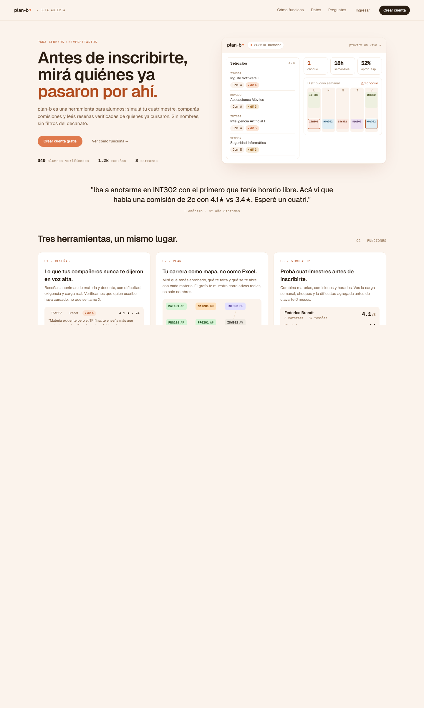

# US-054-f: Landing pública en `/` (reemplaza el redirect a /home)

**Status**: Backlog
**Sprint**: candidato a S4
**Epic**: [EPIC-01: Catálogo público y exploración](../epics/EPIC-01.md)
**Priority**: Medium
**Effort**: M
**ADR refs**: [ADR-0019](../../decisions/0019-single-nextjs-app-con-route-groups.md), [ADR-0041](../../decisions/0041-rediseño-ux-post-claude-design.md)

## Como visitante (no logueado), quiero llegar a `plan-b.com.ar` y entender en 5 segundos qué hace el producto, ver prueba social y poder crear cuenta o ingresar sin scroll inútil

Hoy `app/(public)/page.tsx` solo hace `redirect('/home')`. La sesión de claude-design del 2026-05-02 cerró la landing en `canvas-mocks/landing.jsx::Landing`: un long-form de marketing con hero + simulador embebido + prueba social + 3 features + sección "cómo verificamos" + FAQ + CTA final + footer. Esta US la convierte en página real.

## Acceptance Criteria

- [ ] `app/(public)/page.tsx` reescrito con la estructura del mock `Landing`. Borrar el `redirect('/home')`.
- [ ] **Topbar** sticky con `LpLogo` + eyebrow "· beta abierta · UNSTA" + nav (`Cómo funciona`, `Datos`, `Preguntas`) + 2 CTAs (`Ingresar` ghost, `Crear cuenta` primary).
- [ ] **Hero** grid `1fr auto`, gap 40, `max-width 1280px`:
  - Eyebrow mono "Para alumnos de UNSTA".
  - H1 display 56px en 3 líneas, palabra final con `var(--color-accent-ink)`.
  - Lead 16px con `var(--color-ink-2)`, max-width 52ch.
  - 2 CTAs: "Crear cuenta gratis" (accent) + "Ver cómo funciona →" (ghost).
  - Stats row mono: 340 alumnos verificados / 1.2k reseñas / 3 carreras.
  - Aside derecho: `<MiniSim/>` (mock visual del simulador, no funcional).
- [ ] **Quote anónima** centrada, max-width 920, font-weight 500, 24px.
- [ ] **Sección "Tres herramientas"** (`#features`): grid 3 columnas con 3 `LpFeature` (Reseñas, Plan, Simulador), cada una con código (`01 · Reseñas`), título, body y demo embebido (`DemoReview`, `DemoGraph`, `DemoProf`).
- [ ] **Sección "Cómo verificamos"** (`#data`): grid `1fr 1fr`, fondo `var(--color-bg-elev)`. Lado izq: heading + párrafo. Lado der: card con 3 pasos numerados.
- [ ] **FAQ corto** (`#faq`): 4 preguntas como `
`/`
` con `border-top` separator.
- [ ] **CTA final**: banda oscura (`var(--color-ink)` background) con heading + CTA "Crear cuenta con email UNSTA".
- [ ] **Footer**: una línea mono con `plan-b · 2026 · proyecto independiente` + `no afiliado oficialmente con UNSTA`.
- [ ] **CTAs Ingresar / Crear cuenta** linkean a `/sign-in` y `/sign-up`. Anchors internos (`#features`, `#data`, `#faq`) con scroll suave.
- [ ] **Si user logueado entra a `/`**: la página renderea igual (no redirect). En la topbar, los CTAs cambian de `Ingresar / Crear cuenta` a un único `Ir a mi inicio →` que apunta a `/home`. Decisión: respeta SEO y permite re-entrada para alumnos logueados.
- [ ] **`MiniSim`** y `DemoReview`/`DemoGraph`/`DemoProf` son componentes visuales puros (no fetch ni interacción real). Vivem en `features/landing/components/` con tipos estables.

## Out of scope

- **Datos reales**: stats hero (340 / 1.2k / 3) son hardcoded. Cuando aterrice telemetry real (post-MVP), se enchufan a un endpoint público.
- **`MiniSim` interactivo**: el mock muestra un mini grid de comisiones; en esta US se renderea como visual estático. La versión interactiva (drag para combinar comisiones) entra con US futura del simulador público.
- **Catálogo público de materias / docentes**: la landing no es el catálogo. El catálogo browseable sin auth es US separada (US-001 / US futura).
- **i18n**: copy en español rioplatense hardcoded.
- **A/B testing del hero**: out.
- **Analytics events**: out (cuando aterrice, se agrega como US-cross).
- **OG / metadata SEO completa**: el `<head>` mínimo entra acá; la optimización SEO (sitemap, robots.txt, structured data) es US separada.

## Edge cases

| Caso | Comportamiento esperado |
|---|---|
| Visitante anónimo entra a `/` | Renderea landing completa con CTAs `Ingresar` / `Crear cuenta`. |
| Member logueado entra a `/` | Renderea misma landing. Topbar cambia a `Ir a mi inicio →`. No se redirige automáticamente. |
| Click en `#features` desde la nav | Scroll suave al section. URL queda como `/#features`. |
| Click en "Crear cuenta gratis" del hero | Navega a `/sign-up`. |
| Click en "Crear cuenta con email UNSTA" del CTA final | Navega a `/sign-up`. |
| Visitante con JS deshabilitado | Landing renderea (es server component, SSR). Anchors funcionan vía nativos. |
| Viewport < 1024px | Hero pasa a stack (texto arriba, MiniSim abajo). Grid de features pasa a 1 columna. |
| Viewport < 640px | Topbar colapsa a hamburger (out of scope para MVP, se acepta degradación). |
| User logueado sin StudentProfile entra a `/` | Igual: ve la landing. El guard de `(member)` no aplica acá; si hace click en `Ir a mi inicio →`, el guard de `/home` lo redirigirá a `/onboarding/welcome`. |

## Test scenarios

### Críticos (Given-When-Then)

1. **Given** visitante anónimo, **when** entra a `/`, **then** ve hero con H1 + topbar con `Ingresar` / `Crear cuenta` y NO se redirige a `/home`.
2. **Given** Lucía logueada, **when** entra a `/`, **then** ve la landing completa, pero la topbar muestra `Ir a mi inicio →` en lugar de los CTAs anónimos.
3. **Given** visitante en `/`, **when** clickea "Crear cuenta gratis", **then** navega a `/sign-up`.
4. **Given** visitante en `/`, **when** clickea "Cómo funciona" en la nav, **then** scroll suave al section `#features`.
5. **Given** visitante en viewport 1280px, **when** la página renderea, **then** el hero es 2-col (texto + MiniSim).
6. **Given** visitante en viewport 768px, **when** la página renderea, **then** el hero colapsa a 1-col.

### Cobertura por capa

- **Component / vitest + RTL**: `landing-page.test.tsx` con render del page completo + verificaciones de heading principal, presencia de los 3 features cards, presencia del CTA hero. Tests de `MiniSim`, `DemoReview`, `DemoGraph`, `DemoProf` como snapshot por componente.
- **E2E Playwright**: spec `landing.spec.ts` que cubre los 6 scenarios críticos: entrada anónima vs logueada, navegación a `/sign-up`, anchors internos.

## Sub-tasks

- [ ] Borrar `app/(public)/page.tsx` actual (el redirect) y reescribirlo con la estructura del mock `Landing`.
- [ ] Crear feature `features/landing/`:
  - `components/landing-hero.tsx` (hero section + MiniSim wrapper).
  - `components/mini-sim.tsx` (port del MiniSim del mock).
  - `components/lp-feature.tsx` (`LpFeature` reusable: code + title + body + demo).
  - `components/demo-review.tsx`, `demo-graph.tsx`, `demo-prof.tsx` (3 demos visuales puras).
  - `components/lp-topbar.tsx` (topbar adaptable según session).
  - `components/lp-faq.tsx`.
  - `components/lp-cta-final.tsx`.
  - `components/lp-footer.tsx`.
  - `lib/anchor-link.ts` (helper para scroll suave si hace falta).
- [ ] En `app/(public)/page.tsx`:
  - Server component: leer `getSession()` y pasar `isLoggedIn` a `<LpTopbar/>` para que renderee CTAs correctos.
  - Componer las secciones en orden.
- [ ] Tests vitest unit + component.
- [ ] Spec E2E `frontend/e2e/public/landing.spec.ts`.
- [ ] Verificar que `(public)/layout.tsx` no aplique guards inesperados.

## Notas de implementación

- **El hero usa `MiniSim` como visual estático**: en el canvas el `MiniSim` muestra un grid de comisiones con horarios y estado de cupo. En MVP se renderea con datos hardcoded; la lógica de drag-drop / combinar comisiones queda para una US del simulador público.
- **No redirige a logueados**: contraintuitivo pero deliberado. Razones: (1) SEO (la landing es la URL canónica del proyecto), (2) los alumnos logueados pueden compartir el link a la landing con un compañero sin perder su sesión, (3) evita el bug de "abro `/` y me tira a `/home` cuando estaba probando otra cosa". El topbar adaptativo (`Ir a mi inicio →`) cubre el caso "estoy logueado y quiero volver a mi app".
- **Quote anónima**: el copy del mock es ficticio. Cuando aterrice un programa de testimonios reales, se reemplaza por una rotación o una review verificada.
- **Tokens del mock vs `globals.css`**: el mock usa `var(--bg)`, `var(--ink)`, etc. La app usa `var(--color-bg)`, `var(--color-ink)`. Mapeo 1-a-1, solo cambia el prefijo `color-`.
- **Stats hero**: 340 / 1.2k / 3 son aspiracionales para la fase de presentación. Documentar en una constante con TODO de reemplazo por endpoint.

## Dependencies

- **Depende de**: ninguna previa (la ruta `/` ya existe como redirect, se reescribe).
- **Bloquea a**: ninguna directa, pero la versión interactiva del simulador público (US futura) consume `MiniSim` como base.
- **Relacionada con**: [US-010-f](US-010-f.md) y [US-028-f](US-028-f.md) (CTAs apuntan a sus rutas), [US-059-f](US-059-f.md) (rediseño de auth coherente con el lenguaje de la landing).

## Refs

- DoD: [Definition of Done](../definition-of-done.md)
- Mockup: . Fuente JSX en `canvas-mocks/landing.jsx::Landing` líneas 330-623.
- ADRs: [ADR-0019](../../decisions/0019-single-nextjs-app-con-route-groups.md), [ADR-0041](../../decisions/0041-rediseño-ux-post-claude-design.md).
- US relacionadas: [US-010-f](US-010-f.md), [US-028-f](US-028-f.md), [US-059-f](US-059-f.md), [US-001](US-001.md).
