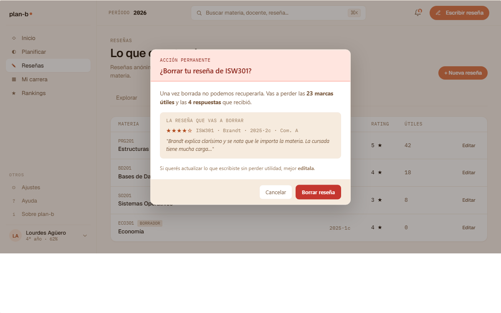

# US-055: Borrar reseña propia (action + modal destructivo)

**Status**: Backlog
**Sprint**: candidato a S5 (cuando aterrice editor de reseña US-049)
**Epic**: [EPIC-05: Sistema de reseñas](../epics/EPIC-05.md)
**Priority**: Medium
**Effort**: S
**ADR refs**: [ADR-0041](../../decisions/0041-rediseño-ux-post-claude-design.md)

## Como member que escribió una reseña, quiero poder borrarla con una confirmación clara que me muestre lo que pierdo (votos útiles, antigüedad), para retirar opiniones que ya no me representan sin hacerlo accidentalmente

US-018 cubre **editar** la propia reseña; falta el camino de **borrarla**. La sesión de claude-design del 2026-05-02 zanjó el modal destructivo (`v2-modals.jsx::V2ModalBorrarResena`) con preview de la reseña + recuento de marcas útiles que se pierden + checklist de consecuencias. Esta US cubre el endpoint backend + el modal + el flow completo.

## Acceptance Criteria

### Backend

- [ ] `DELETE /api/me/reviews/{reviewId}` con ownership check (autor === sesión actual).
- [ ] Si la review está en `under_review` o `published`: pasa a `deleted` (soft delete) con `deletedAt` + `deletedReason='self'`. Mantenemos el row para audit.
- [ ] Si la review estaba `published` y aparecía en feed/rankings/ranking embedding: re-projecta para que desaparezca de los reads.
- [ ] Emite `ReviewDeleted` via Wolverine outbox para invalidar caches y feeds.
- [ ] Idempotencia: segunda llamada con mismo `reviewId` devuelve 200 con el body de la review ya borrada.
- [ ] Audit log entry con `action='deleted'`, `actor=author`, `reason='self'`.

### Frontend

- [ ] CTA "Borrar" disponible en:
  - El menú contextual de cada reseña en `/reseñas?tab=mias`.
  - El header del editor de reseña (US-049) cuando está en modo edit.
- [ ] **Modal destructivo** (port literal de `v2-modals.jsx::V2ModalBorrarResena`):
  - Heading display "¿Borrar reseña?" + subtitle con código de materia + cuatri.
  - **Preview de la reseña** que se borra (card con rating + tags + primeros 100 chars del texto + autor anónimo).
  - **Checklist de consecuencias**:
    - "Pierde {N} marcas útiles."
    - "Vuelve a aparecer en tu lista de pendientes (US-048 tab pendientes)."
    - "Si querés cambiarla, mejor editala (link a US-018 con botón secundario)."
  - 2 CTAs: `Cancelar` (ghost) + `Borrar definitivamente` (warn / destructive button color).
  - El botón de borrar está disabled hasta que el user tipee la palabra "BORRAR" (o el nombre de la materia, decisión final en planning) en un input. Patrón anti-mistap usado en `delete-account-button` ya implementado en frontend.
- [ ] Después de borrar exitoso: toast "Reseña borrada" + redirect a `/reseñas?tab=mias` + invalidar query `['reviews', 'mine']`.
- [ ] Si el modal se cierra (Esc, click backdrop, Cancelar): no se pierde el typed-confirm; queda guardado por sesión por si reabren.

## Out of scope

- **Borrar reseña por moderator/admin**: cubierto por US-051 + US-052 (acciones de moderación).
- **Restaurar reseña borrada**: out de MVP. El soft delete permite restore via support si fuera necesario.
- **Notificación al docente respondedor**: si el docente respondió la reseña (US-040), su respuesta queda huérfana. La política está en ADR-0009; la implementación de cómo se muestra esa respuesta huérfana es de US-040, no de esta.
- **Historial de versiones**: no guardamos drafts ni versiones intermedias. Solo el estado actual y el flag `deleted`.
- **i18n**: copy en español rioplatense.

## Edge cases

| Caso | Comportamiento esperado |
|---|---|
| User borra una reseña que aparecía en rankings (US-070) | Re-projecta rankings para excluirla. Cambio se ve en próximo render del ranking. |
| User borra una reseña con respuesta del docente | Soft delete; respuesta queda huérfana (decisión cubierta por ADR-0009). |
| User intenta borrar reseña ajena (cambia el ID en la URL) | Backend devuelve 403 (ownership check). Frontend muestra "No es tu reseña". |
| User borra y luego quiere reescribir la misma cursada | OK: la cursada vuelve a aparecer en pendientes (US-048 tab e). Puede crear nueva review para esa enrollment. |
| User cierra el modal con `Esc` después de tipear "BORRAR" | Modal se cierra sin borrar. Si reabre el modal, el input vuelve a estar vacío (no persistir cross-session). |
| User borra la última reseña que tenía | Tab `Mis reseñas` (US-048) muestra empty state `v2-resenas-m-empty`. |
| Backend offline al confirmar | Toast error rojo + reseña queda visible. No optimistic update destructivo. |

## Test scenarios

### Críticos (Given-When-Then)

1. **Given** Lucía con 5 reseñas publicadas, **when** abre el menú de una y elige "Borrar", **then** ve modal con preview + checklist + input "BORRAR" requerido.
2. **Given** modal abierto sin tipear "BORRAR", **when** se inspecciona el botón "Borrar definitivamente", **then** está disabled.
3. **Given** Lucía tipea "BORRAR" + clickea "Borrar definitivamente", **when** el backend confirma, **then** toast "Reseña borrada" + lista de mías sin la reseña.
4. **Given** Lucía intenta borrar una reseña ajena vía API directa, **when** el backend procesa, **then** devuelve 403.
5. **Given** Lucía borra su última reseña, **when** vuelve al tab `Mis reseñas`, **then** ve empty state.

### Cobertura por capa

- **Unit / vitest**: `delete-review-action.test.ts` (validación del input + resultado del action).
- **Component / vitest + RTL**: `delete-review-modal.test.tsx` (preview render, input gating, click handlers).
- **Integration backend**: ownership check + soft delete + idempotencia + ReviewDeleted event.
- **E2E Playwright**: spec `delete-review.spec.ts` con Lucía: borrar reseña propia, asserta toast + lista sin la review.

## Sub-tasks

### Backend

- [ ] Comando `DeleteOwnReviewCommand` + handler en módulo Reviews.
- [ ] Endpoint Carter `DELETE /api/me/reviews/{reviewId}`.
- [ ] Soft delete (campo `DeletedAt` + `DeletedReason` en `Review` aggregate).
- [ ] Re-projector de feeds + rankings cuando llega `ReviewDeleted`.
- [ ] Tests integration.

### Frontend

- [ ] `features/delete-review/{actions.ts,api.ts,schema.ts,components/delete-review-modal.tsx,types.ts}`.
- [ ] Reusar el patrón `typed-confirm` del `delete-account-button` (ya existe).
- [ ] Trigger del modal desde `/reseñas?tab=mias` row + desde editor en mode edit.
- [ ] Tests vitest unit + component.
- [ ] Spec E2E.

## Notas de implementación

- **Soft delete vs hard delete**: ADR-0010 (no escrito todavía pero implícito) sugiere soft delete por default para audit trail. Hard delete via support si el user lo pide explícitamente para GDPR.
- **Patrón `typed-confirm`**: el frontend ya tiene `delete-account-button` con el patrón de input que matchea el email del user. Reusarlo. Decidir si la palabra de confirmación es "BORRAR" (genérico, fácil) o el código de la materia (más específico, valida que estás en la review correcta).
- **Modal vs página**: modal porque el user está en contexto (lista de mis reseñas o editor). No hay razón para mover de página.
- **Respuesta del docente huérfana**: es una decisión de presentation layer, no de borrado. Si el docente respondió y la review se borra, la respuesta queda en la DB pero NO se muestra al feed.

## Dependencies

- **Depende de**: [US-017](US-017.md) (publicar reseña, backend Done o pendiente), [US-048](US-048.md) (Reseñas shell con tab `mias`).
- **Bloquea a**: ninguna directa.
- **Relacionada con**: [US-018](US-018.md) (editar reseña, action hermana), [US-019](US-019.md) (reportar reseña), [US-020](US-020.md) (mis reports), [US-051](US-051.md) (borrado por moderator).

## Refs

- DoD: [Definition of Done](../definition-of-done.md)
- Mockup: . Fuente JSX en `canvas-mocks/v2-modals.jsx::V2ModalBorrarResena`.
- ADRs: [ADR-0041](../../decisions/0041-rediseño-ux-post-claude-design.md), [ADR-0009](../../decisions/0009-anonimato-como-regla-de-presentacion.md).
- US relacionadas: [US-018](US-018.md), [US-019](US-019.md), [US-048](US-048.md), [US-051](US-051.md).
