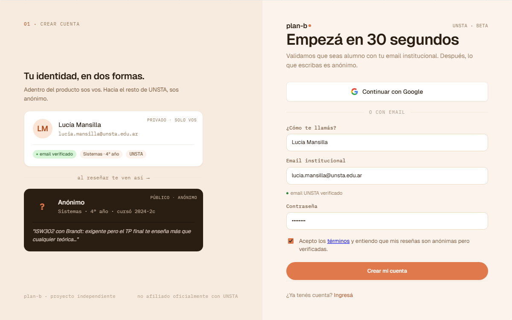
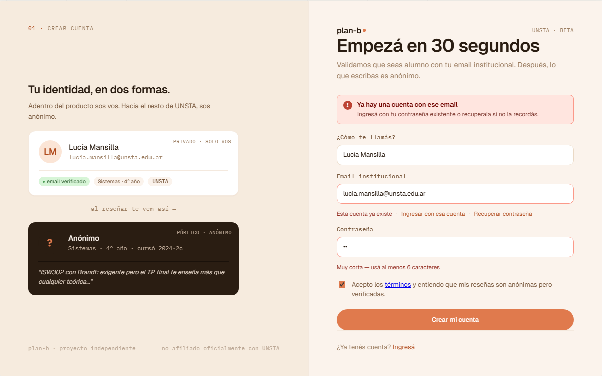
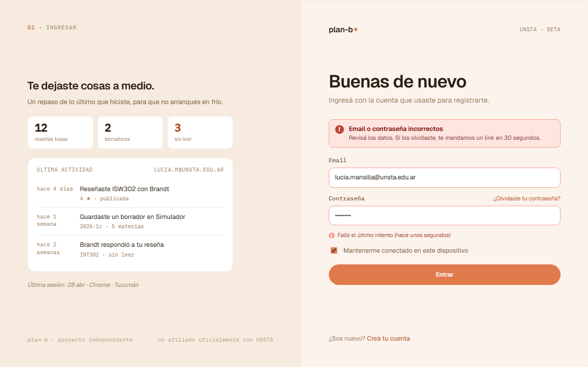
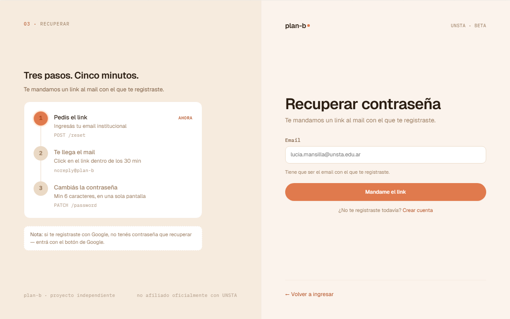
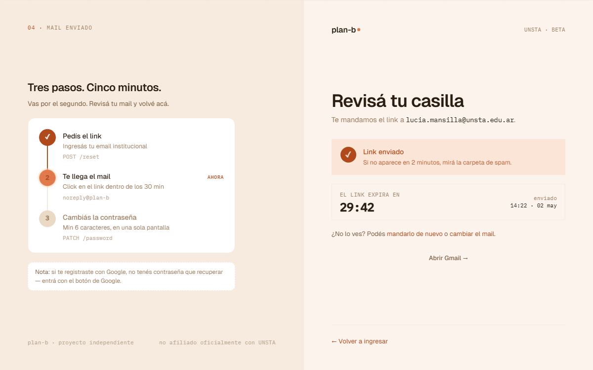

# US-059-f: Auth + Onboarding migración a AuthShell / OnbShell del canvas v2

**Status**: Backlog
**Sprint**: candidato a S3-S4
**Epic**: [EPIC-02: Identidad y autenticación](../epics/EPIC-02.md)
**Priority**: High
**Effort**: M (multi-vista, alto impacto visual)
**ADR refs**: [ADR-0023](../../decisions/0023-auth-flow-jwt-cookie-layout-guards.md), [ADR-0041](../../decisions/0041-rediseño-ux-post-claude-design.md)

> Esta US es de **rediseño puro**, sin cambios de comportamiento ni de backend. Cubre las 4 vistas auth (`sign-up`, `sign-in`, `forgot-password`, `forgot-password/check-inbox`) y las 4 vistas onboarding (`welcome`, `career`, `history`, `done`) que hoy viven en código (US-010-f / US-028-f / US-033-i / US-037-f, todas Done en S1) pero usan layouts previos al canvas v2 cerrado en la sesión de claude-design del 2026-05-02.

## Como member o visitante en el flow auth/onboarding, quiero ver shells coherentes con el lenguaje visual del producto (eyebrows numerados, paneles izquierdos contextuales, topbar de progreso real) para sentir que estoy en el mismo producto desde el primer click

Hoy las 4 vistas de auth comparten `<AuthSplit/>` con `<auth-hero/>` genérico (un quote + stats), y las 4 vistas de onboarding usan `<OnboardingShell/>` con cream radial glow + dot stepper. El canvas v2 introduce dos shells nuevos:

- **`AuthShell`** (`canvas-mocks/auth.jsx::AuthShell`): grid `1.05fr 1fr`. Panel izquierdo `bg-elev` con eyebrow numerado (`01 · ALTA DE CUENTA`, `02 · INGRESO`, `03 · RECUPERAR ACCESO`), un `leftPanel` contextual por vista (`CarnetPreview` / `LastActivityPanel` / `FlowSteps`), y footer mono "plan-b · proyecto independiente · no afiliado oficialmente con UNSTA". Panel derecho con header logo + eyebrow "UNSTA · beta", form centrado max-width 480, footer text con border-top.
- **`OnbShell`** (`canvas-mocks/onboarding.jsx::OnbShell`): topbar fija (`tb`) con logo + pill "Configuración inicial · paso N de 4" + barra progress lineal (220px height 3 con fill apricot) + link `Salir` mono. Card central blanca sobre fondo apricot, max-width 780. Footer fijo con CTAs "← Atrás" / "Continuar →".

## Acceptance Criteria

### Common (shells)

- [ ] Crear `components/layout/auth-shell.tsx` que reemplace `auth-split.tsx`. API:
  ```ts
  type AuthShellProps = {
    stepCode: string;        // e.g. "01"
    stepName: string;        // e.g. "ALTA DE CUENTA"
    leftPanel: ReactNode;    // panel contextual por vista
    title: string;           // h2 display 36px
    sub?: string;            // párrafo bajo el title
    children: ReactNode;     // el form
    foot: ReactNode;         // footer del panel der (CTA contraplano)
  };
  ```
- [ ] Crear `components/layout/onboarding-shell.tsx` (rebuild) que reemplace el actual:
  ```ts
  type OnbShellProps = {
    step: 1 | 2 | 3 | 4;
    total?: 4;
    children: ReactNode;
    footer?: ReactNode;      // botones de navegación
  };
  ```
- [ ] **Borrar** `components/layout/auth-split.tsx` + `auth-hero.tsx`. Mover/refactorizar lo que se reuse.
- [ ] **Tokens**: usar `var(--color-bg)`, `var(--color-bg-elev)`, `var(--color-bg-card)`, `var(--color-line)`, `var(--color-ink)`, `var(--color-ink-2)`, `var(--color-ink-3)`, `var(--color-ink-4)`, `var(--color-accent-ink)`, `var(--color-accent-soft)`, `var(--font-display)`, `var(--font-mono)`, `var(--font-ui)`. No hardcodear hex/oklch fuera de los tokens, salvo cuando el mock lo hace explícito (ej. el border accent del CarnetPreview).
- [ ] **Disclaimer "no afiliado a UNSTA"**: extraer constante `INDEPENDENT_PROJECT_DISCLAIMER` en `lib/copy.ts` y reusarla en footer del AuthShell + landing + about. Single source of truth.

### Sign-up (US-010-f rediseño)

- [ ] `app/(auth)/sign-up/page.tsx` consume `<AuthShell stepCode="01" stepName="ALTA DE CUENTA" leftPanel={<CarnetPreview/>} title="Crear cuenta" sub="Configurás tu identidad en 30 segundos.">...</AuthShell>`.
- [ ] `features/sign-up/components/carnet-preview.tsx` (port de `auth.jsx::CarnetPreview` líneas 127-237): muestra dos carnets ("privado" + "público anónimo") side-by-side stack vertical. **Puede ser estático en MVP** (no conectarse al estado del form en este slice). Si después se quiere conectarlo (live preview del nombre que se está tipeando), entra en US-XXX-f separada.
- [ ] El form del sign-up mantiene los mismos campos (email, password, confirm) con la misma validación. Solo cambia el shell.
- [ ] **Estado de error inline** (`auth.jsx::SignupErrorView`, captura `auth-signup-err`): cuando el backend devuelve 409 (email duplicado) o validación fallida, se renderea `<AuthErrorBanner title body/>` arriba del form (mismo layout, sin reload). Banner usa `oklch(0.95 0.04 30)` background + ⚠ icono. Reusa el componente `<AuthErrorBanner>` portado de `auth.jsx`.

### Sign-in (US-028-f rediseño)

- [ ] `app/(auth)/sign-in/page.tsx` consume `<AuthShell stepCode="02" stepName="INGRESO" leftPanel={<LastActivityPanel/>} title="Buenas de nuevo" sub="Volvé a tu plan-b.">...</AuthShell>`.
- [ ] `features/sign-in/components/last-activity-panel.tsx` (port de `auth.jsx::LastActivityPanel` líneas 293-379): muestra "últimas reseñas + movimientos" como visual estático (mock data). En MVP: hardcoded. Cuando aterrice telemetry pública anónima (post-MVP), se enchufa.
- [ ] El form del sign-in mantiene los mismos campos. Banners de account-deleted / reset-success siguen igual.
- [ ] **Estado de error inline** (`auth.jsx::LoginErrorView`, captura `auth-login-err`): cuando el backend devuelve 401 (credenciales inválidas), 423 (cuenta bloqueada) o cuenta no verificada, se renderea `<AuthErrorBanner>` arriba del form con copy específico por caso. Reusa el mismo `<AuthErrorBanner>` que sign-up.

### Forgot password (US-033-i rediseño, vistas `forgot` + `forgot-sent`)

- [ ] `app/(auth)/forgot-password/page.tsx` y `forgot-password/check-inbox/page.tsx` consumen `<AuthShell stepCode="03" stepName="RECUPERAR ACCESO" leftPanel={<FlowSteps active={1}/>} ...>` (paso 1 = formulario de email) y `<FlowSteps active={2}/>` (paso 2 = "te mandamos el link").
- [ ] `features/forgot-password/components/flow-steps.tsx` (port de `auth.jsx::FlowSteps` líneas 429-528): 3 pasos numerados (`01 Pediste el reset`, `02 Te mandamos el link`, `03 Cambiás contraseña`) con "active" + "done" highlights.
- [ ] Mismo behavior + endpoint (`POST /api/identity/forgot-password`). Solo cambia el shell.

### Onboarding (US-037-f rediseño, vistas `welcome` + `career` + `history` + `done`)

- [ ] Las 4 pages de `app/onboarding/*` consumen `<OnbShell step={N} footer={<CTAs/>}>...` con el shell nuevo.
- [ ] **Topbar `tb`**: logo + pill "Configuración inicial · paso N de 4" + spacer + progress bar lineal (220px height 3, fill apricot) + link `Salir` (mono, color ink-3, cursor pointer). Salir confirma con dialog "Estás dejando el onboarding ¿seguro?" → si sí, cierra sesión y vuelve a `/sign-in`.
- [ ] **Footer fijo**: padding 18/32, border-top line, gap 12, alignItems center. Contiene CTAs según vista (welcome: "~ 2 minutos" + "Empezar →"; career/history: "← Atrás" + "Continuar →"; done: CTA principal + skip).
- [ ] **Card central**: max-width 780, fondo bg-card, padding interno consistente. El contenido específico de cada paso (form, options, etc.) se conserva (US-037-f ya lo aterrizó); solo se reenmarca en el shell nuevo.
- [ ] **Botón Salir**: confirmación + signOut (action existente en US-037-f).

## Out of scope

- **Cambios de comportamiento**: ningún endpoint, validación o flow cambia. Solo visual.
- **CarnetPreview interactivo (live preview)**: en MVP es visual estático. La conexión al estado del form se deja para una US separada.
- **LastActivityPanel con datos reales**: stub mock. Cuando aterrice un endpoint público anónimo de "últimas reseñas globales", se conecta.
- **Mobile diseñado**: web-first per ADR-0041. Los shells nuevos colapsan a 1 columna en viewport < 1024px (panel izq pasa abajo o se oculta).
- **Animaciones de transición entre pasos del onboarding**: out de esta US.
- **i18n**: copy en español rioplatense hardcoded.

## Edge cases

| Caso | Comportamiento esperado |
|---|---|
| Visitante anónimo en `/sign-up` | Renderea `AuthShell` nuevo con `CarnetPreview`. Form igual al actual. |
| Member logueado intenta entrar a `/sign-in` | Guard del `(auth)` group redirige a `/home` (igual que hoy). |
| User en `/onboarding/career` clickea "Salir" | Dialog de confirmación. Si confirma: signOut + redirect a `/sign-in`. |
| User en `/onboarding/welcome` sin StudentProfile | Renderea normal (es el primer paso). |
| User en `/onboarding/done` con StudentProfile completo | Renderea el card final con CTA "Ir al inicio". |
| Viewport < 1024px en `AuthShell` | Panel izq se oculta o pasa abajo del form (decisión: ocultar por simplicidad; el form ocupa 100%). |
| Viewport < 1024px en `OnbShell` | Topbar mantiene logo + pill + progress (sin "Salir" mono o reduciéndolo a icono). Card central ocupa 100%. |
| Refresh en `/onboarding/career` | Mantiene el paso 2 (URL es la fuente de verdad del paso). |

## Test scenarios

### Críticos (Given-When-Then)

1. **Given** visitante en `/sign-up`, **when** la página renderea, **then** ve `AuthShell` con eyebrow "01 · ALTA DE CUENTA", `CarnetPreview` a la izq y form a la der.
2. **Given** visitante en `/sign-in`, **when** la página renderea, **then** ve `AuthShell` con eyebrow "02 · INGRESO" y `LastActivityPanel` a la izq.
3. **Given** visitante en `/forgot-password`, **when** la página renderea, **then** ve `AuthShell` con `FlowSteps` panel y paso 1 highlighted.
4. **Given** visitante en `/forgot-password/check-inbox`, **when** la página renderea, **then** ve `FlowSteps` con paso 2 highlighted.
5. **Given** Lucía en `/onboarding/welcome`, **when** la página renderea, **then** ve `OnbShell` con topbar "paso 1 de 4" + progress bar a 25%.
6. **Given** Lucía en `/onboarding/career`, **when** la página renderea, **then** ve `OnbShell` con topbar "paso 2 de 4" + progress bar a 50%.
7. **Given** Lucía en `/onboarding/career`, **when** clickea "Salir", **then** aparece dialog de confirmación. Si confirma, signOut + redirect.
8. **Given** Specs E2E del happy chain (sign-up → verify → sign-in → onboarding) siguen pasando sin cambios.

### Cobertura por capa

- **Component / vitest + RTL**: snapshots por shell (`auth-shell.test.tsx`, `onboarding-shell.test.tsx`). Tests de los paneles (`carnet-preview.test.tsx`, `last-activity-panel.test.tsx`, `flow-steps.test.tsx`).
- **E2E Playwright**: NO se agregan nuevos specs (los existentes de auth + onboarding deben seguir pasando porque el comportamiento no cambia). Refresh visual de los specs si tienen aserciones de DOM specific al shell viejo (ej. clases CSS).

## Sub-tasks

### Layout / shells

- [ ] Crear `components/layout/auth-shell.tsx` (port de `auth.jsx::AuthShell` líneas 39-111).
- [ ] Refactor `components/layout/onboarding-shell.tsx` con la API nueva (port de `onboarding.jsx::OnbShell` líneas 5-29).
- [ ] Borrar `components/layout/auth-split.tsx` + `auth-hero.tsx`. Limpiar imports dangling.
- [ ] Crear `lib/copy.ts` con `INDEPENDENT_PROJECT_DISCLAIMER`. Reemplazar usos en `auth-shell.tsx`, `landing/page.tsx`, `about/page.tsx`.

### Sign-up

- [ ] `features/sign-up/components/carnet-preview.tsx` (port).
- [ ] Update `app/(auth)/sign-up/page.tsx` para usar `<AuthShell/>` con `<CarnetPreview/>`.
- [ ] Update tests del page si tienen aserciones DOM-specific del shell viejo.

### Sign-in

- [ ] `features/sign-in/components/last-activity-panel.tsx` (port).
- [ ] Update `app/(auth)/sign-in/page.tsx`.
- [ ] Update tests.

### Forgot password

- [ ] `features/forgot-password/components/flow-steps.tsx` (port).
- [ ] Update `app/(auth)/forgot-password/page.tsx` (paso 1: form, `<FlowSteps active={1}/>`).
- [ ] Update `app/(auth)/forgot-password/check-inbox/page.tsx` (paso 2: confirmación, `<FlowSteps active={2}/>`).
- [ ] Update tests.

### Onboarding

- [ ] Update `features/onboarding/components/{welcome-screen,career-form,history-options,done-screen}.tsx` para usar `<OnbShell step={N} footer={...}>` con la API nueva.
- [ ] Asegurar que el dialog de "Salir" exista (si no estaba, agregarlo).
- [ ] Update tests + E2E `frontend/e2e/auth/onboarding.spec.ts` si tiene assertions DOM-specific del shell viejo.

### Cross

- [ ] Correr `bunx tsc --noEmit` + `bun run lint` + `bun run test` + `bun run build` antes de pushear.
- [ ] Correr `just frontend-test-e2e-show` (E2E zone touched: `frontend/src/app/(auth)/**` + onboarding + lib).
- [ ] Verificar visualmente cada vista en browser (no confiar en gates verdes solos).

## Notas de implementación

- **Sin cambios de comportamiento**: este es el invariante. No se tocan endpoints, validaciones, redirects, banners. Solo el shell. Si algo se rompe en E2E, es probablemente porque un selector apuntaba a una clase del shell viejo: actualizar el selector, no cambiar comportamiento.
- **CarnetPreview / LastActivityPanel / FlowSteps son visual-only**: implementarlos como server components con datos hardcoded. No useState, no fetch.
- **OnbShell topbar fija**: usar `position: sticky` o `position: fixed` con padding del card central para que no quede tapado.
- **Progress bar lineal del Onb**: 220px width fijo (no fluido). El fill `(step/total) * 100%` con apricot `#e07a4d` o token equivalente. Mantener consistente con el progress bar de US-044 (período).
- **`Salir` del onboarding**: el dialog se puede implementar con `<dialog>` nativo (HTML) o un componente shadcn AlertDialog. La simplicidad gana en MVP.
- **Email institucional**: el copy del CarnetPreview menciona `lucia.mansilla@unsta.edu.ar` como ejemplo. Si la US-005 (validación de email institucional) ya está implementada, alinear el ejemplo. Si no, usar como ejemplo aspiracional.
- **Naming consistency**: la app llama "OnboardingShell" y "AuthSplit"; el canvas llama "OnbShell" y "AuthShell". Decidir nombre canónico (recomendado: nombres del canvas, son más cortos y matchean los mocks). Documentar el rename si se hace.

## Dependencies

- **Depende de**:
  - [US-010-f](US-010-f.md) (sign-up form, **Done** en S1).
  - [US-028-f](US-028-f.md) (sign-in form, **Done**).
  - [US-033-i](US-033-i.md) (forgot password, **Done**).
  - [US-037-f](US-037-f.md) (onboarding 4 pasos, **Done**).
- **Bloquea a**: ninguna directa. Si después se quiere conectar `CarnetPreview` al estado del form (live preview), aterriza una US separada que depende de esta.
- **Relacionada con**: [US-054-f](US-054-f.md) (la landing comparte el lenguaje visual; el shell de auth debe sentirse continuación de la landing), [ADR-0041](../../decisions/0041-rediseño-ux-post-claude-design.md).

## Refs

- DoD: [Definition of Done](../definition-of-done.md)
- Mockups (canvas v2):
  -  (panel izq: `CarnetPreview`).
  -  (banner inline `AuthErrorBanner`).
  -  (panel izq: `LastActivityPanel`).
  -  (banner inline `AuthErrorBanner`).
  -  (panel izq: `FlowSteps` paso 1).
  -  (panel izq: `FlowSteps` paso 2).
  - .
  - .
  - .
  - .
  - Fuentes JSX: `canvas-mocks/auth.jsx` (`AuthShell` + `SignupView` / `LoginView` / `ForgotView` / `ForgotSentView` + `SignupErrorView` / `LoginErrorView` + `AuthErrorBanner`) + `canvas-mocks/onboarding.jsx` (`OnbShell` + 4 pasos).
- ADRs: [ADR-0023](../../decisions/0023-auth-flow-jwt-cookie-layout-guards.md), [ADR-0041](../../decisions/0041-rediseño-ux-post-claude-design.md).
- US relacionadas: [US-010-f](US-010-f.md), [US-028-f](US-028-f.md), [US-033-i](US-033-i.md), [US-037-f](US-037-f.md).
