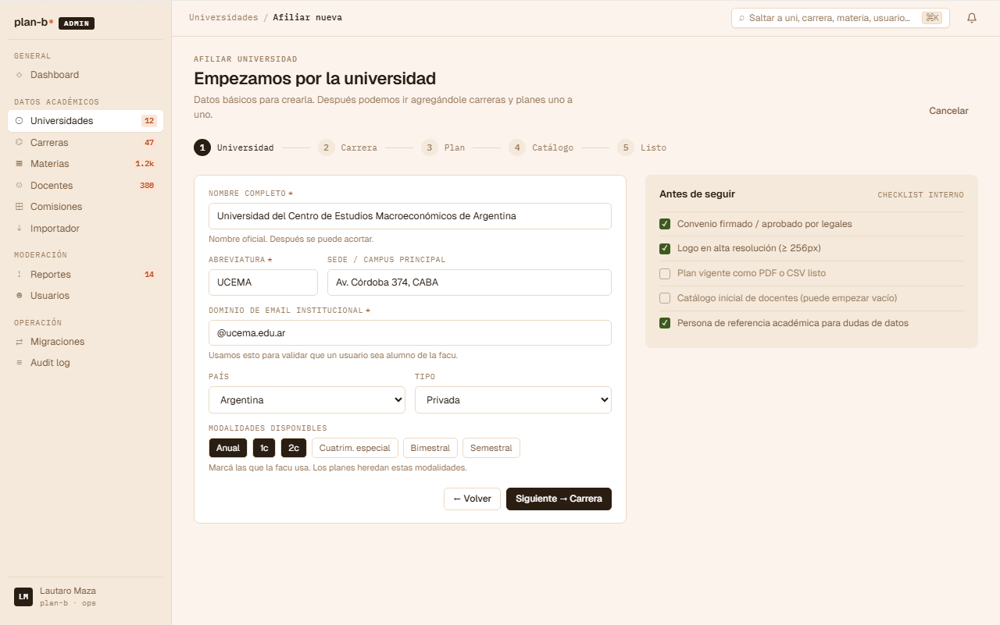
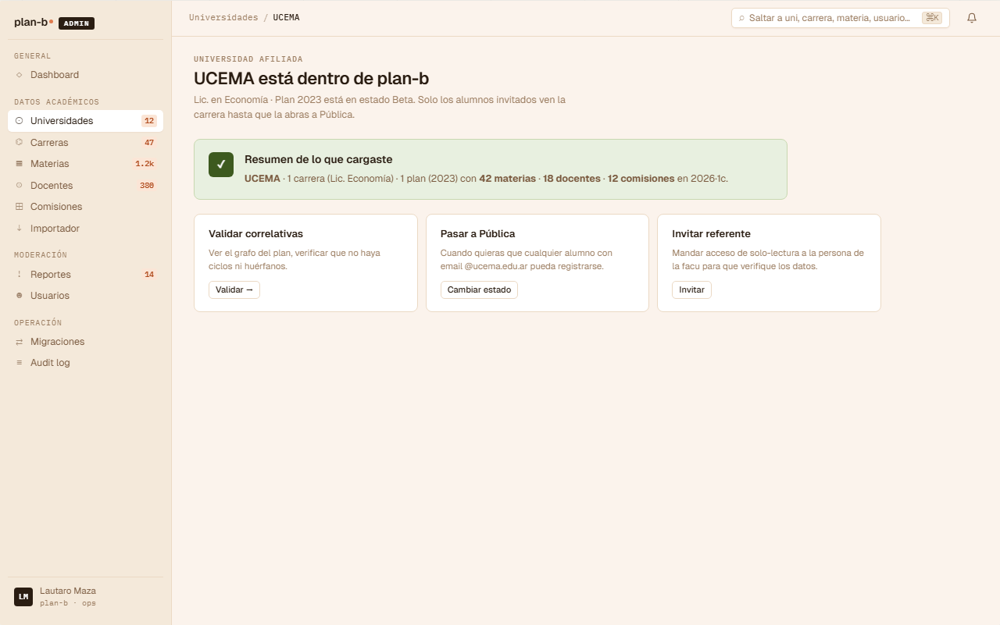
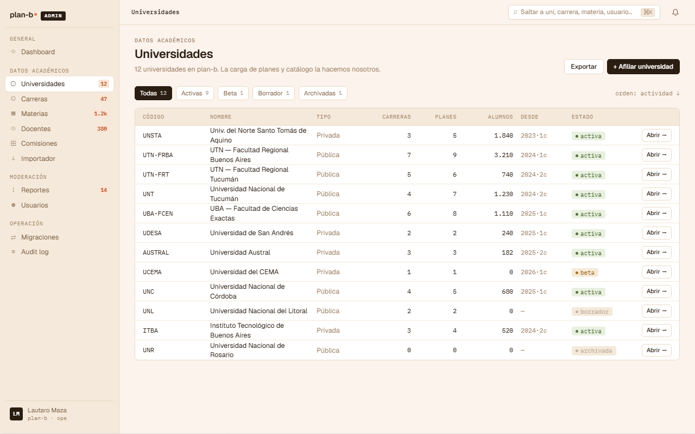
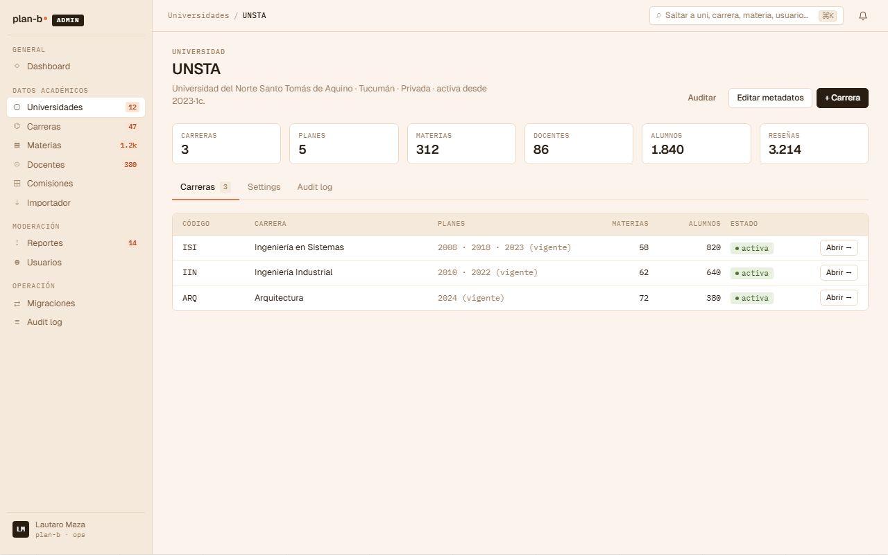

# US-060: Gestionar University

**Status**: Done
**Sprint**: S9
**Epic**: [EPIC-08: Backoffice de catálogo](../epics/EPIC-08.md)
**Priority**: High
**Effort**: M
**UC**: [UC-060](../use-cases/UC-060.md)
**ADR refs**: ADR-0001

## Como admin, quiero CRUD de Universities para mantener el catálogo institucional

Como admin, quiero CRUD completo de University con validaciones de slug único y dominios institucionales normalizados, para sostener el catálogo multi-universidad.

## Acceptance Criteria

### Backend

> Nota (doc): el AC original declaraba el namespace `/api/admin/...`. Ese namespace no existe en
> el código: el backend no tiene módulo `admin`, cada feature vive bajo el módulo que le
> corresponde (acá, `academic`). Rutas corregidas contra el código real (`Features/AdminUniversities/`).

- [x] CRUD completo bajo `/api/academic/universities`:
  - `POST` create con `{ name, shortName, slug, country, city, website?, institutionalEmailDomains[] }`.
  - `GET` list con paginación.
  - `GET /{id}` detail.
  - `PATCH /{id}` update.
  - `DELETE /{id}` soft delete (preservar histórico de careers).
  > TODO(doc): `CreateUniversityRequest`/`UpdateUniversityRequest` (código real) solo tiene `{ name, slug, institutionalEmailDomains }`; no existen `shortName`, `country`, `city`, `website`. El listado admin (`GET /api/academic/universities/admin`, `ListUniversitiesAdminEndpoint.cs`) no pagina: devuelve todo. El resto (get/update/soft delete) sí matchea.
- [x] Validación: slug único en toda la tabla (constraint `UNIQUE`).
- [ ] `institutional_email_domains` normalizados antes de persistir: lowercase, sin protocolo (`http://`), sin trailing slash.
  > TODO(doc): `University.NormalizeDomains` (código real) solo hace `Trim().ToLowerInvariant()` + dedup; no se encontró remoción de protocolo ni trailing slash.
- [x] Requiere `role = 'admin'`.

### Frontend

- [x] CRUD UI en backoffice.

## Sub-tasks

- [x] Aggregate University en módulo Academic
- [ ] Value object `InstitutionalEmailDomain` con normalización
  > TODO(doc): no existe como value object separado. La normalización vive inline como método privado (`NormalizeDomains`) del aggregate `University`.
- [x] Endpoints Carter CRUD
- [x] UI admin
- [x] Integration tests: slug duplicado rechazado, dominio normalizado correctamente

## Notas de implementación

- **Multi-universidad desde día 1**: ADR-0001. Estos endpoints son la primera vez que admins agregan universities (UNSTA seeded en dev, pero SIGLO 21 / USPT se cargan acá).
- **Soft delete por default**: borrar una University con careers activas rompería FKs intra-schema. Soft delete preserva la integridad y permite "archivado".
- **Domains normalizados al persistir, no al leer**: `unsta.edu.ar` y `UNSTA.edu.ar` son el mismo dominio. La validación de teacher institutional (US-031) compara contra el array. Normalizar al ingestar evita lookups con `LOWER()` cada vez.

## Refs

- DoD: [Definition of Done](../definition-of-done.md)
- Use Case: [UC-060](../use-cases/UC-060.md)
- Mockups admin canvas (sección ① + ②):
  - 
  - 
  - 
  - 
  - Fuente JSX en `canvas-mocks/admin-screens-1.jsx::AdmOnbUni / AdmOnbDone` + `admin-screens-2.jsx::AdmUniList / AdmUniDetalle`. Agregar AC visual del wizard (steps + checklist "antes de seguir" + `institutionalEmailDomains`) y del listado (chips de filtro por estado live/beta/draft/archived + stats por row).
- ADRs: [ADR-0001](../../decisions/0001-multi-universidad-desde-dia-1.md), [ADR-0041](../../decisions/0041-rediseño-ux-post-claude-design.md)
