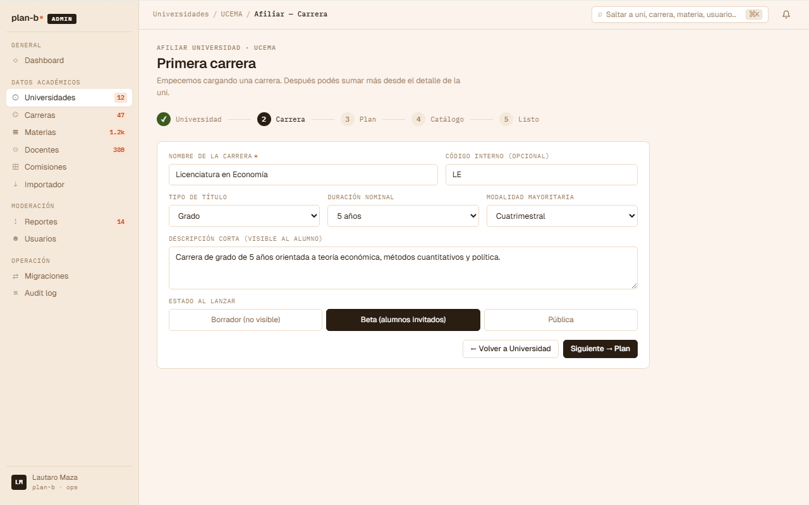
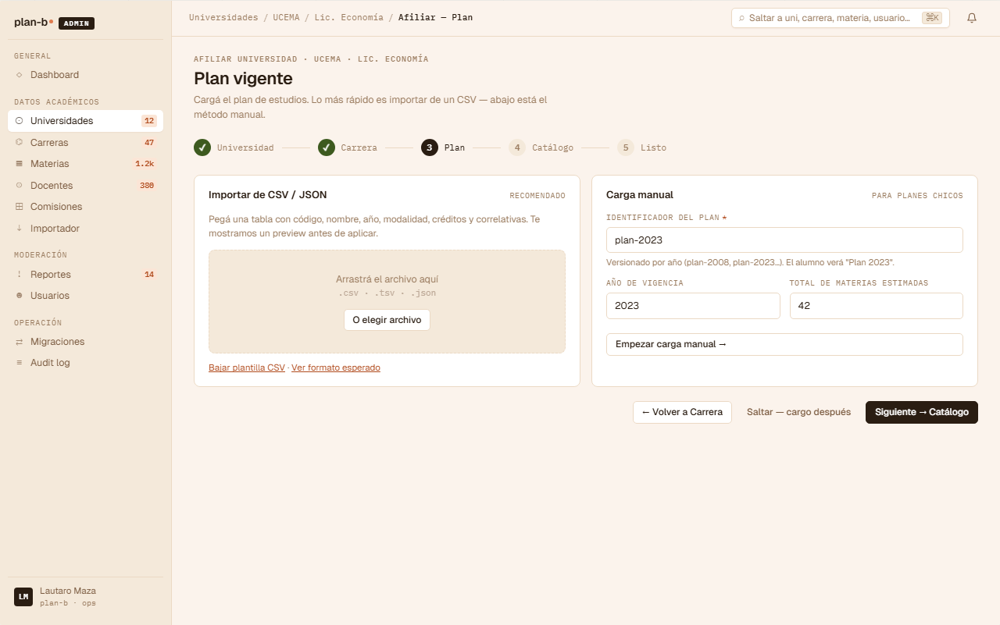
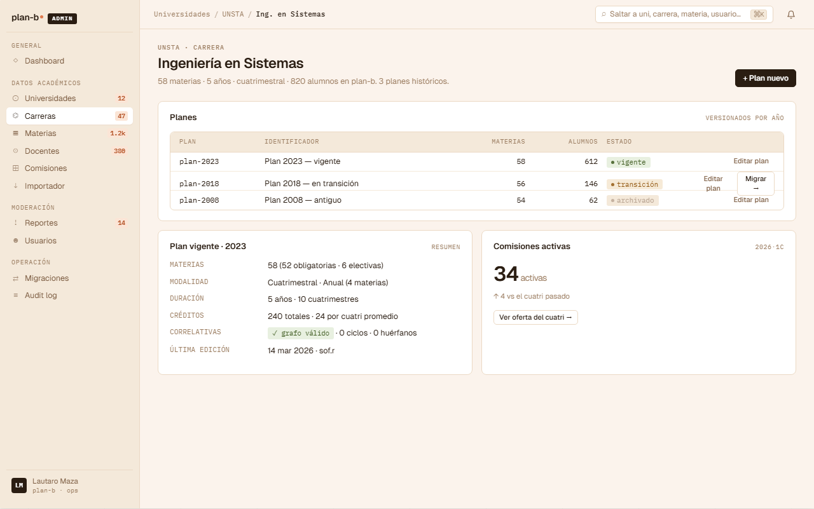

# US-061: Gestionar Career + CareerPlan

**Status**: Backlog
**Sprint**: 
**Epic**: [EPIC-08: Backoffice de catálogo](../epics/EPIC-08.md)
**Priority**: High
**Effort**: M
**UC**: [UC-061](../use-cases/UC-061.md)
**ADR refs**: ADR-0002

## Como admin, quiero gestionar Careers y sus versiones de plan para reflejar cambios curriculares

Como admin, quiero crear Career bajo University y agregar CareerPlans con effective_from/to (multiple plans por Career a lo largo del tiempo) para soportar versionado curricular.

## Acceptance Criteria

### Backend

- [ ] CRUD Career bajo `/api/admin/universities/{universityId}/careers`:
  - Create con `{ name, shortName, code? }`.
  - List, get, update, soft delete.
- [ ] CRUD CareerPlan bajo `/api/admin/careers/{careerId}/plans`:
  - Create con `{ versionLabel, durationTerms, defaultTermKind, effectiveFrom, effectiveTo? }`.
  - `version_label` único por career (constraint).
  - `effective_to >= effective_from` (CHECK).
- [ ] Validación de overlapping effective ranges: a nivel domain service. Dos planes vigentes simultáneamente para una career genera advertencia (decisión: permitir con warning o rechazar; AC asume rechazo).
- [ ] Plan vigente: `effective_to IS NULL`.
- [ ] Requiere `role = 'admin'`.
- [ ] Validación: rechazar create/update de CareerPlan si las fechas effective_from/effective_to overlapean con otro plan vigente del mismo career. Domain service `ICareerPlanRangeValidator`. Error: 409 `academic.career-plan.overlap`.
- [ ] Cuando un plan se cierra (effective_to seteado), los StudentProfile asociados NO se migran automáticamente. Quedan en el plan viejo. Migrarlos es un flow manual del alumno (US-070, post-MVP).

### Frontend

- [ ] UI con timeline de planes por career.

## Sub-tasks

- [ ] Aggregates Career + CareerPlan
- [ ] Domain service de validación de ranges
- [ ] Endpoints Carter
- [ ] UI admin
- [ ] Integration tests: overlap rechazado, plan vigente único por career, code único por university

## Notas de implementación

- **Versionado de planes**: ADR-0002. Multiple `CareerPlan` por `Career` a lo largo del tiempo. Un alumno cursa una `Career` bajo un `CareerPlan` específico (su `StudentProfile.career_id` apunta al plan, no a la career).
- **Cuándo cerrar `effective_to`**: cuando aparece un plan nuevo. El plan viejo deja de ser vigente pero los alumnos en ese plan siguen ahí. Materias del plan viejo siguen existiendo.
- **`code` opcional pero único cuando se provee**: constraint `UNIQUE(university_id, code)`. Permite distinguir carreras con códigos institucionales sin obligar.
- **Decisión de rechazar (no warning)** ante overlap: tener dos planes vigentes simultáneamente confunde el matching de StudentProfile.career_plan_id. Si en el futuro hace falta un override (ej. transición controlada de plan viejo a nuevo durante un cuatrimestre), se agrega flag `force=true`.

## Refs

- DoD: [Definition of Done](../definition-of-done.md)
- Use Case: [UC-061](../use-cases/UC-061.md)
- Mockups admin canvas (sección ① + ②):
  - 
  - 
  - 
  - Fuente JSX en `canvas-mocks/admin-screens-1.jsx::AdmOnbCarrera / AdmOnbPlan` + `admin-screens-2.jsx::AdmCarreraDetalle`. Agregar AC visual del step 2 con selector `initialStatus` (Borrador / Beta / Pública), step 3 con dual entry point (importar CSV → [US-082](US-082.md) / carga manual), y vista detalle con timeline de planes versionados (vigente / transición / archivado) + acción "Migrar →" ([US-084](US-084.md)).
- ADRs: [ADR-0002](../../decisions/0002-versionado-de-planes-de-estudio.md), [ADR-0041](../../decisions/0041-rediseño-ux-post-claude-design.md)
