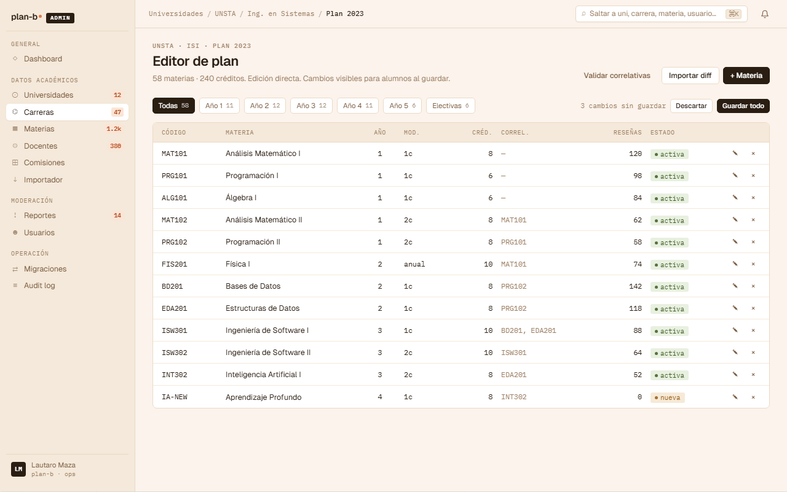
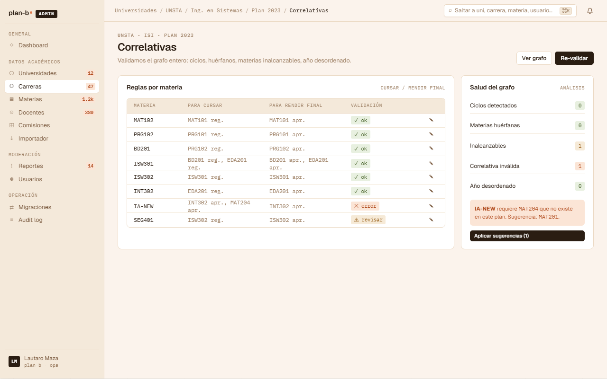
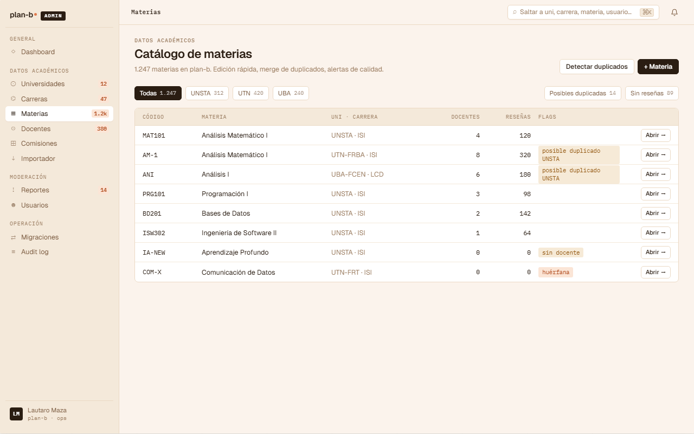

# US-062: Gestionar Subject + Prerequisite

**Status**: Backlog
**Sprint**: 
**Epic**: [EPIC-08: Backoffice de catálogo](../epics/EPIC-08.md)
**Priority**: High
**Effort**: M
**UC**: [UC-062](../use-cases/UC-062.md)
**ADR refs**: ADR-0003

## Como admin, quiero CRUD de Subjects y sus correlativas para definir el plan de estudios

Como admin, quiero agregar Subjects al CareerPlan y agregar Prerequisites validando aciclicidad del grafo (domain service), separando para_cursar vs para_rendir (ADR-0003).

## Acceptance Criteria

### Backend

- [ ] CRUD Subject bajo `/api/admin/career-plans/{planId}/subjects`:
  - Create con `{ code, name, yearInPlan, termKind, termInYear?, weeklyHours, totalHours, description? }`.
  - `UNIQUE(career_plan_id, code)`.
  - CHECK: `term_kind = 'anual'` ⇒ `term_in_year IS NULL`; `term_kind != 'anual'` ⇒ `term_in_year NOT NULL`.
- [ ] CRUD Prerequisite bajo `/api/admin/subjects/{subjectId}/prerequisites`:
  - Create con `{ requiredSubjectId, type }` (type: `para_cursar` | `para_rendir`).
  - Domain service valida aciclicidad del grafo por type (cada tipo es un DAG separado).
  - Ambas materias deben pertenecer al mismo `career_plan_id`.
- [ ] Requiere `role = 'admin'`.
- [ ] Soft-delete de Subject: si un Subject tiene Prerequisites apuntando a él (otras materias lo necesitan), borrarlo devuelve 409 `academic.subject.has_dependents` con el listado de materias dependientes. El admin debe re-asignar prerequisites primero.

### Frontend

- [ ] UI grid de subjects por año + matriz de prerequisites.

## Sub-tasks

- [ ] Aggregate Subject + child entity Prerequisite
- [ ] Domain service `IPrerequisiteGraphValidator` (DAG check con DFS)
- [ ] Endpoints Carter
- [ ] UI admin
- [ ] Integration tests: ciclo simple rechazado, ciclo indirecto rechazado, prerequisite cross-plan rechazado, prerequisite mismo subject rechazado

## Notas de implementación

- **Dos DAGs separados, uno por type**: ADR-0003. `para_cursar` y `para_rendir` son grafos distintos sobre los mismos subjects. Una materia puede tener correlativa A `para_cursar` y B `para_rendir` sin que se mezclen.
- **Aciclicidad validada en domain service, no en SQL**: ADR-0017. La FK `(subject_id, required_subject_id)` previene self-loops, pero ciclos largos (A → B → C → A) requieren DFS en código.
- **`subject_id != required_subject_id`**: CHECK del data-model. No hay correlativa de uno consigo mismo.

## Refs

- DoD: [Definition of Done](../definition-of-done.md)
- Use Case: [UC-062](../use-cases/UC-062.md)
- Mockups admin canvas (sección ②):
  - 
  - 
  - 
  - Fuente JSX en `canvas-mocks/admin-screens-2.jsx::AdmPlanEditor / AdmCorrelativasEditor / AdmMateriasList`. Agregar AC visual del editor inline (dirty state batch "N cambios sin guardar / Descartar / Guardar todo" + filter chips por año), del editor de correlativas (panel "Salud del grafo" con ciclos / huérfanos / inalcanzables + apply suggestions), y del catálogo cross-uni con flags ("posible duplicado", "huérfana", "sin docente") + CTA "Detectar duplicados" → [US-083](US-083.md).
- ADRs: [ADR-0003](../../decisions/0003-correlativas-con-dos-tipos.md), [ADR-0041](../../decisions/0041-rediseño-ux-post-claude-design.md)
