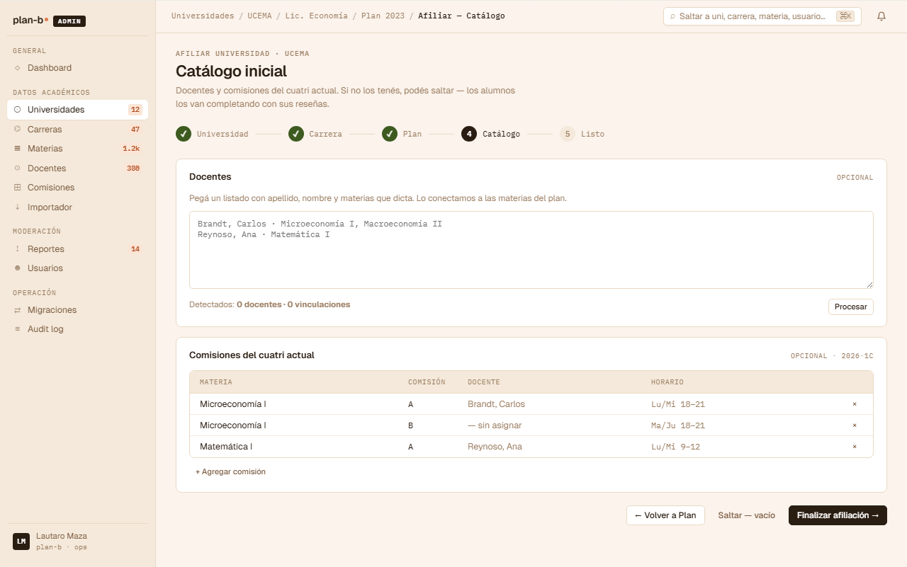
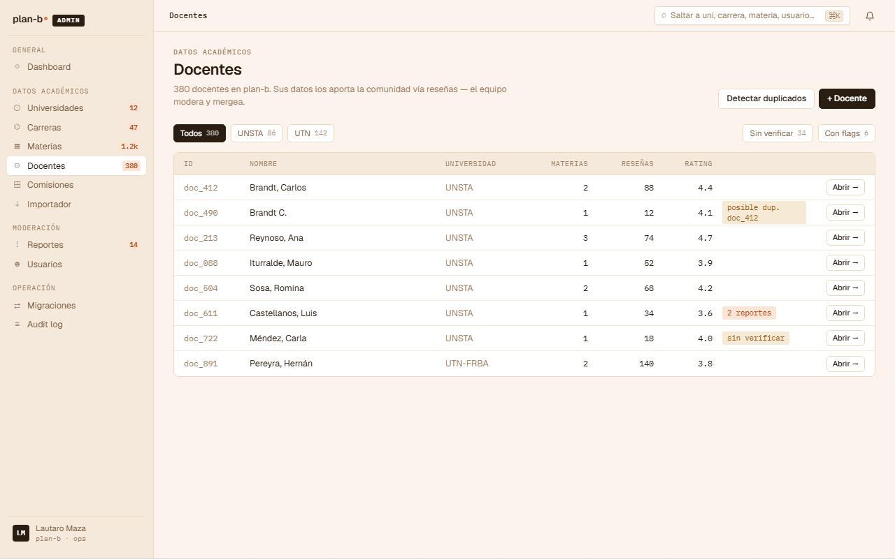

# US-063: Gestionar Teacher

**Status**: Done
**Sprint**: S7
**Epic**: [EPIC-08: Backoffice de catálogo](../epics/EPIC-08.md)
**Priority**: Medium
**Effort**: S
**UC**: [UC-063](../use-cases/UC-063.md)
**ADR refs**: ninguno.

## Como admin, quiero CRUD de Teachers para tener el catálogo docente que después se claim-eará

Como admin, quiero CRUD de Teachers con normalización de nombre (lowercase storage, title case display), bio y photo_url, soft delete via IsActive.

## Acceptance Criteria

### Backend

> Nota (doc): el AC original declaraba el namespace `/api/admin/...` y `universityId` en el path.
> Ninguno de los dos existe en el código: no hay módulo `admin` (cada feature vive bajo su módulo,
> acá `academic`), y `universityId` viaja en el **body** del create, no en la ruta. Rutas
> corregidas contra el código real (`Features/AdminTeachers/`).

- [x] CRUD Teacher bajo `/api/academic/teachers`:
  - Create con `{ firstName, lastName, title?, bio?, photoUrl? }`.
  - List, get, update, soft delete (via flag `is_active` o equivalente).
  > TODO(doc): el create real es `POST /api/academic/teachers` con `universityId` como campo del body (no `/api/admin/universities/{universityId}/teachers` con el id en el path). List es `GET /api/academic/teachers?universityId=`. Update es `PATCH /api/academic/teachers/{id}`. Soft delete es `DELETE /api/academic/teachers/{id}` (+ `POST /api/academic/teachers/{id}/reactivate`, bonus no pedido por el AC). No se encontró un GET admin por id dedicado: el detalle reusa el catálogo público (`GET /api/academic/teachers/{id}` en `PublicCatalog`).
- [x] Nombres normalizados al persistir: lowercase. Display en title case (responsabilidad de la API o frontend).
- [x] Requiere `role = 'admin'`.

### Frontend

- [ ] CRUD UI con upload de foto.
  > TODO(doc): no hay upload de archivo. `teacher-form.tsx` (código real) usa un campo de texto URL con preview en vivo; el propio comentario del componente dice "el upload de archivos es una US aparte".

## Sub-tasks

- [x] Aggregate Teacher
- [x] Endpoints Carter
- [x] UI admin
- [x] Integration tests: nombres normalizados al ingestar
- [x] Injertar la rama docente en la búsqueda global `GET /api/search`: US-004 dejó el contrato discriminado por `type` (subject|teacher), así que sumar docentes es aditivo (query por nombre + items `type=teacher` + href `/teachers/{id}`), no rework. Ver [US-004](US-004.md).

## Notas de implementación

- **Normalización lowercase storage, title case display**: convención del data-model. "JUAN PÉREZ" y "Juan Pérez" se persisten igual. Display lo decide la presentation layer. Evita duplicados por mayúsculas/minúsculas.
- **Soft delete porque hay reseñas anclas**: una review apunta a `docente_reseñado_id`. Si el Teacher se hard-deletea, las reviews quedan con FK rota (intra-schema, sí hay FK). Soft delete preserva la integridad histórica.
- **Sin claim automático**: crear un Teacher en backoffice no genera TeacherProfile. El claim es voluntario por parte del docente real (US-030).

## Refs

- DoD: [Definition of Done](../definition-of-done.md)
- Use Case: [UC-063](../use-cases/UC-063.md)
- Mockups admin canvas (sección ① + ②):
  - 
  - 
  - Fuente JSX en `canvas-mocks/admin-screens-1.jsx::AdmOnbCatalogo` + `admin-screens-2.jsx::AdmDocentesList`. Agregar AC visual del bulk-paste parser de docentes (textarea con detección automática de nombres + emails + cátedras) y del listado con flags ("posible duplicado", "sin verificar", "N reportes") + CTA "Detectar duplicados".
- ADRs: [ADR-0041](../../decisions/0041-rediseño-ux-post-claude-design.md)
