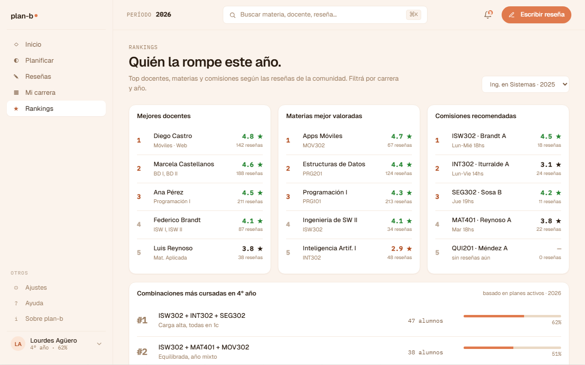

# US-070: Rankings (top 10 paginado: docentes / materias / comisiones)

**Status**: Backlog
**Sprint**: candidato a S4
**Epic**: [EPIC-05: Sistema de reseñas](../epics/EPIC-05.md)
**Priority**: Medium
**Effort**: M
**ADR refs**: [ADR-0041](../../decisions/0041-rediseño-ux-post-claude-design.md)

## Como member, quiero ver rankings agregados (mejores docentes, materias más temidas, comisiones más recomendadas) para descubrir señal del corpus de reseñas más allá de mi carrera

La sesión de claude-design del 2026-05-02 introdujo Rankings como sección nueva (sección ⑧). Display: **top 10 visible + paginado** para ver el resto.

## Acceptance Criteria

- [ ] Ruta `/rankings` (route group `(member)`).
- [ ] **Tabs / segmentos**:
  1. Top docentes mejor reseñados.
  2. Top materias más temidas (mayor dificultad promedio + cantidad mínima de reseñas para evitar ruido).
  3. Top comisiones más recomendadas (% de "volverías a cursar" + "recomendarías la cursada").
- [ ] **Display**: top 10 visible + paginación (siguientes 10, etc.).
- [ ] Cada item del ranking muestra: nombre + universidad/carrera + métrica principal (rating / dificultad / % recomendado) + cantidad de reseñas que respaldan + link al detalle.
- [ ] **Filtros laterales**: por universidad, por carrera (default = la del alumno).
- [ ] **Mínimo de reseñas por item para entrar al ranking** (anti-ruido): TBD por configuración. MVP = 5 reseñas mínimo.

## Sub-tasks

### Backend

- [ ] `GET /api/rankings/teachers?university=&career=&page=` con cálculo de rating promedio + cantidad reseñas.
- [ ] `GET /api/rankings/subjects?university=&career=&page=` con dificultad promedio.
- [ ] `GET /api/rankings/commissions?university=&career=&page=` con % recomendaciones.
- [ ] Cada query con threshold mínimo de N=5 reseñas para entrar al ranking.
- [ ] Cache Redis con TTL 1h por query (Patrón #3 hot reads, ADR-0034). Key: `rankings:{type}:{filters-hash}:{page}`.
- [ ] Tests integration: ranking devuelve top N ordenado, filtra por carrera, items con < N reseñas excluidos.

### Frontend

- [ ] `app/(member)/rankings/page.tsx` con tabs.
- [ ] `features/rankings/{api.ts,components/{ranking-list,ranking-item-card,filter-bar}.tsx}`.
- [ ] Sidebar v2: agregar entrada "Rankings" en sección Producto.
- [ ] Paginación con `nuqs` para que el page sea sharable.

## Notas de implementación

- **Paginado, no infinite scroll**: el alumno mira el top y ya. Infinite scroll incentiva consumo eterno; paginado hace explícito que es contenido finito.
- **Cross-schema query es legal acá**: Reviews + Academic en Dapper read model. Mismo principio que US-034 (stats públicas en hero).
- **Cache 1h**: rankings no necesitan ser real-time. Recálculo cada hora alcanza.
- **Threshold de N=5 reseñas**: parámetro de config. Si bajamos a N=3 antes de tener corpus, una sola reseña explosiva mueve el ranking. Si lo subimos a N=10 con corpus chico, el ranking queda vacío.
- **Otras categorías post-MVP**: docentes con mejor respuesta a reseñas, comisiones con mejores TPs, etc. Cuando aparezca señal útil del corpus, se agregan.

## Refs

- DoD: [Definition of Done](../definition-of-done.md)
- Mockup: . Fuente JSX en `canvas-mocks/v2-screens-2.jsx::V2Rankings` líneas 284-404.
- ADRs: [ADR-0041](../../decisions/0041-rediseño-ux-post-claude-design.md), [ADR-0034](../../decisions/0034-redis-como-cache-y-ephemeral-state.md).
- US relacionadas: [US-017](US-017.md) (publicar reseña, alimenta el corpus).
