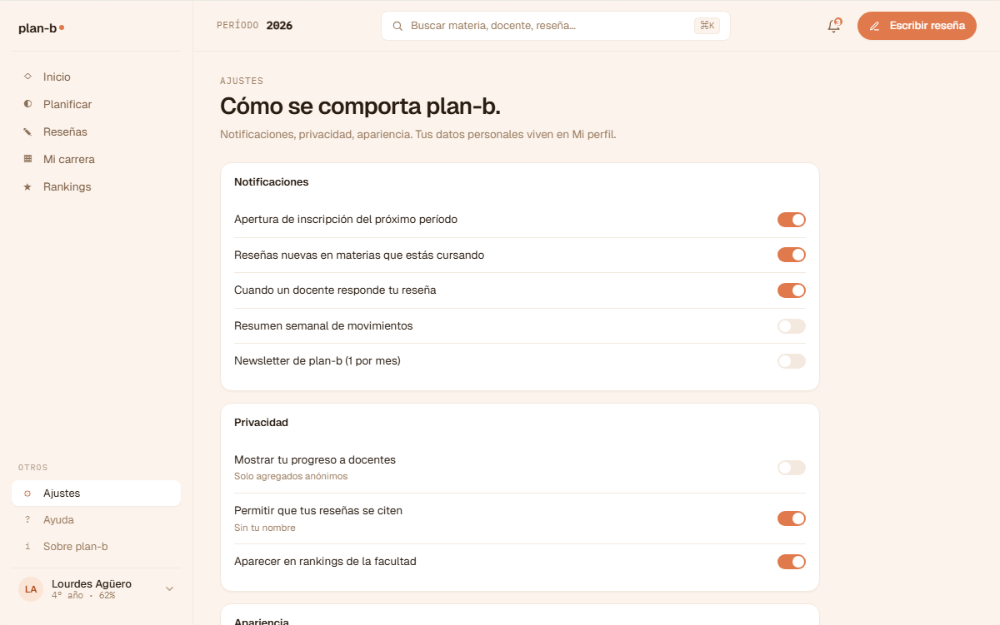

# US-072: Ajustes (notificaciones / privacidad / idioma / tema)

**Status**: Backlog
**Sprint**: candidato a S5
**Epic**: [EPIC-02: Identidad y autenticación](../epics/EPIC-02.md)
**Priority**: Medium
**Effort**: M
**ADR refs**: [ADR-0041](../../decisions/0041-rediseño-ux-post-claude-design.md)

## Como member, quiero una pantalla de ajustes para configurar notificaciones, privacidad, idioma y tema sin que se mezclen con mis datos de identidad académica

La sesión de claude-design del 2026-05-02 separó "Ajustes" (config de la app) de "Mi perfil" (identidad). Ajustes vive como ítem propio en la sección "Otros" del sidebar.

## Acceptance Criteria

- [ ] Ruta `/ajustes` (route group `(member)`).
- [ ] Acceso desde **ítem "Ajustes" en sección "Otros"** del sidebar v2.
- [ ] **Sección "Notificaciones"**:
  - Toggle por canal: in-app, email.
  - Toggle por tipo: respuesta a mi reseña, review nueva en materia que sigo, calendario académico (recordatorio inicio cuatri / fin de inscripción), nudge de promoción de borrador.
- [ ] **Sección "Privacidad"**:
  - Toggle "Mostrar mi display name en mis reseñas" (si OFF, anónimo público).
  - Toggle "Permitir que docentes me contacten cuando respondan mi reseña" (TBD: depende de si habilitamos contact via app).
- [ ] **Sección "Idioma"**:
  - Select. Opciones: Español rioplatense (default). Más adelante: ES neutro, EN.
- [ ] **Sección "Tema"**:
  - Select: claro / oscuro / auto (sistema). Default = auto.
- [ ] Cada cambio se guarda automáticamente al toggle/select (no botón "Guardar"; UX de settings modernos).
- [ ] **Sección "Seguridad"** con row "Contraseña" + valor "Cambiar contraseña →" como link/trigger del modal de **[US-079-i](US-079-i.md)** (cambio de contraseña con sesión activa, slice integrated propio: endpoint backend + modal frontend). Esta US **solo monta el row** en Ajustes; el modal + endpoint + validaciones + revocación de refresh tokens + notification al user viven en US-079-i.
  - **DECIDIDO 2026-05-09**: splitteamos el cambio de password a US-079-i propia siguiendo el patrón de US-029-i (sign-out) y US-033-i (forgot password). US-072 queda enfocada al UI de Ajustes; US-079-i tiene el endpoint Identity completo + modal.

## Sub-tasks

### Backend

- [ ] `GET /api/users/me/settings` (devuelve current settings).
- [ ] `PATCH /api/users/me/settings` con cualquier subset.
- [ ] Storage en `user_settings` table (FK a User, JSONB con shape validado por Zod / FluentValidation server side).
- [ ] Tests integration.

### Frontend

- [ ] `app/(member)/ajustes/page.tsx`.
- [ ] `features/settings/{api.ts,actions.ts,schema.ts,components/{notifications-section,privacy-section,language-select,theme-select}.tsx}`.
- [ ] Theme provider que lee del setting (next-themes o similar).
- [ ] i18n setup mínimo (next-intl): solo si vamos a soportar más de un idioma. Si en S5 todavía es solo ES rioplatense, dejar el setting visible pero la implementación de i18n queda como deuda.
- [ ] Sidebar v2: agregar "Ajustes" en sección "Otros".

## Notas de implementación

- **Auto-save por toggle**: el patrón "guardar automático" es el estándar de settings hoy (Mac, iOS, GitHub). El usuario ve el cambio aplicado al toggle. No necesita confirmar.
- **Privacidad de display name** depende de un cambio en backend de Reviews: la proyección pública lee el flag y oculta / muestra. Si el flag aterriza después que reviews ya está public, los pre-existentes se actualizan via projection rebuild.
- **Idioma "Español rioplatense"**: la app ya está en ES rioplatense. Esta opción está en el ajuste para cuando aterrice un segundo idioma. Si no hay segundo idioma, el setting es no-op y queda placeholder.
- **Tema dark mode**: Tailwind 4 + `dark:` prefix + `next-themes` library. Colores en `@theme` ya soportan dark via tokens.

## Refs

- DoD: [Definition of Done](../definition-of-done.md)
- Mockups:
  - . Fuente JSX en `canvas-mocks/v2-screens-2.jsx::V2Ajustes` líneas 605-708.
  - El modal "Cambiar contraseña" (`cuenta-v2-modal-pass.png`) lo cubre [US-079-i](US-079-i.md). Esta US solo monta el row en Ajustes que lo dispara.
- ADRs: [ADR-0041](../../decisions/0041-rediseño-ux-post-claude-design.md).
- US relacionadas: [US-047](US-047.md) (Mi perfil: pantalla aparte, no mezclar).
