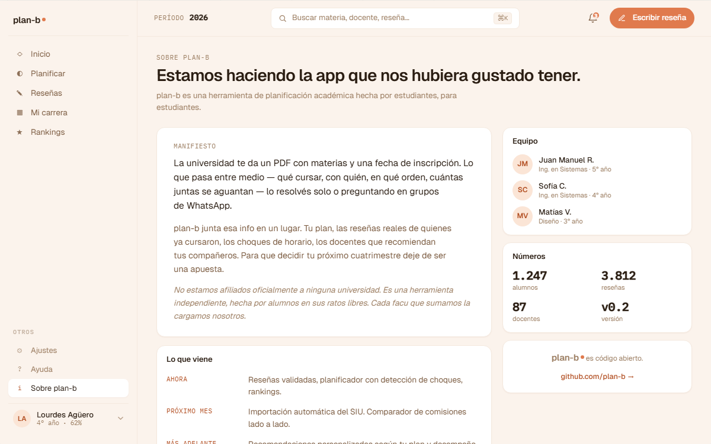

# US-074: Sobre plan-b (página informacional + créditos)

**Status**: Backlog
**Sprint**: candidato a S5
**Epic**: [EPIC-02: Identidad y autenticación](../epics/EPIC-02.md)
**Priority**: Low
**Effort**: S
**ADR refs**: [ADR-0041](../../decisions/0041-rediseño-ux-post-claude-design.md)

## Como member o visitor, quiero una página "Sobre plan-b" con qué es el proyecto, quién lo hace y cómo aportar para entender el contexto antes de usar la app o contribuir

La sesión de claude-design del 2026-05-02 introdujo "Sobre plan-b" como página plana en sección "Otros" del sidebar.

## Acceptance Criteria

- [ ] Ruta `/sobre` accesible tanto desde `(public)` como desde `(member)` (no requiere auth).
- [ ] Acceso autenticado desde **ítem "Sobre plan-b" en sección "Otros"** del sidebar v2.
- [ ] Acceso público desde footer de la landing.
- [ ] **Secciones**:
  - **Qué es plan-b**: 2-3 párrafos. Plataforma multi-universidad de planificación de cuatrimestre + reseñas crowd-sourced. Origen como proyecto final UNSTA.
  - **Universidades soportadas**: lista actual (UNSTA, SIGLO 21, USPT, etc. según corpus).
  - **Cómo funciona**: 3-4 bloques con iconos (planificá tu cuatri / reseña a tu paso / descubrí docentes y comisiones / aportá al corpus).
  - **Quién lo hace**: créditos. Lucas Iriarte (autor). Mención académica (Universidad del Norte Santo Tomás de Aquino: UNSTA, Tecnicatura en Desarrollo y Calidad de Software, 2026, tutor Ing. Elio Copas).
  - **Open source / cómo aportar**: link al repo público (si lo abrimos), link a issues / discussions, mail de contacto.
  - **Versión y changelog**: link a `CHANGELOG.md` o snapshot de últimas releases.

## Sub-tasks

### Frontend

- [ ] `app/(public)/sobre/page.tsx` (también linkeable desde `(member)`).
- [ ] `features/about/components/{hero,what-is-it,universities-list,how-it-works,credits,open-source-cta,version-info}.tsx`.
- [ ] Contenido en MD o JSX directo. MD si pensamos que va a editarse seguido; JSX si es estático.
- [ ] Sidebar v2: agregar "Sobre plan-b" en sección "Otros".
- [ ] Footer de landing (público) con link a `/sobre`.

## Notas de implementación

- **Sin backend**: todo estático. Datos del proyecto, créditos y univs vienen de constantes del frontend.
- **Versión**: leer el `CHANGELOG.md` o un endpoint `/api/meta/version`. Para MVP: leer del package.json o hardcoded label "v0.x".
- **Repo público**: si seguimos en repo privado, omitir esa sección o reemplazar por "código fuente disponible bajo pedido".
- **Universidades soportadas**: lista construida de la tabla `universities` de Academic. Si hace falta endpoint dedicado, `GET /api/universities/public` cacheado 24h.
- **Créditos académicos**: Lucas como autor solo. UNSTA + Ing. Copas como contexto académico, no co-authors.

## Refs

- DoD: [Definition of Done](../definition-of-done.md)
- Mockup: . Fuente JSX en `canvas-mocks/v2-screens-2.jsx::V2Sobre` líneas 491-600.
- ADRs: [ADR-0041](../../decisions/0041-rediseño-ux-post-claude-design.md).
- US relacionadas: [US-073](US-073.md) (Ayuda).
