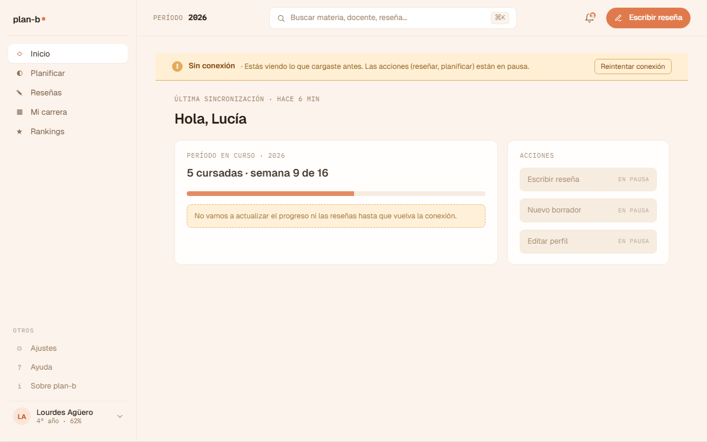

# US-076-f: Estado offline (banner global + acciones en pausa)

**Status**: Backlog
**Sprint**: candidato a S5+
**Epic**: [EPIC-00: Foundations & DevEx](../epics/EPIC-00.md) (estado transversal del producto)
**Priority**: Medium
**Effort**: S
**ADR refs**: [ADR-0041](../../decisions/0041-rediseño-ux-post-claude-design.md)

## Como member que pierde conexión mientras usa plan-b, quiero que la app me avise sin romperse y me deje seguir leyendo lo que ya cargué, para no perder contexto cuando la red se cae

Sección ④ del canvas v2 incluye `home-v2-inicio-offline` con `V2OfflineBanner` (en `v2-empty.jsx`). El banner es transversal: aparece sobre cualquier vista del shell autenticado cuando se detecta `navigator.onLine === false` o cuando una request pierde conexión. Esta US cubre la detección + el banner + la degradación coherente de las acciones que requieren red.

## Acceptance Criteria

- [ ] **Hook `useOnlineStatus()`** en `lib/use-online-status.ts`:
  - Suscripción a `window.addEventListener('online' | 'offline')`.
  - Inicializa con `navigator.onLine`.
  - Devuelve `{ online: boolean, since: Date | null }`.
- [ ] **Banner global** persistente en el top del shell `(member)` cuando `online === false`:
  - Background `oklch(0.92 0.06 60)` (warm warning, no rojo).
  - Texto: "Sin conexión. Te mostramos lo último que cargaste; algunas acciones están en pausa."
  - Icono inline ⚠.
  - Botón inline "Reintentar" (link mono accent-ink) que dispara `queryClient.refetchQueries()` + chequea `navigator.onLine`.
  - Cuando vuelve la conexión: banner se reemplaza 3 segundos por uno verde "Conexión restablecida" y luego se va.
- [ ] **Degradación de acciones** (mientras `online === false`):
  - Botones de mutación (publicar reseña, guardar borrador, planificar, ajustes save, etc.) quedan disabled con tooltip "Sin conexión".
  - Server actions que se disparen igual (race condition con la detección): el catch del action devuelve `{ status: 'offline' }` y muestra toast warning.
  - Lectura sigue funcionando con cache de TanStack Query.
- [ ] **Sin lectura nueva**: NO se prefetchean queries con `online === false`; las que ya están en cache se sirven con `isStale=true` notado al user con un dot inline cerca del card afectado.
- [ ] El banner aparece en TODA ruta del `(member)` route group (Inicio, Mi carrera, Planificar, Reseñas, Rankings, Cuenta). No en `(public)` ni `(auth)`.
- [ ] **Mock data fallback**: la US deliberadamente NO implementa cache offline persistente (Service Worker / IndexedDB). Eso es post-MVP. Se aprovecha solo el cache in-memory de TanStack Query.

## Out of scope

- **Service Worker + cache persistente offline**: out de MVP (post-launch).
- **Queueing de mutaciones offline para enviar al volver**: out de MVP. Las mutaciones quedan disabled.
- **Sync de simulador offline → online**: out (US-046 puede tener nota propia sobre esto).
- **Detección de conexión lenta** (slow 3G): out. Solo `online === true|false`.
- **Notificaciones push offline**: out (no hay push en MVP).
- **Modo avión deliberado**: el toggle "trabajar offline" como feature explícita es post-MVP.
- **Replicación local de queries**: out (no usamos un offline-first framework).

## Edge cases

| Caso | Comportamiento esperado |
|---|---|
| User entra a `/home` con conexión y la pierde mid-render | Banner aparece desde el top, queries que estaban en flight muestran error genérico. Lo que ya cargó se mantiene visible. |
| User entra a `/home` sin conexión desde el principio | Banner visible desde mount. Queries que no estaban en cache muestran empty state "Sin datos cargados todavía". |
| Conexión inestable (toggle on/off rápido) | Hook debounce 500ms para evitar flickering del banner. |
| User presiona "Reintentar" sin que vuelva la conexión | Loader de 1s + el banner sigue. No spammear refetch (debounce 3s). |
| Logueado offline + token expira | Sin red para refresh. Sigue mostrando lo cacheado. Cuando vuelve la red, el middleware de auth chequea y redirige a `/sign-in` si el token es inválido. |
| Browser sin soporte de `online` event (raro) | `navigator.onLine` siempre `true`. El banner nunca aparece. Aceptado como degradación. |

## Test scenarios

### Críticos (Given-When-Then)

1. **Given** Lucía en `/home` con conexión, **when** se simula `offline` (Playwright `context.setOffline(true)`), **then** el banner aparece dentro de 1s con copy "Sin conexión".
2. **Given** banner offline visible, **when** se simula `online`, **then** banner cambia a verde "Conexión restablecida" 3s y luego desaparece.
3. **Given** Lucía offline en `/reseñas?tab=mias`, **when** intenta borrar una reseña (US-055), **then** botón "Borrar" queda disabled con tooltip.
4. **Given** Lucía offline, **when** clickea "Reintentar" del banner, **then** se dispara refetch + sigue offline si no hay red.
5. **Given** Lucía en `(public)/`, **when** se queda sin red, **then** NO aparece el banner (es solo del shell `(member)`).

### Cobertura por capa

- **Unit / vitest**: `use-online-status.test.ts` (mock `window.dispatchEvent('offline')`).
- **Component / vitest + RTL**: `offline-banner.test.tsx` (render + retry button + transitions).
- **E2E Playwright**: spec `offline.spec.ts` con `context.setOffline(true)`. Confirma banner + acciones disabled.

## Sub-tasks

- [ ] `lib/use-online-status.ts` + tests.
- [ ] `components/layout/offline-banner.tsx` + tests.
- [ ] Mount el banner en `app/(member)/layout.tsx`.
- [ ] Update sidebar / topbar / cards para ocultar / disabled botones de mutación cuando `online === false`. Patrón: hook + prop opcional `disabled` en cada button de mutación.
- [ ] Spec E2E.
- [ ] Documentar el patrón en `docs/testing/conventions.md` (cómo simular offline en Playwright).

## Notas de implementación

- **Banner es presentational, no policy**: el banner solo muestra. La lógica de "qué se desactiva" la maneja cada feature consumiendo el hook.
- **Por qué warm warning, no rojo**: rojo = error fatal. Offline es estado temporal, queremos comunicar urgencia sin alarma. Warm naranja warning matchea el lenguaje del producto.
- **Cache in-memory de TanStack Query**: alcanza para una sesión. Si el user refresha la página estando offline, pierde TODO el cache. Es aceptable en MVP.
- **Detección no es perfecta**: `navigator.onLine === true` no garantiza que el backend de plan-b sea reachable (ej. usuario en wifi de Starbucks pero sin DNS). Idealmente combinar con un health check al backend (`/api/health` cada N segundos). Eso es deuda; por ahora confiamos en `navigator.onLine`.

## Dependencies

- **Depende de**: [US-042-f](US-042-f.md) (AppShell, **Done**).
- **Bloquea a**: ninguna directa, pero todas las US frontend que tienen mutaciones se benefician del patrón (hook + disabled).
- **Relacionada con**: [US-046](US-046.md) (planificar offline = lectura del último borrador), [US-049](US-049.md) (editor de reseña offline = save deshabilitado).

## Refs

- DoD: [Definition of Done](../definition-of-done.md)
- Mockup: . Fuente JSX en `canvas-mocks/v2-empty.jsx::V2OfflineBanner`.
- ADRs: [ADR-0041](../../decisions/0041-rediseño-ux-post-claude-design.md).
- US relacionadas: [US-046](US-046.md), [US-049](US-049.md).
