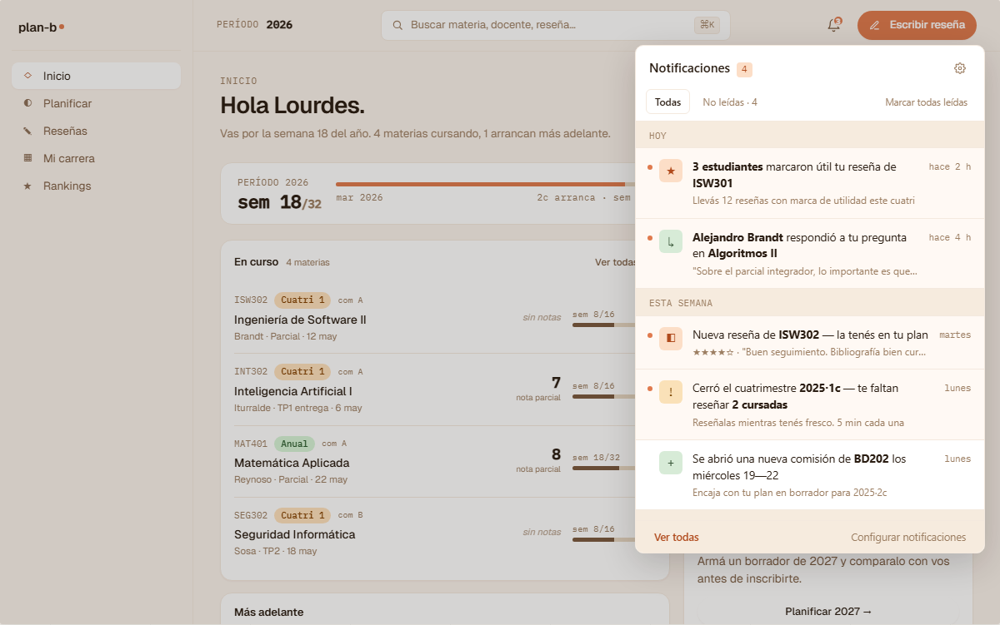
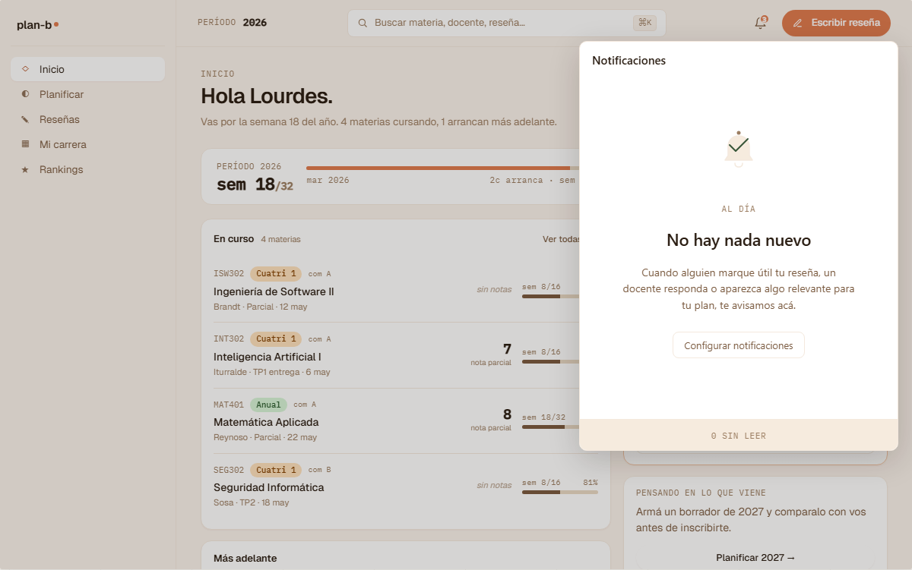

# US-077-b: Backend de Notificaciones (Notifications BC)

**Status**: Backlog, splitada en [US-077-b-1](US-077-b-1.md) + [US-077-b-2](US-077-b-2.md) + [US-077-b-3](US-077-b-3.md)
**Sprint**:
**Epic**: [EPIC-05: Sistema de reseñas](../epics/EPIC-05.md) (notificaciones del corpus social) y EPIC-02 cross (notif transversales tipo password changed)
**Priority**: Medium
**Effort**: L (parent); cada sub-slice S-M
**ADR refs**: [ADR-0040](../../decisions/0040-notifications-como-bounded-context.md), [ADR-0030](../../decisions/0030-cross-bc-consistency-via-wolverine-outbox.md), [ADR-0034](../../decisions/0034-redis-como-cache-y-ephemeral-state.md)

> Esta US se splitea en 3 sub-slices secuenciales (backend-only, partidos por capa funcional):
>
> - **[US-077-b-1](US-077-b-1.md) core**: aggregate `Notification` + state machine + read API (`GET /api/me/notifications` con paginación + `?unread=`) + mutations (mark-as-read individual + bulk). Sin subscribers, sin email. Mínimo para que US-077-f deje de usar mock data: backend devuelve notifs persistidas (cargadas manualmente o por seed).
> - **[US-077-b-2](US-077-b-2.md) subscribers**: handlers Wolverine a los events que disparan notifs (ReviewResponded, ReviewUseful, NewReviewInSubject, PlanPeriodOpen, PlanChange, UserPasswordChanged, ReviewEditRequested, PlanMigrationApplied, system). Cada subscriber crea una Notification en estado `pending → delivered_inapp`.
> - **[US-077-b-3](US-077-b-3.md) email delivery**: `INotificationEmailSender` interface + impl SMTP genérica + templates HTML por kind + Wolverine job que procesa pending de canal email + retry. **Mailpit en dev/CI** (ya hay infra); vendor de prod (Postmark / SES / etc.) se decide en deploy con env vars, sin tocar código.
>
> Las 3 sub-slices son aterrizables independientes: b-1 alcanza para US-077-f con notifs reales; b-2 enchufa los disparos a features ya en producción (US-079-i, US-085, US-084); b-3 agrega el canal email. Si Lucas decide pausar después de b-2, el sistema funciona sin email (deuda explícita).

## Como member, quiero recibir notificaciones in-app + email de eventos relevantes (respuestas a mis reseñas, alguien marcó útil mi reseña, moderador me pidió que edite, mi password cambió, etc.) para no perderme avisos importantes y mantener confianza en la cuenta

[ADR-0040](../../decisions/0040-notifications-como-bounded-context.md) declaró Notifications como BC nuevo. Esta US es la primera implementación de ese BC. Cubre el read model + write side + subscribers cross-BC + canal email, todo siguiendo el patrón de modular monolith (Wolverine outbox + event-driven cross-BC + read APIs Carter).

El frontend ([US-077-f](US-077-f.md)) consume los endpoints de read + mutations expuestos por esta US.

## Acceptance Criteria (consolidado parent)

Cada AC vive en su sub-slice. Acá resumo el scope total:

### Core (US-077-b-1)

- [ ] Aggregate `Notification` en `Planb.Notifications.Domain` con state machine (`pending → delivered_inapp → read → archived` + outcomes paralelos `email_pending → email_sent | email_failed`).
- [ ] Tabla `notifications.notification` en schema propio.
- [ ] `GET /api/me/notifications` con paginación cursor, filters (`?unread=bool`, `?kinds=<comma-separated>`, `?since=<ISO>`).
- [ ] `PATCH /api/me/notifications/{id}/read` (mark-as-read individual).
- [ ] `PATCH /api/me/notifications/read-all` (mark-all-as-read, scoped al user).
- [ ] `GET /api/me/notifications/unread-count` (para el badge del bell, polling 30s desde frontend).
- [ ] Authorization: solo el owner (`actor.id == notification.user_id`).
- [ ] Tests integration: CRUD, paginación, filters, mark-as-read idempotente.

### Subscribers (US-077-b-2)

- [ ] Handler Wolverine por cada integration event que dispara notif:
  - `ReviewResponded` → notif `kind='review_response'`.
  - `ReviewMarkedUseful` → notif `kind='review_useful'`.
  - `NewReviewInFollowedSubject` → notif `kind='review_new_in_subject'`.
  - `PlanPeriodOpened` → notif `kind='plan_period_open'`.
  - `PlanChanged` → notif `kind='plan_change'`.
  - `UserPasswordChanged` (de [US-079-i](US-079-i.md)) → notif `kind='system'` + flag email.
  - `ReviewEditRequested` (de [US-085](US-085.md)) → notif `kind='review_edit_requested'` + flag email.
  - `PlanMigrationApplied` (de [US-084](US-084.md)) → notif `kind='system'` + flag email.
  - `SystemAnnouncement` (anuncios del equipo plan-b) → notif `kind='system'`.
- [ ] Cada handler crea una row con `target_url` resuelto (frontend navega ahí al clickear).
- [ ] Tests integration por subscriber: event arrives → notif persisted con shape correcto.

### Email delivery (US-077-b-3)

- [ ] Interface `INotificationEmailSender` en `Notifications.Application`.
- [ ] Impl `SmtpNotificationEmailSender` con `System.Net.Mail.SmtpClient` + config por env vars.
- [ ] Templates HTML por kind (al menos: `UserPasswordChanged`, `ReviewResponded`, `ReviewEditRequested`, `PlanPeriodOpened`).
- [ ] Wolverine job `DeliverNotificationEmailJob` que procesa `email_pending` → llama sender → marca `email_sent` / `email_failed` + retry exponencial (3 intentos, Wolverine out-of-the-box).
- [ ] **Mailpit como SMTP en dev/CI**: env vars apuntan a `localhost:1025`. Sin auth, sin TLS. Ya hay infra del proyecto.
- [ ] **Vendor de prod**: se decide en deploy. Misma impl SMTP, otras env vars.
- [ ] Tests integration usando Mailpit: trigger event → notif creada → email job corre → email visible en Mailpit con shape esperado.

## Out of scope (parent)

- **Push notifications nativas / web push**: out de MVP (post-launch).
- **Email summary semanal** (resumen agregado en vez de 1 email por evento): out. Si llega, US separada de aggregation.
- **Unsubscribe headers + preferences per-kind**: parcialmente cubierto por [US-072](US-072.md) (ajustes de notificaciones in-app); email unsubscribe link en footer queda como deuda visible si no llega en b-3.
- **Bounce / spam tracking**: out de MVP.
- **Email warm-up / deliverability**: irrelevante hasta tráfico real.
- **Templates con i18n**: español rioplatense hardcoded.
- **Decisión de vendor de prod**: out. Decisión se hace en deploy.
- **Real-time push del badge del bell**: en MVP polling 30s desde frontend ([US-077-f](US-077-f.md)).

## Notas de implementación

- **Wolverine outbox como pegamento**: cada subscriber consume eventos via outbox (durable). Si la creación de la notif falla, retry automático.
- **Email pending como segunda fase**: la notif se crea con `delivered_inapp` directo (el user la ve en el bell ya). Si el kind requiere email, queda con `email_pending` y un job aparte procesa el envío. Esto desacopla "el user ve en la app" de "el email llegó al inbox".
- **Tests con Mailpit en CI**: ya hay precedente (`frontend/e2e/helpers/mailpit.ts` + integration tests de US-011 / US-033-i lo usan).
- **`target_url` resuelto en el handler**: cuando crea la notif, computa el deep link (ej. `target_url = /reseñas?tab=mias&highlight=rev_XX`). El frontend navega sin parsear.
- **Schema separado `notifications.*`**: no FKs cross-schema (respeta ADR-0017). El BC mantiene `user_id` como referencia lógica.

## Dependencies

- **Depende de**: [ADR-0040](../../decisions/0040-notifications-como-bounded-context.md) (BC declarado).
- **Bloquea a**: [US-077-f](US-077-f.md) (panel frontend) cuando esté b-1; subscribers de eventos de US-079-i, US-085, US-084 quedan como deuda visible hasta b-2; canal email queda como deuda hasta b-3.

## Refs

- DoD: [Definition of Done](../definition-of-done.md)
- Mockups (frontend referencias, no del backend):
  -  (panel consume `GET /api/me/notifications` de b-1).
  -  (empty state).
- ADRs: [ADR-0040](../../decisions/0040-notifications-como-bounded-context.md), [ADR-0030](../../decisions/0030-cross-bc-consistency-via-wolverine-outbox.md), [ADR-0034](../../decisions/0034-redis-como-cache-y-ephemeral-state.md), [ADR-0017](../../decisions/0017-persistence-ignorance.md).
- Slices: [US-077-b-1](US-077-b-1.md) (core), [US-077-b-2](US-077-b-2.md) (subscribers), [US-077-b-3](US-077-b-3.md) (email delivery).
- Frontend par: [US-077-f](US-077-f.md).
- US que disparan notif: [US-079-i](US-079-i.md), [US-085](US-085.md), [US-084](US-084.md), [US-040](US-040.md), [US-019](US-019.md).
