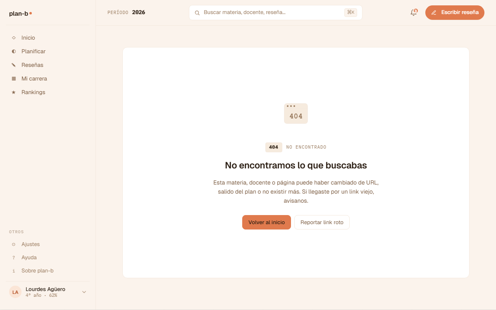
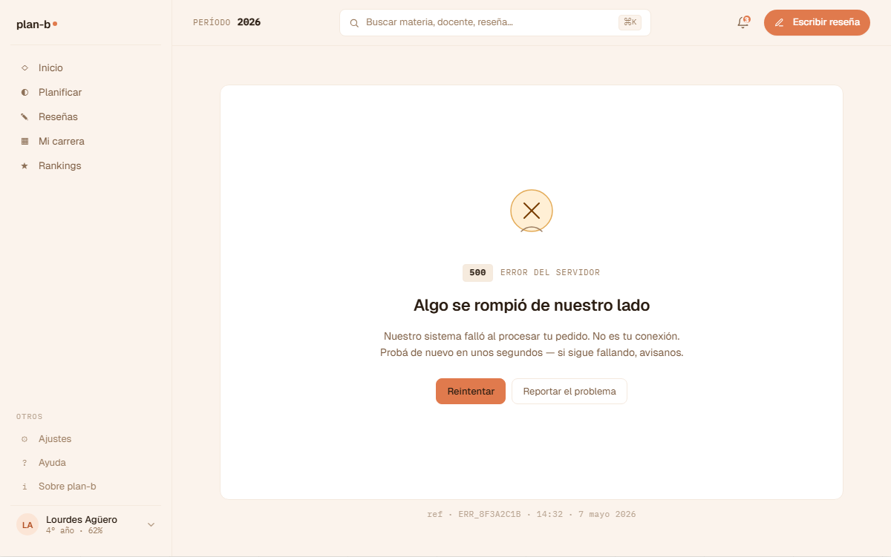

# US-078-f: Páginas de error globales (404 + 5xx)

**Status**: Backlog
**Sprint**: candidato a S5+
**Epic**: [EPIC-00: Foundations & DevEx](../epics/EPIC-00.md) (transversal)
**Priority**: Medium
**Effort**: S
**ADR refs**: [ADR-0041](../../decisions/0041-rediseño-ux-post-claude-design.md)

## Como user que tropieza con un link roto o un servidor caído, quiero ver páginas de error que mantengan el lenguaje del producto y me ofrezcan una salida clara, para no quedar varado con un error técnico genérico

Sección ⑬ del canvas v2 (`canvas-mocks/v2-errors.jsx`). Hoy Next.js 15 muestra `app/not-found.tsx` + `app/error.tsx` + `app/global-error.tsx` con stubs mínimos. Esta US los rediseña al lenguaje v2: `V2Error404` y `V2Error5xx` con AppShell + V2ErrorCard + CTAs claros.

## Acceptance Criteria

### 404 (Not found)

- [ ] `app/not-found.tsx` reescrito con la estructura del mock `V2Error404`.
- [ ] **Layout**: AppShell del `(member)` route group si hay sesión, o layout pelado del `(public)` si no la hay.
- [ ] **Card central** (`V2ErrorCard`):
  - Eyebrow mono "404 · NO ENCONTRADO".
  - Display heading "Esto no está acá."
  - Body: "El link que seguiste apunta a un lugar que no existe o ya no está. Volvé al inicio o usá el buscador."
  - 2 CTAs: `← Volver al inicio` (primary, navega a `/home` o `/` según session) + `Buscar (⌘K)` (ghost, abre el `<GlobalSearch/>` de US-071/US-056-f cuando aterrice).
  - Ghost link al fondo: "¿Pensás que es un bug? Reportá el link roto." → abre form de soporte (mailto stub o link a US-073 cuando aterrice).
- [ ] **Para member logueado**: el sidebar y topbar siguen visibles (no es un blocker total, solo el contenido se reemplaza).
- [ ] **Para visitor anónimo**: layout simplificado con solo el logo top + el card central.

### 5xx (Server error)

- [ ] `app/error.tsx` (Next.js error boundary) reescrito con `V2Error5xx`.
- [ ] **Card central**:
  - Eyebrow mono "500 · ALGO SE ROMPIÓ".
  - Display heading "Algo se rompió de nuestro lado."
  - Body: "No es culpa tuya. Si el problema persiste, contanos qué pasó (referencia: `{ref}`)."
  - **Ref code**: short ID generado client-side a partir del error (timestamp + random; mostrado en mono).
  - 2 CTAs: `Reintentar` (primary, llama `reset()` del error boundary de Next) + `Volver al inicio` (ghost).
  - Ghost link al fondo: "Reportar el problema (referencia: {ref})" → abre mailto con el ref pre-poblado.
- [ ] **`global-error.tsx`** (root error boundary): variante simplificada que no requiere shell (porque el shell mismo puede haber roto).

### Common

- [ ] Los layouts respetan el lenguaje del v2 (apricot, geist, mono code para refs).
- [ ] **Logging**: cuando se renderea `error.tsx`, se loggea el error a consola con `console.error(err)` (en prod, idealmente Sentry / similar; en MVP, console).
- [ ] **No leak de stack traces** al user. El stack solo va a consola.
- [ ] Reuso del componente `<V2ErrorCard>` portado de `canvas-mocks/v2-errors.jsx` con props `{ code, title, body, primary: { label, onClick }, secondary: { label, onClick }, ghost?: { label, onClick } }`.

## Out of scope

- **Sentry / error tracking real**: out de MVP. Solo `console.error`.
- **Páginas de error específicas por status** (401, 403, 410, etc.): out. Solo 404 + 5xx genérico. 401/403 los maneja el guard de auth (redirect a sign-in).
- **i18n**: copy en español rioplatense.
- **Animaciones / transitions**: out.
- **Mobile diseñado**: web-first. Mobile renderea como degraded UX.

## Edge cases

| Caso | Comportamiento esperado |
|---|---|
| Error 5xx en `app/error.tsx` mientras se renderea otro error | Sube al `global-error.tsx` (root boundary). |
| 404 en `(member)/.../foo` | Renderea el layout `(member)/layout.tsx` con shell + reemplaza solo `{children}` por el card 404. |
| 404 en `(public)/.../foo` | Renderea layout simplificado. |
| User en error 5xx clickea "Reintentar" | Llama `reset()` del Next error boundary. Si el error vuelve a aparecer, queda en bucle hasta que el user navegue. |
| Ref code generado | Es client-side: `crypto.randomUUID().slice(0,8)`. No persiste, no se manda al backend. |
| Backend caído en 5xx | El error boundary de cada layout se dispara. El logo del topbar (que es client) sigue funcionando, ofrece "ir al inicio". |
| Página estática del `(public)` (ej. landing) tira 5xx | Se renderea el card 5xx con layout pelado (sin shell). |

## Test scenarios

### Críticos (Given-When-Then)

1. **Given** Lucía logueada navega a `/foo-bar-no-existe`, **when** Next intenta resolver, **then** renderea `not-found.tsx` con sidebar + card 404 + CTA "Volver al inicio".
2. **Given** visitor anónimo navega a `/foo-bar`, **when** Next intenta resolver, **then** renderea 404 con layout pelado.
3. **Given** un componente client tira un error en `/home`, **when** Next captura, **then** renderea `error.tsx` con card 5xx + ref code visible.
4. **Given** card 5xx visible con `reset()` disponible, **when** Lucía clickea "Reintentar", **then** se invoca `reset()` y se intenta re-renderear.
5. **Given** click en "Reportar el problema (ref: {ref})", **when** se inspecciona, **then** abre `mailto:soporte@plan-b.app?subject=Error&body=ref={ref}`.
6. **Given** ghost link "Buscar (⌘K)" del 404, **when** Lucía clickea, **then** abre el global search de US-071 (cuando aterrice; antes: stub).

### Cobertura por capa

- **Component / vitest + RTL**: `error-card.test.tsx` (props + CTAs + ref code).
- **E2E Playwright**: spec `errors.spec.ts` que navega a una ruta inexistente + asserta el 404.

## Sub-tasks

- [ ] `components/layout/error-card.tsx` (`V2ErrorCard` reusable).
- [ ] Reescribir `app/not-found.tsx` con `V2Error404`.
- [ ] Reescribir `app/error.tsx` con `V2Error5xx`.
- [ ] Reescribir `app/global-error.tsx` (variante minimal).
- [ ] Helper `lib/error-ref.ts` para generar el ref code.
- [ ] Tests vitest component + spec E2E.
- [ ] Documentar en `docs/operations/` el mapping ref code ↔ logs (cuando exista observabilidad real).

## Notas de implementación

- **Next.js error boundaries**: cada `route group` puede tener su propio `error.tsx` que se dispara antes que el root. Esta US implementa el root + un boundary genérico de `(member)` para que el shell siga visible. `app/(public)/error.tsx` queda como override del root sin shell.
- **Ref code es decorativo en MVP**: cuando aterrice observabilidad real (Sentry o similar), el ref code se sincroniza con el `event.id` de Sentry y le pegamos al user un link real al ticket.
- **`global-error.tsx` debe importar `<html>` + `<body>`**: porque corre fuera del root layout. Usar la variante minimal sin shell.
- **No infinite loop**: si el `error.tsx` mismo lanza, Next sube al global-error. Mantener `error.tsx` simple.
- **Component reusable**: `<V2ErrorCard>` debería poder consumirse desde cualquier `error.tsx` futuro de feature (ej. `(member)/mi-carrera/error.tsx` con un copy específico de mi-carrera).

## Dependencies

- **Depende de**: [US-042-f](US-042-f.md) (AppShell, **Done**).
- **Bloquea a**: ninguna directa.
- **Relacionada con**: [US-073](US-073.md) (Ayuda, donde apunta el "Reportar problema"), [US-071](US-071.md) (búsqueda global, donde apunta el ghost link del 404).

## Refs

- DoD: [Definition of Done](../definition-of-done.md)
- Mockups:
  - . Fuente JSX en `canvas-mocks/v2-errors.jsx::V2Error404`.
  - . Fuente JSX en `canvas-mocks/v2-errors.jsx::V2Error5xx`.
- ADRs: [ADR-0041](../../decisions/0041-rediseño-ux-post-claude-design.md).
- US relacionadas: [US-073](US-073.md), [US-071](US-071.md).
