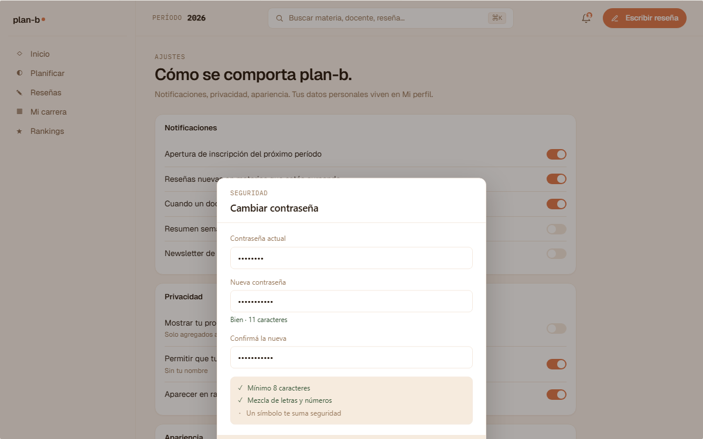

# US-079-i: Cambiar contraseña con sesión activa (integrated)

**Status**: Backlog
**Sprint**:
**Epic**: [EPIC-02: Identidad y autenticación](../epics/EPIC-02.md)
**Priority**: Medium
**Effort**: S (slice integrated chico, sigue patrón de US-029-i / US-033-i)
**ADR refs**: [ADR-0023](../../decisions/0023-auth-flow-jwt-cookie-layout-guards.md), [ADR-0034](../../decisions/0034-redis-como-cache-y-ephemeral-state.md), [ADR-0040](../../decisions/0040-notifications-como-bounded-context.md), [ADR-0041](../../decisions/0041-rediseño-ux-post-claude-design.md)

## Como member logueado, quiero cambiar mi contraseña sin tener que pedir un reset por email, verificando la contraseña actual + eligiendo una nueva, para mantener el control de mi cuenta sin fricción

Slice integrated: backend + frontend en un solo PR porque el endpoint chico + un modal y sin las 2 puntas no es shippable. Sigue el patrón de [US-029-i](US-029-i.md) (sign-out) y [US-033-i](US-033-i.md) (forgot password integrated). El flow de [US-033-i](US-033-i.md) es **reset por email** cuando el user no se acuerda; este flow es **change con sesión activa** cuando el user sí se acuerda y quiere rotar.

## Acceptance Criteria

### Backend

- [ ] `PATCH /api/me/password` con `{ currentPassword, newPassword }`.
- [ ] Requiere sesión válida (`planb_session` cookie con JWT activo).
- [ ] Valida `currentPassword` contra el hash BCrypt persistido del user. Si no matchea: 401 `identity.password.current_invalid` (sin distinguir entre "no matchea" vs "user no existe" para evitar enumeration).
- [ ] Valida `newPassword` server-side:
  - Mínimo 8 chars.
  - Distinta a `currentPassword` (rechaza si son iguales: 400 `identity.password.same_as_current`).
  - Sin política de complejidad heavy (no requirir uppercase + symbols + etc.) per ADR-0023 (privilegia length sobre complejidad, alineado a NIST SP 800-63B).
- [ ] Hash BCrypt nuevo con work factor 12.
- [ ] **Revoca todos los refresh tokens del user EXCEPTO el actual** (force re-login en otros dispositivos sin desloguear al actual). Implementación: en Redis (ADR-0034), `KEYS identity:refresh:{userHash}:*` → `DEL` todos menos el del session actual.
- [ ] **Emite `UserPasswordChanged` integration event vía Wolverine outbox** con `{ userId, changedAt, sessionTokenHash }`.
- [ ] **Notification al user vía email** (depende de US-077-b cuando aterrice). Mientras tanto, el event se emite y queda en outbox; el subscriber de notifications se enchufa cuando US-077-b esté operativo. Copy del email: "Tu contraseña se cambió hace {when}. Si no fuiste vos, escribinos a soporte@plan-b.app".
- [ ] **Audit log entry** en `identity.user_audit_log` (cuando aterrice US-086 / ADR-0042) con `action='password.changed'` + `actor_id = user.id`, `target_id = user.id`. Mientras tanto, log estructurado a stdout con el evento.
- [ ] **Rate limit**: máximo 5 intentos fallidos de `currentPassword` por hora por user. Implementado con `IRateLimiter` Redis (key `identity:ratelimit:password-change:{userId}`). Excedido devuelve 429 `identity.password.rate_limit`.
- [ ] Idempotencia: si llega el mismo body con el mismo `currentPassword` correcto pero `newPassword` ya hashea contra el actual (caso race), devuelve 200 (la nueva password ya está aplicada).
- [ ] Longitud máxima de `newPassword`: 200 chars (sane upper bound, no security issue real porque BCrypt trunca a 72 bytes pero queremos validación explícita).

### Frontend

- [ ] **Modal "Cambiar contraseña"** (port literal de `canvas-mocks/v2-modals.jsx::V2ModalCambiarContrasena`, captura `cuenta-v2-modal-pass.png`):
  - Heading display "Cambiar contraseña".
  - Subtitle: "Te vamos a desloguear de los otros dispositivos por seguridad."
  - 3 inputs (label + input password):
    1. Contraseña actual.
    2. Nueva contraseña (con hint "Mínimo 8 caracteres").
    3. Confirmar nueva contraseña.
  - Validación client-side al `onChange`:
    - Nueva ≥ 8 chars.
    - Confirmar matchea nueva.
    - Nueva distinta a actual (visible solo al submit, no on-change para no dar feedback temprano sobre cuál es la actual).
  - 2 CTAs: `Cancelar` (ghost) + `Cambiar contraseña` (primary, disabled hasta que las 3 validaciones client-side pasen).
- [ ] **Trigger**: desde `/ajustes` (US-072), sección "Seguridad", row "Contraseña" con valor "Cambiar contraseña →" abre el modal.
- [ ] **Server action** `changePasswordAction(formData)` que:
  - Llama `PATCH /api/me/password` con forwarding del cookie de sesión.
  - Si 401: muestra inline error "La contraseña actual no coincide.".
  - Si 400 `same_as_current`: error inline "La nueva contraseña tiene que ser distinta a la actual.".
  - Si 429: error inline "Demasiados intentos. Esperá una hora.".
  - Si 200: cierra modal + toast verde "Contraseña actualizada." + refresh de la página (para que la cookie nueva sirva).
- [ ] **No persiste typed values** entre apertura/cierre del modal (security: si cierra Esc, las contraseñas se borran).
- [ ] **Sin show/hide password toggle** en MVP (deuda menor; se agrega si Lucas lo pide).
- [ ] **Cookie del session actual** se mantiene válida; el user no se desloguea de ESTE dispositivo.

## Out of scope

- **Reset por email** (caso "olvidé la contraseña"): cubierto por [US-033-i](US-033-i.md).
- **Notification real al user**: depende de [US-077-b](US-077-f.md) (backend de notifications). Mientras tanto, evento se emite a outbox + se loggea; cuando aterrice US-077-b, el subscriber se enchufa sin cambiar esta US.
- **Audit log integrado**: depende de [US-086](US-086.md) que crea `identity.user_audit_log`. Mientras tanto, log estructurado a stdout cubre el caso.
- **Forzar cambio de password tras N días**: out de MVP. Si llega como requisito de compliance, sale US separada.
- **Password strength meter visual** (verde / amarillo / rojo según fortaleza): out. Solo validación de longitud.
- **2FA / TOTP / passkey**: out de MVP.
- **i18n**: copy en español rioplatense hardcoded.

## Edge cases

| Caso | Comportamiento esperado |
|---|---|
| User con OAuth (Google, no password) intenta cambiar | El endpoint devuelve 400 `identity.password.no_local_credential`. Frontend muestra "Tu cuenta usa Google. Cambiá la contraseña en Google.". |
| `currentPassword` correcto + `newPassword` igual | 400 `same_as_current`. |
| `newPassword` < 8 chars | 400 con field error `newPassword.too_short`. |
| User intenta 6 veces seguidas con `currentPassword` mal | Primeras 5 devuelven 401. 6ta devuelve 429 con `Retry-After` 1h. |
| Cambio exitoso + user clickea login en otro dispositivo | El refresh token viejo no sirve (revocado). El user reingresa con la nueva contraseña. |
| Cambio exitoso + user pierde conexión antes del toast | El backend ya aplicó el cambio. El user puede usar la nueva password al volver. |
| Modal abierto + user cambia de tab + vuelve | Inputs se mantienen typed (no perder progress). Pero al cerrar el modal explícito, se borran. |
| Endpoint llamado sin cookie de sesión | 401 `identity.unauthorized`. Guard del frontend `(member)` no debería dejar pasar, pero defensa en backend. |
| Race: user cambia password en tab A, tab B intenta con la vieja | Tab B recibe 401 al validar current. Mensaje pide actualizar y reintentar. |
| `newPassword` con 73+ bytes (BCrypt trunca a 72) | Backend valida que el plaintext ≤ 200 chars antes de hashear. Si llega más, 400 con `too_long`. |
| User logueado en 3 dispositivos cambia password en uno | Los otros 2 quedan deslogueados (refresh tokens revocados). El que cambió sigue activo. |

## Test scenarios

### Críticos (Given-When-Then)

1. **Given** Lucía logueada con password `vieja-123`, **when** abre modal en Ajustes + tipea actual=`vieja-123` + nueva=`nueva-456` + confirmar=`nueva-456` + clickea Cambiar, **then** backend valida current OK + hash nuevo persiste + refresh tokens viejos revocados (excepto el actual) + evento emitido + toast verde.
2. **Given** Lucía tipea actual=`equivocada`, **when** clickea Cambiar, **then** inline error "La contraseña actual no coincide." sin perder los otros campos.
3. **Given** Lucía tipea actual=`vieja-123` + nueva=`vieja-123`, **when** clickea Cambiar, **then** inline error "La nueva contraseña tiene que ser distinta a la actual.".
4. **Given** Lucía tipea actual=`equivocada` 5 veces, **when** clickea Cambiar la 6ta, **then** error "Demasiados intentos. Esperá una hora." (429).
5. **Given** Lucía cambió password exitoso en dispositivo A, **when** intenta login en dispositivo B con password vieja, **then** 401 (refresh token revocado).
6. **Given** Lucía con OAuth Google intenta cambiar password, **when** clickea Cambiar, **then** error "Tu cuenta usa Google. Cambiá la contraseña en Google.".

### Cobertura por capa

- **Unit / xUnit**:
  - `ChangePasswordCommandValidator.tests.cs` (min length, distinct from current, max length, no-OAuth).
  - `BCryptVerifier.tests.cs` (current matchea, no matchea).
- **Integration backend**:
  - `ChangePassword_HappyPath.cs`: cambia OK + refresh revocados + evento.
  - `ChangePassword_CurrentInvalid_Returns401.cs`.
  - `ChangePassword_SameAsCurrent_Returns400.cs`.
  - `ChangePassword_RateLimit.cs`: 5 fallidas + 6ta es 429.
  - `ChangePassword_OAuthUser_Returns400.cs`.
- **Component / vitest + RTL**:
  - `change-password-modal.test.tsx`: render, validation client-side, submit, error states.
- **E2E Playwright**:
  - `frontend/e2e/dashboard/change-password.spec.ts` con Lucía logueada: abrir Ajustes → modal → cambiar → verify refresh deslogueado en otra session.

## Sub-tasks

### Backend

- [ ] Comando `ChangePasswordCommand` + `ChangePasswordCommandHandler` en `Planb.Identity.Application/Features/ChangePassword/`.
- [ ] Validator con FluentValidation (length + distinct + OAuth check).
- [ ] BCrypt verify + rehash (work factor 12 alineado a sign-up).
- [ ] Llamar `IRefreshTokenStore.RevokeAllForUserExceptAsync(userId, currentSessionTokenHash)` (extender o crear el método).
- [ ] Emitir `UserPasswordChanged` event vía Wolverine outbox.
- [ ] Rate limiter con `IRateLimiter` Redis.
- [ ] Endpoint Carter `PATCH /api/me/password`.
- [ ] Audit log entry (cuando US-086 esté disponible; mientras tanto structured log).
- [ ] Integration tests.

### Frontend

- [ ] `features/change-password/{actions.ts,schema.ts,components/change-password-modal.tsx,types.ts}`.
- [ ] Zod schema compartido client + server (length, distinct, confirm matches).
- [ ] Update `/ajustes` (US-072) para que el row "Contraseña" abra este modal.
- [ ] Toast on success + error inline mappings.
- [ ] Spec E2E.

## Notas de implementación

- **Slice integrated por convención**: backend + frontend en el mismo PR. Patrón de US-029-i / US-033-i. Si crece más, splittear pero hoy no se justifica.
- **Revocar refresh excepto el actual**: el handler tiene el `sessionTokenHash` del JWT actual (viene en el claim del cookie). Se pasa al `IRefreshTokenStore` como exception list. Si el método no existe todavía, extenderlo en este slice.
- **No re-loguear al user actual**: el cookie de sesión actual se preserva. El JWT no caduca por el cambio de password (porque es stateless). El próximo refresh va a pedir el refresh token, que también se preserva para esta session.
- **Backwards-compat**: users existentes con BCrypt work factor distinto (si llegamos a cambiarlo) se re-hashean en este flow al cambiar (oportunidad de migration).
- **OAuth-only users**: hoy en MVP todos los users tienen password local (OAuth aún no implementado). Cuando aterrice OAuth, el campo `User.passwordHash` queda nullable; el handler ya está preparado para devolver 400 si es null.
- **El modal NO se reusa para el reset por email** ([US-033-i](US-033-i.md)): este modal pide actual + nueva + confirmar. El reset por email pide solo nueva + confirmar (porque ya verificó identidad con el token del email). Distintos componentes.
- **`Subtitle` del modal "Te vamos a desloguear de los otros dispositivos por seguridad"**: explicit consent del comportamiento. Sin disclaimer, el user se asusta si su tablet pierde sesión.

## Dependencies

- **Depende de**: [US-028-b](US-028-b.md) (login backend, donde está el BCrypt + JWT stack), [US-033-i](US-033-i.md) (define el `IRefreshTokenStore` que extendemos acá), [US-072](US-072.md) (define el row "Contraseña" en Ajustes que linkea a este modal). **Sin US-072 implementado, esta US no tiene trigger UI**, pero backend puede aterrizar antes (deuda visible).
- **Bloquea a**: ninguna directa.
- **Soft dep (no bloqueante)**: [US-077-b](US-077-f.md) backend de notifications (para el email de aviso) + [US-086](US-086.md) audit log per-user (para la entry de audit). Esta US emite el event y loguea; cuando US-077-b / US-086 aterricen, los subscribers se enchufan sin cambiar este flow.
- **Relacionada con**: [US-029-i](US-029-i.md) (mismo patrón de slice integrated), [US-033-i](US-033-i.md) (reset por email, flow hermano), [US-068](US-068.md) (disable user revoca refresh tokens también; mecanismo compartido).

## Refs

- DoD: [Definition of Done](../definition-of-done.md)
- Mockup: . Fuente JSX en `canvas-mocks/v2-modals.jsx::V2ModalCambiarContrasena`.
- ADRs: [ADR-0023](../../decisions/0023-auth-flow-jwt-cookie-layout-guards.md), [ADR-0034](../../decisions/0034-redis-como-cache-y-ephemeral-state.md), [ADR-0040](../../decisions/0040-notifications-como-bounded-context.md), [ADR-0041](../../decisions/0041-rediseño-ux-post-claude-design.md).
- US relacionadas: [US-072](US-072.md), [US-033-i](US-033-i.md), [US-029-i](US-029-i.md), [US-068](US-068.md), [US-077-f](US-077-f.md).
