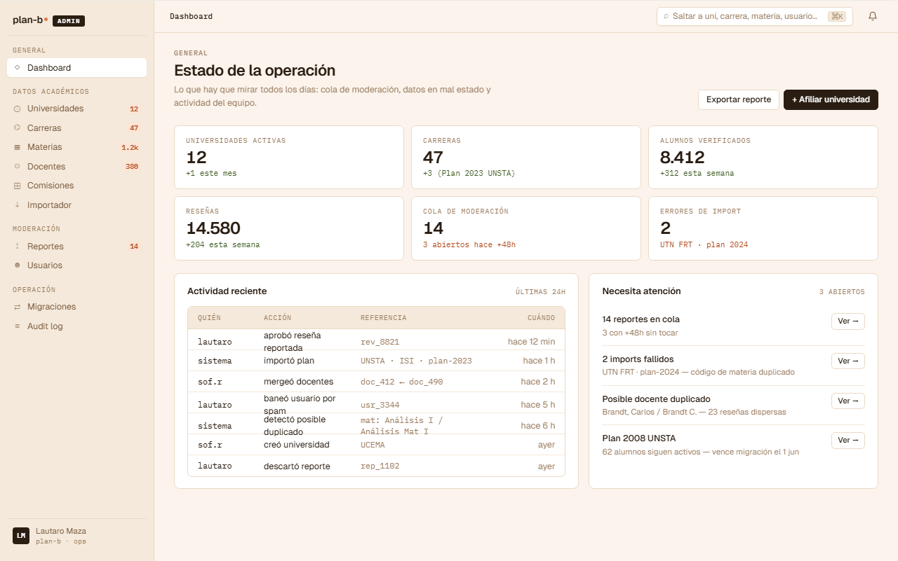

# US-081: Dashboard ops del admin (KPIs + cola)

**Status**: Backlog
**Sprint**: candidato a post-MVP (depende de cuándo aterrice el primer admin real)
**Epic**: [EPIC-09: Backoffice de cuentas staff](../epics/EPIC-09.md)
**Priority**: Medium
**Effort**: M
**ADR refs**: [ADR-0041](../../decisions/0041-rediseño-ux-post-claude-design.md)

## Como admin del equipo plan-b, quiero abrir el backoffice y ver de un vistazo qué está pasando (KPIs de tráfico, cola de moderación, errores de import, universidades pendientes) para priorizar el trabajo del día

Sección ⓪ del canvas admin (`canvas-mocks/admin-shell.jsx::AdmDashboard`). Es la pantalla por defecto al loguearse al `/admin`. Combina: shell con sidebar de admin + topbar con breadcrumbs + grid de KPIs globales + panel "Necesita atención" + feed de actividad reciente.

## Acceptance Criteria

- [ ] Ruta `/admin` en route group `(staff)` (rol `admin`). Página por defecto del backoffice.
- [ ] **Shell del admin** (port de `admin-shell.jsx::AdmShell`): sidebar 220px con grupos (Operación, Datos académicos, Moderación, Sistema) + topbar 46px con breadcrumbs + search global + bell + avatar.
- [ ] **Grid de KPIs globales** (4 stat cards):
  - "Universidades activas" + delta semanal.
  - "Reseñas publicadas (últimos 30d)" + delta.
  - "Reportes abiertos" (con tag warning si > threshold).
  - "Errores de import (últimos 7d)" (con tag critical si > 0).
- [ ] **Panel "Necesita atención"**: card con lista de items priorizados:
  - Reportes vencidos (sin decisión > 48h).
  - Universidades en estado Beta con > N alumnos (listo para pasar a Pública).
  - Materias con flag "huérfana" o "sin docente".
  - Errores de import sin resolver.
  - Cada item con CTA "Ir →" al detalle correspondiente.
- [ ] **Feed de actividad reciente**: timeline de eventos (último admin que decidió un report, última uni afiliada, último merge de duplicados, último user baneado). **Implementación del feed (read model cross-BC + UI) cubierta por [US-087](US-087.md)**; esta US solo monta el panel `<FeedPanel>` en el layout del dashboard.
- [ ] **Sin scoping por universidad en MVP**: el dashboard es global (no por-uni). Cuando aterrice US-080 dashboard institucional (vista filtrada por uni para `university_staff`), esta US queda como vista admin-only.
- [ ] **Mock data**: 100% mock en frontend hasta que aterrice un endpoint `/api/admin/ops/dashboard` que agregue contadores cross-BC.

## Out of scope

- **Dashboard por-uni** para `university_staff` (rol distinto): cubierto por [US-080](US-080.md) cuando aterrice. Esta US es solo para `admin` plan-b.
- **Charts complejos** (líneas de tendencia, distribuciones): out de MVP. Solo stat cards numéricos + tablas.
- **Drill-down interactivo** desde KPIs: clickear "Reportes abiertos" navega a `/admin/moderacion` con filtro; no hay tooltip ni preview inline.
- **Configurar widgets** del dashboard: layout fijo, no customizable.
- **Notificaciones push para admins**: out (los admins entran al backoffice deliberadamente).

## Edge cases

| Caso | Comportamiento esperado |
|---|---|
| Primer admin que entra (sin data) | KPIs muestran ceros, panel "Necesita atención" empty con mensaje "Todo en orden por ahora". |
| Reportes abiertos > 50 | Stat card muestra `50+` y tag warning. |
| Errores de import > 0 | Stat card en rojo con dot pulsante. CTA "Resolver →". |
| Admin con rol pero sin permisos cross-uni (futuro) | Vista filtrada al scope (post-MVP cuando aterrice scoping). |
| Network error al fetch | Skeleton loading + retry button. No bloquear el shell. |

## Test scenarios

### Críticos (Given-When-Then)

1. **Given** admin loguea a `/admin`, **when** la página renderea, **then** ve shell + 4 stat cards + panel "Necesita atención" + feed.
2. **Given** mock con 3 reportes vencidos, **when** se inspecciona el panel "Necesita atención", **then** lista los 3 con CTA "Ir →".
3. **Given** mock con `errores_import > 0`, **when** se inspecciona la stat card, **then** se renderea en rojo.
4. **Given** click en stat card "Reportes abiertos", **when** se inspecciona, **then** navega a `/admin/moderacion/reportes` (cubierto por US-050).
5. **Given** un visitor sin rol admin entra a `/admin`, **when** el guard `(staff)` chequea, **then** redirige a `/sign-in` con error "Sin permisos".

### Cobertura por capa

- **Component / vitest + RTL**: `kpi-card.test.tsx`, `attention-panel.test.tsx`, `activity-feed.test.tsx`.
- **E2E Playwright**: spec `admin-dashboard.spec.ts` con un admin seedeado.

## Sub-tasks

### Backend

- [ ] Endpoint `GET /api/admin/ops/dashboard` que devuelve `{ kpis, attention[], activity[] }`.
- [ ] Cada contador es una query Dapper que pega a las tablas de cada módulo respetando persistence ignorance (sin FKs cross-BC).
- [ ] Cache Redis con TTL 60s (no es real-time, pero tampoco refresca cada minuto).
- [ ] Authorization: solo rol `admin` (no `university_staff` que tiene scope distinto).

### Frontend

- [ ] `app/(staff)/admin/page.tsx` con layout `admin-shell`.
- [ ] `components/layout/admin-shell.tsx` (sidebar + topbar) reusable para todas las vistas admin.
- [ ] `features/admin-dashboard/{api.ts,components/{kpi-grid,attention-panel,activity-feed,kpi-card}.tsx,types.ts}`.
- [ ] Sidebar del admin con todos los items: Dashboard / Universidades / Materias / Docentes / Comisiones / Reportes / Usuarios / Migraciones / Audit log / Sistema.
- [ ] Tests + spec E2E.

## Notas de implementación

- **Shell del admin distinto del shell del alumno**: el admin tiene tipografía más densa, tablas en lugar de cards, mono para IDs. Mismo design system, otro registro. Variables CSS específicas `--adm-*` ya están definidas en `plan-b-admin.html`.
- **Sin scoping por uni**: en MVP el equipo plan-b es todo full-admin. Cuando lleguen staff de universidades, el scoping va a una US separada (probablemente US-080 + extensiones).
- **Caché 60s**: balance entre frescura y costo. Los admins refrescan manualmente si necesitan ver algo en tiempo real.
- **Actividad reciente**: el feed lee de un audit log global (consolidar US-053 a nivel app, no solo per-review).

## Dependencies

- **Depende de**: [US-067](US-067.md) (cuentas staff backend para login del admin), [US-068](US-068.md) (admin permisos).
- **Bloquea a**: ninguna directa.
- **Relacionada con**: [US-080](US-080.md) (dashboard university_staff, scope distinto), [US-050](US-050.md) (cola de reportes, KPI feeds esta vista), [US-087](US-087.md) (feed de actividad reciente, read model cross-BC que se monta en este dashboard), todas las US del backoffice catálogo (US-060..065).

## Refs

- DoD: [Definition of Done](../definition-of-done.md)
- Mockup: . Fuente JSX en `canvas-mocks/admin-shell.jsx::AdmDashboard` + tokens en `plan-b-admin.html` (`--adm-*` CSS vars).
- ADRs: [ADR-0041](../../decisions/0041-rediseño-ux-post-claude-design.md), [ADR-0034](../../decisions/0034-redis-como-cache-y-ephemeral-state.md).
- US relacionadas: [US-080](US-080.md), [US-067](US-067.md), [US-068](US-068.md), [US-050](US-050.md), [US-082](US-082.md), [US-083](US-083.md), [US-084](US-084.md).
