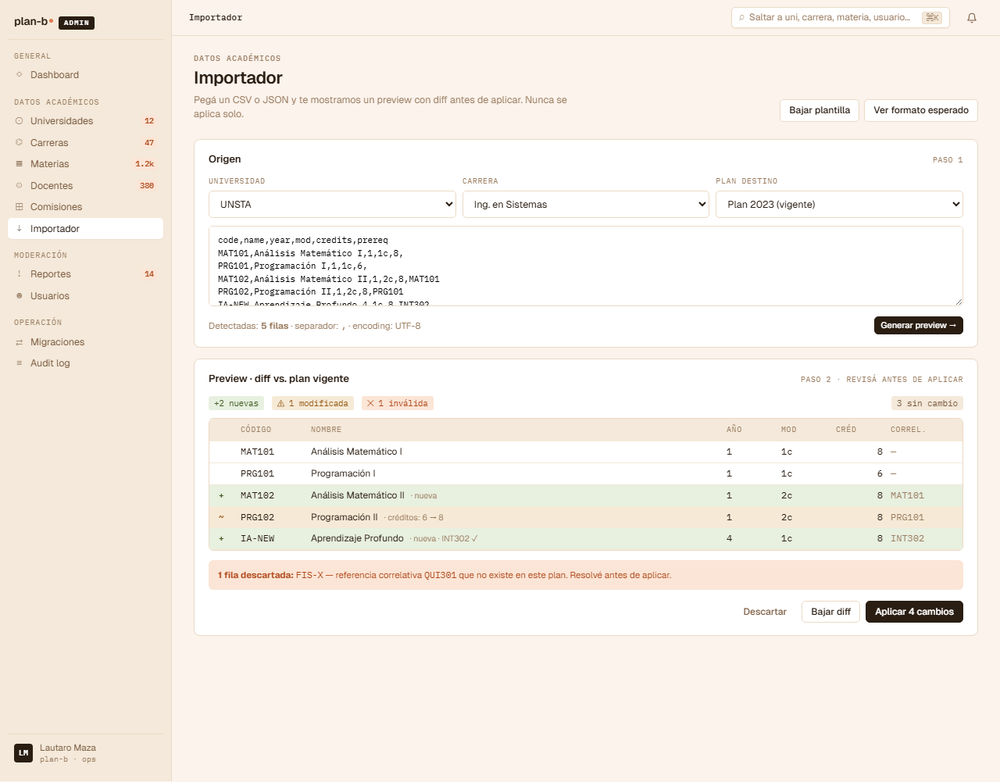

# US-082: Importador de plan con preview/diff (CSV → catálogo)

**Status**: Backlog
**Sprint**: candidato a post-MVP, depende de US-060..062 (catálogo backend)
**Epic**: [EPIC-08: Backoffice de catálogo](../epics/EPIC-08.md)
**Priority**: High (operación crítica recurrente, no solo onboarding)
**Effort**: L
**ADR refs**: [ADR-0041](../../decisions/0041-rediseño-ux-post-claude-design.md)

## Como admin del equipo plan-b, quiero pegar un CSV con materias / docentes / comisiones, ver el preview en diff (qué se agrega, qué se modifica, qué falla por correlativa rota), y aplicar solo lo válido sin tener que cargar materia por materia

Sección ② del canvas admin (`canvas-mocks/admin-screens-1.jsx::AdmImportador`). Aparece tanto como step 3 del wizard de afiliación inicial (US-060/US-061) como acción recurrente desde `/admin/datos/planes/{id}/importar`. Es la herramienta operacional que diferencia "cargar el plan en 10 minutos" de "cargar el plan en 3 días manualmente".

## Acceptance Criteria

- [ ] Ruta `/admin/datos/planes/{planId}/importar` accesible para rol `admin`. También invocable como step embedded desde el wizard de US-060.
- [ ] **Input principal**: textarea grande pegando CSV. Soporta formatos:
  - Headers obligatorios: `codigo, nombre, anio, modalidad`. Opcionales: `horas, prerequisitos` (lista de códigos separados por `|`).
  - Separador: coma. Tolera quoted strings.
  - Encoding: UTF-8 (rechaza ISO-8859-1 con error claro).
- [ ] **Preview**: al pegar / parsear, render side-by-side debajo del textarea:
  - **Diff por row**: gutter con `+ / ~ / ✕ / =` (nueva / modificada / inválida / sin cambio).
  - Columnas: gutter, código, nombre, año, modalidad, horas, prerequisitos.
  - Background por estado: verde claro (add), naranja claro (mod), rojo claro (inválida), neutral (sin cambio).
- [ ] **Validaciones automáticas** que arman el estado `inválida`:
  - Código duplicado dentro del CSV.
  - Código ya existe en otra carrera del mismo plan con datos distintos.
  - Prerequisito referencia un código que no existe en este plan ni en el CSV.
  - Modalidad fuera del enum permitido (`1c|2c|anual|bim1|...`).
- [ ] **Toolbar superior** del preview:
  - Counter: `+12 nuevas / ~3 modificadas / ✕ 2 inválidas / = 28 sin cambio`.
  - 2 CTAs: `Cancelar` (ghost) + `Aplicar 15 cambios` (primary, count = add + mod; ignora inválidas).
  - Switch "Esconder filas sin cambio" para foco.
- [ ] **Apply**: confirma con modal "¿Aplicar 15 cambios al plan 2023?" + lista de impactos (N alumnos con planes activos afectados → ver US-084). Al confirmar:
  - Backend ejecuta upsert transaccional (todo o nada).
  - Las rows inválidas quedan rechazadas con razón en log.
  - Emite `PlanImported` event con `{ planId, addedCount, modifiedCount, rejectedCount }`.
  - Redirige a `/admin/datos/planes/{planId}` con toast "Plan actualizado".
- [ ] **Endpoint**: `POST /api/admin/plans/{planId}/import` con body `{ csv: string }` que devuelve `{ preview: { row, status, current, incoming, errors[] }[] }` cuando se llama con `?dry=true` (preview) o aplica cuando `?dry=false`.
- [ ] **Audit log entry**: `action='plan.imported'`, payload con counts + diff resumen.

## Out of scope

- **Importar docentes / comisiones**: scope de esta US es solo materias + correlativas. Docentes (US-063) y Comisiones (US-065) tienen sus propios importadores variants si se vuelven críticos.
- **Mapping interactivo de columnas** (CSV con headers distintos): asume headers exactos. Si el CSV viene con headers en otro idioma, el admin renombra antes de pegar.
- **Migración de StudentProfiles afectados**: cubierto por [US-084](US-084.md) (migración asistida).
- **Undo**: el apply es transaccional pero no hay rollback de un import ya commiteado. Si hubo error, el admin re-pega CSV con la corrección y vuelve a aplicar.
- **Excel direct paste**: no soportar `.xlsx`. El admin exporta a CSV antes.
- **Validación de horas y plan check**: validamos enum de modalidad pero no chequeamos "este plan tiene > X horas totales". Eso es out.

## Edge cases

| Caso | Comportamiento esperado |
|---|---|
| CSV con > 500 rows | Parser funciona pero advierte "muchas rows; verificá antes de aplicar". Preview pagina de 50 en 50. |
| CSV con BOM UTF-8 | Parser limpia BOM. |
| Encoding wrong (ISO-8859-1 paste) | Detecta caracteres raros, muestra error "Encoding inválido, exportá como UTF-8". |
| Apply con 0 cambios | Botón disabled. Mensaje "Nada para aplicar". |
| Apply con error transaccional backend | Toast rojo + preview se mantiene + log con la razón. |
| Plan vigente con StudentProfiles activos afectados | Modal de confirmación con "Esto va a afectar a N alumnos → considera migración asistida (US-084) antes de aplicar". |
| CSV vacío | Validación inline "Pegá el contenido del CSV". |
| Apply con prerequisito que apunta a materia que se va a borrar en el mismo import | Inválida. |
| Apply mientras otro admin está editando el plan a mano | Lock optimista: si el `updatedAt` cambió, falla con "El plan fue modificado mientras importabas". El admin debe refrescar. |

## Test scenarios

### Críticos (Given-When-Then)

1. **Given** admin pega CSV con 5 materias nuevas, **when** se inspecciona el preview, **then** ve 5 rows con gutter `+` verde.
2. **Given** CSV con un código duplicado, **when** parsea, **then** ambas filas se marcan `✕` con razón "Código duplicado en CSV".
3. **Given** preview con +5 / ✕ 2, **when** clickea "Aplicar 5 cambios", **then** se aplican solo las 5 válidas y las 2 inválidas se ignoran.
4. **Given** apply exitoso, **when** se confirma, **then** redirige a detalle del plan + toast "Plan actualizado".
5. **Given** apply con plan que tiene StudentProfiles activos, **when** se inspecciona el modal de confirm, **then** advierte sobre US-084.

### Cobertura por capa

- **Unit / vitest**: `csv-parser.test.ts`, `validate-row.test.ts`, `diff-rows.test.ts`.
- **Integration backend**: parser + validator + upsert transaccional.
- **Component / vitest + RTL**: `import-preview.test.tsx`, `diff-row.test.tsx`.
- **E2E Playwright**: spec `import-plan.spec.ts` con admin: pegar CSV → preview → apply.

## Sub-tasks

### Backend

- [ ] Parser CSV (sin librería pesada; un parser RFC 4180 simple alcanza).
- [ ] `IPlanImportValidator` domain service con reglas: duplicate code, prereq missing, modality enum, etc.
- [ ] Comando `ImportPlanCommand` (dry mode + apply mode) + handler con transacción EF Core.
- [ ] Endpoint Carter `POST /api/admin/plans/{id}/import?dry=bool`.
- [ ] Emite `PlanImported` integration event.
- [ ] Tests integration: happy path, duplicados, prereq invalido, encoding errors.

### Frontend

- [ ] `app/(staff)/admin/datos/planes/[planId]/importar/page.tsx`.
- [ ] `features/admin-plan-import/{api.ts,actions.ts,components/{csv-textarea,import-preview,diff-row,apply-modal}.tsx,types.ts}`.
- [ ] Embedding como step del wizard US-060 (props para pre-poblar `planId`).
- [ ] Tests vitest unit + component + spec E2E.

## Notas de implementación

- **Por qué CSV y no upload de XLSX**: CSV es el menor común denominador. Si el admin tiene un Excel, exporta CSV en 2 clicks. Soportar XLSX implica librería pesada en backend (EPPlus, ClosedXML) que arrastra dependencias C++/Office.
- **Apply transaccional**: si una row falla durante el upsert, rollback total. Mejor "todo o nada" que "10 OK + 5 con error".
- **Preview con dry=true**: parsea + valida + devuelve diff sin escribir. Permite que el admin itere CSV hasta que esté limpio.
- **Lock optimista**: usar `updatedAt` del plan como concurrency token. Evita race entre dos admins editando.
- **Audit log obligatorio**: cualquier import cambia el catálogo público. Necesitamos saber quién y cuándo.

## Dependencies

- **Depende de**: [US-060](US-060.md) (University CRUD), [US-061](US-061.md) (CareerPlan CRUD), [US-062](US-062.md) (Subject CRUD + Prerequisite).
- **Bloquea a**: aceleración del onboarding inicial de universidades (afiliar uni se demora 3-5x sin importador).
- **Relacionada con**: [US-084](US-084.md) (migración asistida cuando el import cambia un plan vigente), [US-053](US-053.md) (audit log).

## Refs

- DoD: [Definition of Done](../definition-of-done.md)
- Mockup: . Fuente JSX en `canvas-mocks/admin-screens-1.jsx::AdmImportador`.
- ADRs: [ADR-0041](../../decisions/0041-rediseño-ux-post-claude-design.md).
- US relacionadas: [US-060](US-060.md), [US-061](US-061.md), [US-062](US-062.md), [US-084](US-084.md), [US-053](US-053.md).
