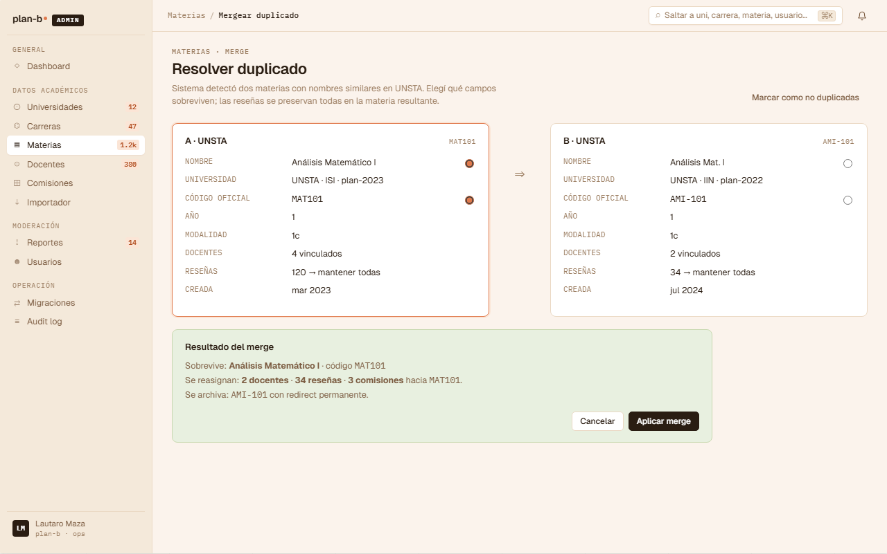

# US-083: Merge de Subjects duplicados (admin)

**Status**: Backlog
**Sprint**: candidato a post-MVP
**Epic**: [EPIC-08: Backoffice de catálogo](../epics/EPIC-08.md)
**Priority**: Medium (recurrente cuando se afilia uni nueva o se importa CSV con dups)
**Effort**: L (operación destructiva con cascada cross-BC)
**ADR refs**: [ADR-0041](../../decisions/0041-rediseño-ux-post-claude-design.md), [ADR-0030](../../decisions/0030-cross-bc-consistency-via-wolverine-outbox.md)

## Como admin, quiero fusionar dos materias detectadas como duplicado (ej. "BD I" cargada en plan 2018 y "Bases de Datos I" cargada en plan 2023 que son la misma) eligiendo qué campos sobreviven, para que las reseñas, comisiones y enrollments reapunten a una sola Subject sin perder data

Sección ② del canvas admin (`canvas-mocks/admin-screens-2.jsx::AdmMateriasMerge`). NINGUNA US existente cubre merge; US-062 cubre CRUD pero no fusión. El merge es operación destructiva con consecuencias cross-BC: la materia "perdedora" desaparece y todo lo que la referenciaba (Review, EnrollmentRecord, Commission) debe reapuntar a la sobreviviente.

## Acceptance Criteria

- [ ] Ruta `/admin/datos/materias/merge?a={idA}&b={idB}` accesible para rol `admin`. Se llega desde:
  - Tabla `/admin/datos/materias` con flag "posible duplicado" → CTA "Resolver duplicado".
  - CTA "Detectar duplicados" del header del catálogo.
- [ ] **Layout side-by-side**: dos columnas con el detalle de cada Subject (A y B). Header con código + nombre + uni + plan.
- [ ] **Por cada campo** (código, nombre, año, modalidad, horas, prerequisitos, descripción): radio button "Usar A" / "Usar B" + preview del valor seleccionado en una tercera columna "Resultado".
- [ ] **Detector de conflictos**: cuando A y B tienen valores distintos, el campo se resalta con dot warning. Si son iguales, el radio queda checked en ambos sin warning.
- [ ] **Resumen de impacto** (panel inferior):
  - "Esto va a afectar: N reseñas + M comisiones + K enrollments + J planes que referencian las dos materias."
  - Por cada referencia, mostrar count.
  - Link "Ver detalle" expande lista paginada.
- [ ] **Decisión "qué borrar"**: por default, A sobrevive y B se elimina (soft delete con `mergedIntoId = A`). Toggle para invertir.
- [ ] **Botón "Aplicar merge"** (warn destructive, requiere typed-confirm `MERGE` o el código de A):
  - Modal de confirmación final con:
    - Heading "¿Fusionar B en A?".
    - Recuento de afectados.
    - Disclaimer "Acción irreversible (rollback solo via support con backup).".
  - 2 CTAs: `Cancelar` (ghost) + `Aplicar fusión` (warn).
- [ ] **Backend**: endpoint `POST /api/admin/subjects/merge` con body `{ survivorId, mergedId, fieldChoices: {[field]: 'A'|'B'} }`. El handler:
  - En transacción:
    - Update Subject A con los campos elegidos.
    - Marcar Subject B con `MergedIntoId = A.Id` + `DeletedAt = now()`.
    - Re-apuntar Reviews donde `subjectId = B` a A (via projection rebuild).
    - Re-apuntar Commissions donde `subjectId = B` a A.
    - Re-apuntar EnrollmentRecords donde `subjectId = B` a A.
    - Actualizar Prerequisites que referenciaban B para que referencien A.
  - Emite `SubjectMerged` integration event con `{ survivorId, mergedId, fieldChoices }`.
  - Audit log entry con `action='subject.merged'`.
- [ ] **Idempotencia**: si se intenta mergear B en A pero B ya fue mergeada (tiene `MergedIntoId`), devuelve 409 con mensaje claro.
- [ ] **Redirect URL para B**: cualquier intento de acceder a `/admin/datos/materias/{B.Id}` después del merge redirige 301 a `/admin/datos/materias/{A.Id}` (B sigue accesible en el listing con tag "fusionada").

## Out of scope

- **Detección automática de duplicados via embedding/fuzzy match**: el admin marca manualmente cuáles fusionar. La detección "posible duplicado" en el listing puede ser un simple match de nombre normalizado o de código, no IA.
- **Merge entre Subjects de planes distintos sin warning**: el flow asume que el admin verificó que efectivamente son la misma materia. La UI advierte cross-plan pero no bloquea.
- **Undo del merge**: out de MVP. Si se equivocó, se restaura via backup DB.
- **Merge en cascada de prerequisitos**: si A.prereq = X y B.prereq = X, queda X una sola vez. Si A.prereq = X y B.prereq = Y, se unen ambos (X + Y) por default; el admin puede deseleccionar.
- **Merge de Teachers / Commissions / Universities**: solo Subjects en esta US. Si hace falta merge de docentes, sale US separada (similar pattern).

## Edge cases

| Caso | Comportamiento esperado |
|---|---|
| A y B con códigos iguales en el mismo plan | El listing los detecta como dup. Merge OK. |
| A y B en planes distintos | Warning visible "Cross-plan: confirmá que es la misma materia". |
| A tiene 50+ reseñas, B tiene 0 | Recuento muestra "A: 50, B: 0". Default: A sobrevive. |
| B tiene reseñas y A no | Defaultear sobreviviente al que más data tiene (B). |
| Admin selecciona "Usar B" en TODOS los campos | Equivalente a "B sobrevive, A muere". Sistema permite. |
| Conflicto en `código`: A=ISW301, B=BD301 | Mostrar warning, requiere decisión manual del campo. |
| Concurrencia: dos admins intentan mergear el mismo par | Lock optimista: el segundo recibe 409 con "Ya fue mergeada por X". |
| Aplicar con typed-confirm vacío | Botón disabled. |
| Backend falla mid-merge (network blip) | Transacción aborta, nada se aplica. Toast de error. |
| Re-apuntar EnrollmentRecord donde el alumno ya tenía la otra materia | Conflict por UNIQUE: alumno tendría dos enrollments de la misma materia. El handler detecta + reporta + cancela el merge con mensaje "Conflicto: alumno X tiene ambas materias en su historial". |

## Test scenarios

### Críticos (Given-When-Then)

1. **Given** admin abre merge de A=ISW301 y B=BD301 con conflictos en código y nombre, **when** elige "Usar A" en código y "Usar B" en nombre, **then** ve preview "ISW301 · Bases de Datos I".
2. **Given** merge OK + typed-confirm `MERGE`, **when** clickea "Aplicar fusión", **then** backend re-apunta reseñas + commissions + enrollments + emite `SubjectMerged`.
3. **Given** intento de mergear una Subject que ya tiene `MergedIntoId`, **when** backend procesa, **then** devuelve 409.
4. **Given** después del merge, **when** alguien navega a `/admin/datos/materias/{B.Id}`, **then** redirige a A con tag "fusionada".
5. **Given** conflict de UNIQUE en EnrollmentRecord, **when** backend valida, **then** cancela el merge con mensaje específico.

### Cobertura por capa

- **Unit / vitest**: `merge-field-resolver.test.ts` (lógica de elegir campos), `impact-counter.test.ts`.
- **Integration backend**: transacción + re-apuntar Reviews/Commissions/Enrollments + idempotencia + UNIQUE conflict.
- **Component / vitest + RTL**: `merge-side-by-side.test.tsx`, `field-radio.test.tsx`, `apply-modal.test.tsx`.
- **E2E Playwright**: spec `subject-merge.spec.ts` con seeded duplicate.

## Sub-tasks

### Backend

- [ ] Migration: agregar campos `MergedIntoId` (FK self-ref nullable) + `DeletedAt` a `Subject` aggregate.
- [ ] Comando `MergeSubjectsCommand` + handler con transacción.
- [ ] Re-apuntar Reviews / Commissions / EnrollmentRecords / Prerequisites en el mismo `SaveChangesAsync`.
- [ ] Cross-BC: emitir `SubjectMerged` via Wolverine outbox; los BCs que consumen (Reviews, Enrollments, Planning si aplica) actualizan sus projections.
- [ ] Endpoint Carter `POST /api/admin/subjects/merge`.
- [ ] Tests integration: happy path, conflicto UNIQUE, idempotencia, redirect URL.

### Frontend

- [ ] `app/(staff)/admin/datos/materias/merge/page.tsx` (server component con prefetch de A y B).
- [ ] `features/admin-subject-merge/{api.ts,actions.ts,components/{side-by-side,field-radio,impact-summary,apply-modal}.tsx,types.ts}`.
- [ ] Trigger desde `/admin/datos/materias` row con flag.
- [ ] Tests vitest unit + component + spec E2E.

## Notas de implementación

- **`MergedIntoId` como FK self-ref**: standard pattern. Permite consultar "qué fusionó qué" sin perder historial.
- **Re-apuntar via projection rebuild vs update directo**: depende del BC. Reviews y Enrollments mantienen sus propias projections (Dapper read models); el evento `SubjectMerged` dispara el rebuild. Las tablas de write side se actualizan directo en la transacción.
- **Cross-BC events son críticos**: si el rebuild falla en Reviews o Enrollments, el merge backend ya pasó pero los reads están stale. Idempotencia + retry del Wolverine outbox cubre esto.
- **Typed-confirm reusable**: usar el patrón de `delete-account-button` que ya existe en frontend.
- **Side-by-side compacto**: el canvas muestra layout 2-col con tercera col resultado. Usar grid `1fr 1fr 1fr` con header sticky.

## Dependencies

- **Depende de**: [US-062](US-062.md) (Subject CRUD), [US-082](US-082.md) (importador detecta duplicados que disparan merge).
- **Bloquea a**: ninguna directa.
- **Relacionada con**: [US-053](US-053.md) (audit log), [ADR-0030](../../decisions/0030-cross-bc-consistency-via-wolverine-outbox.md), [US-019](US-019.md) y [US-051](US-051.md) (reportes/decisiones de moderación si alguna review reapuntó después del merge).

## Refs

- DoD: [Definition of Done](../definition-of-done.md)
- Mockup: . Fuente JSX en `canvas-mocks/admin-screens-2.jsx::AdmMateriasMerge`.
- ADRs: [ADR-0041](../../decisions/0041-rediseño-ux-post-claude-design.md), [ADR-0030](../../decisions/0030-cross-bc-consistency-via-wolverine-outbox.md).
- US relacionadas: [US-062](US-062.md), [US-082](US-082.md), [US-053](US-053.md).
