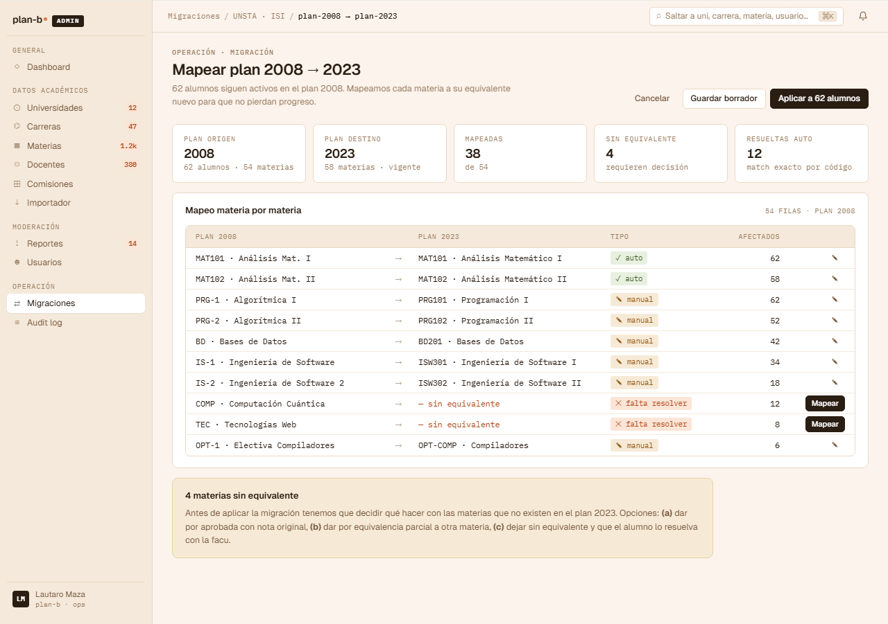

# US-084: Migración asistida de plan de estudios (mapping de materias)

**Status**: Backlog
**Sprint**: candidato a post-MVP
**Epic**: [EPIC-08: Backoffice de catálogo](../epics/EPIC-08.md)
**Priority**: Medium (operación rara pero crítica cuando sucede)
**Effort**: XL (state machine + mapping + apply en batch)
**ADR refs**: [ADR-0002](../../decisions/0002-versionado-de-planes-de-estudio.md), [ADR-0030](../../decisions/0030-cross-bc-consistency-via-wolverine-outbox.md), [ADR-0041](../../decisions/0041-rediseño-ux-post-claude-design.md)

## Como admin, quiero asistir la migración de un plan viejo a uno nuevo (ej. plan 2008 → plan 2023) mapeando materia por materia con detección automática + override manual, para que los alumnos del plan viejo puedan completar el nuevo sin tener que reasignar sus enrollments uno por uno

Sección ④ del canvas admin (`canvas-mocks/admin-screens-3.jsx::AdmMigracionPlan`). NINGUNA US existente cubre migración asistida. US-061 nota "los StudentProfile asociados NO se migran automáticamente. Migrarlos es un flow manual del alumno (US-070, post-MVP)" pero esa frase es ahora obsoleta (US-070 fue reasignado a Rankings). Esta US implementa el flow staff-driven.

## Acceptance Criteria

- [ ] Ruta `/admin/ops/migraciones/{migrationId}` accesible para rol `admin`. Se crea desde detalle de carrera → CTA "Migrar plan X → Y".
- [ ] **Header de migración**: eyebrow "Migración de plan" + título "Plan 2008 → Plan 2023 (Ing. en Sistemas · UNSTA)" + stats (N alumnos del plan viejo afectados, M materias del viejo, K materias del nuevo).
- [ ] **Tabla de mapping materia-por-materia** (del plan viejo al nuevo):
  - Columnas: `código viejo`, `nombre viejo`, `→`, `código nuevo`, `nombre nuevo`, `tipo de match`, `estado`, `acciones`.
  - **Tipo de match**: `auto` (detector automático), `manual` (admin mapeó), `pendiente` (sin mapear), `sin equivalente` (admin marcó "no existe en el nuevo").
  - Cada row con acción rápida: select dropdown para cambiar el destino o marcar como "sin equivalente".
- [ ] **Detector automático**: al crear la migración, el sistema sugiere mappings por:
  - Match exacto de código.
  - Match de nombre normalizado (sin tildes, lowercase).
  - Match aproximado por nombre (fuzzy, score > 0.85).
  - Los `auto` quedan con un dot verde; los pendientes con dot warning.
- [ ] **Panel "Materias sin equivalente"** (4 del mock): lista de materias del viejo que no tienen match en el nuevo. Cada una con 3 opciones:
  - `Reconocer como aprobada equivalencia libre` (el alumno recibe crédito sin cursar nada del nuevo).
  - `Mapear a "Optativa libre" del nuevo`.
  - `Sin reconocimiento` (el alumno pierde la cursada, debe cursar materias del nuevo).
- [ ] **Toolbar superior**:
  - Counter: `auto 32 / manual 8 / pendiente 2 / sin equivalente 4`.
  - Switch "Solo pendientes".
  - 2 CTAs: `Guardar borrador` (ghost, salva el state actual sin aplicar) + `Aplicar migración` (primary, disabled si `pendientes > 0`).
- [ ] **Apply en batch**: clickear "Aplicar migración a 62 alumnos":
  - Modal de confirmación con:
    - Resumen del mapping (auto / manual / sin equivalente).
    - Disclaimer "Esto va a actualizar 62 StudentProfile + reasignar N EnrollmentRecord en cascada. Reversible solo via support con backup."
    - Typed-confirm `MIGRAR`.
  - 2 CTAs: `Cancelar` + `Aplicar a 62 alumnos`.
  - Al confirmar:
    - Backend ejecuta migration en background (job Wolverine, no sincrónico por el tiempo).
    - UI muestra progress bar + "Migrando 62 alumnos..." con polling.
    - Cada alumno: cambia `StudentProfile.PlanId` al nuevo + crea `EnrollmentRecord` con `mappedFromId` para cada cursada migrada.
    - Las materias "sin equivalente con reconocimiento" generan `EnrollmentRecord` con flag `equivalencia=true`.
    - Las "sin reconocimiento" quedan archivadas (no se migran).
- [ ] **Endpoint backend**: `POST /api/admin/migrations/{id}/apply`. Devuelve 202 con jobId; el job procesa async.
- [ ] **Audit log entry**: `action='plan.migration.applied'` con `{ planFrom, planTo, affectedStudents, mapping }`.
- [ ] **Re-projector cross-BC**: cuando los enrollments cambian, Reviews que estaban ancladas al enrollment viejo siguen funcionando (la review queda con `enrollmentRecordId` que apunta al record migrado).

## Out of scope

- **Migración en tiempo real durante la inscripción**: la migración asume período de inscripción cerrado del plan viejo. No se ejecuta con alumnos cursando.
- **Notificar al alumno de la migración**: el alumno se entera vía email o al loguear y ver banner "Tu carrera se actualizó al plan 2023". El email + banner son US separadas (probablemente US-077-f notificaciones + email transactional).
- **Multi-step migration** (ej. 2008 → 2018 → 2023): no soportado. Si hay que pasar por intermedio, el admin migra dos veces.
- **Rollback automático**: la migración es irreversible en MVP. Rollback via backup DB.
- **Auto-aplicar a alumnos nuevos del plan viejo**: si después de la migración alguien crea un perfil en el plan viejo (no debería poder, el plan está archivado), no se migra automáticamente. El admin lo decide.

## Edge cases

| Caso | Comportamiento esperado |
|---|---|
| Plan viejo sin alumnos asociados | Migración aplica solo a catálogo (cambio de estado del plan), 0 alumnos afectados. Skip el batch. |
| Alumno con materia "sin equivalente sin reconocimiento" | Su `EnrollmentRecord` queda con `migrationStatus='lost'`. El alumno la ve en su historial con flag "no migrada al plan nuevo". |
| Apply con `pendientes > 0` | Botón disabled. Tooltip "Mapeá las materias pendientes antes de aplicar". |
| Concurrencia: dos admins editan la misma migración | Lock optimista por `updatedAt` de la migración. |
| Job de migración falla mid-batch (alumno 31 de 62) | Job marca el error, reanuda desde donde quedó con retry idempotente. Los 30 ya migrados quedan. |
| Migración aplicada y luego se descubre que un mapping estaba mal | Out: rollback manual via support. La US no implementa "deshacer mapping específico". |
| Review anclada a una cursada del plan viejo | Review sigue válida (review = experiencia, no = plan). Aparece en el feed con `enrollmentRecord.subjectId` ya apuntando al nuevo. |
| Materia "sin equivalente con equivalencia libre" pero el alumno tiene 0 cursadas viejas | No hace nada (no genera fake enrollment). |

## Test scenarios

### Críticos (Given-When-Then)

1. **Given** admin crea migración 2008→2023, **when** abre la página, **then** ve mapping pre-poblado con `auto`/`manual`/`pendiente`/`sin equivalente`.
2. **Given** mapping con `pendientes > 0`, **when** se inspecciona el botón apply, **then** está disabled.
3. **Given** admin cambia una row de `pendiente` a `manual` con destino, **when** guarda, **then** el counter se actualiza.
4. **Given** apply con typed-confirm `MIGRAR`, **when** clickea, **then** backend devuelve 202 + UI muestra polling.
5. **Given** job termina, **when** finaliza, **then** muestra "Migración completa: 62 alumnos migrados (4 con equivalencias, 58 directas)".
6. **Given** alumno con materia "sin reconocimiento", **when** se inspecciona post-migración, **then** la cursada vieja queda con flag `lost`.

### Cobertura por capa

- **Unit / vitest**: `mapping-detector.test.ts` (exact / normalized / fuzzy), `migration-validator.test.ts`.
- **Integration backend**: state machine de migración (`draft → applying → done | failed`) + job idempotente.
- **Component / vitest + RTL**: `mapping-table.test.tsx`, `unmatched-panel.test.tsx`, `apply-modal.test.tsx`.
- **E2E Playwright**: spec `plan-migration.spec.ts` con seeded plan + alumnos.

## Sub-tasks

### Backend

- [ ] Migration aggregate `PlanMigration` con state machine.
- [ ] `MappingDetector` domain service con 3 niveles de match.
- [ ] Comando `ApplyMigrationCommand` que dispara Wolverine job batch.
- [ ] Job `MigrateStudentsBatch` idempotente con cursor (procesa de a N).
- [ ] Re-projector cross-BC para Reviews + Enrollments (que las queries reapunten).
- [ ] Endpoint Carter `POST /api/admin/migrations/{id}/apply` + `GET /api/admin/migrations/{id}/status`.
- [ ] Tests integration: happy path, pending pendientes, batch failure resume.

### Frontend

- [ ] `app/(staff)/admin/ops/migraciones/[id]/page.tsx`.
- [ ] `features/admin-plan-migration/{api.ts,actions.ts,components/{mapping-table,unmatched-panel,apply-modal,progress-tracker}.tsx,types.ts}`.
- [ ] Poll del status del job cada 2s mientras está `applying`.
- [ ] Tests vitest unit + component + spec E2E.

## Notas de implementación

- **State machine de la migración**:
  - `draft`: admin está mapeando, no se aplicó nada.
  - `applying`: job en curso.
  - `done`: completada exitosa.
  - `failed`: el job falló; quedan los que ya se migraron + flag de error.
- **Job idempotente por cursor**: el batch procesa alumnos en orden por `studentProfileId`. Si falla, retoma desde el último OK. Esto permite recuperación sin re-migrar a los ya OK.
- **Equivalencias generan EnrollmentRecord fake**: con `subjectId` del nuevo plan + flag `equivalencia=true` + `grade=null` + `period=null`. El alumno la ve como "Aprobada por equivalencia" en su historial.
- **Reviews ancladas a enrollment viejo**: el enrollment viejo NO se borra durante la migración. Queda como histórico con `migratedToId = nuevo`. La review sigue apuntando al enrollment original; cuando se renderea, el sistema sigue la chain para mostrar nombre actual de la materia.
- **Detector fuzzy**: implementar con Levenshtein simple normalizado (sin librería pesada). Score > 0.85 = sugerencia auto.
- **Lock optimista**: `updatedAt` del aggregate `PlanMigration` como concurrency token.

## Dependencies

- **Depende de**: [US-061](US-061.md) (CareerPlan + versionado), [US-013](US-013.md) (cargar historial, alimenta los EnrollmentRecord), [US-082](US-082.md) (importador genera el plan nuevo antes de migrar).
- **Bloquea a**: ninguna directa.
- **Relacionada con**: [US-077-f](US-077-f.md) (notificación al alumno post-migración), [US-053](US-053.md) (audit log).

## Refs

- DoD: [Definition of Done](../definition-of-done.md)
- Mockup: . Fuente JSX en `canvas-mocks/admin-screens-3.jsx::AdmMigracionPlan`.
- ADRs: [ADR-0002](../../decisions/0002-versionado-de-planes-de-estudio.md), [ADR-0030](../../decisions/0030-cross-bc-consistency-via-wolverine-outbox.md), [ADR-0041](../../decisions/0041-rediseño-ux-post-claude-design.md).
- US relacionadas: [US-061](US-061.md), [US-082](US-082.md), [US-013](US-013.md), [US-077-f](US-077-f.md).
