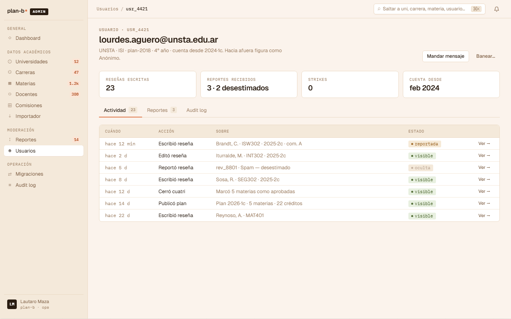

# US-086: Audit log per-user (tab del detalle de usuario en backoffice)

**Status**: Backlog
**Sprint**:
**Epic**: [EPIC-07: Moderación](../epics/EPIC-07.md)
**Priority**: Medium
**Effort**: M
**ADR refs**: [ADR-0042](../../decisions/0042-audit-log-per-bc-no-central.md), [ADR-0031](../../decisions/0031-review-audit-log-como-projection.md), [ADR-0017](../../decisions/0017-persistence-ignorance.md)
**Extends pattern**: [US-053](US-053.md) (audit log per-review). Esta US es el complemento cross-BC per-user.

## Como moderator o admin, quiero abrir el detalle de un usuario y ver su timeline completo de eventos (signup, reviews escritas, reports recibidos, strikes, bans, password changes, etc.) cross-BC para tener contexto al moderar o investigar abuse patterns

El canvas v2 (`canvas-mocks/admin-screens-3.jsx::AdmUsuarioDetalle`) muestra el tab "Audit log" en el detalle de usuario como timeline cronológico de eventos del user. Conceptualmente cruza varios BCs: Identity (signup, login, password changes, ban/unban), Reviews (publicó / editó / borró review), Moderation (recibió report, strike emitido, decisión sobre review propia), Planning si aplica.

[ADR-0042](../../decisions/0042-audit-log-per-bc-no-central.md) decidió **per-BC** (cada módulo mantiene su projection local). Esta US implementa el read model Dapper cross-schema que UNION-ea las projections per-BC filtradas por `actor_id = userId OR target_user_id = userId`, ordena por `at DESC` y pagina.

## Acceptance Criteria

### Backend

- [ ] **Endpoint** `GET /api/admin/users/{userId}/audit-log` con paginación (default 30 items, máximo 100). Query params:
  - `?actions=<comma-separated>` filtro por tipo de acción.
  - `?since=<ISO>` filtra desde fecha.
- [ ] **Read model Dapper cross-schema** que UNION ALL las tablas:
  - `moderation.review_audit_log` (entries donde `actor_id = userId` o la review pertenece a `userId`).
  - `identity.user_audit_log` (entries donde `actor_id = userId` o `target_user_id = userId`).
  - `moderation.action_log` (decisiones donde `actor_id = userId` o sobre reviews del user).
  - `academic.catalog_audit_log` (solo si el user es admin con `actor_id`).
- [ ] **Shape uniforme** del read model (proyección final):
  ```
  {
    at: ISO timestamp,
    bc: 'reviews' | 'identity' | 'moderation' | 'academic',
    action: string (enum del BC origen),
    actor: { id, displayName | 'system' } (identidad visible al staff),
    target: { type, id, label },  // ej. { type: 'review', id, label: 'ISW301' }
    context: object (payload variable según action)
  }
  ```
- [ ] **Identidad visible al staff** ([ADR-0009](../../decisions/0009-anonimato-como-regla-de-presentacion.md)): el moderator ve nombre real del actor + del target. Anonimato es solo en presentation pública.
- [ ] **Authorization** `role IN ('moderator', 'admin')`.
- [ ] **Performance**: índices coordinados por `at DESC` + `actor_id` + `target_user_id` (donde aplique) en cada tabla source. Documentar el patrón en `docs/architecture/audit-log-indexes.md` (crear).

### Frontend

- [ ] Tab "Audit log" en `/admin/moderacion/usuarios/{userId}` (port de `AdmUsuarioDetalle` tab del canvas).
- [ ] **Timeline view**:
  - Vertical, ordenado por `at DESC`.
  - Cada item con:
    - Timestamp relativo (`hace 12 min`) + absoluto on hover (`2026-05-09 14:22 UTC-3`).
    - Pill con BC origen (`reviews`, `identity`, `moderation`, `academic`).
    - Icono de la acción (✎ edit, 🗑 delete, ⚠ report, 🛡 strike, 🚫 ban, etc.).
    - Copy human-readable: "Brandt respondió la reseña de ISW301", "Strike 1 emitido por insulto al docente", etc. Template per-action en `features/admin-user-audit-log/lib/action-template.ts`.
    - Actor visible (link al detalle del actor cuando es otro user).
    - Target visible (link al detalle del target).
- [ ] **Filter chips** arriba del timeline:
  - Todos / Reviews / Identity / Moderation / Academic.
  - Las counts dinámicas según el set actual.
- [ ] **Botón "Cargar más"** al final con cursor pagination.
- [ ] **Estado vacío**: "Este usuario no tiene actividad registrada aún." (raro pero posible si es cuenta recién creada sin eventos auditables).
- [ ] **Permite copiar el row entero** como JSON (para support / debugging).

## Out of scope

- **Audit log per-review**: cubierto por [US-053](US-053.md). Esta US no entrega timeline en detalle de review (vive del lado Reviews).
- **Feed global del dashboard admin**: cubierto por [US-087](US-087.md). El feed mezcla audits de muchos users; esta US es siempre filtrada por un user específico.
- **Búsqueda full-text dentro del audit log**: no MVP. Si el moderator necesita encontrar "todos los audits con la palabra 'spam' del usuario X", puede usar la pestaña como timeline cronológico y buscar con `Ctrl+F` del browser.
- **Export del audit log a CSV**: out. Si llega como necesidad, se agrega un button `Exportar`.
- **Real-time push**: la vista se refresca al navegar. No hay WebSocket en MVP.
- **Audit log para visitor anónimo**: imposible (sin user_id no hay filter).
- **Edición / borrado de entries**: append-only ([ADR-0031](../../decisions/0031-review-audit-log-como-projection.md)). Esta US es read-only.

## Edge cases

| Caso | Comportamiento esperado |
|---|---|
| User sin actividad (recién creado, 0 events) | Empty state. |
| User con > 1000 events | Cursor pagination. Backend devuelve `nextCursor` opaco. Front llama `?cursor=X` para la siguiente página. |
| Event con `actor_id` apuntando a un user borrado | Mostrar "Usuario eliminado" en el actor. Mantener `target` legible. |
| Action que aún no tiene template human-readable | Fallback genérico: "Acción `{action}` en `{bc}`". Log warning. Nunca renderear el `context` crudo. |
| Concurrent writes durante una lectura | Cursor pagination usa `at DESC` como key. Tolerable: los nuevos events aparecen al refrescar. |
| BC offline / projection caída | El UNION ALL falla parcial; mostrar "Algunos eventos no se pudieron cargar (BC `reviews` no disponible)" + mostrar lo que sí cargó. |
| User con role admin (es actor de muchas acciones cross-BC) | Filter chips se vuelven importantes para no inundar la vista con todas sus acciones de Academic catalog. |
| Network error mid-paginación | Retry button con cursor preserved. |

## Test scenarios

### Críticos (Given-When-Then)

1. **Given** user `usr_4421` con 5 reviews + 1 strike + 1 ban en su historial, **when** admin abre `/admin/moderacion/usuarios/usr_4421/audit-log`, **then** ve timeline con 7+ items ordenados por `at DESC`, mezclando BCs.
2. **Given** filter chip `Moderation` activo, **when** se inspecciona el timeline, **then** solo se muestran entries con `bc: 'moderation'`.
3. **Given** user sin actividad, **when** abre la vista, **then** ve empty state.
4. **Given** click en actor de un row, **when** se inspecciona, **then** navega a `/admin/moderacion/usuarios/{actorUserId}`.
5. **Given** 1500 events, **when** abre la vista, **then** carga los primeros 30 + button "Cargar más" funcional.
6. **Given** un member intenta acceder a `/admin/moderacion/usuarios/usr_4421/audit-log` (sin role staff), **when** el guard chequea, **then** redirige a `/home`.

### Cobertura por capa

- **Unit / vitest + xUnit**:
  - `action-template.test.ts` (per-action copy templates).
  - `cursor-pagination.test.cs` (read model paginator).
  - `union-all-audit-query.test.cs` (Dapper read model: shape uniforme cross-BC).
- **Integration backend**: read model devuelve UNION ALL correcto, paginación cursor consistente, filters funcionan, identidad visible al staff.
- **Component / vitest + RTL**: `user-audit-timeline.test.tsx`, `audit-row.test.tsx`, `bc-pill.test.tsx`.
- **E2E Playwright**: spec `admin-user-audit-log.spec.ts` con un user seedeado con actividad cross-BC.

## Sub-tasks

### Backend

- [ ] **Migrations** para crear las projections que aún no existen:
  - `identity.user_audit_log` con campos según ADR-0042 (`id`, `at`, `actor_id`, `target_id`, `action`, `context`).
  - `moderation.action_log` (decisiones moderator).
  - `academic.catalog_audit_log`.
- [ ] **Projectors Wolverine** para cada BC nuevo:
  - `Identity.AuditLogProjector` (signup, login, password_changed, banned, etc.).
  - `Moderation.ActionLogProjector` (uphold, dismiss, strike issued, edit requested, ban issued).
  - `Academic.CatalogAuditLogProjector` (uni created/archived, plan imported via US-082, subject merged via US-083, plan migration applied via US-084, etc.).
- [ ] **Read model Dapper cross-schema**: `IUserAuditLogReader.GetByUser(userId, cursor, limit, filters)` retorna shape uniforme.
- [ ] **Endpoint** Carter `GET /api/admin/users/{userId}/audit-log`.
- [ ] **Authorization policy** `moderator|admin`.
- [ ] **Tests integration**: UNION ALL correcto, paginación, filter por action types, identidad visible.

### Frontend

- [ ] `app/(staff)/admin/moderacion/usuarios/[userId]/audit-log/page.tsx` (probablemente como sub-tab del detalle de user de US-068).
- [ ] `features/admin-user-audit-log/{api.ts,components/{audit-timeline,audit-row,bc-pill,filter-chips,empty-state}.tsx,lib/action-template.ts,types.ts}`.
- [ ] Reusar `<AdmShell>` con `active="usr"` y breadcrumbs del usuario.
- [ ] Tests vitest unit + component + spec E2E.

## Notas de implementación

- **El patrón de projections per-BC viene de [ADR-0031](../../decisions/0031-review-audit-log-como-projection.md) extendido por [ADR-0042](../../decisions/0042-audit-log-per-bc-no-central.md)**. Cada BC nuevo replica el patrón. No hay módulo central de Audit.
- **Shape uniforme entre BCs** es crítico para que el UNION ALL funcione sin sorpresas. Documentar el schema mínimo (`id`, `at`, `actor_id`, `target_id`, `action`, `context`) en `docs/architecture/data-model.md` cuando se agregue cada projection.
- **`target_id` semantics**: para `user_audit_log`, `target_id` apunta al user al que afecta la acción (puede ser distinto del actor en casos como "admin baneó user X" → actor=admin, target=user X). Para `review_audit_log`, `target_id` apunta al review_id.
- **Action templates en frontend**: cada `action` (enum) tiene un template human-readable. Maintenance: cuando se agrega un action nuevo en cualquier BC, agregar template + test. CI rule "todo action nuevo debe tener template" cuando aterrice.
- **`bc` field se computa en el read model**, no se persiste. Es metadata derivada del schema fuente.
- **Cursor pagination**: usar `{ at, id }` como cursor opaco. `at` para sort, `id` para tiebreak. Encoded como base64.

## Dependencies

- **Depende de**: [ADR-0042](../../decisions/0042-audit-log-per-bc-no-central.md), [ADR-0031](../../decisions/0031-review-audit-log-como-projection.md), [US-068](US-068.md) (detalle de usuario donde se monta el tab), [US-081](US-081.md) (admin shell + tabs).
- **Bloquea a**: [US-068](US-068.md) frontend completo (el tab "Audit log" es uno de los tabs del detalle).
- **Relacionada con**: [US-053](US-053.md) (audit log per-review, hermano del patrón), [US-087](US-087.md) (feed global del dashboard, comparte projections), [US-085](US-085.md) (strikes / bans que pueblan `user_audit_log` y `moderation.action_log`).

## Refs

- DoD: [Definition of Done](../definition-of-done.md)
- Mockup admin canvas (sección ③):
  - 
  - Fuente JSX en `canvas-mocks/admin-screens-3.jsx::AdmUsuarioDetalle` (tab "Audit log").
- ADRs: [ADR-0042](../../decisions/0042-audit-log-per-bc-no-central.md), [ADR-0031](../../decisions/0031-review-audit-log-como-projection.md), [ADR-0017](../../decisions/0017-persistence-ignorance.md), [ADR-0009](../../decisions/0009-anonimato-como-regla-de-presentacion.md).
- US relacionadas: [US-053](US-053.md), [US-087](US-087.md), [US-068](US-068.md), [US-085](US-085.md).
