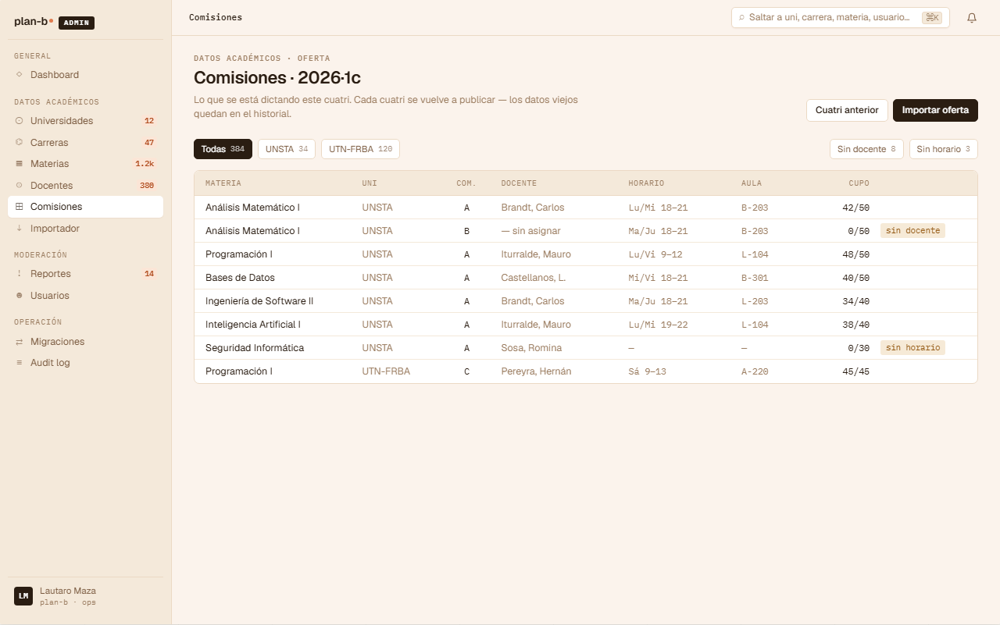

# US-093: Gestionar Comisión (CRUD de oferta por término, con horarios)

**Status**: Sprint actual
**Sprint**: S11
**Epic**: [EPIC-08: Backoffice de catálogo](../epics/EPIC-08.md)
**Priority**: High
**Effort**: L
**UC**: [UC-065](../use-cases/UC-065.md)
**ADR refs**: [ADR-0050](../../decisions/0050-backoffice-como-corte-transversal.md)

> Renumerada de US-090 el 2026-07-17 (el número quedó tomado por [US-090-f](US-090-f.md)).
> Al entrar a S11 (2026-07-23) **absorbe el pendiente de [US-065](US-065.md)** (mismo CRUD,
> detectado el solape al planificar) y suma los **horarios de cursada**, que el modelo
> `Commission` no tenía y son prerequisito de los choques del planificador (US-096).

## Como admin, quiero el CRUD de comisiones con docentes y horarios de cursada para que la oferta real por término alimente reseñas y planificador

Lo que ya existe (US-065, S7): el aggregate `Commission` + `CommissionTeacher` con sus métodos (`Create`/`Update`/`AssignTeacher`/`UnassignTeacher`), el seed y dos GET públicos de lectura. Lo que falta y esta US cierra: los endpoints de escritura que invoquen esos métodos, la UI de backoffice, las validaciones cross-aggregate, y el modelado de **horarios por comisión** (hoy `Commission` no tiene schedule: sin eso no hay choques ni calendario real).

## Acceptance Criteria

### Backend

- [ ] CRUD de `Commission` bajo `/api/academic/subjects/{subjectId}/commissions` (módulo dueño, ADR-0050): create `{ termId, name, modality, capacity?, notes? }`, update, listar admin, desactivar.
- [ ] `UNIQUE(subject_id, term_id, name)`; coherencia de cadencia (`subject.term_kind = term.kind`) y de universidad (subject, term, teacher de la misma).
- [ ] CRUD de `CommissionTeacher` bajo `/api/academic/commissions/{commissionId}/teachers` con `{ teacherId, role }`.
- [ ] **Horarios**: una comisión tiene 0..N bloques de cursada `{ día, hora inicio, hora fin }`. Modelado como parte del aggregate (diseño concreto se presenta antes de implementar). Validaciones: fin > inicio, sin solape entre bloques de la misma comisión.
- [ ] Todos los writes requieren `role = 'admin'`.
- [ ] Cambio de modality con inscriptos: 409 `academic.commission.has_enrollments`.

### Frontend

- [ ] Pantalla de gestión en `(staff)/admin`: grid de comisiones por término (selector de término), con docentes y horarios; flags visuales "sin docente" / "sin horario" (mockup `AdmComisiones`).
- [ ] Alta/edición de comisión con sus bloques horarios.

## Out of scope

Esto NO incluye:

- Importador masivo de oferta (CTA "Importar oferta" del mockup): va con los importadores (US-007 o US propia).
- Migración de inscriptos al cambiar modality: manual post-MVP.
- Aula/sede por bloque: el mockup lo insinúa; se difiere hasta que un consumidor real lo pida (YAGNI).

## Edge cases

| Caso | Comportamiento esperado |
|---|---|
| Crear comisión duplicada (mismo subject + term + name) | 409 con error específico. |
| Término de cadencia distinta a la materia (anual vs cuatrimestral) | 400 con el motivo; el selector del frontend ya filtra términos compatibles. |
| Docente de otra universidad | 400; el picker solo ofrece docentes de la universidad. |
| Bloques horarios solapados dentro de la misma comisión | 400: una comisión no puede pisarse a sí misma. |
| Comisión desactivada con enrollments históricos | Se desactiva (no se borra): el historial y las reseñas la siguen referenciando. |

## Test scenarios

### Críticos (Given-When-Then)

1. **Given** una materia cuatrimestral y un término cuatrimestral de la misma universidad **When** el admin crea la comisión con 2 bloques horarios y un titular **Then** aparece en el grid y en el GET público con horarios y docente.
2. **Given** una comisión existente **When** el admin intenta crear otra con el mismo nombre en el mismo subject+term **Then** 409.
3. **Given** bloques Lun 18-22 y Lun 20-21 en la misma comisión **When** el admin guarda **Then** 400 por solape interno.

### Cobertura por capa

- **Unit / domain**: invariantes de bloques (rango válido, solape interno), sobre los 16 tests existentes del aggregate.
- **Integration**: CRUD completo + validaciones cross-aggregate + UNIQUE (los escenarios que US-065 dejó pendientes).
- **E2E**: alta de comisión con horarios desde el backoffice y verla en el grid.

## Sub-tasks

### Backend

- [ ] Modelado de horarios en el aggregate (diseño a presentar primero) + migración.
- [ ] Commands/handlers/endpoints: Create/Update/Deactivate Commission, Add/Remove CommissionTeacher, bloques horarios.
- [ ] Extender los GET públicos con horarios.
- [ ] Integration tests.

### Frontend

- [ ] Feature slice `manage-commissions` en `(staff)/admin` (grid + form con bloques).

## Notas de implementación

- **Por qué los horarios van acá y no en US-096**: el dato nace en la oferta (backoffice); el planificador solo lo consume. Cargar horarios sin CRUD de comisiones no tiene dueño.
- **El aggregate ya está**: no rehacer `Commission`; los commands invocan los métodos existentes. La validación de coherencia universitaria vive en el app service (como su doc comment anticipa).

## Dependencies

- **Bloquea a**: [US-096](US-096.md) (choques necesitan oferta con horarios cargada).
- **Depende de**: nada pendiente ([US-062](US-062.md) Subject y [US-064](US-064.md) AcademicTerm están entregadas).
- **Relacionada con**: [US-065](US-065.md) (su pendiente vive acá; lo entregado en S7 no se toca).

## Refs

- DoD: [Definition of Done](../definition-of-done.md)
- Use Case: [UC-065](../use-cases/UC-065.md)
- Mockup admin canvas (sección ②):  (`canvas-mocks/admin-screens-2.jsx::AdmComisiones`)
- ADRs: [ADR-0050](../../decisions/0050-backoffice-como-corte-transversal.md)
