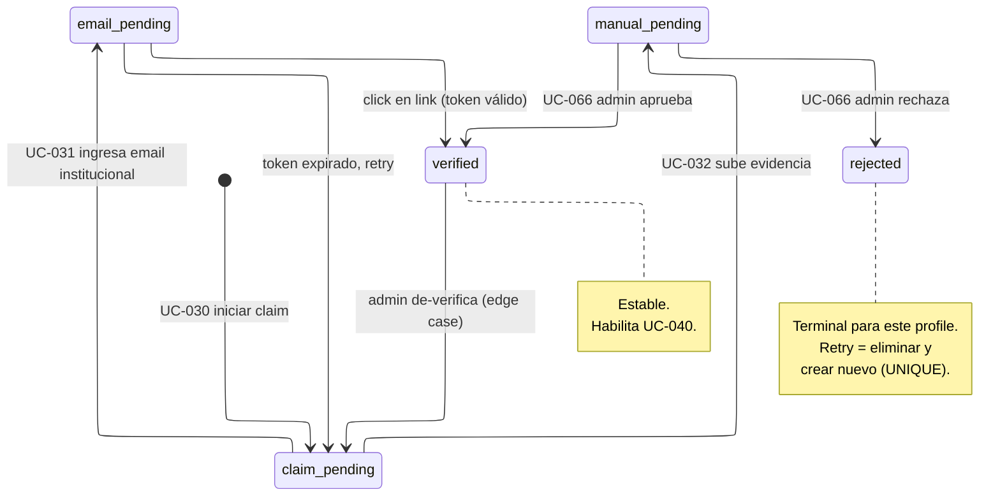
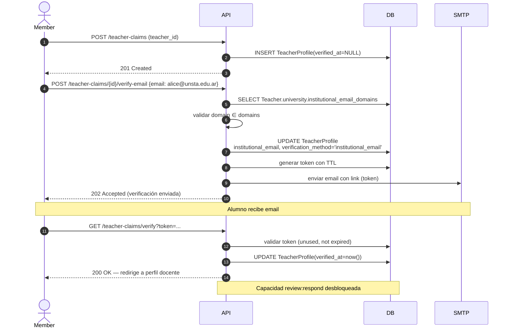
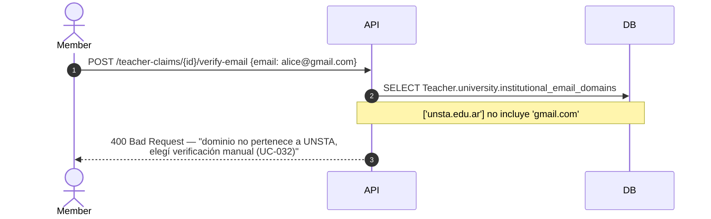
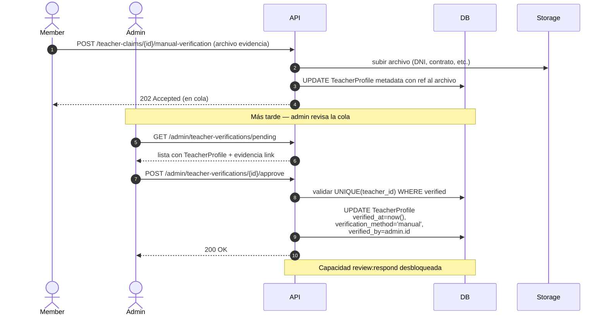
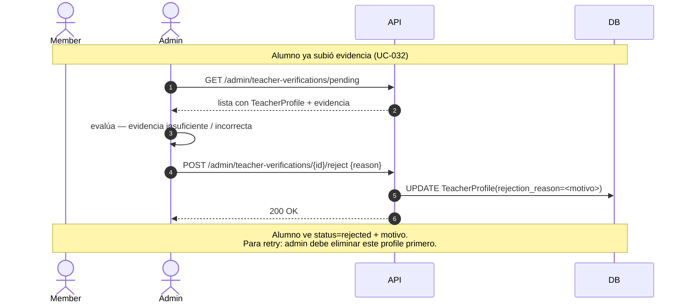

# Verification Flows — planb

Flows completos de verificación de `TeacherProfile`. Un `member` reclama identidad de docente creando un `TeacherProfile`, pero ese profile no desbloquea la capacidad `review:respond` (UC-040) hasta verificarse. Hay dos caminos: email institucional (automático) o evidencia manual revisada por admin.

Cubre:

- States conceptuales del `TeacherProfile` y su state machine.
- Matriz de transiciones.
- Sequence diagrams de los 4 flujos principales.
- Invariantes del modelo y reglas de unicidad.
- Política de retry después de rechazo.

Este documento expande UC-030, UC-031, UC-032, UC-066. Ver también [ADR-0008](../decisions/0008-roles-exclusivos-profiles-como-capacidades.md) para la separación entre rol y profile.

## States (conceptuales)

Los estados son conceptuales — no hay una columna `status` en `TeacherProfile`. El estado se deriva de la combinación de `verified_at`, `verification_method` y `rejection_reason`.

| Estado conceptual | Condición en DB                                                                                                                     | Significado                                                    |
| ----------------- | ----------------------------------------------------------------------------------------------------------------------------------- | -------------------------------------------------------------- |
| `claim_pending`   | `verified_at IS NULL AND verification_method IS NULL AND rejection_reason IS NULL`                                                  | Profile creado, no hay intento de verificación en curso.       |
| `email_pending`   | `verification_method = 'institutional_email' AND verified_at IS NULL AND institutional_email NOT NULL AND rejection_reason IS NULL` | Email enviado, esperando click.                                |
| `manual_pending`  | `verified_at IS NULL AND evidencia subida (fuera de la tabla) AND rejection_reason IS NULL`                                         | Esperando decisión del admin.                                  |
| `verified`        | `verified_at NOT NULL`                                                                                                              | Estable. Habilita UC-040.                                      |
| `rejected`        | `verified_at IS NULL AND rejection_reason NOT NULL`                                                                                 | Rechazado (por admin o por token expirado cuando corresponda). |

El state machine ayuda a razonar sobre el flow; no se materializa en un enum dedicado para mantener el schema simple.

## State machine

## Matriz de transiciones

| De → A                             | Trigger                            | UC                  | Side effects                                                                                                                                 |
| ---------------------------------- | ---------------------------------- | ------------------- | -------------------------------------------------------------------------------------------------------------------------------------------- |
| `null` → `claim_pending`           | Member inicia claim                | UC-030              | INSERT `TeacherProfile(verified_at=NULL)`.                                                                                                   |
| `claim_pending` → `email_pending`  | Alumno ingresa email institucional | UC-031              | Se setea `institutional_email` y `verification_method='institutional_email'`. Se genera token con TTL, se envía email.                       |
| `claim_pending` → `manual_pending` | Alumno sube evidencia              | UC-032              | Evidencia persistida (referencia en storage, no en tabla). Claim pasa a cola del admin.                                                      |
| `email_pending` → `verified`       | Click en link con token válido     | UC-031              | Setea `verified_at=now()`. Capacidad `review:respond` activa.                                                                                |
| `email_pending` → `claim_pending`  | Token expirado y alumno reinicia   | UC-031              | Reseteo de `institutional_email` y `verification_method` a NULL. Nuevo token al retry.                                                       |
| `manual_pending` → `verified`      | Admin aprueba                      | UC-066              | Setea `verified_at=now()`, `verification_method='manual'`, `verified_by=admin.id`.                                                           |
| `manual_pending` → `rejected`      | Admin rechaza                      | UC-066              | Setea `rejection_reason`. `verified_at` sigue NULL.                                                                                          |
| `verified` → `claim_pending`       | Admin de-verifica                  | Manual admin action | Setea `verified_at=NULL`. Capacidad pierde. Libera el `UNIQUE(teacher_id) WHERE verified_at IS NOT NULL` para que otro user pueda verificar. |

## Sequence diagrams

### 1. Happy path — email institucional (UC-031)

### 2. Email institucional rechazado por dominio (UC-031, A1)

### 3. Verificación manual aprobada (UC-032 + UC-066)

### 4. Verificación manual rechazada (UC-032 + UC-066 reject)

## Invariantes

Enforceadas a nivel de DB o en la capa de aplicación:

- `UNIQUE(user_id, teacher_id)` — un user no puede tener dos claims sobre el mismo Teacher (DB).
- `UNIQUE(teacher_id) WHERE verified_at IS NOT NULL` — un Teacher tiene a lo sumo **un** TeacherProfile verificado (DB, partial unique).
- `verified_at NOT NULL → verification_method NOT NULL` (DB CHECK).
- `verification_method = 'manual' → verified_by NOT NULL` (DB CHECK).
- `verification_method = 'institutional_email' → institutional_email NOT NULL` (DB CHECK).
- `institutional_email` dominio ∈ `Teacher.university.institutional_email_domains` (app-level al ingresar email).
- `User.role = 'member'` al crear `TeacherProfile` (app-level; moderadores/admins/staff no pueden tener profiles).

## Política de retry después de rejected

Cuando un `TeacherProfile` pasa a `rejected`, queda en ese estado permanentemente. El `UNIQUE(user_id, teacher_id)` impide crear un segundo profile sobre el mismo Teacher.

Para que el alumno pueda reintentar:

1. Admin elimina (DELETE) el `TeacherProfile` rechazado.
2. Alumno inicia UC-030 nuevamente, creando un profile nuevo.

Esta UX es incómoda pero simple. Se eligió así para MVP porque:

- El volumen de rechazos esperado es bajo (casos genuinos donde la evidencia no corresponde al Teacher reclamado).
- Evita sumar una tabla `VerificationAttempt` y su mantenimiento.
- El admin tiene visibilidad de rechazos históricos por un período vía logs/backups antes de eliminar.

**Cuándo revisitar:** si aparece volumen de rechazos retryables (ej. rechazos por documentación parcialmente incorrecta que el alumno puede corregir), migrar a modelo con tabla `VerificationAttempt`:

- `TeacherProfile` persiste una sola vez y cambia de estado en el tiempo.
- `VerificationAttempt(id, teacher_profile_id, method, evidence_ref, status, decided_by, decided_at, reason)` registra cada intento.
- `TeacherProfile.current_attempt_id` apunta al último.
- Rejected transita a `claim_pending` sin borrar historia.

Esta migración está documentada pero no implementada.

## Cross-references

| Tipo       | Referencias                                                                                                                                         |
| ---------- | --------------------------------------------------------------------------------------------------------------------------------------------------- |
| UCs        | UC-030 (iniciar claim), UC-031 (email institucional), UC-032 (evidencia manual), UC-040 (habilitado tras verified), UC-066 (admin resuelve manual). |
| ADRs       | [ADR-0008](../decisions/0008-roles-exclusivos-profiles-como-capacidades.md).                                                                        |
| Data model | [TeacherProfile + Teacher + University.institutional_email_domains](../architecture/data-model.md#context-identity).                                |
