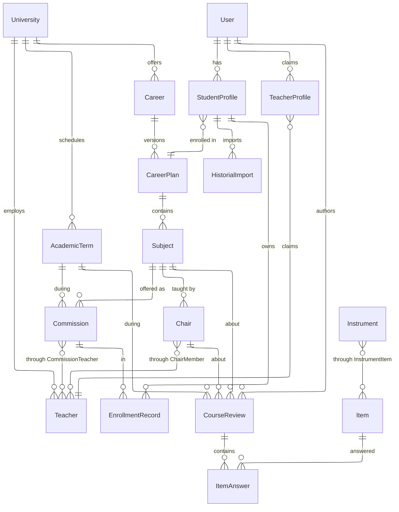
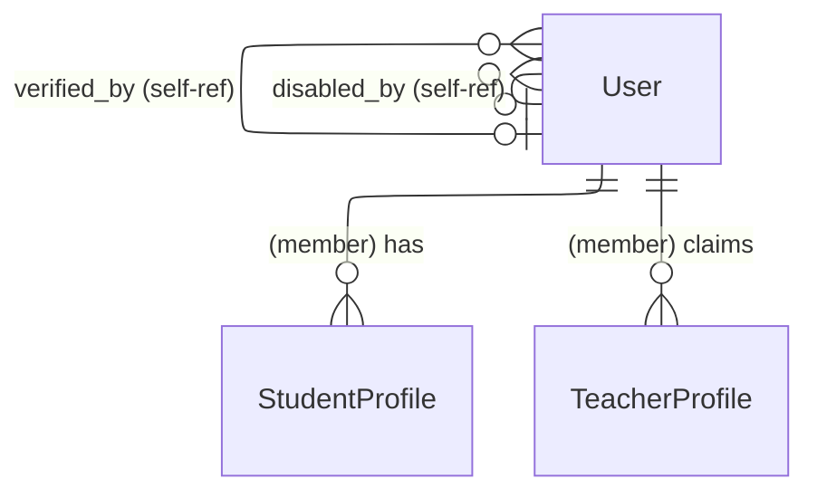
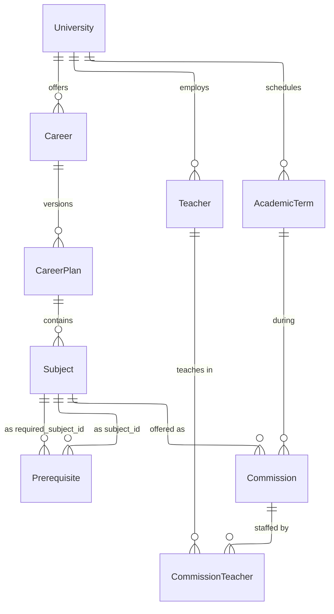
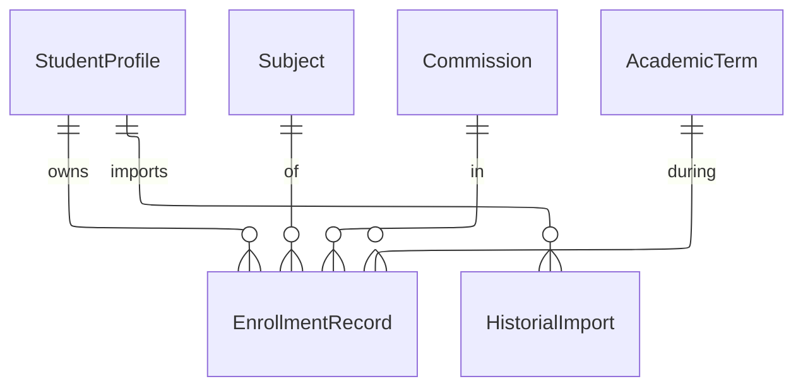

# Data Model. planb

> **Este documento describe el código actual, y desde R2 hay un solo modelo de reseña.** El del producto vigente ([ADR-0082](../decisions/0082-the-review-captures-the-cursada-in-three-layers.md) a [ADR-0085](../decisions/0085-three-instruments-and-official-data.md)): la [cátedra](#entity-chair-la-cátedra) en el catálogo académico, y el [instrumento con la reseña de tres capas](#context-el-instrumento-y-la-reseña-de-tres-capas) en su propio contexto. El anterior (la `Review` con ratings y texto publicado, `TeacherResponse`, la moderación de contenido y el planificador) se podó y ya no está descripto acá: vive en el historial de git.

Modelo de datos completo del sistema, organizado por bounded contexts. Cada sección tiene un diagrama ER en Mermaid con las relaciones del contexto, seguido de la especificación de cada entidad (campos, tipos, constraints) y las invariantes que se aplican transversalmente.

El "por qué" de las decisiones estructurales está en los ADRs referenciados. Este documento describe el "qué".

## Tabla de contenidos

- [Overview](#overview)
- [Context: Identity](#context-identity)
- [Context: Academic Catalog](#context-academic-catalog)
- [Context: Student History](#context-student-history)
- [Context: el instrumento y la reseña de tres capas](#context-el-instrumento-y-la-reseña-de-tres-capas)
- [Context: Semantic Analytics](#context-semantic-analytics)
- [Apéndice A: Enums](#apéndice-a-enums)
- [Apéndice B: Invariantes transversales](#apéndice-b-invariantes-transversales)

## Overview

Vista de alto nivel: bounded contexts y sus conexiones. Cada contexto se detalla en su sección.



**Contextos:**

| Context              | Entidades                                                                                                   | Propósito                                                       |
| -------------------- | ----------------------------------------------------------------------------------------------------------- | --------------------------------------------------------------- |
| Identity             | User, StudentProfile, TeacherProfile, VerificationToken                                                     | Cuentas, roles, identidades académicas                          |
| Academic Catalog     | University, Career, CareerPlan, Subject, Prerequisite, Teacher, Commission, CommissionTeacher, AcademicTerm, CareerPlanImport | Datos precargados del dominio académico       |
| Student History      | EnrollmentRecord, HistorialImport                                                                           | Historial de cursadas del alumno                                |

## Context: Identity

Cuentas, roles y perfiles que capturan identidad del usuario en la plataforma. Ver [ADR-0008](../decisions/0008-exclusive-roles-with-profiles-as-capability-unlockers.md) para la separación entre rol y profile.



### Entity: User

| Campo               | Tipo             | Constraints                  | Notas                               |
| ------------------- | ---------------- | ---------------------------- | ----------------------------------- |
| `id`                | UUID             | PK                           |                                     |
| `email`             | TEXT             | NOT NULL, UNIQUE             |                                     |
| `password_hash`     | TEXT             | NOT NULL                     | bcrypt/argon2                       |
| `email_verified_at` | TIMESTAMPTZ      | NULL                         | Null = cuenta pendiente             |
| `role`              | ENUM `user_role` | NOT NULL, DEFAULT `'member'` | Ver [Apéndice A](#apéndice-a-enums) |
| `disabled_at`       | TIMESTAMPTZ      | NULL                         | Soft suspend                        |
| `disabled_reason`   | TEXT             | NULL                         |                                     |
| `disabled_by`       | UUID             | FK → User, NULL              | Self-ref                            |
| `created_at`        | TIMESTAMPTZ      | NOT NULL, DEFAULT `now()`    |                                     |
| `updated_at`        | TIMESTAMPTZ      | NOT NULL, DEFAULT `now()`    |                                     |

### Entity: StudentProfile

Vincula un User con un CareerPlan. Un User `member` puede tener múltiples StudentProfiles (una por carrera).

| Campo             | Tipo                  | Constraints                  | Notas                           |
| ----------------- | --------------------- | ---------------------------- | ------------------------------- |
| `id`              | UUID                  | PK                           |                                 |
| `user_id`         | UUID                  | FK → User, NOT NULL          |                                 |
| `career_id`       | UUID                  | FK → CareerPlan, NOT NULL    | Apunta al plan, no a la carrera |
| `enrollment_year` | INT                   | NOT NULL                     | Año de ingreso                  |
| `status`          | ENUM `student_status` | NOT NULL, DEFAULT `'active'` |                                 |
| `graduated_at`    | DATE                  | NULL                         |                                 |
| `created_at`      | TIMESTAMPTZ           | NOT NULL                     |                                 |
| `updated_at`      | TIMESTAMPTZ           | NOT NULL                     |                                 |

Constraints adicionales:

- `UNIQUE(user_id, career_id)`: un user no puede tener dos profiles en la misma carrera-plan.
- CHECK: `status = 'graduated'` → `graduated_at NOT NULL`.
- CHECK: `status IN ('active', 'abandoned')` → `graduated_at IS NULL`.

### Entity: TeacherProfile

Claim de identidad docente por parte de un User. Sin `verified_at`, el profile existe pero no desbloquea capacidades.

| Campo                 | Tipo                               | Constraints            | Notas                                                   |
| --------------------- | ---------------------------------- | ---------------------- | ------------------------------------------------------- |
| `id`                  | UUID                               | PK                     |                                                         |
| `user_id`             | UUID                               | FK → User, NOT NULL    |                                                         |
| `teacher_id`          | UUID                               | FK → Teacher, NOT NULL |                                                         |
| `verification_method` | ENUM `teacher_verification_method` | NULL                   | Se setea al verificar                                   |
| `verified_at`         | TIMESTAMPTZ                        | NULL                   | Null = no verificado                                    |
| `verified_by`         | UUID                               | FK → User, NULL        | Admin que verificó manualmente                          |
| `institutional_email` | TEXT                               | NULL                   | Se captura si verification_method = institutional_email |
| `rejection_reason`    | TEXT                               | NULL                   | Si se rechazó un claim, motivo                          |
| `created_at`          | TIMESTAMPTZ                        | NOT NULL               |                                                         |
| `updated_at`          | TIMESTAMPTZ                        | NOT NULL               |                                                         |

Constraints adicionales:

- `UNIQUE(user_id, teacher_id)`.
- `UNIQUE(teacher_id) WHERE verified_at IS NOT NULL`: un Teacher tiene un único profile verificado.
- CHECK: `verified_at NOT NULL` → `verification_method NOT NULL`.
- CHECK: `verification_method = 'manual'` → `verified_by NOT NULL`.
- CHECK: `verification_method = 'institutional_email'` → `institutional_email NOT NULL`.

### Entity: VerificationToken (child de User / TeacherProfile)

Token opaco usado para verificar el email de un User (purpose=`user_email_verification`) o el email institucional de un docente reclamado (purpose=`teacher_institutional_verification`). Es **child entity**, no aggregate independiente: vive dentro del aggregate root que lo posee. Ver [ADR-0033](../decisions/0033-verification-token-as-a-child-entity.md).

| Campo               | Tipo                              | Constraints                              | Notas                                              |
| ------------------- | --------------------------------- | ---------------------------------------- | -------------------------------------------------- |
| `id`                | UUID                              | PK                                       |                                                    |
| `owner_id`          | UUID                              | NOT NULL                                 | FK a `user.id` cuando purpose=`user_email_verification`; FK a `teacher_profile.id` cuando purpose=`teacher_institutional_verification` (UNIQUE por purpose) |
| `purpose`           | ENUM `verification_token_purpose` | NOT NULL                                 | `user_email_verification`, `teacher_institutional_verification` |
| `value`             | TEXT                              | NOT NULL, UNIQUE                         | Opaque, 256-bit base64url                          |
| `issued_at`         | TIMESTAMPTZ                       | NOT NULL                                 |                                                    |
| `expires_at`        | TIMESTAMPTZ                       | NOT NULL                                 | TTL típicamente 24h                                |
| `consumed_at`       | TIMESTAMPTZ                       | NULL                                     | Set cuando se consume; terminal                    |
| `invalidated_at`    | TIMESTAMPTZ                       | NULL                                     | Set cuando se invalida (por resend o force expiry) |

Constraints:

- `UNIQUE(owner_id, purpose) WHERE consumed_at IS NULL AND invalidated_at IS NULL`: un solo token activo por purpose por owner.
- CHECK: `consumed_at IS NULL OR invalidated_at IS NULL`: un token no puede estar consumido E invalidado simultáneamente.
- CHECK: `expires_at > issued_at`.

### Invariantes cross-table (enforced en app)

- Si `User.role != 'member'` → no puede existir `StudentProfile` ni `TeacherProfile` con ese `user_id`.
- Si se crea un `TeacherProfile` con `verification_method = 'institutional_email'`, el dominio de `institutional_email` debe estar en `Teacher.university.institutional_email_domains`.
- `verified_by` apunta a un User con `role = 'admin'`.
- `disabled_by` apunta a un User con `role IN ('moderator', 'admin')`.

## Context: Academic Catalog

Datos precargados manualmente por el equipo admin. Modela universidades, carreras, planes de estudio, materias, correlativas, docentes, comisiones y cuatrimestres. Ver [ADR-0001](../decisions/0001-multi-university-as-root-domain-from-day-1.md), [ADR-0049](../decisions/0049-career-plan-versions-by-year-and-status.md), [ADR-0003](../decisions/0003-prerequisites-with-two-types.md).



### Entity: University

| Campo                         | Tipo        | Constraints              | Notas                                            |
| ----------------------------- | ----------- | ------------------------ | ------------------------------------------------ |
| `id`                          | UUID        | PK                       |                                                  |
| `name`                        | TEXT        | NOT NULL                 | Ej "Universidad del Norte Santo Tomás de Aquino" |
| `short_name`                  | TEXT        | NOT NULL                 | Ej "UNSTA"                                       |
| `slug`                        | TEXT        | NOT NULL, UNIQUE         | Ej "unsta"                                       |
| `country`                     | TEXT        | NOT NULL                 |                                                  |
| `city`                        | TEXT        | NOT NULL                 |                                                  |
| `website`                     | TEXT        | NULL                     |                                                  |
| `institutional_email_domains` | TEXT[]      | NOT NULL, DEFAULT `'{}'` | Dominios válidos para verificación docente       |
| `created_at`                  | TIMESTAMPTZ | NOT NULL                 |                                                  |
| `updated_at`                  | TIMESTAMPTZ | NOT NULL                 |                                                  |

### Entity: Career

| Campo            | Tipo                      | Constraints               | Notas                                         |
| ----------------- | ------------------------- | -------------------------- | ----------------------------------------------- |
| `id`              | UUID                      | PK                          |                                                 |
| `university_id`   | UUID                      | FK → University, NOT NULL   |                                                 |
| `name`            | TEXT                      | NOT NULL                    |                                                 |
| `slug`            | TEXT                      | NOT NULL                    | Único por universidad                          |
| `short_name`      | TEXT                      | NULL                        | Ej "Ing. Sistemas"                             |
| `code`            | TEXT                      | NULL                        | Código institucional, ej "TUDCS"               |
| `degree_type`     | ENUM `career_degree_type` | NULL                        | Grado, posgrado o tecnicatura                  |
| `duration_years`  | INT                       | NULL                        | Duración nominal en años (rango 1-15)          |
| `cadence`         | ENUM `term_kind`          | NULL                        | Cadencia mayoritaria de la carrera              |
| `description`     | TEXT                      | NULL                        | Descripción corta visible al alumno            |
| `is_official`     | BOOLEAN                   | NOT NULL, DEFAULT `true`    | False cuando la creó un alumno via crowdsourcing |
| `is_active`       | BOOLEAN                   | NOT NULL, DEFAULT `true`    | Soft delete                                    |
| `created_at`      | TIMESTAMPTZ               | NOT NULL                    |                                                 |
| `updated_at`      | TIMESTAMPTZ               | NOT NULL                    |                                                 |

Constraints:

- `UNIQUE(university_id, slug)`: slug único por universidad.
- `UNIQUE(university_id, code) WHERE code IS NOT NULL`: código único por universidad cuando se provee (índice parcial).
- `duration_years` (cuando no NULL): rango 1-15.

### Entity: CareerPlan

Plan de estudios de una Career para un año particular (ej. "TUDCS Plan 2024").

| Campo         | Tipo                       | Constraints              | Notas                                             |
| ------------- | -------------------------- | -------------------------- | --------------------------------------------------- |
| `id`          | UUID                       | PK                          |                                                     |
| `career_id`   | UUID                       | FK → Career, NOT NULL       |                                                     |
| `year`        | INT                        | NOT NULL                    | Año del plan, ej 2024                              |
| `status`      | ENUM `career_plan_status`  | NOT NULL                    | `active` = vigente; `deprecated` = histórico       |
| `label`       | TEXT                       | NULL                         | Identificador editorial opcional, ej "plan-2023"   |
| `is_official` | BOOLEAN                    | NOT NULL, DEFAULT `true`    | False cuando lo creó un alumno via crowdsourcing   |
| `created_at`  | TIMESTAMPTZ                | NOT NULL                    |                                                     |
| `updated_at`  | TIMESTAMPTZ                | NOT NULL                    |                                                     |

Constraints:

- `UNIQUE(career_id, year)`: un plan por año por carrera.

### Entity: Subject

Materia de un plan específico.

| Campo            | Tipo             | Constraints               | Notas             |
| ---------------- | ---------------- | ------------------------- | ----------------- |
| `id`             | UUID             | PK                        |                   |
| `career_plan_id` | UUID             | FK → CareerPlan, NOT NULL |                   |
| `code`           | TEXT             | NOT NULL                  | Ej "MAT101"       |
| `name`           | TEXT             | NOT NULL                  | Ej "Matemática I" |
| `year_in_plan`   | INT              | NOT NULL                  | 1, 2, 3…          |
| `term_in_year`   | INT              | NULL                      | Null si anual     |
| `term_kind`      | ENUM `term_kind` | NOT NULL                  |                   |
| `weekly_hours`   | INT              | NOT NULL                  |                   |
| `total_hours`    | INT              | NOT NULL                  |                   |
| `description`    | TEXT             | NULL                      |                   |
| `is_active`      | BOOLEAN          | NOT NULL, DEFAULT `true`  | Soft delete (US-062) |
| `is_official`    | BOOLEAN          | NOT NULL                  | False si la creó el crowdsourcing |
| `created_at`     | TIMESTAMPTZ      | NOT NULL                  |                   |
| `updated_at`     | TIMESTAMPTZ      | NOT NULL                  |                   |

Constraints:

- `UNIQUE(career_plan_id, code)`.
- CHECK: `term_kind = 'anual'` → `term_in_year IS NULL`.
- CHECK: `term_kind != 'anual'` → `term_in_year IS NOT NULL`.
- `term_kind` queda congelado apenas la materia tiene comisiones (app-level): crear una comisión valida que la cadencia de materia y período coincidan, y editarla después rompía esa igualdad en silencio.

Índices de búsqueda (US-042):

```sql
CREATE INDEX ix_subjects_search_trgm ON academic.subjects USING gin (
    academic.immutable_unaccent(lower(code)) gin_trgm_ops,
    academic.immutable_unaccent(lower(name)) gin_trgm_ops);
```

`academic.immutable_unaccent(text)` es un wrapper propio: las dos sobrecargas de `unaccent` son `STABLE`, así que Postgres rechaza indexarlas. Fijando el diccionario de forma explícita (`public.unaccent('public.unaccent'::regdictionary, $1)`) el resultado sí es determinístico y marcarla `IMMUTABLE` es correcto. La query tiene que usar exactamente la misma expresión, y comparar por similitud con el operador `%` (con `pg_trgm.similarity_threshold` seteado en la sesión), porque `similarity(a,b) > x` como llamada a función no es indexable.

### Entity: Prerequisite

Correlativa entre dos materias del mismo plan.

| Campo                 | Tipo                     | Constraints            |
| --------------------- | ------------------------ | ---------------------- |
| `subject_id`          | UUID                     | FK → Subject, NOT NULL |
| `required_subject_id` | UUID                     | FK → Subject, NOT NULL |
| `type`                | ENUM `prerequisite_type` | NOT NULL               |

Constraints:

- `PRIMARY KEY (subject_id, required_subject_id, type)`.
- CHECK: `subject_id != required_subject_id`.
- App-level: ambas materias pertenecen al mismo `career_plan_id`.
- App-level: el grafo de cada `type` es acíclico (validado al cargar plan en backoffice).

### Entity: Teacher

Docente del catálogo de una universidad. Entidad precargada, independiente de si un User la reclamó.

| Campo           | Tipo        | Constraints               | Notas                                                             |
| --------------- | ----------- | ------------------------- | ----------------------------------------------------------------- |
| `id`            | UUID        | PK                        |                                                                   |
| `university_id` | UUID        | FK → University, NOT NULL |                                                                   |
| `first_name`    | TEXT        | NOT NULL                  |                                                                   |
| `last_name`     | TEXT        | NOT NULL                  |                                                                   |
| `title`         | TEXT        | NULL                      | Lowercase en DB, title case en display (convención Laravel-style) |
| `bio`           | TEXT        | NULL                      |                                                                   |
| `photo_url`     | TEXT        | NULL                      |                                                                   |
| `is_active`     | BOOLEAN     | NOT NULL, DEFAULT `true`  | Soft delete (US-063)                                              |
| `created_at`    | TIMESTAMPTZ | NOT NULL                  |                                                                   |
| `updated_at`    | TIMESTAMPTZ | NOT NULL                  |                                                                   |

Índice de búsqueda análogo al de Subject (`ix_teachers_search_trgm`), con una tercera expresión sobre `first_name || ' ' || last_name` para la búsqueda por nombre completo.

Un docente archivado no se puede asignar a comisiones nuevas (app-level). Sí se lo deja seguir asignado donde ya estaba: sacarlo reescribiría quién dictó esa comisión.

### Entity: AcademicTerm

Período lectivo genérico. Ver [ADR-0001](../decisions/0001-multi-university-as-root-domain-from-day-1.md).

| Campo               | Tipo             | Constraints               | Notas                                                  |
| ------------------- | ---------------- | ------------------------- | ------------------------------------------------------ |
| `id`                | UUID             | PK                        |                                                        |
| `university_id`     | UUID             | FK → University, NOT NULL |                                                        |
| `year`              | INT              | NOT NULL                  |                                                        |
| `number`            | INT              | NOT NULL                  | Ordinal dentro del año                                 |
| `kind`              | ENUM `term_kind` | NOT NULL                  |                                                        |
| `start_date`        | DATE             | NOT NULL                  |                                                        |
| `end_date`          | DATE             | NOT NULL                  |                                                        |
| `enrollment_opens`  | TIMESTAMPTZ      | NOT NULL                  |                                                        |
| `enrollment_closes` | TIMESTAMPTZ      | NOT NULL                  |                                                        |
| `label`             | TEXT             | NOT NULL                  | Computado al insertar. Ej "2026-C1", "2026-B3", "2026" |
| `created_at`        | TIMESTAMPTZ      | NOT NULL                  |                                                        |
| `updated_at`        | TIMESTAMPTZ      | NOT NULL                  |                                                        |

Constraints:

- `UNIQUE(university_id, year, number, kind)`.
- CHECK: `end_date > start_date`.
- CHECK: `enrollment_closes > enrollment_opens`.
- `kind` queda congelado apenas el período tiene comisiones (app-level), por el mismo motivo que `Subject.term_kind`. El resto de los campos se siguen pudiendo corregir.

El `label` lo computa siempre el dominio (`AcademicTerm.ComputeLabel`), incluido el seeder. Cuando el seed traía sus propios literales, el mismo dropdown mezclaba dos convenciones para el mismo tipo de período según quién lo hubiera creado.

### Entity: Commission

Oferta concreta de una Subject en un AcademicTerm.

| Campo        | Tipo                       | Constraints                 | Notas                                  |
| ------------ | -------------------------- | --------------------------- | -------------------------------------- |
| `id`         | UUID                       | PK                          |                                        |
| `subject_id` | UUID                       | FK → Subject, NOT NULL      |                                        |
| `term_id`    | UUID                       | FK → AcademicTerm, NOT NULL |                                        |
| `name`       | TEXT                       | NOT NULL                    | Ej "A", "Com 1", "Noche"               |
| `modality`   | ENUM `commission_modality` | NOT NULL                    |                                        |
| `capacity`   | INT                        | NULL                        |                                        |
| `notes`      | TEXT                       | NULL                        |                                        |
| `schedules`  | JSONB                      | NOT NULL                    | Franjas embebidas, ver abajo           |
| `is_active`  | BOOLEAN                    | NOT NULL                    | Soft delete (US-093), default `true`   |
| `created_at` | TIMESTAMPTZ                | NOT NULL                    |                                        |
| `updated_at` | TIMESTAMPTZ                | NOT NULL                    |                                        |

Constraints:

- `UNIQUE(subject_id, term_id, name)`. Sobre todas las filas, no solo las activas: archivar no libera el nombre porque la salida correcta es reactivar la comisión archivada, no crear una segunda con el mismo nombre.
- CHECK `ck_commissions_capacity_positive`: `capacity IS NULL OR capacity > 0`.

`schedules` es un array de `{day, start, end}` embebido en la fila, no una tabla hija ([ADR-0053](../decisions/0053-the-shape-of-child-collections-in-an-aggregate.md)): ninguna lectura expande las franjas a filas para joinear. `CommissionTeacher`, en cambio, sigue siendo tabla porque se joinea contra `teachers` para traer el nombre. El CHECK `end_time > start_time` que tenía la tabla de franjas no se puede escribir sobre un array jsonb; el invariante lo sostiene el aggregate, cuyo último bypass (`Commission.Hydrate`, usado por el seeder) ahora valida y tira.

### Entity: CommissionTeacher

M:N entre Commission y Teacher, con rol.

| Campo           | Tipo                           | Constraints               |
| --------------- | ------------------------------ | ------------------------- |
| `commission_id` | UUID                           | FK → Commission, NOT NULL |
| `teacher_id`    | UUID                           | FK → Teacher, NOT NULL    |
| `role`          | ENUM `commission_teacher_role` | NOT NULL                  |

Constraints:

- `PRIMARY KEY (commission_id, teacher_id)`.

### Entity: Chair (la cátedra)

El equipo docente a cargo de una materia, con su titular ([ADR-0082](../decisions/0082-the-review-captures-the-cursada-in-three-layers.md), US-196). **No es una `Commission`**: la comisión es la oferta de un período (horario y cupo) y muere con él; la cátedra persiste entre períodos, y una materia puede tener varias en paralelo, que es lo que la ficha compara. La reseña la referencia por id, cross-BC y sin FK.

| Campo        | Tipo         | Constraints            | Notas                                            |
| ------------ | ------------ | ---------------------- | ------------------------------------------------ |
| `id`         | UUID         | PK                     |                                                  |
| `subject_id` | UUID         | NOT NULL               | Ref a Subject sin FK (cross-aggregate, ADR-0017) |
| `name`       | VARCHAR(100) | NOT NULL               | Cómo la nombra el alumno: casi siempre el apellido del titular |
| `is_active`  | BOOLEAN      | NOT NULL               | Soft delete (ADR-0057)                           |
| `created_at` | TIMESTAMPTZ  | NOT NULL               |                                                  |
| `updated_at` | TIMESTAMPTZ  | NOT NULL               |                                                  |

Constraints:

- `UNIQUE(subject_id, name)` (`ux_chairs_subject_name`), sobre todas las filas: archivar no libera el nombre.

### Entity: ChairMember

Un docente en el equipo, con su rol y **el tramo en el que estuvo**.

| Campo           | Tipo                  | Constraints          | Notas                                        |
| --------------- | --------------------- | -------------------- | -------------------------------------------- |
| `chair_id`      | UUID                  | FK → Chair, NOT NULL | ON DELETE CASCADE (intra-aggregate)          |
| `teacher_id`    | UUID                  | NOT NULL             | Ref a Teacher sin FK                         |
| `role`          | VARCHAR(32)           | NOT NULL             | `Lead`, `Associate`, `PracticalLead`, `Assistant`, `Guest` |
| `since_term_id` | UUID                  | NOT NULL             | Desde qué período está                       |
| `until_term_id` | UUID                  | NULL                 | NULL = sigue en el equipo                    |

Constraints:

- `PRIMARY KEY (chair_id, teacher_id, since_term_id)`. El período de inicio entra en la clave porque un docente puede irse y volver, y cada tramo es una fila propia.

El tramo no es adorno: la ficha publica reseñas de varios años y el equipo cambia. Sin `since`/`until`, la ficha le atribuiría al titular de hoy lo que se dictó hace tres años. Los invariantes que el aggregate sostiene (un docente vigente por vez, a lo sumo un titular vigente) no tienen red en la base, porque validar solapamientos de tramos exige ordenar períodos: los valida `Chair`, y `Hydrate` tira si el manifiesto del seeder viene incoherente.

### Invariantes cross-table (enforced en app)

- `Career.university_id = Teacher.university_id` para los teachers asignados (vía `CommissionTeacher`) a comisiones de subjects de esa carrera.
- `Chair.subject_id` existe y está activa; los `ChairMember.teacher_id` existen, están activos y son de la misma universidad que la materia.
- `Subject.term_kind = AcademicTerm.kind` cuando se crea una `Commission`.
- `Subject.career_plan.career.university_id = AcademicTerm.university_id` para una `Commission`.
- `Prerequisite`: ambos subjects pertenecen al mismo `career_plan_id`.
- `Career.university_id = Commission.subject.career_plan.career.university_id = AcademicTerm.university_id = Teacher.university_id` (coherencia universitaria total).

## Context: Student History

Historial académico del alumno. Ver [ADR-0004](../decisions/0004-enrollment-record-stores-facts-not-derived-state.md) y [ADR-0006](../decisions/0006-jsonb-only-where-the-shape-is-variable.md).



### Entity: EnrollmentRecord

Cursada específica del alumno.

| Campo             | Tipo                     | Constraints                   | Notas                     |
| ----------------- | ------------------------ | ----------------------------- | ------------------------- |
| `id`              | UUID                     | PK                            |                           |
| `student_id`      | UUID                     | FK → StudentProfile, NOT NULL |                           |
| `subject_id`      | UUID                     | FK → Subject, NOT NULL        |                           |
| `commission_id`   | UUID                     | FK → Commission, NULL         | Null para equivalencias   |
| `term_id`         | UUID                     | FK → AcademicTerm, NULL       | Null para equivalencias   |
| `status`          | ENUM `enrollment_status` | NOT NULL                      |                           |
| `approval_method` | ENUM `approval_method`   | NULL                          | Solo si status='aprobada' |
| `grade`           | NUMERIC(4,2)             | NULL                          | 0..10                     |
| `created_at`      | TIMESTAMPTZ              | NOT NULL                      |                           |
| `updated_at`      | TIMESTAMPTZ              | NOT NULL                      |                           |

Constraints:

- `UNIQUE(student_id, subject_id, term_id)` con `NULLS NOT DISTINCT`: sin eso el índice no restringe nada cuando `term_id` es nulo (en Postgres dos NULL son distintos entre sí) y convivían N cursadas iguales sin período, que es exactamente lo que ensucia el pass rate público.
- `UNIQUE(student_id, subject_id) WHERE approval_method = 'equivalencia'`: una sola equivalencia por materia, independiente del período (que ahí siempre es nulo).
- CHECK: `status = 'aprobada'` → `grade NOT NULL AND approval_method NOT NULL`.
- CHECK: `status = 'regular'` → `grade NOT NULL AND approval_method IS NULL`.
- CHECK: `status IN ('cursando','reprobada','abandonada')` → `grade IS NULL AND approval_method IS NULL`.
- CHECK: `approval_method = 'equivalencia'` → `commission_id IS NULL AND term_id IS NULL`.
- CHECK: `approval_method = 'final_libre'` → `commission_id IS NULL AND term_id IS NOT NULL` (rindió libre en un cuatrimestre específico sin cursar comisión).
- CHECK `ck_enrollment_records_cursada_requires_term`: `approval_method IN ('cursada','promocion','final')` → `term_id NOT NULL`. **La comisión NO se exige**: el historial académico que sube el alumno no dice en qué comisión cursó, así que exigirla hacía imposible importar cualquier materia aprobada cursando (US-014). Sin comisión la cursada no es reseñable, que es una función menos, no un dato falso.
- CHECK: `grade BETWEEN 0 AND 10`.

### Entity: HistorialImport

Staging del parseo de PDF/texto.

| Campo         | Tipo                      | Constraints                   | Notas                               |
| ------------- | ------------------------- | ----------------------------- | ----------------------------------- |
| `id`          | UUID                      | PK                            |                                     |
| `student_id`  | UUID                      | FK → StudentProfile, NOT NULL |                                     |
| `source_type` | ENUM `import_source_type` | NOT NULL                      |                                     |
| `raw_payload` | JSONB                     | NOT NULL                      | Output crudo del parser             |
| `status`      | ENUM `import_status`      | NOT NULL, DEFAULT `'pending'` |                                     |
| Error       | TEXT                      | NULL                          | Mensaje de error si status='failed' |
| `parsed_at`   | TIMESTAMPTZ               | NULL                          | Timestamp de parseo exitoso         |
| `confirmed_at`| TIMESTAMPTZ               | NULL                          | Timestamp del confirm del alumno    |
| `created_at`  | TIMESTAMPTZ               | NOT NULL                      |                                     |
| `updated_at`  | TIMESTAMPTZ               | NOT NULL                      |                                     |

`MarkParsing` acepta volver desde `parsing` además de `pending`: estar ya en `parsing` significa que el worker anterior se cayó a mitad del parseo, y rechazar esa redelivery dejaba el import trabado en ese estado para siempre, con el frontend polleando algo que no iba a cambiar nunca. Del lado del transporte, las colas locales de Wolverine son durables (`UseDurableLocalQueues`) para que el mensaje sobreviva al restart en vez de perderse entre el outbox y la cola en memoria.

### Invariantes cross-table (enforced en app)

- `StudentProfile.career_id.career.university_id = Subject.career_plan.career.university_id` para un `EnrollmentRecord`: el alumno cursa materias de su propia universidad/plan.
- `Commission.subject_id = EnrollmentRecord.subject_id` y `Commission.term_id = EnrollmentRecord.term_id`: la comisión del enrollment corresponde a la materia y cuatrimestre del enrollment.

## Context: el instrumento y la reseña de tres capas

**El modelo del producto vigente** ([ADR-0082](../decisions/0082-the-review-captures-the-cursada-in-three-layers.md) a [ADR-0084](../decisions/0084-free-text-feeds-curation-and-is-never-published.md)), y desde R2 lo único que vive en el schema `reviews`. Cuatro tablas del catálogo (qué se pregunta) y dos de la reseña (qué se respondió).

Nacieron aparte de `Review` a propósito: `CourseReview` no era una versión de la reseña anterior, era otra cosa, y convertirla habría dejado un período largo donde una misma tabla era mitad un modelo y mitad el otro. La anterior (`Review`, `ReviewVote`, `TeacherResponse`, `ReviewAuditLog`) y el schema `moderation` entero se podaron en R2 con la migración `DropPreviousReviewModel` ([ADR-0063](../decisions/0063-the-product-is-a-pressure-instrument.md)): moderaban y publicaban contenido que el modelo vigente no produce ([ADR-0084](../decisions/0084-free-text-feeds-curation-and-is-never-published.md)). Su forma queda en el historial de git.

### Entity: Item

Una pregunta del cuestionario con sus opciones cerradas. Es la unidad de lo que se recolecta y de lo que la ficha publica como conteo.

| Campo        | Tipo         | Constraints | Notas                                                        |
| ------------ | ------------ | ----------- | ------------------------------------------------------------ |
| `id`         | UUID         | PK          |                                                              |
| `code`       | VARCHAR(60)  | NOT NULL    | La identidad **semántica**: `CHAIR_ANSWERS_IN_CLASS`         |
| `text`       | VARCHAR(200) | NOT NULL    | La pregunta como la lee el estudiante                        |
| `help`       | VARCHAR(500) | NULL        | Aclaración opcional                                          |
| `layer`      | VARCHAR(20)  | NOT NULL    | `Context`, `ChairConduct`, `StudentExperience`               |
| `subject`    | VARCHAR(20)  | NOT NULL    | A qué ficha aterriza: `Chair`, `Subject`, `Institution`      |
| `is_active`  | BOOLEAN      | NOT NULL    | Retirado no se borra: lo respondido sigue contando           |
| `created_at` | TIMESTAMPTZ  | NOT NULL    |                                                              |
| `updated_at` | TIMESTAMPTZ  | NOT NULL    |                                                              |

Constraints:

- `UNIQUE(code)` (`ux_items_code`).

**El código es la identidad, no el texto.** Afinar la redacción sin cambiar lo que se pregunta es un update: misma serie histórica, respuestas viejas comparables. Si cambia el **significado**, no se edita: se crea un ítem nuevo con código nuevo y el anterior se retira, y eso es lo que declara la ruptura de la serie. La distinción es editorial y la sostiene quien cura; el modelo la hace posible separando las dos columnas.

### Entity: ItemOption

| Campo     | Tipo         | Constraints         | Notas                                                     |
| --------- | ------------ | ------------------- | --------------------------------------------------------- |
| `item_id` | UUID         | FK → Item, NOT NULL | ON DELETE CASCADE (intra-aggregate)                       |
| `value`   | SMALLINT     | NOT NULL            | Lo que se persiste en la respuesta. **Nunca se recicla**  |
| `order`   | SMALLINT     | NOT NULL            | Orden en que se muestran                                  |
| `label`   | VARCHAR(120) | NOT NULL            | La etiqueta literal que la ficha repite cuando es la moda |
| `valence` | VARCHAR(20)  | NOT NULL            | `None`, `Positive`, `Neutral`, `Negative`                 |

Constraints:

- `PRIMARY KEY (item_id, value)`, con `value` explícitamente **no identity**: es un valor de negocio que elige quien cura el ítem, y la convención de EF lo habría hecho autoincremental (se detectó leyendo la migración generada).

Invariantes que sostiene el aggregate: al menos dos opciones; valores y órdenes únicos; **a lo sumo una negativa** (el rojo de la ficha marca una sola cosa); y ninguna valencia distinta de `None` si el ítem es de capa `Context`, porque el contexto no se publica dato por dato.

### Entity: Instrument

Una versión del cuestionario: qué ítems se ofrecen y en qué orden.

| Campo         | Tipo        | Constraints | Notas                                    |
| ------------- | ----------- | ----------- | ---------------------------------------- |
| `id`          | UUID        | PK          |                                          |
| `code`        | VARCHAR(40) | NOT NULL    | `STUDENT_COURSE`                         |
| `version`     | SMALLINT    | NOT NULL    | Solo avanza                              |
| `valid_from`  | TIMESTAMPTZ | NOT NULL    |                                          |
| `valid_until` | TIMESTAMPTZ | NULL        | NULL = es la versión que se ofrece hoy   |

Constraints:

- `UNIQUE(code, version)` (`ux_instruments_code_version`).

Que no queden dos versiones vigentes del mismo código lo valida el application layer: es el único que ve las dos filas.

### Entity: InstrumentItem

| Campo           | Tipo     | Constraints               | Notas                               |
| --------------- | -------- | ------------------------- | ----------------------------------- |
| `instrument_id` | UUID     | FK → Instrument, NOT NULL | ON DELETE CASCADE                   |
| `item_id`       | UUID     | NOT NULL                  | Ref a Item sin FK (cross-aggregate) |
| `order`         | SMALLINT | NOT NULL                  | Orden en que se pregunta            |

Constraints:

- `PRIMARY KEY (instrument_id, item_id)`.

No lleva marca de obligatorio: **saltear siempre vale**, así que no habría dónde ponerla. Tampoco lleva condición: los ítems condicionales no existen en el catálogo vigente y se agregan el día que un ítem real los pida.

### Entity: CourseReview

Una voz sobre una cursada: la unidad de todo lo que el producto publica.

| Campo           | Tipo          | Constraints | Notas                                                       |
| --------------- | ------------- | ----------- | ----------------------------------------------------------- |
| `id`            | UUID          | PK          | Nunca se publica: existe para que su autor la edite o borre |
| `account_id`    | UUID          | NOT NULL    | Ref a User sin FK. **Nunca se publica**                     |
| `subject_id`    | UUID          | NOT NULL    | Ref a Subject sin FK                                        |
| `term_id`       | UUID          | NOT NULL    | El período en que **cursó**, no en que reseñó               |
| `chair_id`      | UUID          | NULL        | NULL = no recuerda la cátedra, y es una respuesta legítima  |
| `instrument_id` | UUID          | NOT NULL    | La versión con la que respondió                             |
| `free_text`     | VARCHAR(2000) | NULL        | **No se publica nunca** (ADR-0084)                          |
| `created_at`    | TIMESTAMPTZ   | NOT NULL    |                                                             |
| `updated_at`    | TIMESTAMPTZ   | NOT NULL    |                                                             |

Constraints:

- `UNIQUE(account_id, subject_id, term_id)` (`ux_course_reviews_account_subject_term`): **una voz por cuenta, materia y período**. Es lo que impide que una persona pese como muchas en el mismo dato, y la red de base del error `already_reviewed`.

### Entity: ItemAnswer

| Campo              | Tipo     | Constraints                | Notas                                    |
| ------------------ | -------- | -------------------------- | ---------------------------------------- |
| `course_review_id` | UUID     | FK → CourseReview, NOT NULL | ON DELETE CASCADE                        |
| `item_id`          | UUID     | NOT NULL                   | Ref a Item sin FK                        |
| `option_value`     | SMALLINT | NOT NULL                   | El valor de la opción, no su texto       |

Constraints:

- `PRIMARY KEY (course_review_id, item_id)`, con `option_value` **no identity** por la misma razón que `item_options.value`.

**Saltear no deja fila.** Un ítem sin responder simplemente no está en esta tabla, y por eso no cuenta en ningún denominador: el denominador de un ítem son las reseñas que lo respondieron, no las que existen. Guardar un "no dijo" explícito sería la misma información con una fila de más, y abriría la puerta a contarlo como si fuera una respuesta.

Se guarda el **valor** y no la etiqueta porque la etiqueta puede afinarse después sin tocar lo respondido: es lo que mantiene comparable la serie.

### Invariantes cross-table (enforced en app)

- La materia y el período de una `CourseReview` existen en el catálogo; la cátedra, si se declaró, es una de las de esa materia (si no, el dato aterrizaría en la ficha equivocada).
- Cada `ItemAnswer` apunta a un ítem que **el instrumento de esa reseña ofrece**, y a un valor que **ese ítem admite**. El aggregate recibe el juego de pares válidos armado desde el catálogo y rechaza cualquier otro.
- Una opción que ya tiene respuestas no se borra ni cambia de valor al re-editar el ítem: las reseñas viejas la apuntan.
- Ningún read público devuelve una `CourseReview` individual, ni su `free_text`, ni su contexto dato por dato. Lo que se publica son conteos agregados, y el piso de 10 reseñas por cátedra protege a quien reseñó, no a la institución.

## Context: Semantic Analytics

**No existe.** La revisión del 2026-07-26 de [ADR-0007](../decisions/0007-pgvector-deferred-until-there-is-a-real-consumer.md) borró el andamiaje de pgvector (la extensión, el wiring de Npgsql y el handler stub) hasta que haya un consumidor real.

Este doc describía la tabla `ReviewEmbedding` con su unique y su índice HNSW como si estuvieran creados. Nunca lo estuvieron: no había tabla, ni entidad, ni repositorio, ni índice, ni pipeline. Se saca la descripción en lugar de dejarla marcada como pendiente, porque un modelo de datos que enumera columnas de una tabla inexistente se lee con la misma confianza que el resto del doc.

El diseño (tabla aparte para poder versionar modelos, el modelo elegido, el gating por volumen) sigue vigente en el ADR para cuando la feature se retome.

## Apéndice A: Enums

Nombres y valores de todos los enums del modelo.

| Enum                          | Valores                                                                               |
| ----------------------------- | ------------------------------------------------------------------------------------- |
| `user_role`                   | `member`, `moderator`, `admin`, `university_staff`                                    |
| `student_status`              | `active`, `graduated`, `abandoned`                                                    |
| `teacher_verification_method` | `institutional_email`, `manual`                                                       |
| `career_degree_type`          | `grado`, `posgrado`, `tecnicatura`                                                    |
| `career_plan_status`          | `active`, `deprecated`                                                                |
| `term_kind`                   | `bimestral`, `cuatrimestral`, `semestral`, `anual`                                    |
| `prerequisite_type`           | `para_cursar`, `para_rendir`                                                          |
| `commission_modality`         | `presencial`, `virtual`, `hibrida`                                                    |
| `commission_teacher_role`     | `titular`, `adjunto`, `jtp`, `ayudante`, `invitado`                                   |
| `enrollment_status`           | `cursando`, `regular`, `aprobada`, `reprobada`, `abandonada`                          |
| `approval_method`             | `cursada`, `promocion`, `final`, `final_libre`, `equivalencia`                        |
| `import_source_type`          | `pdf`, `text`, `manual`                                                               |
| `import_status`               | `pending`, `parsing`, `parsed`, `failed`, `confirmed`                                 |
| `career_plan_import_status`   | `pending`, `parsing`, `parsed`, `failed`, `approved`                                  |
| `verification_token_purpose`  | `user_email_verification`, `teacher_institutional_verification`                       |

## Apéndice B: Invariantes transversales

Reglas que atraviesan múltiples contextos y no caben en una sola sección. La mayoría se enforcan en app porque cruzan tablas.

### Separación de roles staff y profiles

- Si `User.role != 'member'` → no puede existir `StudentProfile(user_id=User.id)` ni `TeacherProfile(user_id=User.id)`.
- `User.role = 'member'` → puede tener 0, 1 o 2 profiles (Student, Teacher, o ambos).

Responsable: servicios de registro, claim de profile, cambio de rol admin.

### Coherencia universitaria

Un `EnrollmentRecord` con `commission_id` y `term_id` no nulos debe satisfacer:

```
EnrollmentRecord.student.career_plan.career.university
  == Subject.career_plan.career.university
  == Commission.term.university
  == CommissionTeacher.teacher.university (para cada teacher de la comisión)
```

Responsable: servicios de inscripción, validadores al crear commission.

### Anonimato en serialización

Ningún endpoint público serializa:

- `CourseReview.account_id`, ni ninguna otra forma de llegar de una respuesta a quien la escribió.
- `CourseReview.free_text`, que no se publica nunca y solo lo relee su autor ([ADR-0084](../decisions/0084-free-text-feeds-curation-and-is-never-published.md)).
- `ItemAnswer` de a una: lo que sale publicado son conteos, y solo pasado el piso de la cátedra ([ADR-0083](../decisions/0083-the-ficha-publishes-counts-not-scores.md)).
- `User.email` de terceros.

Responsable: DTOs de la capa API, tests de integración que verifican ausencia de estos campos.

### Verificación de docentes

- `institutional_email` debe tener un dominio presente en `Teacher.university.institutional_email_domains`.

Responsable: servicio de claim/verificación.
