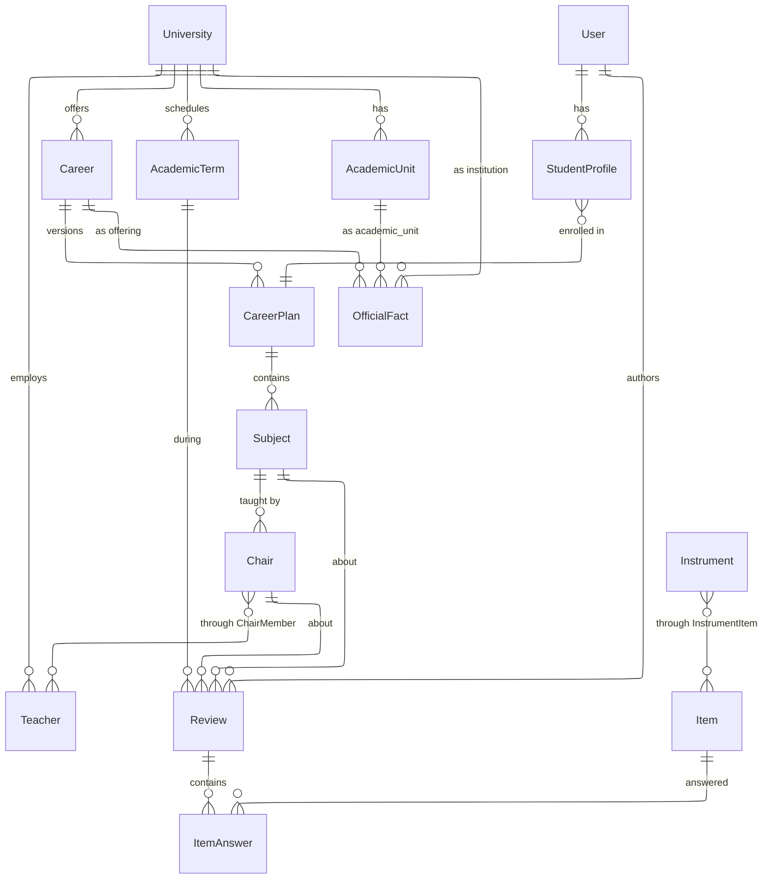
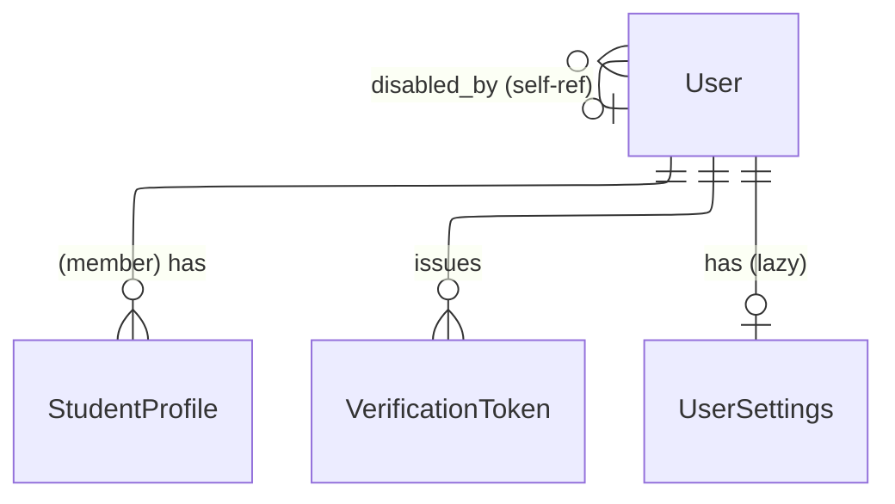
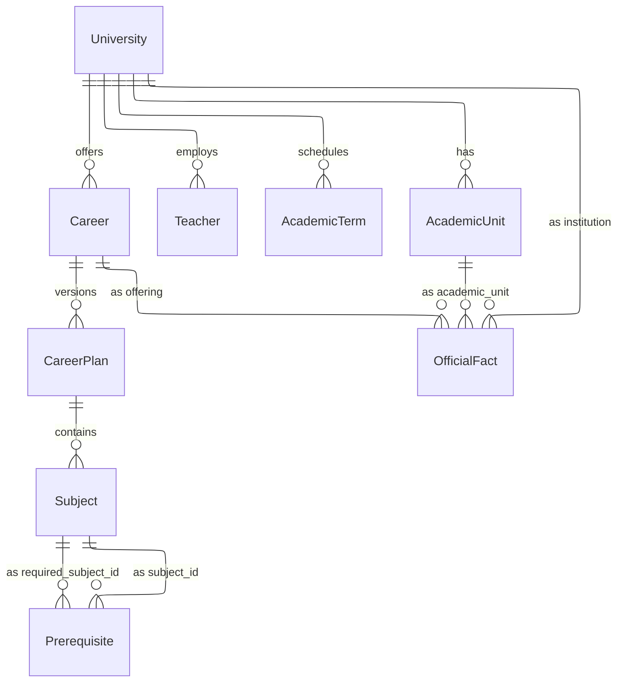

# Data Model. planb

> **Este documento describe el código actual, y desde R2 hay un solo modelo de reseña.** El del producto vigente ([ADR-0082](../decisions/0082-the-review-captures-the-cursada-in-three-layers.md) a [ADR-0085](../decisions/0085-three-instruments-and-official-data.md)): la [cátedra](#entity-chair-la-cátedra) en el catálogo académico, y el [instrumento con la reseña de tres capas](#context-el-instrumento-y-la-reseña-de-tres-capas) en su propio contexto. El anterior (la `Review` con ratings y texto publicado, `TeacherResponse`, la moderación de contenido y el planificador) se podó y ya no está descripto acá: vive en el historial de git.

Modelo de datos completo del sistema, organizado por bounded contexts. Cada sección tiene un diagrama ER en Mermaid con las relaciones del contexto, seguido de la especificación de cada entidad (campos, tipos, constraints) y las invariantes que se aplican transversalmente.

El "por qué" de las decisiones estructurales está en los ADRs referenciados. Este documento describe el "qué".

## Tabla de contenidos

- [Overview](#overview)
- [Context: Identity](#context-identity)
- [Context: Academic Catalog](#context-academic-catalog)
- [Context: el instrumento y la reseña de tres capas](#context-el-instrumento-y-la-reseña-de-tres-capas)
- [Context: Semantic Analytics](#context-semantic-analytics)
- [Apéndice A: Enums](#apéndice-a-enums)
- [Apéndice B: Invariantes transversales](#apéndice-b-invariantes-transversales)

## Overview

Vista de alto nivel: bounded contexts y sus conexiones. Cada contexto se detalla en su sección.



**Contextos:**

| Context              | Entidades                                                                                                   | Propósito                                                       |
| -------------------- | ----------------------------------------------------------------------------------------------------------- | --------------------------------------------------------------- |
| Identity             | User, StudentProfile, UserSettings, UserDeletionLog, VerificationToken                      | Cuentas, roles, identidades académicas, ajustes, bajas         |
| Academic Catalog     | University, AcademicUnit, Career, CareerPlan, Subject, Prerequisite, Teacher, Chair, ChairMember, AcademicTerm, CareerPlanImport, OfficialFact | Datos precargados del dominio académico y los datos oficiales relevados (ADR-0090) |

## Context: Identity

Cuentas, roles y perfiles que capturan identidad del usuario en la plataforma. Ver [ADR-0008](../decisions/0008-exclusive-roles-with-profiles-as-capability-unlockers.md) para la separación entre rol y profile. El perfil docente y su claim se borraron en R4: hoy solo hay identidad de alumno.



### Entity: User

| Campo                    | Tipo                      | Constraints | Notas                                                                                                      |
| ------------------------ | ------------------------- | ----------- | ------------------------------------------------------------------------------------------------------------ |
| `id`                     | UUID                      | PK          |                                                                                                             |
| `email`                  | VARCHAR(254)              | NOT NULL    | Único mientras la cuenta está activa (ver índice abajo)                                                     |
| `password_hash`          | TEXT                      | NOT NULL    | bcrypt. Sentinel `DEACTIVATED` tras una baja (ADR-0044)                                                      |
| `email_verified_at`      | TIMESTAMPTZ               | NULL        | Null = registro pendiente de verificar                                                                      |
| `role`                   | ENUM `identity.user_role` | NOT NULL    | `member`, `moderator`, `admin`, `university_staff` (ADR-0008). Sin default en DB: lo fija `User.Register`   |
| `disabled_at`            | TIMESTAMPTZ               | NULL        | Soft suspend                                                                                                |
| `disabled_reason`        | TEXT                      | NULL        |                                                                                                             |
| `disabled_by`            | UUID                      | NULL        | Self-ref a `User.id`, sin FK                                                                                 |
| `expired_at`             | TIMESTAMPTZ               | NULL        | Registro sin verificar, vencido (US-022)                                                                    |
| `deactivated_at`         | TIMESTAMPTZ               | NULL        | Baja propia con anonimización del email (ADR-0044)                                                          |
| `pending_career_plan_id` | UUID                      | NULL        | Carrera declarada en el registro, antes de verificar el mail                                                |
| `pending_career_id`      | UUID                      | NULL        | `CareerId` denormalizado del plan pendiente                                                                  |
| `created_at`             | TIMESTAMPTZ               | NOT NULL    |                                                                                                             |
| `updated_at`             | TIMESTAMPTZ               | NOT NULL    |                                                                                                             |

Constraints:

- `UNIQUE(email) WHERE expired_at IS NULL AND deactivated_at IS NULL` (`ux_users_email_active`): un registro expirado o una cuenta dada de baja no bloquean que el mismo email se vuelva a registrar.

### Entity: StudentProfile (child de User)

Vincula un User con un CareerPlan y, opcionalmente, su año de ingreso. Vive como owned entity de `User` (tabla `student_profiles`), sin lifecycle propio: nace y se borra con el aggregate que lo contiene.

| Campo             | Tipo         | Constraints              | Notas                                                                                          |
| ------------------ | ------------ | ------------------------- | -------------------------------------------------------------------------------------------------- |
| `id`               | UUID         | PK                        |                                                                                                     |
| `user_id`          | UUID         | NOT NULL                  | Owner de la owned entity                                                                            |
| `career_plan_id`   | UUID         | NOT NULL                  | Ref a CareerPlan sin FK (cross-schema, ADR-0017)                                                    |
| `career_id`        | UUID         | NOT NULL                  | Denormalizado del plan: compara carreras sin JOIN cross-schema                                     |
| `enrollment_year`  | INT          | NULL                      | Nullable: el profile que materializa `VerifyEmail` desde una declaración de carrera todavía no tiene año |
| `status`           | VARCHAR(20)  | NOT NULL                  | Hoy el único valor es `Active`                                                                      |
| `display_name`     | VARCHAR(80)  | NULL                      | Editable desde Mi perfil (US-047)                                                                    |
| `year_of_study`    | INT          | NULL                      |                                                                                                     |
| `legajo`           | VARCHAR(32)  | NULL                      |                                                                                                     |
| `regular_student`  | BOOLEAN      | NOT NULL, DEFAULT `true`  |                                                                                                     |
| `created_at`       | TIMESTAMPTZ  | NOT NULL                  |                                                                                                     |
| `updated_at`       | TIMESTAMPTZ  | NULL                      |                                                                                                     |

Constraints:

- `UNIQUE(user_id) WHERE status = 'Active'` (`ux_student_profiles_user_active`): a lo sumo un profile activo por cuenta, sin importar la carrera. El invariante es la cuenta, no la carrera: para pasarse a otra hay que dar de baja el activo primero.

### Entity: VerificationToken (child de User)

Token opaco que un User consume para verificar su email o para resetear su contraseña. Es **child entity**, no aggregate independiente: vive dentro del aggregate root que lo posee. Ver [ADR-0033](../decisions/0033-verification-token-as-a-child-entity.md).

| Campo             | Tipo         | Constraints       | Notas                                                                                |
| ------------------ | ------------ | ------------------ | ---------------------------------------------------------------------------------------- |
| `id`               | UUID         | PK                 |                                                                                           |
| `user_id`          | UUID         | NOT NULL           | Owner                                                                                     |
| `purpose`          | VARCHAR(64)  | NOT NULL           | `UserEmailVerification`, `PasswordReset`                                                  |
| `token`            | VARCHAR(128) | NOT NULL, UNIQUE    | Opaco                                                                                     |
| `issued_at`        | TIMESTAMPTZ  | NOT NULL           |                                                                                           |
| `expires_at`       | TIMESTAMPTZ  | NOT NULL           | 24h para verificación de email, 30min para reset de contraseña                            |
| `consumed_at`      | TIMESTAMPTZ  | NULL               | Set al consumirse; terminal                                                              |
| `invalidated_at`   | TIMESTAMPTZ  | NULL               | Set al invalidarse (token nuevo del mismo purpose, resend, o expiración de registro)      |

Constraints:

- `UNIQUE(token)` (`ux_verification_tokens_token`).
- `UNIQUE(user_id, purpose) WHERE consumed_at IS NULL AND invalidated_at IS NULL` (`ux_verification_tokens_user_purpose_active`): un solo token activo por purpose por user.

### Entity: UserSettings

Configuración personal del user (US-072): notificaciones, privacidad, idioma, tema. Aggregate root propio, no child de `User`: el row nace lazy en el primer PATCH, no en el registro. Sin row, el GET devuelve los defaults sin persistir nada.

| Campo                          | Tipo         | Constraints | Notas                                                     |
| ------------------------------- | ------------ | ----------- | ------------------------------------------------------------ |
| `id`                            | UUID         | PK          |                                                               |
| `user_id`                       | UUID         | NOT NULL    |                                                               |
| `notifications_in_app`          | BOOLEAN      | NOT NULL    | Default `true`                                                |
| `notifications_email`           | BOOLEAN      | NOT NULL    | Default `true`                                                |
| `notify_review_response`        | BOOLEAN      | NOT NULL    | Default `true`                                                |
| `notify_new_review_in_followed` | BOOLEAN      | NOT NULL    | Default `true`                                                |
| `notify_academic_calendar`      | BOOLEAN      | NOT NULL    | Default `true`                                                |
| `notify_draft_promotion_nudge`  | BOOLEAN      | NOT NULL    | Default `true`                                                |
| `show_display_name_in_reviews`  | BOOLEAN      | NOT NULL    | Default `true`                                                |
| `allow_teacher_contact`         | BOOLEAN      | NOT NULL    | Default `false`: único opt-in de privacidad, no se asume       |
| `language`                      | VARCHAR(32)  | NOT NULL    | `EsRioplatense` (default), `EsNeutro`, `En`                    |
| `theme`                         | VARCHAR(16)  | NOT NULL    | `Auto` (default), `Light`, `Dark`                              |
| `created_at`                    | TIMESTAMPTZ  | NOT NULL    |                                                               |
| `updated_at`                    | TIMESTAMPTZ  | NOT NULL    | Se actualiza en cada PATCH                                    |

Constraints:

- `UNIQUE(user_id)` (`ux_user_settings_user_id`): un settings row por cuenta.

### Entity: UserDeletionLog

Fila de auditoría inmutable que queda cuando un user borra su cuenta (UC-038, derecho de supresión, Ley 25.326 art. 6). Guarda el hash del email, no el email: alcanza para responder "¿esta cuenta existió?" y "¿este email ya se borró antes?" sin retener el dato identificable que el borrado pide suprimir.

| Campo        | Tipo         | Constraints | Notas                                                        |
| ------------- | ------------ | ----------- | ---------------------------------------------------------------- |
| `id`          | UUID         | PK          |                                                                   |
| `user_id`     | UUID         | NOT NULL    | Sin FK: el user ya se está borrando en la misma transacción       |
| `email_hash`  | VARCHAR(64)  | NOT NULL    | SHA-256 hex del email en minúsculas                                |
| `deleted_at`  | TIMESTAMPTZ  | NOT NULL    |                                                                   |

Índices (ninguno único: si una cuenta se recrea con el mismo email y se vuelve a borrar, tanto el `user_id` como el `email_hash` pueden repetirse):

- `ix_user_deletion_log_user_id`.
- `ix_user_deletion_log_email_hash`.

### Invariantes cross-table (enforced en app)

- `User.Role != Member` → no puede tener ningún `StudentProfile` (lo rechaza `AddStudentProfile` con el error `OnlyMembersCanHaveProfiles`).
- Un `User` con `Role = Member` tiene a lo sumo un `StudentProfile` activo, sin importar la carrera (`ux_student_profiles_user_active`).
- `PendingCareerPlanId` / `PendingCareerId` solo existen mientras el registro no verificó el mail: `VerifyEmail` los materializa en un `StudentProfile` y los limpia (con o sin éxito), y `Deactivate` / `ExpireRegistration` también los limpian.

## Context: Academic Catalog

Datos precargados manualmente por el equipo admin. Modela universidades, unidades académicas, carreras, planes de estudio, materias, correlativas, docentes, cátedras, cuatrimestres y los datos oficiales relevados contra fuente pública. Ver [ADR-0001](../decisions/0001-multi-university-as-root-domain-from-day-1.md), [ADR-0049](../decisions/0049-career-plan-versions-by-year-and-status.md), [ADR-0003](../decisions/0003-prerequisites-with-two-types.md), [ADR-0090](../decisions/0090-an-official-datum-is-a-dated-claim-with-value-source-and-status.md).



### Entity: University

| Campo                         | Tipo        | Constraints              | Notas                                            |
| ----------------------------- | ----------- | ------------------------ | ------------------------------------------------ |
| `id`                          | UUID        | PK                       |                                                  |
| `name`                        | TEXT        | NOT NULL                 | Ej "Universidad del Norte Santo Tomás de Aquino" |
| `short_name`                  | TEXT        | NOT NULL                 | Ej "UNSTA"                                       |
| `slug`                        | TEXT        | NOT NULL, UNIQUE         | Ej "unsta"                                       |
| `country`                     | TEXT        | NOT NULL                 |                                                  |
| `city`                        | TEXT        | NOT NULL                 |                                                  |
| `website`                     | TEXT        | NULL                     |                                                  |
| `institutional_email_domains` | TEXT[]      | NOT NULL, DEFAULT `'{}'` | Dominios de email institucional, en lowercase    |
| `created_at`                  | TIMESTAMPTZ | NOT NULL                 |                                                  |
| `updated_at`                  | TIMESTAMPTZ | NOT NULL                 |                                                  |

### Entity: AcademicUnit

La facultad: el nivel entre la institución y la carrera ([ADR-0085](../decisions/0085-three-instruments-and-official-data.md), [ADR-0090](../decisions/0090-an-official-datum-is-a-dated-claim-with-value-source-and-status.md)). Las carreras cuelgan de ella y es uno de los tres sujetos posibles de un `OfficialFact`.

| Campo           | Tipo        | Constraints               | Notas                                            |
| --------------- | ----------- | -------------------------- | ------------------------------------------------ |
| `id`            | UUID        | PK                         |                                                  |
| `university_id` | UUID        | NOT NULL                   | Ref a University sin FK (cross-aggregate, ADR-0017) |
| `name`          | TEXT        | NOT NULL                   | Ej "Facultad de Ingeniería"                      |
| `slug`          | TEXT        | NOT NULL                   | Único por universidad                            |
| `is_active`     | BOOLEAN     | NOT NULL, DEFAULT `true`   | Soft delete                                      |
| `created_at`    | TIMESTAMPTZ | NOT NULL                   |                                                  |
| `updated_at`    | TIMESTAMPTZ | NOT NULL                   |                                                  |

Constraints:

- `UNIQUE(university_id, slug)`: slug único por universidad.

### Entity: Career

| Campo            | Tipo                      | Constraints               | Notas                                         |
| ----------------- | ------------------------- | -------------------------- | ----------------------------------------------- |
| `id`              | UUID                      | PK                          |                                                 |
| `university_id`   | UUID                      | FK → University, NOT NULL   |                                                 |
| `name`            | TEXT                      | NOT NULL                    |                                                 |
| `slug`            | TEXT                      | NOT NULL                    | Único por universidad                          |
| `short_name`      | TEXT                      | NULL                        | Ej "Ing. Sistemas"                             |
| `code`            | TEXT                      | NULL                        | Código institucional, ej "TUDCS"               |
| `degree_type`     | ENUM `career_degree_type` | NULL                        | Grado, posgrado o tecnicatura                  |
| `duration_years`  | INT                       | NULL                        | Duración nominal en años (rango 1-15)          |
| `cadence`         | ENUM `term_kind`          | NULL                        | Cadencia mayoritaria de la carrera              |
| `description`     | TEXT                      | NULL                        | Descripción corta visible al alumno            |
| `is_official`     | BOOLEAN                   | NOT NULL, DEFAULT `true`    | False cuando la creó un alumno via crowdsourcing |
| `is_active`       | BOOLEAN                   | NOT NULL, DEFAULT `true`    | Soft delete                                    |
| `created_at`      | TIMESTAMPTZ               | NOT NULL                    |                                                 |
| `updated_at`      | TIMESTAMPTZ               | NOT NULL                    |                                                 |

Constraints:

- `UNIQUE(university_id, slug)`: slug único por universidad.
- `UNIQUE(university_id, code) WHERE code IS NOT NULL`: código único por universidad cuando se provee (índice parcial).
- `duration_years` (cuando no NULL): rango 1-15.

### Entity: CareerPlan

Plan de estudios de una Career para un año particular (ej. "TUDCS Plan 2024").

| Campo         | Tipo                       | Constraints              | Notas                                             |
| ------------- | -------------------------- | -------------------------- | --------------------------------------------------- |
| `id`          | UUID                       | PK                          |                                                     |
| `career_id`   | UUID                       | FK → Career, NOT NULL       |                                                     |
| `year`        | INT                        | NOT NULL                    | Año del plan, ej 2024                              |
| `status`      | ENUM `career_plan_status`  | NOT NULL                    | `active` = vigente; `deprecated` = histórico       |
| `label`       | TEXT                       | NULL                         | Identificador editorial opcional, ej "plan-2023"   |
| `is_official` | BOOLEAN                    | NOT NULL, DEFAULT `true`    | False cuando lo creó un alumno via crowdsourcing   |
| `created_at`  | TIMESTAMPTZ                | NOT NULL                    |                                                     |
| `updated_at`  | TIMESTAMPTZ                | NOT NULL                    |                                                     |

Constraints:

- `UNIQUE(career_id, year)`: un plan por año por carrera.

### Entity: Subject

Materia de un plan específico.

| Campo            | Tipo             | Constraints               | Notas             |
| ---------------- | ---------------- | ------------------------- | ----------------- |
| `id`             | UUID             | PK                        |                   |
| `career_plan_id` | UUID             | FK → CareerPlan, NOT NULL |                   |
| `code`           | TEXT             | NOT NULL                  | Ej "MAT101"       |
| `name`           | TEXT             | NOT NULL                  | Ej "Matemática I" |
| `year_in_plan`   | INT              | NOT NULL                  | 1, 2, 3…          |
| `term_in_year`   | INT              | NULL                      | Null si anual     |
| `term_kind`      | ENUM `term_kind` | NOT NULL                  |                   |
| `weekly_hours`   | INT              | NOT NULL                  |                   |
| `total_hours`    | INT              | NOT NULL                  |                   |
| `description`    | TEXT             | NULL                      |                   |
| `is_active`      | BOOLEAN          | NOT NULL, DEFAULT `true`  | Soft delete (US-062) |
| `is_official`    | BOOLEAN          | NOT NULL                  | False si la creó el crowdsourcing |
| `created_at`     | TIMESTAMPTZ      | NOT NULL                  |                   |
| `updated_at`     | TIMESTAMPTZ      | NOT NULL                  |                   |

Constraints:

- `UNIQUE(career_plan_id, code)`.
- CHECK: `term_kind = 'anual'` → `term_in_year IS NULL`.
- CHECK: `term_kind != 'anual'` → `term_in_year IS NOT NULL`.

Índices de búsqueda (US-042):

```sql
CREATE INDEX ix_subjects_search_trgm ON academic.subjects USING gin (
    academic.immutable_unaccent(lower(code)) gin_trgm_ops,
    academic.immutable_unaccent(lower(name)) gin_trgm_ops);
```

`academic.immutable_unaccent(text)` es un wrapper propio: las dos sobrecargas de `unaccent` son `STABLE`, así que Postgres rechaza indexarlas. Fijando el diccionario de forma explícita (`public.unaccent('public.unaccent'::regdictionary, $1)`) el resultado sí es determinístico y marcarla `IMMUTABLE` es correcto. La query tiene que usar exactamente la misma expresión, y comparar por similitud con el operador `%` (con `pg_trgm.similarity_threshold` seteado en la sesión), porque `similarity(a,b) > x` como llamada a función no es indexable.

### Entity: Prerequisite

Correlativa entre dos materias del mismo plan.

| Campo                 | Tipo                     | Constraints            |
| --------------------- | ------------------------ | ---------------------- |
| `subject_id`          | UUID                     | FK → Subject, NOT NULL |
| `required_subject_id` | UUID                     | FK → Subject, NOT NULL |
| `type`                | ENUM `prerequisite_type` | NOT NULL               |

Constraints:

- `PRIMARY KEY (subject_id, required_subject_id, type)`.
- CHECK: `subject_id != required_subject_id`.
- App-level: ambas materias pertenecen al mismo `career_plan_id`.
- App-level: el grafo de cada `type` es acíclico (validado al cargar plan en backoffice).

### Entity: Teacher

Docente del catálogo de una universidad. Entidad precargada, independiente de si un User la reclamó.

| Campo           | Tipo        | Constraints               | Notas                                                             |
| --------------- | ----------- | ------------------------- | ----------------------------------------------------------------- |
| `id`            | UUID        | PK                        |                                                                   |
| `university_id` | UUID        | FK → University, NOT NULL |                                                                   |
| `first_name`    | TEXT        | NOT NULL                  |                                                                   |
| `last_name`     | TEXT        | NOT NULL                  |                                                                   |
| `title`         | TEXT        | NULL                      | Lowercase en DB, title case en display (convención Laravel-style) |
| `bio`           | TEXT        | NULL                      |                                                                   |
| `photo_url`     | TEXT        | NULL                      |                                                                   |
| `is_active`     | BOOLEAN     | NOT NULL, DEFAULT `true`  | Soft delete (US-063)                                              |
| `created_at`    | TIMESTAMPTZ | NOT NULL                  |                                                                   |
| `updated_at`    | TIMESTAMPTZ | NOT NULL                  |                                                                   |

Índice de búsqueda análogo al de Subject (`ix_teachers_search_trgm`), con una tercera expresión sobre `first_name || ' ' || last_name` para la búsqueda por nombre completo.

Un docente archivado no se puede sumar a una cátedra (app-level). Sí se lo deja donde ya integraba: sacarlo reescribiría quién dictó esa cursada.

### Entity: AcademicTerm

Período lectivo genérico. Ver [ADR-0001](../decisions/0001-multi-university-as-root-domain-from-day-1.md).

| Campo               | Tipo             | Constraints               | Notas                                                  |
| ------------------- | ---------------- | ------------------------- | ------------------------------------------------------ |
| `id`                | UUID             | PK                        |                                                        |
| `university_id`     | UUID             | FK → University, NOT NULL |                                                        |
| `year`              | INT              | NOT NULL                  |                                                        |
| `number`            | INT              | NOT NULL                  | Ordinal dentro del año                                 |
| `kind`              | ENUM `term_kind` | NOT NULL                  |                                                        |
| `start_date`        | DATE             | NOT NULL                  |                                                        |
| `end_date`          | DATE             | NOT NULL                  |                                                        |
| `enrollment_opens`  | TIMESTAMPTZ      | NOT NULL                  |                                                        |
| `enrollment_closes` | TIMESTAMPTZ      | NOT NULL                  |                                                        |
| `label`             | TEXT             | NOT NULL                  | Computado al insertar. Ej "2026-C1", "2026-B3", "2026" |
| `created_at`        | TIMESTAMPTZ      | NOT NULL                  |                                                        |
| `updated_at`        | TIMESTAMPTZ      | NOT NULL                  |                                                        |

Constraints:

- `UNIQUE(university_id, year, number, kind)`.
- CHECK: `end_date > start_date`.
- CHECK: `enrollment_closes > enrollment_opens`.

El `label` lo computa siempre el dominio (`AcademicTerm.ComputeLabel`), incluido el seeder. Cuando el seed traía sus propios literales, el mismo dropdown mezclaba dos convenciones para el mismo tipo de período según quién lo hubiera creado.

### Entity: Chair (la cátedra)

El equipo docente a cargo de una materia, con su titular ([ADR-0082](../decisions/0082-the-review-captures-the-cursada-in-three-layers.md), US-196). Persiste entre períodos, y una materia puede tener varias en paralelo, que es lo que la ficha compara. La reseña la referencia por id, cross-BC y sin FK.

| Campo        | Tipo         | Constraints            | Notas                                            |
| ------------ | ------------ | ---------------------- | ------------------------------------------------ |
| `id`         | UUID         | PK                     |                                                  |
| `subject_id` | UUID         | NOT NULL               | Ref a Subject sin FK (cross-aggregate, ADR-0017) |
| `name`       | VARCHAR(100) | NOT NULL               | Cómo la nombra el alumno: casi siempre el apellido del titular |
| `is_active`  | BOOLEAN      | NOT NULL               | Soft delete (ADR-0057)                           |
| `created_at` | TIMESTAMPTZ  | NOT NULL               |                                                  |
| `updated_at` | TIMESTAMPTZ  | NOT NULL               |                                                  |

Constraints:

- `UNIQUE(subject_id, name)` (`ux_chairs_subject_name`), sobre todas las filas: archivar no libera el nombre.

### Entity: ChairMember

Un docente en el equipo, con su rol y **el tramo en el que estuvo**.

| Campo           | Tipo                  | Constraints          | Notas                                        |
| --------------- | --------------------- | -------------------- | -------------------------------------------- |
| `chair_id`      | UUID                  | FK → Chair, NOT NULL | ON DELETE CASCADE (intra-aggregate)          |
| `teacher_id`    | UUID                  | NOT NULL             | Ref a Teacher sin FK                         |
| `role`          | VARCHAR(32)           | NOT NULL             | `Lead`, `Associate`, `PracticalLead`, `Assistant`, `Guest` |
| `since_term_id` | UUID                  | NOT NULL             | Desde qué período está                       |
| `until_term_id` | UUID                  | NULL                 | NULL = sigue en el equipo                    |

Constraints:

- `PRIMARY KEY (chair_id, teacher_id, since_term_id)`. El período de inicio entra en la clave porque un docente puede irse y volver, y cada tramo es una fila propia.

El tramo no es adorno: la ficha publica reseñas de varios años y el equipo cambia. Sin `since`/`until`, la ficha le atribuiría al titular de hoy lo que se dictó hace tres años. Los invariantes que el aggregate sostiene (un docente vigente por vez, a lo sumo un titular vigente) no tienen red en la base, porque validar solapamientos de tramos exige ordenar períodos: los valida `Chair`, y `Hydrate` tira si el manifiesto del seeder viene incoherente.

### Entity: OfficialFact

Un dato oficial: una afirmación fechada, con sujeto, campo, valor con su unidad, período, fuente y estado ([ADR-0090](../decisions/0090-an-official-datum-is-a-dated-claim-with-value-source-and-status.md)). Ledger de solo alta: no hay Update, "corregir" es cargar una afirmación nueva con una fecha de relevamiento más reciente.

| Campo                 | Tipo         | Constraints | Notas                                                                 |
| --------------------- | ------------ | ----------- | ---------------------------------------------------------------------- |
| `id`                  | UUID         | PK          |                                                                        |
| `subject_type`        | ENUM `official_fact_subject_type` | NOT NULL | `Institution`, `AcademicUnit`, `Offering`. Guardado como string      |
| `subject_id`          | UUID         | NOT NULL    | Ref a University, AcademicUnit o Career según `subject_type`, sin FK   |
| `field`               | VARCHAR(60)  | NOT NULL    | Código del vocabulario curado en código (`OfficialFactField`), abierto |
| `value`               | VARCHAR(2000)| NULL        | El valor tal como se publica, como texto tipado. Null si no hay dato   |
| `unit`                | VARCHAR(20)  | NULL        | `years`, `percent`, `count`, `currency_ars` cuando el valor es numérico |
| `period`              | VARCHAR(120) | NULL        | A qué período refiere el dato, distinto de `relieved_at`               |
| `source_name`         | VARCHAR(200) | NOT NULL    | Obligatoria siempre, incluso con `status = NotPublished`               |
| `source_url`          | VARCHAR(2000)| NOT NULL    |                                                                        |
| `source_document`     | VARCHAR(200) | NULL        | Documento o cuadro dentro de la fuente                                 |
| `source_retrieved_at` | TIMESTAMPTZ  | NOT NULL    | Fecha en que se bajó la muestra de la fuente                           |
| `status`              | ENUM `official_fact_status` | NOT NULL | `Published`, `Derived`, `NotPublished`, `Requested`, `NotApplicable`. Guardado como string |
| `derivation_rule_id`  | VARCHAR(60)  | NULL        | Obligatorio cuando `status = Derived`: el id de la regla escrita en Método |
| `note`                | VARCHAR(1000)| NULL        | Obligatoria cuando `status = NotApplicable` (la razón)                 |
| `relieved_at`         | TIMESTAMPTZ  | NOT NULL    | Cuándo se relevó el dato                                                |
| `relieved_by`         | UUID         | NOT NULL    | Ref a User (identity) sin FK cross-módulo                              |
| `created_at`          | TIMESTAMPTZ  | NOT NULL    |                                                                        |

Índices:

- `ix_official_facts_subject_field (subject_type, subject_id, field)`, **no único**: varias afirmaciones conviven a propósito para el mismo sujeto y campo (dos fuentes que no cierran, dos períodos). Cuál es la vigente lo decide el dominio (`OfficialFactCurrency.SelectCurrent`, la relevada más recientemente), nunca una constraint de la base ni el `ORDER BY` de un read.

### Invariantes cross-table (enforced en app)

- `Career.university_id = Teacher.university_id` para los teachers que integran (vía `ChairMember`) cátedras de subjects de esa carrera.
- `Chair.subject_id` existe y está activa; los `ChairMember.teacher_id` existen, están activos y son de la misma universidad que la materia.
- `Prerequisite`: ambos subjects pertenecen al mismo `career_plan_id`.
- `Career.university_id = Chair.subject.career_plan.career.university_id = AcademicTerm.university_id = Teacher.university_id` (coherencia universitaria total).

## Context: el instrumento y la reseña de tres capas

**El modelo del producto vigente** ([ADR-0082](../decisions/0082-the-review-captures-the-cursada-in-three-layers.md) a [ADR-0084](../decisions/0084-free-text-feeds-curation-and-is-never-published.md)), y desde R2 lo único que vive en el schema `reviews`. Cuatro tablas del catálogo (qué se pregunta) y dos de la reseña (qué se respondió).

Nacieron aparte de `Review` a propósito: `Review` no era una versión de la reseña anterior, era otra cosa, y convertirla habría dejado un período largo donde una misma tabla era mitad un modelo y mitad el otro. La anterior (`Review`, `ReviewVote`, `TeacherResponse`, `ReviewAuditLog`) y el schema `moderation` entero se podaron en R2 con la migración `DropPreviousReviewModel` ([ADR-0063](../decisions/0063-the-product-is-a-pressure-instrument.md)): moderaban y publicaban contenido que el modelo vigente no produce ([ADR-0084](../decisions/0084-free-text-feeds-curation-and-is-never-published.md)). Su forma queda en el historial de git.

### Entity: Item

Una pregunta del cuestionario con sus opciones cerradas. Es la unidad de lo que se recolecta y de lo que la ficha publica como conteo.

| Campo        | Tipo         | Constraints | Notas                                                        |
| ------------ | ------------ | ----------- | ------------------------------------------------------------ |
| `id`         | UUID         | PK          |                                                              |
| `code`       | VARCHAR(60)  | NOT NULL    | La identidad **semántica**: `CHAIR_ANSWERS_IN_CLASS`         |
| `text`       | VARCHAR(200) | NOT NULL    | La pregunta como la lee el estudiante                        |
| `help`       | VARCHAR(500) | NULL        | Aclaración opcional                                          |
| `layer`      | VARCHAR(20)  | NOT NULL    | `Context`, `ChairConduct`, `StudentExperience`               |
| `subject`    | VARCHAR(20)  | NOT NULL    | A qué ficha aterriza: `Chair`, `Subject`, `Institution`      |
| `is_active`  | BOOLEAN      | NOT NULL    | Retirado no se borra: lo respondido sigue contando           |
| `created_at` | TIMESTAMPTZ  | NOT NULL    |                                                              |
| `updated_at` | TIMESTAMPTZ  | NOT NULL    |                                                              |

Constraints:

- `UNIQUE(code)` (`ux_items_code`).

**El código es la identidad, no el texto.** Afinar la redacción sin cambiar lo que se pregunta es un update: misma serie histórica, respuestas viejas comparables. Si cambia el **significado**, no se edita: se crea una frase nueva con código nuevo y la anterior se retira, y eso es lo que declara la ruptura de la serie. La distinción es editorial y la sostiene quien cura; el modelo la hace posible separando las dos columnas.

### Entity: ItemOption

| Campo     | Tipo         | Constraints         | Notas                                                     |
| --------- | ------------ | ------------------- | --------------------------------------------------------- |
| `item_id` | UUID         | FK → Item, NOT NULL | ON DELETE CASCADE (intra-aggregate)                       |
| `value`   | SMALLINT     | NOT NULL            | Lo que se persiste en la respuesta. **Nunca se recicla**  |
| `order`   | SMALLINT     | NOT NULL            | Orden en que se muestran                                  |
| `label`   | VARCHAR(120) | NOT NULL            | La etiqueta literal que la ficha repite cuando es la moda |
| `valence` | VARCHAR(20)  | NOT NULL            | `None`, `Positive`, `Neutral`, `Negative`                 |

Constraints:

- `PRIMARY KEY (item_id, value)`, con `value` explícitamente **no identity**: es un valor de negocio que elige quien cura la frase, y la convención de EF lo habría hecho autoincremental (se detectó leyendo la migración generada).

Invariantes que sostiene el aggregate: al menos dos opciones; valores y órdenes únicos; **a lo sumo una negativa** (el rojo de la ficha marca una sola cosa); y ninguna valencia distinta de `None` si la frase es de capa `Context`, porque el contexto no se publica dato por dato.

### Entity: Instrument

Una versión del cuestionario: qué frases se ofrecen y en qué orden.

| Campo         | Tipo        | Constraints | Notas                                    |
| ------------- | ----------- | ----------- | ---------------------------------------- |
| `id`          | UUID        | PK          |                                          |
| `code`        | VARCHAR(40) | NOT NULL    | `STUDENT_COURSE`                         |
| `version`     | SMALLINT    | NOT NULL    | Solo avanza                              |
| `valid_from`  | TIMESTAMPTZ | NOT NULL    |                                          |
| `valid_until` | TIMESTAMPTZ | NULL        | NULL = es la versión que se ofrece hoy   |

Constraints:

- `UNIQUE(code, version)` (`ux_instruments_code_version`).

Que no queden dos versiones vigentes del mismo código lo valida el application layer: es el único que ve las dos filas.

### Entity: InstrumentItem

| Campo           | Tipo     | Constraints               | Notas                               |
| --------------- | -------- | ------------------------- | ----------------------------------- |
| `instrument_id` | UUID     | FK → Instrument, NOT NULL | ON DELETE CASCADE                   |
| `item_id`       | UUID     | NOT NULL                  | Ref a Item sin FK (cross-aggregate) |
| `order`         | SMALLINT | NOT NULL                  | Orden en que se pregunta            |

Constraints:

- `PRIMARY KEY (instrument_id, item_id)`.

No lleva marca de obligatorio: **saltear siempre vale**, así que no habría dónde ponerla. Tampoco lleva condición: las frases condicionales no existen en el catálogo vigente y se agregan el día que una frase real las pida.

### Entity: Review

Una voz sobre una cursada: la unidad de todo lo que el producto publica.

| Campo           | Tipo          | Constraints | Notas                                                       |
| --------------- | ------------- | ----------- | ----------------------------------------------------------- |
| `id`            | UUID          | PK          | Nunca se publica: existe para que su autor la edite o borre |
| `account_id`    | UUID          | NOT NULL    | Ref a User sin FK. **Nunca se publica**                     |
| `subject_id`    | UUID          | NOT NULL    | Ref a Subject sin FK                                        |
| `term_id`       | UUID          | NOT NULL    | El período en que **cursó**, no en que reseñó               |
| `chair_id`      | UUID          | NULL        | NULL = no recuerda la cátedra, y es una respuesta legítima  |
| `instrument_id` | UUID          | NOT NULL    | La versión con la que respondió                             |
| `free_text`     | VARCHAR(2000) | NULL        | **No se publica nunca** (ADR-0084)                          |
| `created_at`    | TIMESTAMPTZ   | NOT NULL    |                                                             |
| `updated_at`    | TIMESTAMPTZ   | NOT NULL    |                                                             |

Constraints:

- `UNIQUE(account_id, subject_id, term_id)` (`ux_reviews_account_subject_term`): **una voz por cuenta, materia y período**. Es lo que impide que una persona pese como muchas en el mismo dato, y la red de base del error `already_reviewed`.

### Entity: ItemAnswer

| Campo              | Tipo     | Constraints                | Notas                                    |
| ------------------ | -------- | -------------------------- | ---------------------------------------- |
| `review_id` | UUID     | FK → Review, NOT NULL | ON DELETE CASCADE                        |
| `item_id`          | UUID     | NOT NULL                   | Ref a Item sin FK                        |
| `option_value`     | SMALLINT | NOT NULL                   | El valor de la opción, no su texto       |

Constraints:

- `PRIMARY KEY (review_id, item_id)`, con `option_value` **no identity** por la misma razón que `item_options.value`.

**Saltear no deja fila.** Una frase sin responder simplemente no está en esta tabla, y por eso no cuenta en ningún denominador: el denominador de una frase son las reseñas que la respondieron, no las que existen. Guardar un "no dijo" explícito sería la misma información con una fila de más, y abriría la puerta a contarlo como si fuera una respuesta.

Se guarda el **valor** y no la etiqueta porque la etiqueta puede afinarse después sin tocar lo respondido: es lo que mantiene comparable la serie.

### Invariantes cross-table (enforced en app)

- La materia y el período de una `Review` existen en el catálogo; la cátedra, si se declaró, es una de las de esa materia (si no, el dato aterrizaría en la ficha equivocada).
- Cada `ItemAnswer` apunta a una frase que **el instrumento de esa reseña ofrece**, y a un valor que **esa frase admite**. El aggregate recibe el juego de pares válidos armado desde el catálogo y rechaza cualquier otro.
- Una opción que ya tiene respuestas no se borra ni cambia de valor al re-editar la frase: las reseñas viejas la apuntan.
- Ningún read público devuelve una `Review` individual, ni su `free_text`, ni su contexto dato por dato. Lo que se publica son conteos agregados, y el piso de 10 reseñas por cátedra protege a quien reseñó, no a la institución.

## Context: Semantic Analytics

**No existe.** La revisión del 2026-07-26 de [ADR-0007](../decisions/0007-pgvector-deferred-until-there-is-a-real-consumer.md) borró el andamiaje de pgvector (la extensión, el wiring de Npgsql y el handler stub) hasta que haya un consumidor real.

Este doc describía la tabla `ReviewEmbedding` con su unique y su índice HNSW como si estuvieran creados. Nunca lo estuvieron: no había tabla, ni entidad, ni repositorio, ni índice, ni pipeline. Se saca la descripción en lugar de dejarla marcada como pendiente, porque un modelo de datos que enumera columnas de una tabla inexistente se lee con la misma confianza que el resto del doc.

El diseño (tabla aparte para poder versionar modelos, el modelo elegido, el gating por volumen) sigue vigente en el ADR para cuando la feature se retome.

## Apéndice A: Enums

Nombres y valores de todos los enums del modelo.

| Enum                          | Valores                                                                               |
| ----------------------------- | ------------------------------------------------------------------------------------- |
| `user_role`                   | `member`, `moderator`, `admin`, `university_staff`                                    |
| `career_degree_type`          | `grado`, `posgrado`, `tecnicatura`                                                    |
| `career_plan_status`          | `active`, `deprecated`                                                                |
| `term_kind`                   | `bimestral`, `cuatrimestral`, `semestral`, `anual`                                    |
| `prerequisite_type`           | `para_cursar`, `para_rendir`                                                          |
| `career_plan_import_status`   | `pending`, `parsing`, `parsed`, `failed`, `approved`                                  |
| `verification_token_purpose`  | `UserEmailVerification`, `PasswordReset` (persistido como texto, no como enum de Postgres) |
| `official_fact_subject_type`  | `Institution`, `AcademicUnit`, `Offering` (persistido como texto, no como enum de Postgres) |
| `official_fact_status`        | `Published`, `Derived`, `NotPublished`, `Requested`, `NotApplicable` (persistido como texto, no como enum de Postgres) |

## Apéndice B: Invariantes transversales

Reglas que atraviesan múltiples contextos y no caben en una sola sección. La mayoría se enforcan en app porque cruzan tablas.

### Separación de roles staff y profiles

- Si `User.role != 'member'` → no puede existir `StudentProfile(user_id=User.id)`.
- `User.role = 'member'` → puede tener a lo sumo un `StudentProfile` activo.

Responsable: servicios de registro, claim de profile, cambio de rol admin.

### Anonimato en serialización

Ningún endpoint público serializa:

- `Review.account_id`, ni ninguna otra forma de llegar de una respuesta a quien la escribió.
- `Review.free_text`, que no se publica nunca y solo lo relee su autor ([ADR-0084](../decisions/0084-free-text-feeds-curation-and-is-never-published.md)).
- `ItemAnswer` de a una: lo que sale publicado son conteos, y solo pasado el piso de la cátedra ([ADR-0083](../decisions/0083-the-ficha-publishes-counts-not-scores.md)).
- `User.email` de terceros.

Responsable: DTOs de la capa API, tests de integración que verifican ausencia de estos campos.
