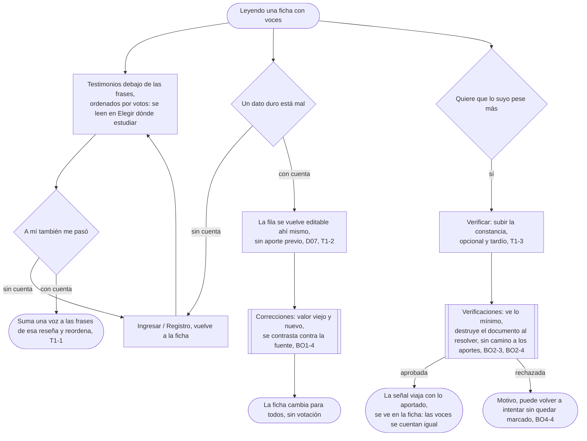

# Cuidar lo publicado: el flujo

> No reemplaza ninguna fila del mapa: el mapa dibuja Votar y Corregir como "acciones inline", sin fila de flujo propia. Personas: Matías (vota), quien vuelve (corrige), quien lee (los testimonios), quien ya aportó (se verifica). Disparador: leer una ficha con testimonios o con un dato duro mal cargado. Stories que cubre: T1-1, T1-2, T1-3 (y lo que tocan del otro lado: BO1-4, BO2-3, BO2-4, BO4-4).

## Salidas y errores

- **Sin cuenta**: votar, corregir y verificarse la piden; leer los testimonios y reportarlos no.
- **La corrección no cambia nada hasta contrastarse contra la fuente** (BO1-4): después cambia para todos, sin votación.
- **La constancia se destruye al resolver** (BO2-3) y esa cola no tiene camino a los aportes de la misma cuenta (BO2-4).
- **Verificarse no mueve ninguna proporción**: las voces se cuentan igual, verificadas o no (T1-3).
- **Una constancia adulterada se rechaza con motivo**, y quien la subió puede volver a intentarlo sin quedar marcado (BO4-4).

## Lo que el flujo no dibuja y la ficha de la pantalla decide

Cómo se ve la señal de verificado sin identificar a nadie; si el voto se puede retirar una vez puesto; qué datos duros son editables inline y cuáles quedan reservados al catálogo.
