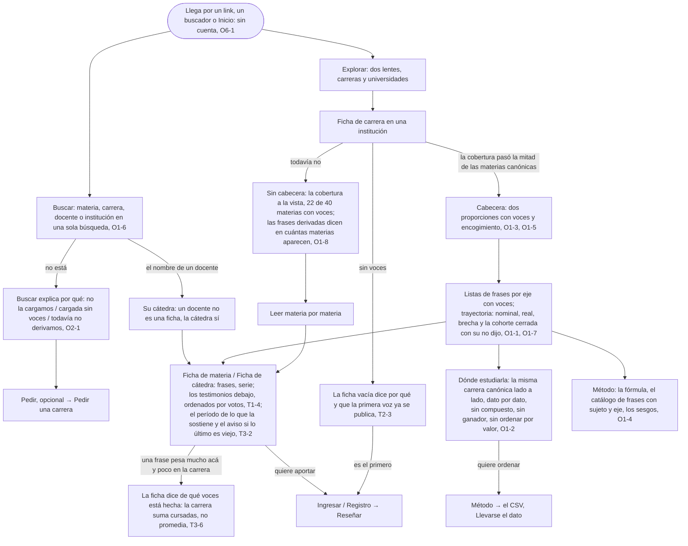

# Elegir dónde estudiar: el flujo

> Reemplaza a las filas 01 (Valentina tiene que elegir en dos meses) y 11 (Buscar, cuando te recomiendan una persona) de la tabla de flujos del [mapa](../../design/product-map.md). Personas: Valentina, Silvia, quien lee. Disparador: un link, un buscador, una recomendación, o Inicio. Stories que cubre: O1-1 a O1-8, T1-4, T2-3, T3-2, T3-6, O2-1, O6-1, O6-4.

## Salidas y errores

- **Lo que busca no está cargado** (O2-1): la ficha no existe y no se inventa; Buscar y Explorar explican el vacío y ofrecen Pedir. Sigue en [Pedir una carrera](../request-a-career/flow.md).
- **Cargada y sin voces** (T2-3): la ficha existe vacía, dice que la primera voz ya se publica con sus voces y su encogimiento, sin escalones.
- **Cargada con voces y sin cabecera** (O1-8): se lee materia por materia; nunca un cero ni una cabecera armada con tres materias.
- **Lo último es viejo** (T3-2): la ficha lo avisa; los testimonios muestran su período.
- **Quiere ordenar la comparación**: no se ordena por valor en pantalla; baja el CSV (O1-2, O8-1).
- **Nada de esto pide cuenta** (O6-1); nada está destacado ni patrocinado (O6-4); ninguna ficha afirma una causa (O8-4).

## Lo que el flujo no dibuja y la ficha de la pantalla decide

Qué lentes y qué orden ofrece Explorar; cómo se lee la trayectoria sin vocabulario (O1-7); el layout de Dónde estudiarla en celular con muchas ofertas; qué muestra la Ficha de institución además de la serie y la comparación frase por frase (O7-3, O7-7, en [Replicar](../reply/README.md)).
