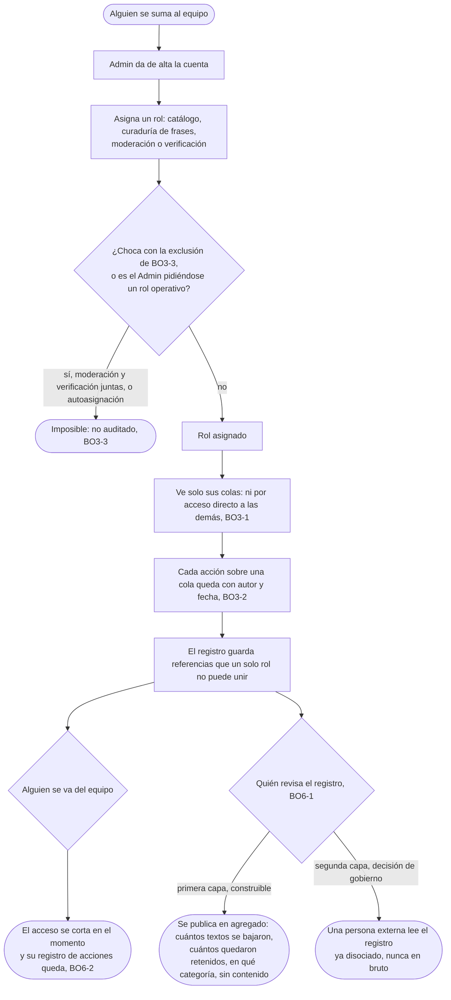

# Cortar los accesos: el flujo

> Reemplaza a la mitad de la fila BO-7 (Cuando la cola nos gana, y quién nos mira) que habla de quién audita al equipo, de la tabla de flujos del [mapa](../../design/product-map.md); el resto es el recorrido del Admin, que el mapa no dibujaba. Personas: Admin, el lector externo. Disparador: alguien se suma o se va del equipo; una acción sobre una cola que quedó registrada. Stories que cubre: BO3-1, BO3-2, BO3-3, BO6-1, BO6-2.

## Salidas y errores

- **Asignar moderación y verificación a la misma persona es imposible**, no una regla que se pueda saltear con un permiso especial (BO3-3).
- **El Admin no puede darse a sí mismo un rol operativo** (catálogo, curaduría, moderación, verificación): solo administra accesos.
- **Ningún rol llega a una cola que no es la suya, ni por URL directa** (BO3-1): no es una cuestión de qué muestra el menú.
- **La baja de alguien del equipo corta el acceso en el momento**: el registro de lo que esa persona hizo no se borra con la baja (BO6-2).
- **El registro está armado para que ningún rol, actuando solo, pueda reconstruir un cruce**: es una propiedad de cómo se guardan las referencias, no una promesa de conducta.
- **La primera capa de BO6-1 es lo único que se construye ahora**: el agregado público, sin contenido. La segunda, la persona externa, lee y no opera, y la decide el gobierno del proyecto, no una story.

## Lo que el flujo no dibuja y la ficha de la pantalla decide

Cómo se ve en Equipo el intento de asignar un rol que choca, si se deshabilita la opción o se explica por qué; qué pide el alta además del mail y el rol; qué pasa con una acción a medio hacer cuando a alguien se le corta el acceso en el momento.
