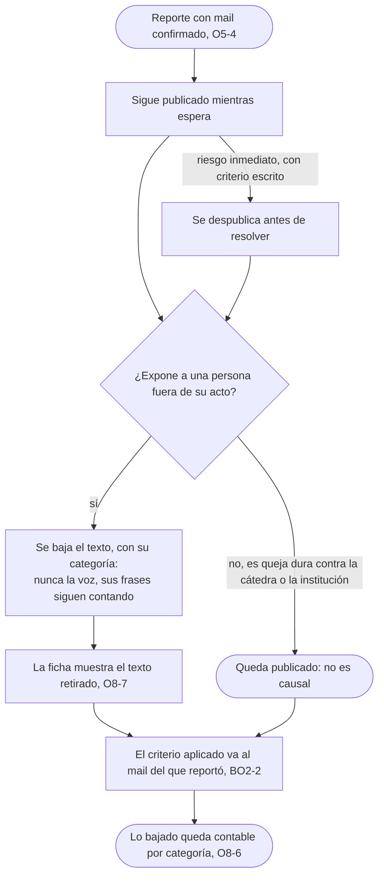
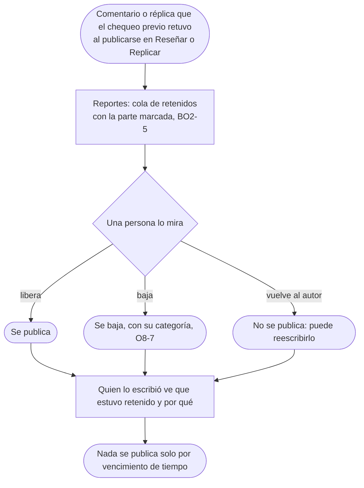
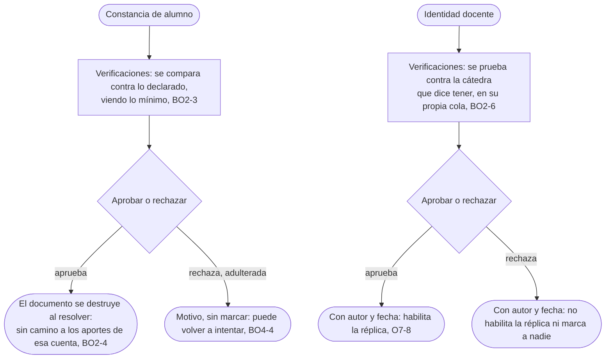
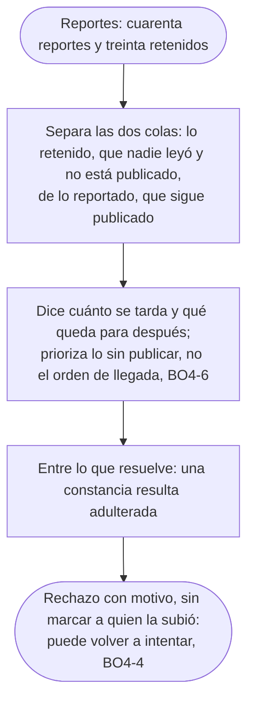
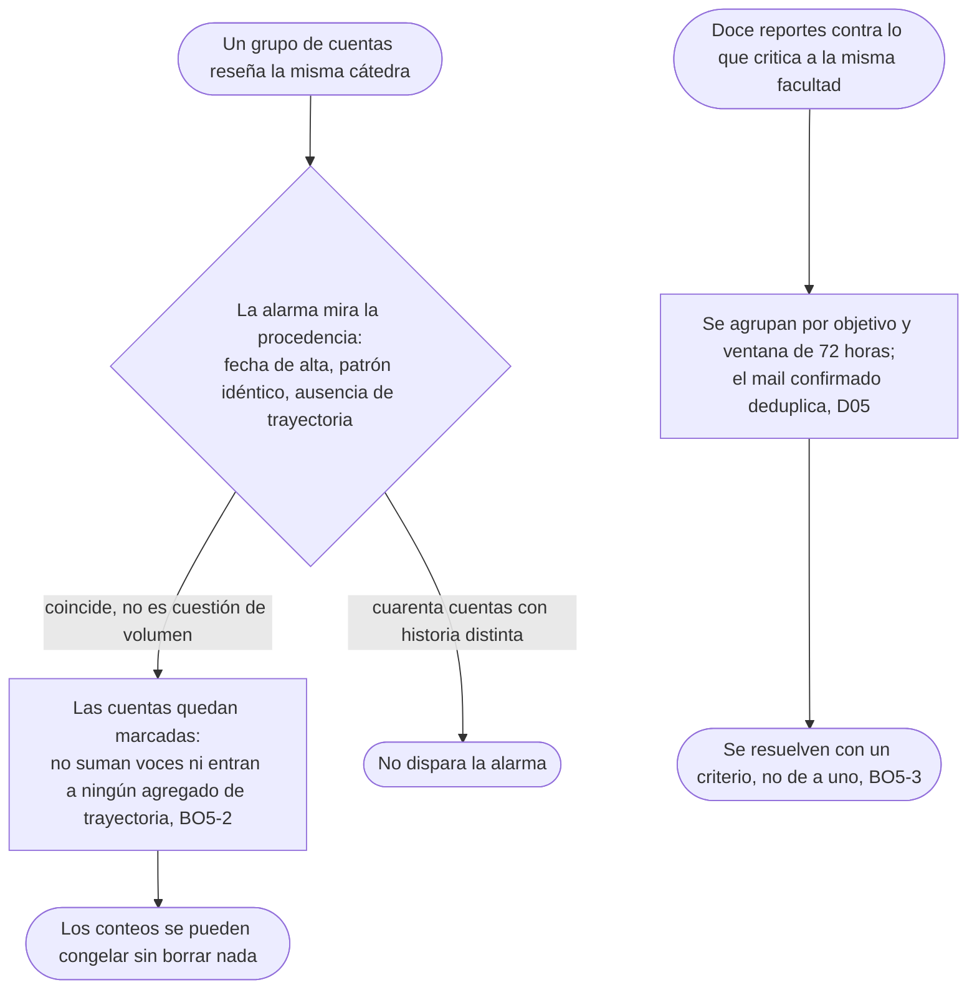

# Moderar sin romper el producto: el flujo

> Reemplaza a las filas BO-3 (Moderar sin bajar la queja incómoda), BO-4 (Ver un nombre una sola vez), BO-8 (Lo que el chequeo previo retuvo), BO-6 (Cuando alguien intenta inflar el corpus) y la mitad de BO-7 (Cuando la cola nos gana) que habla de la cola de moderación, de la tabla de flujos del [mapa](../../design/product-map.md). Personas: Nahuel (BO-3, BO-6, BO-7, BO-8), Camila (BO-4). Disparador: un reporte con mail confirmado, algo que el chequeo previo retuvo al publicarse, una constancia o una identidad docente que alguien sube para verificar, o un patrón de cuentas o de reportes que no se explica por cuánta gente vivió lo mismo. Stories que cubre: BO2-1 a BO2-6, BO4-4, BO4-6, BO5-2, BO5-3, O5-4, O7-8, O8-6, O8-7.

### BO-3: moderar sin bajar la queja incómoda

### BO-8: lo que el chequeo previo retuvo

### BO-4: ver un nombre una sola vez

### Cuando la cola nos gana: cuarenta reportes, treinta retenidos

### BO-6: cuando alguien intenta inflar el corpus

## Salidas y errores

- **El único caso que despublica antes de resolver es el riesgo inmediato**, con criterio escrito: todo lo demás reportado sigue visible mientras espera.
- **La queja dura contra la cátedra o la institución no es causal**: se modera la exposición de una persona, no lo que incomoda a quien evalúan.
- **Nada baja ni se publica solo por cantidad ni por vencimiento**: en las dos colas de Reportes decide una persona.
- **La constancia adulterada se rechaza con motivo y sin marcar** a quien la subió: puede volver a intentar (BO4-4).
- **Rechazar la identidad docente no habilita la réplica ni marca a nadie**: no es una sanción, es la ausencia del permiso.
- **Lo retenido no es lo reportado**: lo retenido nadie lo leyó y no está publicado; lo reportado sigue publicado mientras espera; la cola prioriza lo sin publicar (BO4-6).
- **Cuarenta cuentas con historia distinta reseñando la misma cátedra no disparan la alarma**: mira la procedencia, no el volumen (BO5-2); una cuenta marcada deja de sumar, pero su reseña no se borra; congelar un conteo no lo pone en cero.
- **El mail confirmado deduplica**: dos reportes del mismo mail sobre el mismo objetivo cuentan uno (D05, BO5-3).

## Lo que el flujo no dibuja y la ficha de la pantalla decide

Qué ve exactamente Nahuel de un comentario retenido, la reseña entera o solo la parte marcada; cómo se ordenan entre sí las dos colas de Reportes cuando las dos tienen pendientes; el copy exacto del estado "retenido" que ve el autor.
