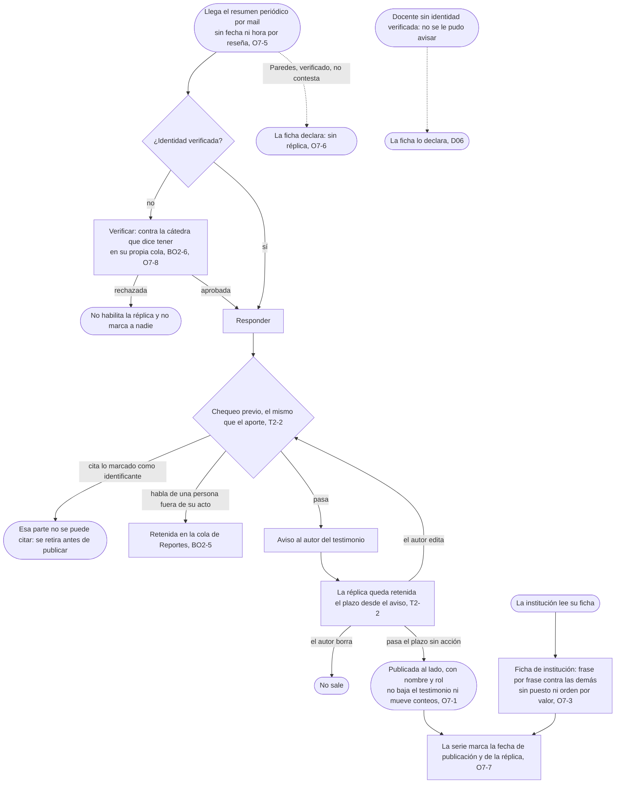

# Replicar: el flujo

> Reemplaza a las filas 06 (Claudia contesta, con nombre porque es público) y 10 (Los evaluados, responder y abandonar) de la tabla de flujos del [mapa](../../design/product-map.md); la mitad de "Mi situación" de la fila 10 vive en Reseñar, sigue en [Reseñar](../write-a-review/flow.md). Personas: Claudia, Prof. Paredes, la institución. Disparador: llega el resumen periódico por mail. Stories que cubre: O7-1, O7-2, O7-3, O7-5, O7-6, O7-7, O7-8, T2-2, BO2-6, BO2-5.

## Salidas y errores

- **Identidad rechazada**: no habilita la réplica y no marca a nadie (O7-8, BO2-6).
- **La réplica cita la parte marcada como identificante**: se retira antes de publicarse (T2-2).
- **La réplica habla de una persona fuera de su acto**: queda retenida en la cola de Reportes hasta que alguien la mire (BO2-5).
- **El autor borra el testimonio en el plazo**: la réplica no sale (T2-2).
- **Paredes no contesta**: la ficha declara "sin réplica", nunca "no quiso responder" (O7-6, D06).
- **Publicada**: no baja el testimonio ni mueve ningún conteo (O7-1).

## Lo que el flujo no dibuja y la ficha de la pantalla decide

El copy exacto del estado del canal; cuánto dura el plazo de retención antes de publicar (T2-2, el número que falta); el layout de la comparación frase por frase en la Ficha de institución.
