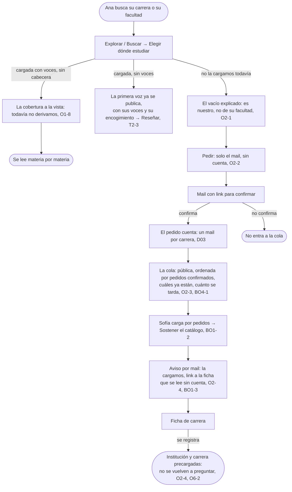

# Pedir una carrera: el flujo

> Reemplaza a la fila 02 (Ana busca la suya y no está) de la tabla de flujos del [mapa](../../design/product-map.md). Personas: Ana; del otro lado, Sofía. Disparador: buscar una carrera o una facultad que no aparece. Stories que cubre: O2-1, O2-2, O2-3, O2-4, T2-3, O1-8, BO1-2, BO1-3, BO4-1, BO4-3, O6-2.

## Salidas y errores

- **El mail no confirma**: el pedido no entra a la cola, no cuenta como reclamo.
- **La carrera ya estaba cargada**: Explorar y Buscar ya la muestran, no hace falta pedirla.
- **Pedir dos veces con el mismo mail para la misma carrera cuenta una sola vez** (D03).
- **La fuente no existe o se contradice al cargar**: es problema de Sofía en Catálogo, que marca de dónde salió el dato (BO4-3, en [Sostener el catálogo](../sustain-the-catalog/flow.md)).

## Lo que el flujo no dibuja y la ficha de la pantalla decide

Cómo se ve el campo de Pedir cuando el nombre es ambiguo, texto libre o una lista de instituciones conocidas; qué dice exactamente La cola sobre cuánto se tarda; el copy de los tres estados del vacío en Explorar y en Buscar.
