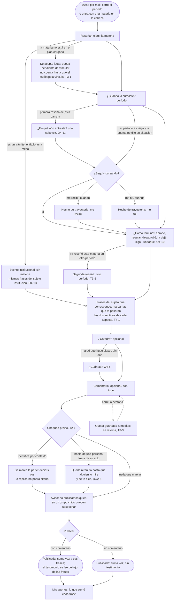

# Reseñar: el flujo

> Reemplaza a las filas 05, 12 y 14 de la tabla de flujos del [mapa](../../design/product-map.md) (Lucía reseña; el texto que te delata; cuando el dato no me alcanza), que ahora son un solo recorrido con sus ramas. Persona: Lucía (y Diego, que llega sin cursar). Disparador: el aviso al cerrar el período, o entrar con una materia en la cabeza. Stories que cubre: O4-1, O4-2, O4-4, O4-6, O4-7, O4-8, O4-10, O4-11, O4-13, T2-1, T3-1, T3-3, T3-5, O6-2.

## Salidas y errores

- **La materia no está** (T3-1): se acepta, queda pendiente de vincular a la materia canónica; el autor la ve como pendiente en Mis aportes; no cuenta en ninguna ficha ni en la cobertura hasta que BO1-7 la vincule.
- **El período es viejo y no dijo su situación**: la pregunta de Mi situación aparece acá, una sola vez; si no contesta, queda como "no dijo" (nunca se infiere).
- **Ya reseñó esta materia**: se acepta una segunda si el período es otro (la reseña es cuenta × materia × período); la cátedra, que es opcional, no entra en la clave.
- **El comentario habla de una persona fuera de su acto**: se retiene para un humano (cola BO2-5); la reseña se publica igual con sus frases; el comentario sale o se baja después, con su categoría.
- **Cerró la pestaña**: la reseña a medias se guarda y aparece para retomar (T3-3).
- **Sin cuenta**: no se llega a Reseñar; el gate está en la acción (Ingresar / Registro), no en la lectura.

## Lo que el flujo no dibuja y la ficha de la pantalla decide

Cuántas frases se ofrecen por vez y en qué orden; cómo se ve la lista con los dos sentidos; el tope del comentario; el copy exacto del aviso de la sospecha; qué muestra Mis aportes al terminar.
